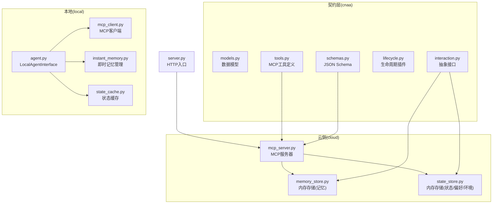
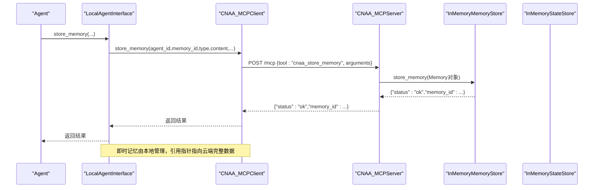
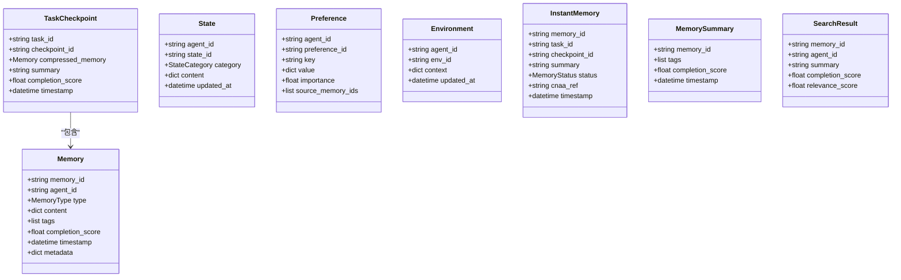
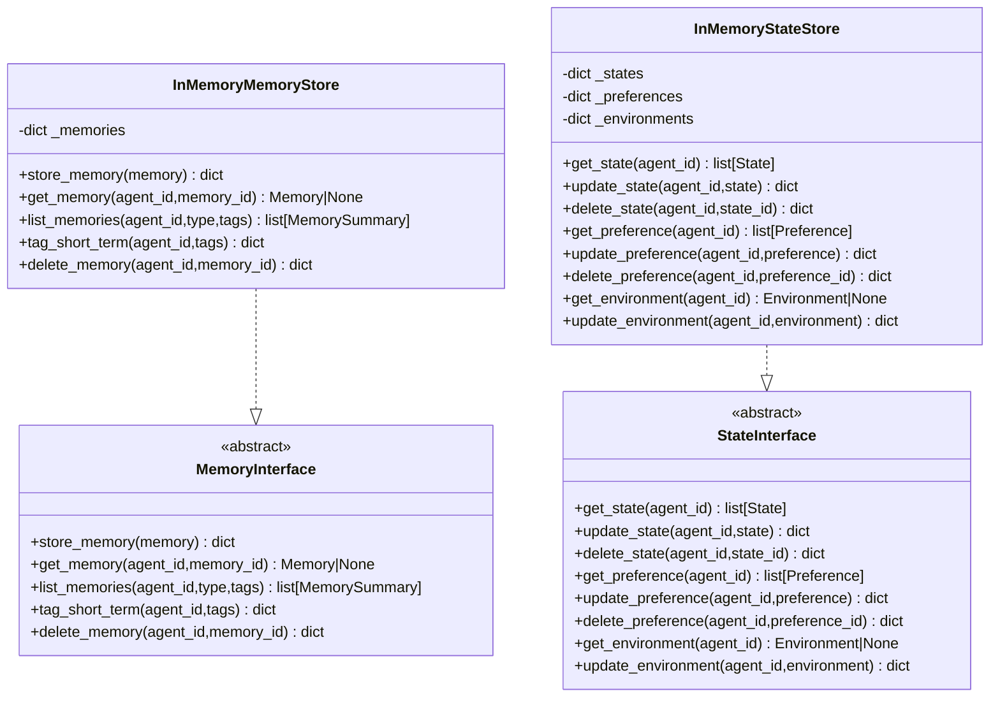
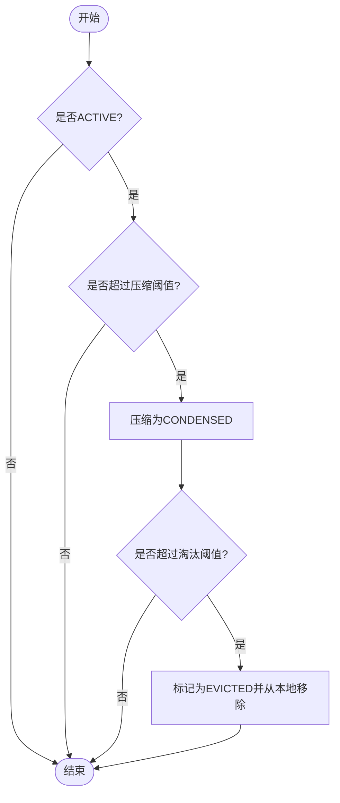
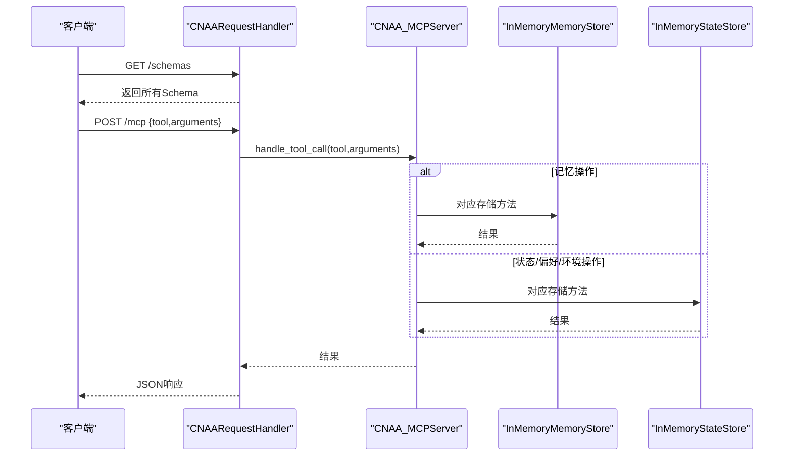
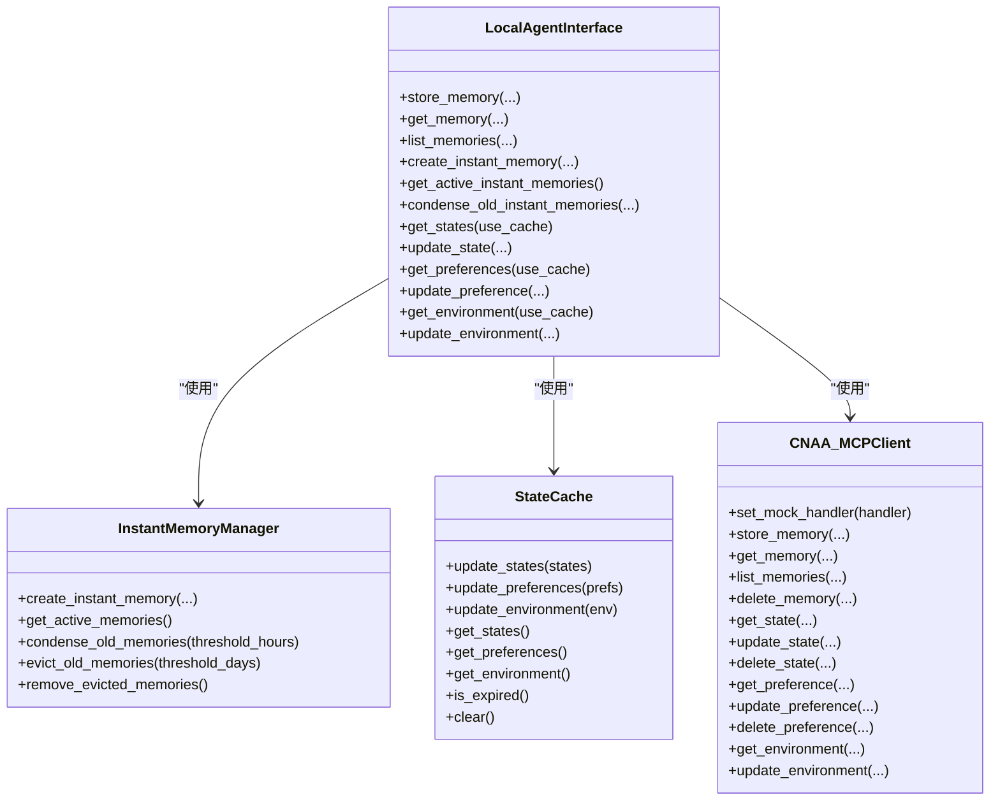
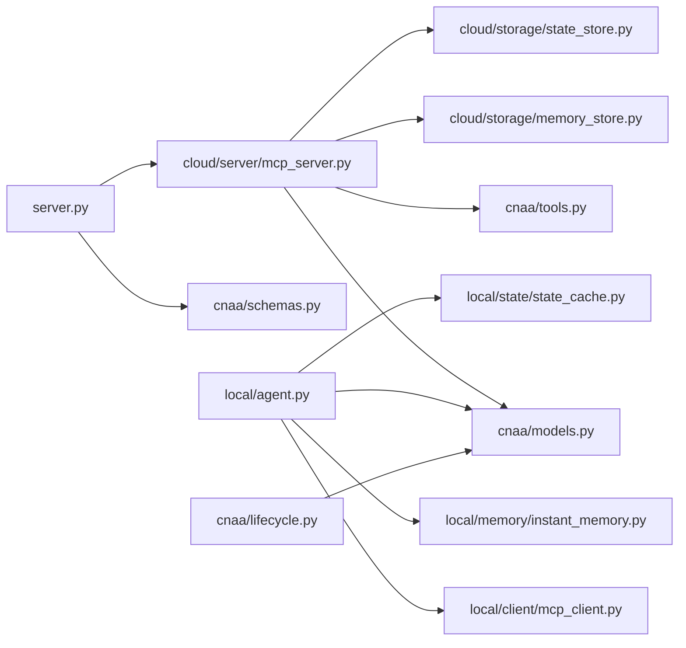

# CNAA规范定义

<cite>
**本文引用的文件**   
- [README.md](file://README.md)
- [README_CN.md](file://README_CN.md)
- [pyproject.toml](file://pyproject.toml)
- [server.py](file://server.py)
- [cnaa/models.py](file://cnaa/models.py)
- [cnaa/schemas.py](file://cnaa/schemas.py)
- [cnaa/interaction.py](file://cnaa/interaction.py)
- [cnaa/lifecycle.py](file://cnaa/lifecycle.py)
- [cnaa/tools.py](file://cnaa/tools.py)
- [cloud/server/mcp_server.py](file://cloud/server/mcp_server.py)
- [cloud/storage/memory_store.py](file://cloud/storage/memory_store.py)
- [cloud/storage/state_store.py](file://cloud/storage/state_store.py)
- [local/agent.py](file://local/agent.py)
- [local/client/mcp_client.py](file://local/client/mcp_client.py)
- [local/memory/instant_memory.py](file://local/memory/instant_memory.py)
- [local/state/state_cache.py](file://local/state/state_cache.py)
</cite>

## 目录
1. [引言](#引言)
2. [项目结构](#项目结构)
3. [核心组件](#核心组件)
4. [架构总览](#架构总览)
5. [详细组件分析](#详细组件分析)
6. [依赖关系分析](#依赖关系分析)
7. [性能考量](#性能考量)
8. [故障排查指南](#故障排查指南)
9. [结论](#结论)
10. [附录](#附录)

## 引言
CNAA（Cloud Native Agentic Architecture）是一套“经验记忆运行时框架”，为任意 AI Agent 提供跨会话的经验持久化、检索与复用能力，而不改变其内部推理逻辑。它不是 Agent 框架、工作流引擎或 RAG 实现，而是以“任务点分块 + 即时记忆沉淀 + 云端持久化”的方式，将经验作为独立运行时资源进行管理与调度。

本规范文档聚焦于 CNAA 的接口契约、数据模型、MCP 工具定义、生命周期策略以及参考实现（本地 SDK 与云侧 MCP Server），帮助读者理解并正确集成 CNAA 到现有 Agent 系统。

**章节来源**
- [README.md:1-174](file://README.md#L1-L174)
- [README_CN.md:1-164](file://README_CN.md#L1-L164)

## 项目结构
CNAA 采用三层正交架构：接口契约层（What）、运行时层（How）、生命周期层（When）。代码组织围绕该分层展开：
- cnaa：接口契约与核心模型（数据模型、交互接口、生命周期插件、MCP 工具定义、JSON Schema）
- cloud：云侧参考实现（MCP Server、内存存储后端）
- local：本地侧参考实现（LocalAgentInterface、MCP Client、即时记忆管理、状态缓存）
- server.py：HTTP 入口，暴露 /schemas、/mcp、/health
- pyproject.toml：包元数据与依赖声明

**图表来源**
- [server.py:1-181](file://server.py#L1-L181)
- [cnaa/models.py:1-225](file://cnaa/models.py#L1-L225)
- [cnaa/schemas.py:1-465](file://cnaa/schemas.py#L1-L465)
- [cnaa/interaction.py:1-255](file://cnaa/interaction.py#L1-L255)
- [cnaa/lifecycle.py:1-478](file://cnaa/lifecycle.py#L1-L478)
- [cnaa/tools.py:1-210](file://cnaa/tools.py#L1-L210)
- [cloud/server/mcp_server.py:1-299](file://cloud/server/mcp_server.py#L1-L299)
- [cloud/storage/memory_store.py:1-139](file://cloud/storage/memory_store.py#L1-L139)
- [cloud/storage/state_store.py:1-176](file://cloud/storage/state_store.py#L1-L176)
- [local/agent.py:1-452](file://local/agent.py#L1-L452)
- [local/client/mcp_client.py:1-351](file://local/client/mcp_client.py#L1-L351)
- [local/memory/instant_memory.py:1-263](file://local/memory/instant_memory.py#L1-L263)
- [local/state/state_cache.py:1-180](file://local/state/state_cache.py#L1-L180)

**章节来源**
- [pyproject.toml:1-33](file://pyproject.toml#L1-L33)

## 核心组件
- 数据模型（cnaa/models.py）：Memory、TaskCheckpoint、State、Preference、Environment、InstantMemory、MemorySummary、SearchResult 等，定义经验、状态、环境与即时记忆的字段与语义。
- 接口契约（cnaa/interaction.py）：MemoryInterface、StateInterface 抽象出记忆与状态的增删改查与标签操作，约束“JSON入、JSON出、无推理”的哑服务原则。
- 生命周期（cnaa/lifecycle.py）：MemoryLifecyclePlugin、RetrievalPlugin、StateEvolutionPlugin 及默认时间驱动策略，控制即时记忆的压缩、淘汰与长期记忆晋升。
- 工具定义（cnaa/tools.py）：统一暴露 13 个 MCP 工具名称与输入 Schema，覆盖记忆、状态、偏好与环境操作。
- 云侧实现（cloud/server/mcp_server.py）：注册工具处理器，路由至内存存储后端，遵循哑服务原则。
- 本地实现（local/agent.py, local/client/mcp_client.py, local/memory/instant_memory.py, local/state/state_cache.py）：封装即时记忆、状态缓存与 MCP 通信，提供面向 Agent 的统一 API。

**章节来源**
- [cnaa/models.py:1-225](file://cnaa/models.py#L1-L225)
- [cnaa/interaction.py:1-255](file://cnaa/interaction.py#L1-L255)
- [cnaa/lifecycle.py:1-478](file://cnaa/lifecycle.py#L1-L478)
- [cnaa/tools.py:1-210](file://cnaa/tools.py#L1-L210)
- [cloud/server/mcp_server.py:1-299](file://cloud/server/mcp_server.py#L1-L299)
- [local/agent.py:1-452](file://local/agent.py#L1-L452)
- [local/client/mcp_client.py:1-351](file://local/client/mcp_client.py#L1-L351)
- [local/memory/instant_memory.py:1-263](file://local/memory/instant_memory.py#L1-L263)
- [local/state/state_cache.py:1-180](file://local/state/state_cache.py#L1-L180)

## 架构总览
CNAA 通过 HTTP 暴露 /schemas、/mcp、/health 三个端点；Agent 通过 MCP 工具调用与云侧交互。本地侧维护即时记忆与状态缓存，减少网络开销并提升响应速度。

**图表来源**
- [server.py:1-181](file://server.py#L1-L181)
- [cloud/server/mcp_server.py:1-299](file://cloud/server/mcp_server.py#L1-L299)
- [cloud/storage/memory_store.py:1-139](file://cloud/storage/memory_store.py#L1-L139)
- [local/agent.py:1-452](file://local/agent.py#L1-L452)
- [local/client/mcp_client.py:1-351](file://local/client/mcp_client.py#L1-L351)

**章节来源**
- [server.py:1-181](file://server.py#L1-L181)
- [cnaa/tools.py:1-210](file://cnaa/tools.py#L1-L210)

## 详细组件分析

### 数据模型与Schema
- 数据模型定义了 Memory、TaskCheckpoint、State、Preference、Environment、InstantMemory 等核心实体，包含类型、状态、时间戳与元数据字段。
- JSON Schema 集中管理请求与响应格式，确保客户端与服务端协议一致。

**图表来源**
- [cnaa/models.py:1-225](file://cnaa/models.py#L1-L225)

**章节来源**
- [cnaa/models.py:1-225](file://cnaa/models.py#L1-L225)
- [cnaa/schemas.py:1-465](file://cnaa/schemas.py#L1-L465)

### 交互接口与工具定义
- MemoryInterface 与 StateInterface 抽象了记忆与状态的操作契约，要求“JSON入、JSON出、无推理”。
- tools.py 集中定义 13 个 MCP 工具名与输入 Schema，涵盖记忆、状态、偏好与环境的全量操作。

**图表来源**
- [cnaa/interaction.py:1-255](file://cnaa/interaction.py#L1-L255)
- [cloud/storage/memory_store.py:1-139](file://cloud/storage/memory_store.py#L1-L139)
- [cloud/storage/state_store.py:1-176](file://cloud/storage/state_store.py#L1-L176)

**章节来源**
- [cnaa/interaction.py:1-255](file://cnaa/interaction.py#L1-L255)
- [cnaa/tools.py:1-210](file://cnaa/tools.py#L1-L210)

### 生命周期与检索策略
- MemoryLifecyclePlugin 定义即时记忆的压缩与淘汰策略，默认 TimeBasedLifecyclePlugin 基于时间与阈值。
- RetrievalPlugin 定义索引、搜索与召回接口，支持向量检索、BM25、混合检索等扩展。
- StateEvolutionPlugin 定义状态演化规则，默认 DefaultStateEvolutionPlugin 提供基础阶段转换。

**图表来源**
- [cnaa/lifecycle.py:1-478](file://cnaa/lifecycle.py#L1-L478)
- [local/memory/instant_memory.py:1-263](file://local/memory/instant_memory.py#L1-L263)

**章节来源**
- [cnaa/lifecycle.py:1-478](file://cnaa/lifecycle.py#L1-L478)

### 云侧MCP服务器与HTTP入口
- server.py 提供 HTTP 入口，处理 /schemas、/mcp、/health。
- mcp_server.py 注册工具处理器，将工具调用路由到存储后端，遵循“JSON入、JSON出、无推理”。

**图表来源**
- [server.py:1-181](file://server.py#L1-L181)
- [cloud/server/mcp_server.py:1-299](file://cloud/server/mcp_server.py#L1-L299)
- [cloud/storage/memory_store.py:1-139](file://cloud/storage/memory_store.py#L1-L139)
- [cloud/storage/state_store.py:1-176](file://cloud/storage/state_store.py#L1-L176)

**章节来源**
- [server.py:1-181](file://server.py#L1-L181)
- [cloud/server/mcp_server.py:1-299](file://cloud/server/mcp_server.py#L1-L299)

### 本地SDK与即时记忆管理
- LocalAgentInterface 整合即时记忆、状态缓存与 MCP 客户端，对外暴露统一的记忆、状态、偏好与环境操作方法。
- InstantMemoryManager 管理本地即时记忆的生命周期（ACTIVE → CONDENSED → EVICTED）。
- StateCache 缓存状态、偏好与环境数据，降低网络延迟。

**图表来源**
- [local/agent.py:1-452](file://local/agent.py#L1-L452)
- [local/memory/instant_memory.py:1-263](file://local/memory/instant_memory.py#L1-L263)
- [local/state/state_cache.py:1-180](file://local/state/state_cache.py#L1-L180)
- [local/client/mcp_client.py:1-351](file://local/client/mcp_client.py#L1-L351)

**章节来源**
- [local/agent.py:1-452](file://local/agent.py#L1-L452)
- [local/memory/instant_memory.py:1-263](file://local/memory/instant_memory.py#L1-L263)
- [local/state/state_cache.py:1-180](file://local/state/state_cache.py#L1-L180)
- [local/client/mcp_client.py:1-351](file://local/client/mcp_client.py#L1-L351)

## 依赖关系分析
- 模块耦合：
  - server.py 依赖 cloud.server.mcp_server 与 cnaa.schemas
  - cloud.server.mcp_server 依赖 cnaa.models、cnaa.tools 与 cloud.storage.*
  - local.agent 依赖 local.client.mcp_client、local.memory.instant_memory、local.state.state_cache 与 cnaa.models
  - lifecycle.py 与 models.py 强耦合，用于生命周期决策
- 外部依赖：
  - mcp>=1.0.0（在 pyproject.toml 中声明）

**图表来源**
- [server.py:1-181](file://server.py#L1-L181)
- [cloud/server/mcp_server.py:1-299](file://cloud/server/mcp_server.py#L1-L299)
- [cnaa/schemas.py:1-465](file://cnaa/schemas.py#L1-L465)
- [cnaa/models.py:1-225](file://cnaa/models.py#L1-L225)
- [cnaa/tools.py:1-210](file://cnaa/tools.py#L1-L210)
- [cloud/storage/memory_store.py:1-139](file://cloud/storage/memory_store.py#L1-L139)
- [cloud/storage/state_store.py:1-176](file://cloud/storage/state_store.py#L1-L176)
- [local/agent.py:1-452](file://local/agent.py#L1-L452)
- [local/client/mcp_client.py:1-351](file://local/client/mcp_client.py#L1-L351)
- [local/memory/instant_memory.py:1-263](file://local/memory/instant_memory.py#L1-L263)
- [local/state/state_cache.py:1-180](file://local/state/state_cache.py#L1-L180)
- [cnaa/lifecycle.py:1-478](file://cnaa/lifecycle.py#L1-L478)

**章节来源**
- [pyproject.toml:1-33](file://pyproject.toml#L1-L33)

## 性能考量
- 本地优先：即时记忆与状态缓存驻留本地，减少网络往返，提高读取性能。
- 小索引→大存储：仅保留轻量摘要与引用指针，完整数据存云端，降低本地内存占用。
- 缓存TTL：StateCache 支持 TTL 过期策略，平衡一致性与性能。
- 生命周期阈值：TimeBasedLifecyclePlugin 通过时间阈值控制压缩与淘汰，避免本地上下文膨胀。

[本节为通用指导，不直接分析具体文件]

## 故障排查指南
- HTTP 错误：
  - /mcp 请求缺少 tool 字段时返回 BAD_REQUEST
  - JSON 解析失败返回 BAD_REQUEST
  - 未找到路径返回 NOT_FOUND
- 工具调用异常：
  - 未知工具名返回 error 消息
  - 处理器抛出异常时记录日志并返回 error
- 本地客户端未连接：
  - 未设置 mock_handler 或未配置 server_url 时返回错误提示

建议检查：
- 请求体是否符合 schemas.py 定义的 JSON Schema
- 工具名是否在 tools.py 中定义
- 本地缓存是否过期导致重复拉取
- 生命周期阈值是否合理导致过早压缩或淘汰

**章节来源**
- [server.py:1-181](file://server.py#L1-L181)
- [cloud/server/mcp_server.py:1-299](file://cloud/server/mcp_server.py#L1-L299)
- [local/client/mcp_client.py:1-351](file://local/client/mcp_client.py#L1-L351)

## 结论
CNAA 通过清晰的接口契约、集中的 Schema 管理、可插拔的生命周期与检索策略，以及本地与云端的参考实现，为 AI Agent 提供了稳定、可扩展的经验记忆运行时。遵循“哑服务”与“接口优先”的设计原则，CNAA 能够在不侵入 Agent 推理逻辑的前提下，实现经验的跨会话持久化与复用。

[本节为总结性内容，不直接分析具体文件]

## 附录
- 环境变量与配置：
  - server.py 支持 --host 与 --port 参数启动服务
  - local.client.mcp_client 支持 server_url 与 timeout 配置
- 依赖版本：
  - Python >= 3.11
  - mcp >= 1.0.0

**章节来源**
- [server.py:1-181](file://server.py#L1-L181)
- [local/client/mcp_client.py:1-351](file://local/client/mcp_client.py#L1-L351)
- [pyproject.toml:1-33](file://pyproject.toml#L1-L33)