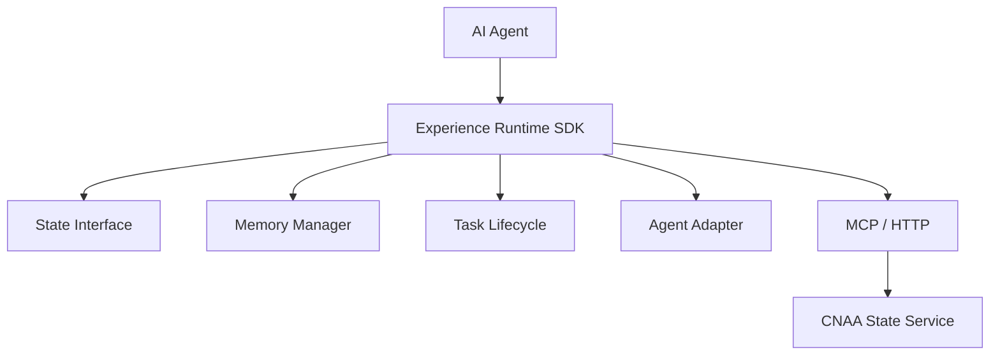
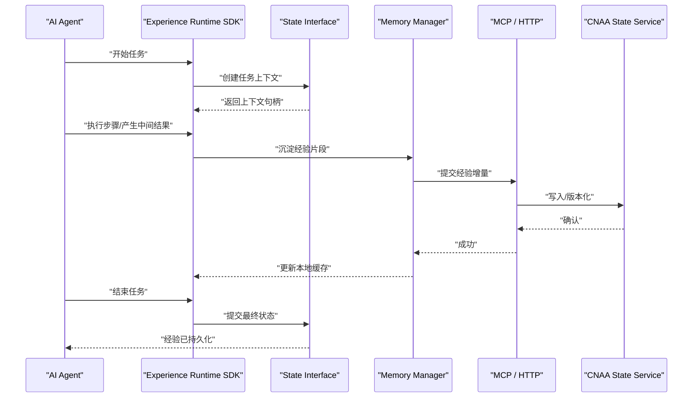
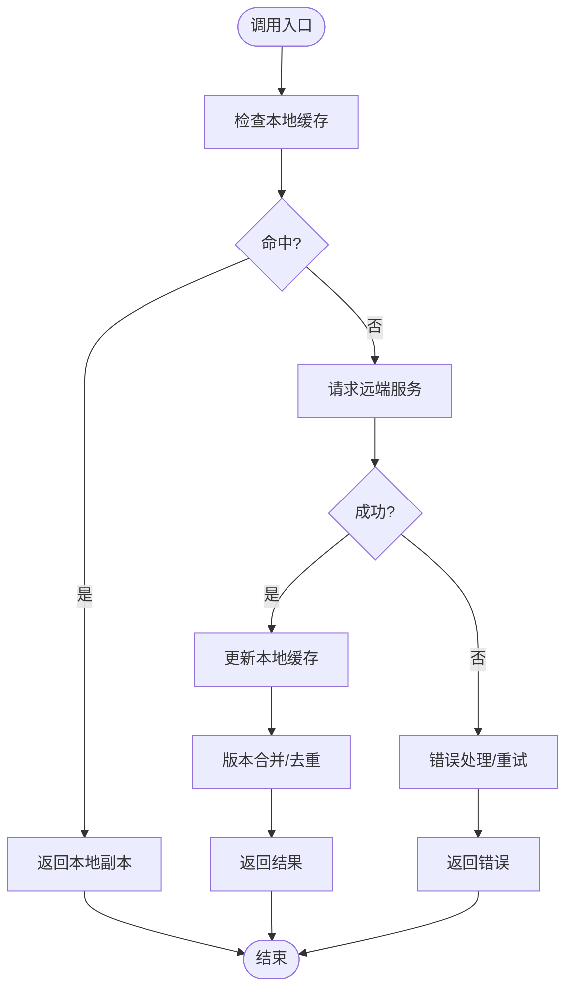
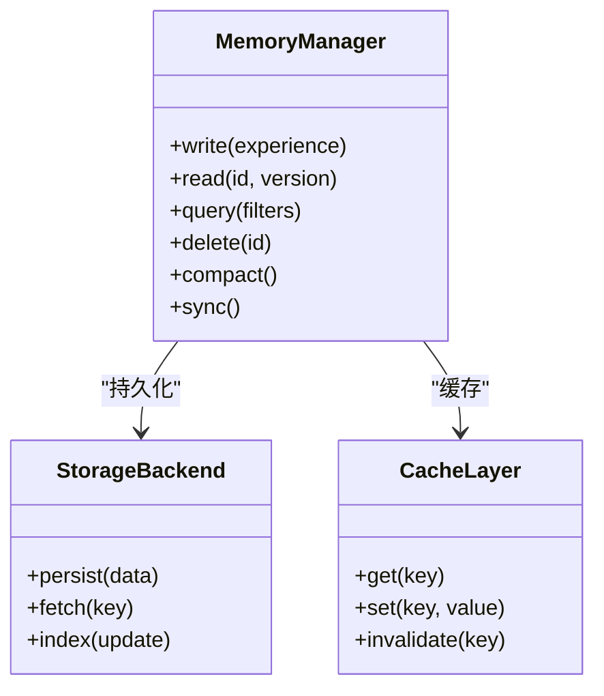
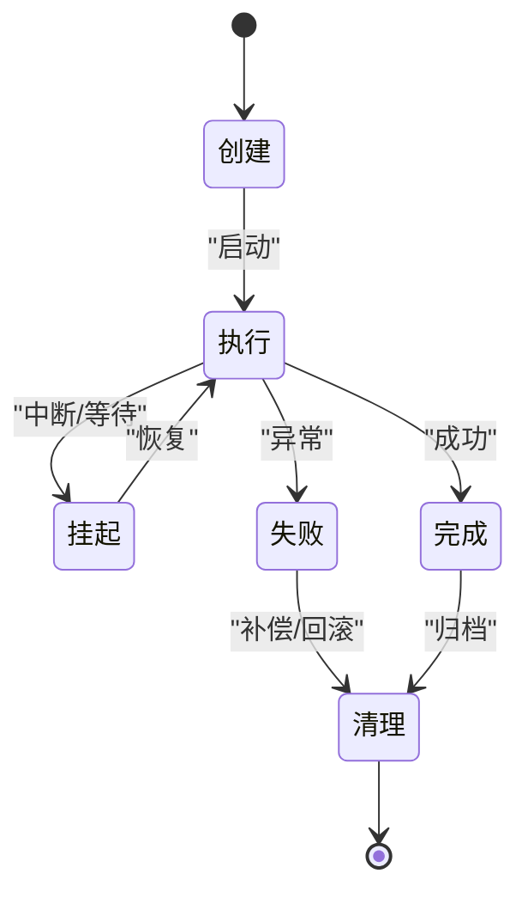
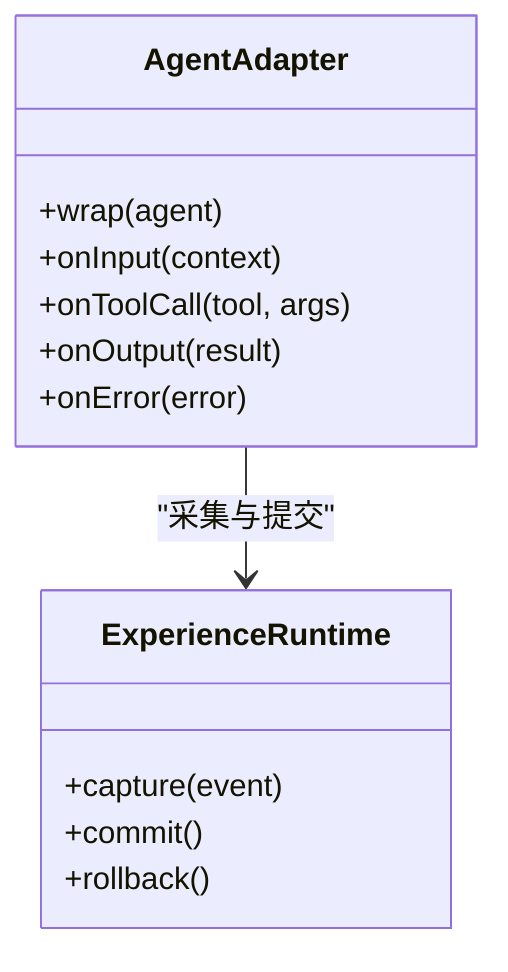
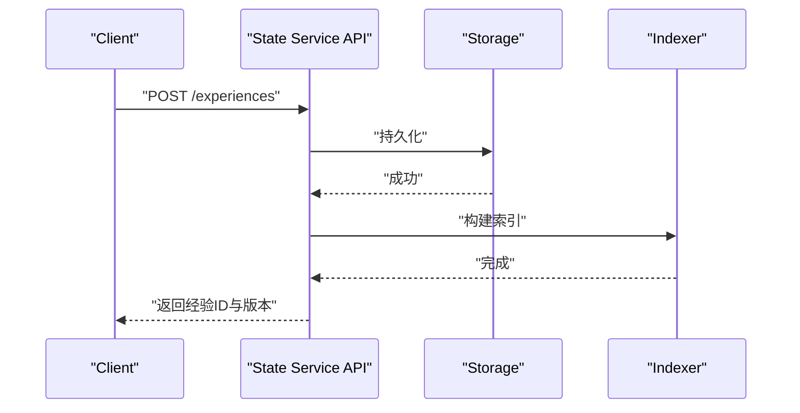
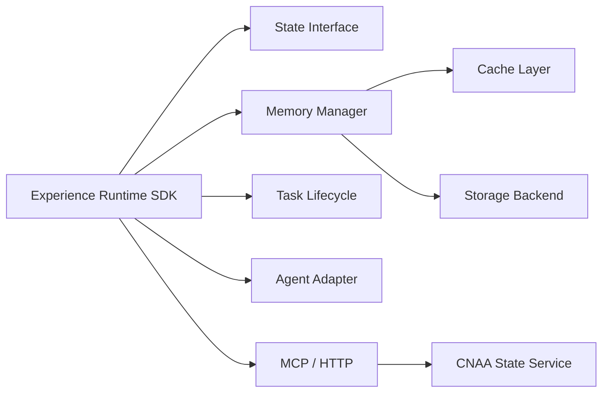

# Experience Runtime（经验运行时）

<cite>
**本文档引用的文件**   
- [README.md](file://README.md)
- [README_CN.md](file://README_CN.md)
</cite>

## 目录
1. [简介](#简介)
2. [项目结构](#项目结构)
3. [核心组件](#核心组件)
4. [架构总览](#架构总览)
5. [详细组件分析](#详细组件分析)
6. [依赖关系分析](#依赖关系分析)
7. [性能考虑](#性能考虑)
8. [故障排查指南](#故障排查指南)
9. [结论](#结论)
10. [附录](#附录)

## 简介
Experience Runtime（经验运行时）是 CNAA 的核心运行时能力，目标是将 AI Agent 的临时 prompt 上下文转化为独立的“经验”资源，实现经验的持久化存储、跨会话复用与状态同步。它不改变 Agent 的内部推理逻辑，而是以轻量 SDK 的形式提供统一的状态接口、记忆管理与任务生命周期管理能力，并通过 MCP/HTTP 与 CNAA State Service 交互，完成经验的沉淀与共享。

该设计强调：
- 经验独立于 Prompt：经验不再是临时的提示词片段，而是可被持久化、版本化、检索与复用的运行时资源。
- 状态同步：Agent 运行期状态与持久化状态保持一致，支持多实例、多进程场景下的协同。
- Agent 无关：通过统一的 State Interface 和 Agent Adapter，适配不同 Agent 框架与语言。

**章节来源**
- [README.md:1-19](file://README.md#L1-L19)
- [README_CN.md:1-20](file://README_CN.md#L1-L20)

## 项目结构
当前仓库为概念与文档型仓库，包含中英文 README 与空 docs 目录。实际代码尚未落地，但架构蓝图清晰，后续可按如下方式组织：
- docs/en、docs/zh：英文与中文文档
- src/runtime：Experience Runtime SDK 核心实现
- src/state-interface：State Interface 规范与客户端
- src/memory-manager：Memory Manager 实现（本地/远程）
- src/task-lifecycle：任务生命周期管理
- src/agent-adapter：Agent 适配器层
- src/state-service：CNAA State Service（MCP/HTTP）

**图表来源**
- [README.md:55-72](file://README.md#L55-L72)

**章节来源**
- [README.md:55-72](file://README.md#L55-L72)
- [README_CN.md:63-80](file://README_CN.md#L63-L80)

## 核心组件
- State Interface（状态接口）
  - 定义经验与状态的读写、版本、查询、订阅等统一 API，屏蔽底层存储差异。
- Memory Manager（记忆管理器）
  - 负责经验的序列化、压缩、索引、缓存、一致性策略与持久化。
- Task Lifecycle（任务生命周期）
  - 管理任务的创建、执行、挂起、恢复、完成与清理；将任务中间态与结果沉淀为经验。
- Agent Adapter（Agent 适配器）
  - 将不同 Agent 的运行模型映射到 Experience Runtime 的统一抽象，提供事件钩子与拦截点。
- CNAA State Service（状态服务）
  - 提供 MCP/HTTP 接口，对外暴露经验的增删改查、版本控制、权限与审计能力。

这些组件共同构成“经验运行时”，使经验成为独立于 Agent 的生命周期之外的资源。

**章节来源**
- [README.md:61-72](file://README.md#L61-L72)
- [README_CN.md:69-80](file://README_CN.md#L69-L80)

## 架构总览
Experience Runtime 位于 Agent 与持久化存储之间，承担“经验抽取—状态同步—持久化—复用”的全链路职责。

**图表来源**
- [README.md:55-72](file://README.md#L55-L72)

**章节来源**
- [README.md:55-72](file://README.md#L55-L72)

## 详细组件分析

### State Interface（状态接口）
- 职责
  - 定义经验与状态的标准操作：创建、读取、更新、删除、版本化、查询、订阅。
  - 屏蔽底层存储（本地文件系统、对象存储、数据库）差异。
- 关键抽象
  - 经验实体：ID、版本、元数据、内容、时间戳、标签、权限。
  - 状态快照：任务级或会话级的状态快照，支持回滚与对比。
  - 变更流：基于事件的经验变更流，便于订阅与回放。
- 典型流程
  - 写路径：SDK 调用 State Interface 写入经验片段，触发版本化与索引更新。
  - 读路径：按条件检索经验，合并最新版本，返回给 Agent。
  - 同步：本地缓存与远端服务的一致性协议（冲突检测与合并）。

**图表来源**
- [README.md:61-72](file://README.md#L61-L72)

**章节来源**
- [README.md:61-72](file://README.md#L61-L72)

### Memory Manager（记忆管理器）
- 职责
  - 经验片段的序列化、压缩、分块、索引与缓存。
  - 一致性策略：幂等写入、冲突解决、事务边界。
  - 生命周期：冷热分层、TTL、归档与清理。
- 优化要点
  - 批量写入与异步落盘，降低 I/O 延迟。
  - 增量索引与倒排索引，提升检索效率。
  - 本地缓存 + 远端强一致，兼顾性能与可靠性。

**图表来源**
- [README.md:61-72](file://README.md#L61-L72)

**章节来源**
- [README.md:61-72](file://README.md#L61-L72)

### Task Lifecycle（任务生命周期）
- 阶段
  - 创建：初始化上下文、分配资源、建立经验沙箱。
  - 执行：逐步推进任务，沉淀中间经验与状态快照。
  - 挂起/恢复：支持中断与断点续跑，保留经验连续性。
  - 完成：提交最终状态，生成经验摘要与指标。
  - 清理：释放资源，归档经验，清理临时数据。
- 调度机制
  - 基于事件驱动的调度器，支持优先级、超时、重试与补偿。
  - 与 Memory Manager 协作，确保经验与状态的一致性。

**图表来源**
- [README.md:61-72](file://README.md#L61-L72)

**章节来源**
- [README.md:61-72](file://README.md#L61-L72)

### Agent Adapter（Agent 适配器）
- 职责
  - 将不同 Agent 的运行模型（函数式、类式、消息驱动）映射到 Experience Runtime 的统一抽象。
  - 提供事件钩子：在关键节点（输入解析、工具调用、输出格式化）自动沉淀经验。
  - 配置注入：根据 Agent 类型动态加载策略（如经验粒度、采样频率、压缩算法）。
- 集成模式
  - 装饰器模式：在不侵入 Agent 主流程的情况下插入经验采集逻辑。
  - 插件化：支持第三方 Agent 框架的快速接入。

**图表来源**
- [README.md:61-72](file://README.md#L61-L72)

**章节来源**
- [README.md:61-72](file://README.md#L61-L72)

### CNAA State Service（状态服务）
- 职责
  - 提供 MCP/HTTP 接口，对外暴露经验的 CRUD、版本控制、权限与审计。
  - 保证高可用与可扩展性，支持水平扩展与多副本一致性。
- 接口要点
  - 经验写入：支持批量、增量与幂等。
  - 经验读取：支持过滤、排序、分页与全文检索。
  - 版本管理：支持分支、合并与回滚。
  - 权限控制：基于角色与资源的访问控制。

**图表来源**
- [README.md:55-72](file://README.md#L55-L72)

**章节来源**
- [README.md:55-72](file://README.md#L55-L72)

## 依赖关系分析
- 内部依赖
  - Experience Runtime SDK 依赖 State Interface、Memory Manager、Task Lifecycle、Agent Adapter。
  - Memory Manager 依赖缓存层与存储后端。
  - Task Lifecycle 依赖 Memory Manager 与调度器。
- 外部依赖
  - CNAA State Service 通过 MCP/HTTP 暴露能力。
  - 可选的外部存储（对象存储、数据库、搜索引擎）由 Storage Backend 抽象。

**图表来源**
- [README.md:55-72](file://README.md#L55-L72)

**章节来源**
- [README.md:55-72](file://README.md#L55-L72)

## 性能考虑
- 写入路径优化
  - 批量写入与异步落盘，减少频繁 I/O。
  - 增量索引与延迟构建，避免阻塞主流程。
- 读取路径优化
  - 多级缓存（内存、本地磁盘、远端），热点经验优先命中。
  - 预取与懒加载，按需拉取大经验体。
- 一致性策略
  - 最终一致性为主，关键路径使用强一致（如事务边界内的经验提交）。
  - 冲突检测与合并策略，支持多实例并发写入。
- 资源治理
  - TTL 与冷热分层，自动归档与清理过期经验。
  - 限流与背压，防止突发流量冲击存储。

[本节为通用指导，无需特定文件引用]

## 故障排查指南
- 常见问题
  - 经验未持久化：检查网络连通性与 State Service 健康状态。
  - 版本不一致：查看本地缓存与远端版本差异，执行强制同步。
  - 写入失败：确认幂等键与重试策略，检查存储后端容量与配额。
  - 检索缓慢：检查索引是否构建完成，必要时重建索引。
- 诊断手段
  - 启用详细日志与追踪 ID，定位问题链路。
  - 使用健康检查与指标监控（QPS、延迟、错误率）。
  - 灰度发布与回滚策略，降低影响面。

[本节为通用指导，无需特定文件引用]

## 结论
Experience Runtime 通过将“经验”从临时 prompt 中解耦，赋予 AI Agent 持续学习与记忆的能力。其核心在于统一的状态接口、可靠的记忆管理与健壮的任务生命周期，配合 CNAA State Service 提供的高可用与可扩展能力，使得经验成为可沉淀、可复用、可治理的运行时资源。未来可在多 Agent 经验共享、跨域协作与智能检索方面进一步演进。

[本节为总结性内容，无需特定文件引用]

## 附录
- 快速开始建议
  - 先实现最小可用的 State Interface 与 Memory Manager，再逐步完善 Task Lifecycle 与 Agent Adapter。
  - 使用本地存储进行原型验证，随后迁移至远端 State Service。
- 最佳实践
  - 明确经验粒度与采样频率，避免过度采集导致噪声。
  - 为经验添加结构化元数据与标签，提升检索与复用效率。
  - 设计幂等写入与冲突合并策略，保障多实例一致性。
  - 建立完善的监控与告警体系，确保运行时稳定性。

[本节为补充信息，无需特定文件引用]