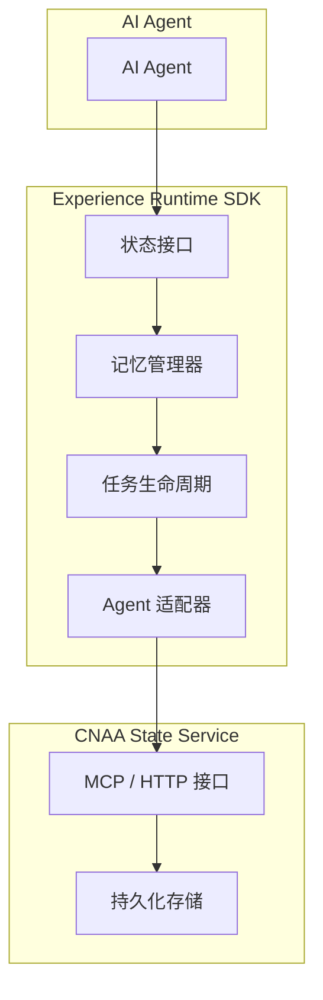
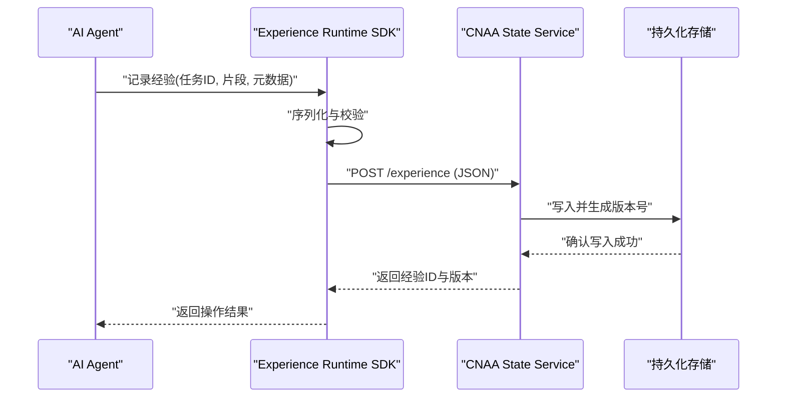
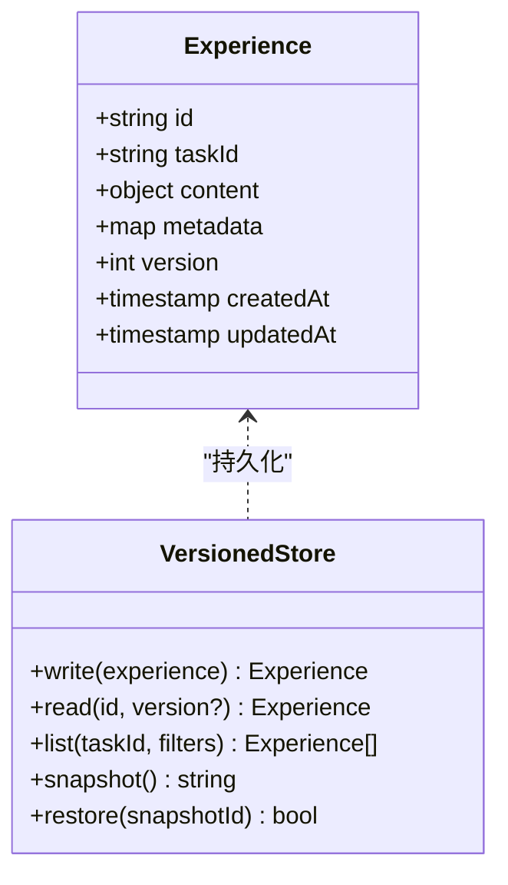
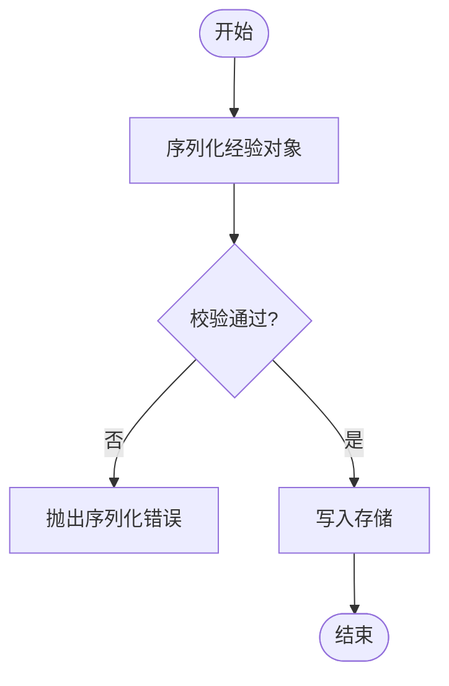
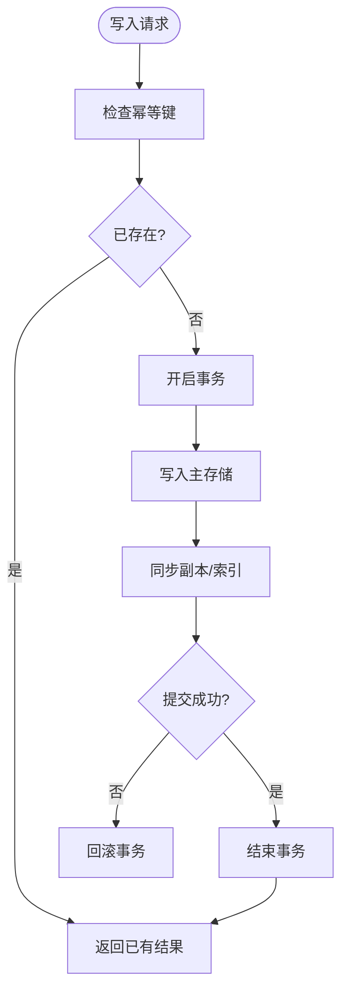
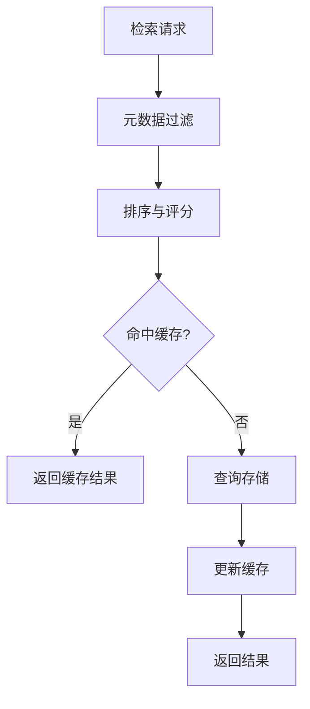
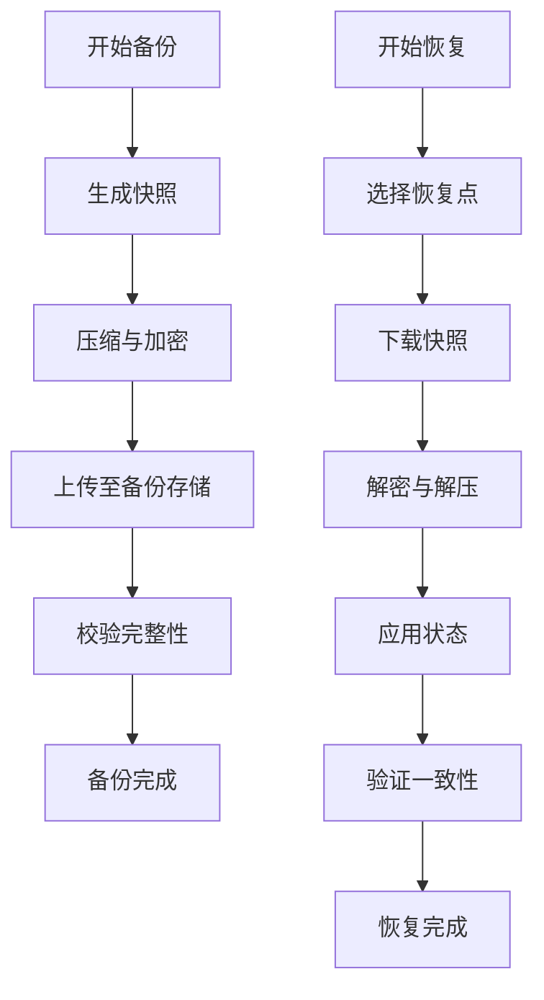
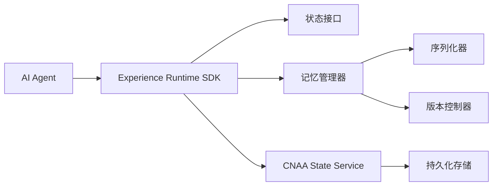

# 持久化经验记忆（Persistent Experience Memory）

<cite>
**本文引用的文件**   
- [README.md](file://README.md)
- [README_CN.md](file://README_CN.md)
</cite>

## 目录
1. [引言](#引言)
2. [项目结构](#项目结构)
3. [核心组件](#核心组件)
4. [架构总览](#架构总览)
5. [详细组件分析](#详细组件分析)
6. [依赖分析](#依赖分析)
7. [性能考虑](#性能考虑)
8. [故障排查指南](#故障排查指南)
9. [结论](#结论)
10. [附录](#附录)

## 引言
本文件面向“持久化经验记忆”这一主题，基于仓库提供的概念与架构说明，系统化阐述：
- 持久化记忆与传统内存系统的本质区别
- 如何将 AI Agent 的经验从临时上下文转换为可持久化的运行时资源
- 经验数据的结构定义、存储格式、版本控制机制
- 经验的序列化/反序列化过程与数据一致性保证
- 经验检索算法、缓存策略、备份恢复机制
- 数据模型示例与 API 使用示例
- 与不同存储后端的集成方式与配置选项

需要特别说明的是：当前仓库为概念性文档仓库，未包含具体实现代码。因此，本节内容以仓库中明确提出的“Experience Runtime”和“Persistent Memory”为核心，结合通用工程实践给出可落地的设计与建议，便于后续在真实工程中落地实施。

**章节来源**
- [README.md:9-41](file://README.md#L9-L41)
- [README_CN.md:9-49](file://README_CN.md#L9-L49)

## 项目结构
仓库目前包含中英文 README 以及空的 docs 目录，表明该项目处于早期规划阶段，重点在于理念与架构方向。根据 README 中的架构图，系统由三层组成：
- AI Agent：业务智能体，不直接管理记忆，仅通过运行时接口交互
- Experience Runtime SDK：提供状态接口、记忆管理、任务生命周期、Agent 适配等能力
- CNAA State Service：作为统一的状态服务，对外暴露 MCP / HTTP 接口，负责持久化与同步

**图表来源**
- [README.md:55-72](file://README.md#L55-L72)
- [README_CN.md:63-80](file://README_CN.md#L63-L80)

**章节来源**
- [README.md:55-72](file://README.md#L55-L72)
- [README_CN.md:63-80](file://README_CN.md#L63-L80)

## 核心组件
根据 README 的架构描述，核心组件包括：
- 状态接口（State Interface）：统一的读写抽象，屏蔽底层存储差异
- 记忆管理器（Memory Manager）：负责经验的增删改查、版本管理、序列化/反序列化
- 任务生命周期（Task Lifecycle）：将经验与任务阶段绑定，确保经验沉淀时机正确
- Agent 适配器（Agent Adapter）：解耦不同 Agent 的实现细节，提供统一接入点
- 状态服务（State Service）：对外提供 MCP / HTTP 接口，承载并发访问与一致性保障

这些组件共同构成“经验运行时”，使经验成为独立于 Agent 推理过程的运行时资源。

**章节来源**
- [README.md:55-72](file://README.md#L55-L72)
- [README_CN.md:63-80](file://README_CN.md#L63-L80)

## 架构总览
下图展示了从 Agent 到持久化存储的整体调用链，强调“经验运行时”作为中间层的作用。

**图表来源**
- [README.md:55-72](file://README.md#L55-L72)
- [README_CN.md:63-80](file://README_CN.md#L63-L80)

## 详细组件分析

### 经验数据结构与版本控制
- 经验实体建议包含以下字段：
  - 经验ID：唯一标识
  - 任务ID：关联的任务或会话
  - 片段内容：结构化或半结构化的经验片段
  - 元数据：标签、权重、来源、时间戳、有效性区间等
  - 版本：每次更新递增的版本号，支持回滚与对比
- 版本控制机制：
  - 写时复制（Copy-on-Write）：每次更新生成新版本，保留历史
  - 合并策略：多源经验合并时采用冲突检测与优先级规则
  - 快照与差分：定期生成快照，增量更新差分，降低存储压力

**图表来源**
- [README.md:55-72](file://README.md#L55-L72)
- [README_CN.md:63-80](file://README_CN.md#L63-L80)

**章节来源**
- [README.md:55-72](file://README.md#L55-L72)
- [README_CN.md:63-80](file://README_CN.md#L63-L80)

### 序列化与反序列化
- 序列化目标：
  - 跨语言兼容（如 JSON、Protocol Buffers）
  - 压缩与加密（可选）
  - 元数据与内容分离，便于索引与检索
- 反序列化流程：
  - 校验版本与完整性
  - 按需加载字段（懒加载）
  - 转换为目标对象并缓存热点数据

**图表来源**
- [README.md:55-72](file://README.md#L55-L72)
- [README_CN.md:63-80](file://README_CN.md#L63-L80)

**章节来源**
- [README.md:55-72](file://README.md#L55-L72)
- [README_CN.md:63-80](file://README_CN.md#L63-L80)

### 数据一致性保证
- 事务性写入：确保经验写入原子性，失败回滚
- 幂等接口：同一请求多次执行结果一致
- 冲突检测：多副本或多进程写入时检测并解决冲突
- 最终一致性：允许短暂不一致，但保证最终收敛

**图表来源**
- [README.md:55-72](file://README.md#L55-L72)
- [README_CN.md:63-80](file://README_CN.md#L63-L80)

**章节来源**
- [README.md:55-72](file://README.md#L55-L72)
- [README_CN.md:63-80](file://README_CN.md#L63-L80)

### 经验检索算法与缓存策略
- 检索算法：
  - 关键词匹配：基于标签与元数据快速过滤
  - 语义检索：向量相似度匹配（可选）
  - 时间窗口：按创建时间或有效期筛选
- 缓存策略：
  - LRU/LFU 缓存热点经验
  - 多级缓存：本地内存 + 分布式缓存
  - 预取策略：基于任务上下文预测可能需要的经验

**图表来源**
- [README.md:55-72](file://README.md#L55-L72)
- [README_CN.md:63-80](file://README_CN.md#L63-L80)

**章节来源**
- [README.md:55-72](file://README.md#L55-L72)
- [README_CN.md:63-80](file://README_CN.md#L63-L80)

### 备份与恢复机制
- 备份：
  - 全量快照：定期导出完整状态
  - 增量备份：仅备份变更部分
- 恢复：
  - 选择时间点恢复
  - 校验数据完整性
  - 灰度切换至新状态

**图表来源**
- [README.md:55-72](file://README.md#L55-L72)
- [README_CN.md:63-80](file://README_CN.md#L63-L80)

**章节来源**
- [README.md:55-72](file://README.md#L55-L72)
- [README_CN.md:63-80](file://README_CN.md#L63-L80)

### API 使用示例（概念性）
- 记录经验：
  - POST /experience
  - 请求体：{taskId, content, metadata}
  - 响应：{id, version}
- 读取经验：
  - GET /experience/{id}?version={n}
  - 响应：经验对象或空
- 列出经验：
  - GET /experiences?taskId={id}&filters={...}
  - 响应：经验列表

注意：以上为概念性接口设计，实际实现需根据后端存储与协议调整。

**章节来源**
- [README.md:55-72](file://README.md#L55-L72)
- [README_CN.md:63-80](file://README_CN.md#L63-L80)

### 与不同存储后端的集成
- 关系型数据库：适合强一致性场景，利用事务与索引
- 文档数据库：适合灵活 schema 与高吞吐写入
- 对象存储：适合大文件与快照备份
- 缓存系统：Redis/Memcached，用于热点数据加速

配置选项建议：
- 连接池大小
- 超时与重试策略
- 加密与压缩开关
- 分片与副本策略

**章节来源**
- [README.md:55-72](file://README.md#L55-L72)
- [README_CN.md:63-80](file://README_CN.md#L63-L80)

## 依赖分析
- 内部依赖：
  - Experience Runtime SDK 依赖状态接口与记忆管理器
  - 记忆管理器依赖序列化器与版本控制器
- 外部依赖：
  - CNAA State Service 依赖存储后端（数据库、对象存储等）
  - 网络协议（MCP/HTTP）用于跨进程通信

**图表来源**
- [README.md:55-72](file://README.md#L55-L72)
- [README_CN.md:63-80](file://README_CN.md#L63-L80)

**章节来源**
- [README.md:55-72](file://README.md#L55-L72)
- [README_CN.md:63-80](file://README_CN.md#L63-L80)

## 性能考虑
- 读写分离：读多写少场景下，使用只读副本提升吞吐
- 批量操作：合并小写入，减少 I/O 次数
- 异步处理：非关键路径操作异步化，降低延迟
- 缓存命中率：优化缓存键与过期策略，提升命中率
- 索引优化：针对高频查询字段建立合适索引

[本节为通用性能建议，无需特定文件引用]

## 故障排查指南
- 常见问题：
  - 序列化失败：检查字段类型与版本兼容性
  - 写入冲突：查看并发写入日志与锁机制
  - 缓存不一致：清理缓存并重新加载
  - 备份恢复失败：校验备份文件完整性与权限
- 诊断工具：
  - 启用详细日志
  - 监控关键指标（QPS、延迟、错误率）
  - 健康检查接口

[本节为通用故障排查建议，无需特定文件引用]

## 结论
CNAA 提出的“持久化经验记忆”将经验从临时上下文提升为独立运行时资源，通过 Experience Runtime SDK 与 CNAA State Service 的协作，实现了经验的持续积累、同步与复用。尽管当前仓库尚未包含具体实现代码，但其架构设计为后续落地提供了清晰的方向。建议在实施过程中重点关注数据模型设计、一致性保证与性能优化，以确保系统在大规模场景下的稳定与高效。

[本节为总结性内容，无需特定文件引用]

## 附录
- 术语表：
  - 经验（Experience）：任务执行过程中产生的可复用知识
  - 运行时（Runtime）：支撑经验管理的执行环境
  - 状态服务（State Service）：提供统一状态访问的后端服务
- 参考链接：
  - [README.md](file://README.md)
  - [README_CN.md](file://README_CN.md)

[本节为补充信息，无需特定文件引用]