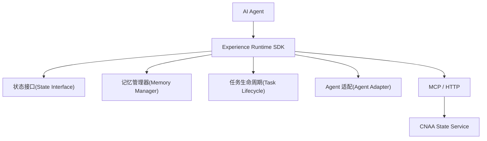
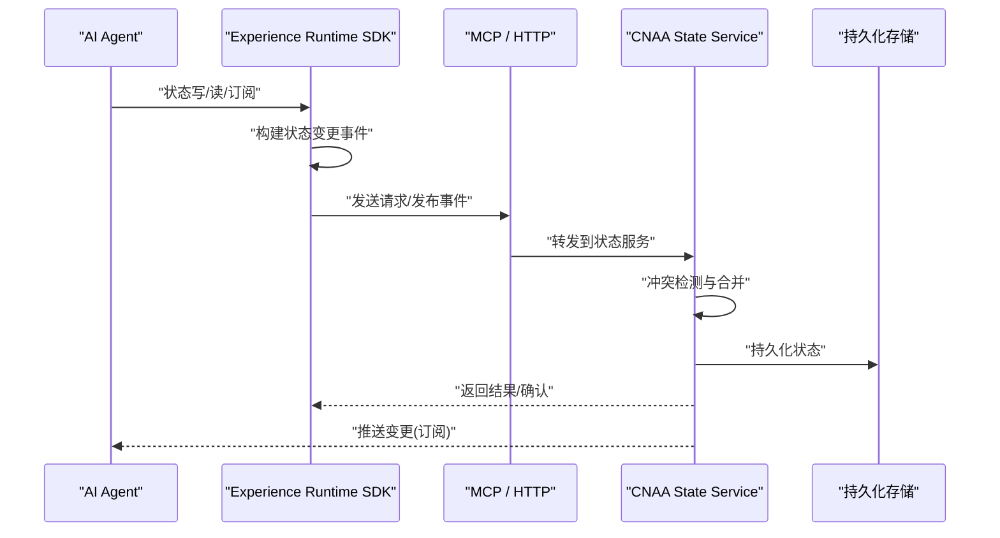
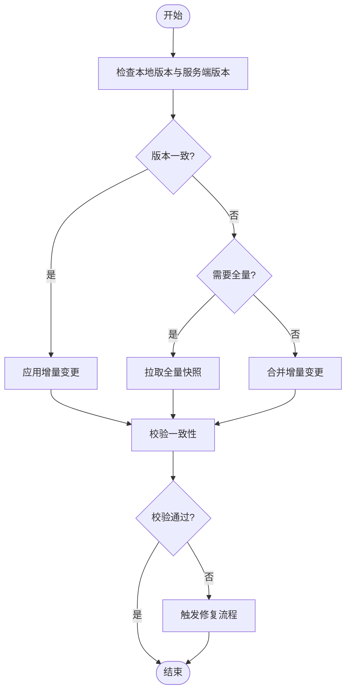
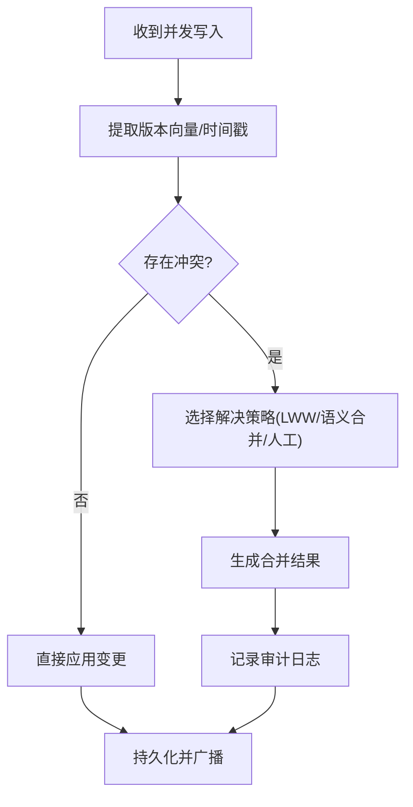
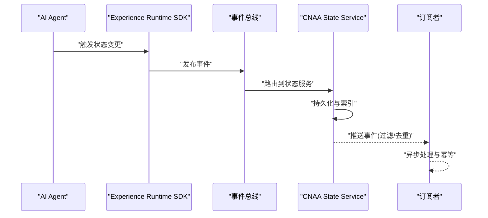
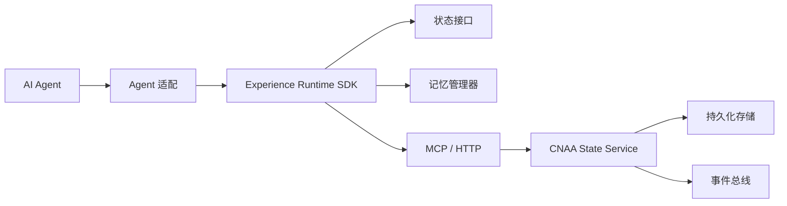

# 运行时状态同步（Runtime State Synchronization）

<cite>
**本文档引用的文件**   
- [README.md](file://README.md)
- [README_CN.md](file://README_CN.md)
</cite>

## 目录
1. [简介](#简介)
2. [项目结构](#项目结构)
3. [核心组件](#核心组件)
4. [架构总览](#架构总览)
5. [详细组件分析](#详细组件分析)
6. [依赖关系分析](#依赖关系分析)
7. [性能考量](#性能考量)
8. [故障排查指南](#故障排查指南)
9. [结论](#结论)
10. [附录](#附录)

## 简介
本技术文档聚焦于 CNAA 的“运行时状态同步”能力，面向需要在多实例、分布式环境下保持 Agent 经验与状态一致性的场景。CNAA 提供轻量级 Experience Runtime，使任意 AI Agent 在不修改推理逻辑的前提下，持续沉淀、同步与复用任务经验。其核心目标包括：
- 增量与全量同步策略，兼顾效率与一致性
- 冲突检测与解决机制，保障分布式一致性
- 事件驱动的状态变更传播，支持异步处理与消息队列
- 网络通信协议设计（MCP/HTTP），适配云端与本地部署
- 配置选项与调优建议，覆盖吞吐、延迟与资源占用
- 故障恢复与断线重连，以及数据修复策略
- 监控指标与可观测性，支撑运维与排障

## 项目结构
从 README 可知，CNAA 的整体架构由“AI Agent -> Experience Runtime SDK -> CNAA State Service”组成，并通过 MCP/HTTP 进行通信。SDK 内部包含状态接口、记忆管理、任务生命周期与 Agent 适配等模块；State Service 作为统一状态服务，对外暴露稳定接口供多个 Agent 实例访问。

图表来源
- [README.md:55-72](file://README.md#L55-L72)
- [README_CN.md:63-80](file://README_CN.md#L63-L80)

章节来源
- [README.md:55-72](file://README.md#L55-L72)
- [README_CN.md:63-80](file://README_CN.md#L63-L80)

## 核心组件
- 状态接口（State Interface）：定义统一的读写、查询与订阅接口，屏蔽底层存储差异，为上层提供一致的状态访问体验。
- 记忆管理器（Memory Manager）：负责经验的持久化、版本控制、增量快照与合并策略，确保状态变更的可追溯与可回滚。
- 任务生命周期（Task Lifecycle）：管理任务从创建、执行到完成的全生命周期，将关键状态变更与经验沉淀绑定到任务阶段。
- Agent 适配（Agent Adapter）：将不同 Agent 的实现细节抽象为统一调用方式，降低接入成本并保证行为一致性。
- 状态服务（CNAA State Service）：集中式状态管理与同步中枢，提供高可用、可扩展的状态同步与一致性保障。

章节来源
- [README.md:55-72](file://README.md#L55-L72)
- [README_CN.md:63-80](file://README_CN.md#L63-L80)

## 架构总览
下图展示了运行时状态同步的总体流程：Agent 通过 SDK 发起状态操作，SDK 将变更转换为事件或请求，经由 MCP/HTTP 传输至 State Service；State Service 负责冲突检测、合并与持久化，并向订阅者广播变更，实现最终一致性。

图表来源
- [README.md:55-72](file://README.md#L55-L72)
- [README_CN.md:63-80](file://README_CN.md#L63-L80)

## 详细组件分析

### 增量与全量同步策略
- 增量同步：基于版本号或时间戳的变更集（delta）传输，减少带宽与处理开销。适用于高频小变更场景。
- 全量同步：在初始化或严重不一致时触发，拉取完整状态快照，确保快速收敛。适用于冷启动或修复场景。
- 混合策略：默认采用增量为主、全量为兜底；当检测到版本漂移过大或校验失败时自动降级为全量。

图表来源
- [README.md:55-72](file://README.md#L55-L72)
- [README_CN.md:63-80](file://README_CN.md#L63-L80)

章节来源
- [README.md:55-72](file://README.md#L55-L72)
- [README_CN.md:63-80](file://README_CN.md#L63-L80)

### 冲突检测与解决机制
- 冲突检测：基于字段级版本向量或因果顺序判断是否存在并发写入冲突。
- 解决策略：
  - 最后写入胜出（LWW）：适用于幂等且允许覆盖的场景。
  - 语义合并：针对结构化数据（如列表、映射）进行字段级合并。
  - 人工介入：对不可自动合并的冲突标记并上报，等待外部决策。
- 审计与回滚：所有冲突与合并结果记录审计日志，支持按版本回滚。

图表来源
- [README.md:55-72](file://README.md#L55-L72)
- [README_CN.md:63-80](file://README_CN.md#L63-L80)

章节来源
- [README.md:55-72](file://README.md#L55-L72)
- [README_CN.md:63-80](file://README_CN.md#L63-L80)

### 分布式环境下的数据一致性保证
- 一致性模型：最终一致性优先，强一致性仅在必要路径（如事务边界）启用。
- 共识与排序：使用单调递增的版本号或全局有序的事件流，避免环状依赖。
- 分区与复制：按状态键分区，副本间通过增量同步与心跳保活。
- 补偿与修复：定期一致性巡检，发现偏差后触发修复任务。

章节来源
- [README.md:55-72](file://README.md#L55-L72)
- [README_CN.md:63-80](file://README_CN.md#L63-L80)

### 状态变更的传播机制与事件驱动架构
- 事件模型：状态变更被封装为不可变事件，携带类型、负载、版本与签名。
- 发布/订阅：SDK 订阅感兴趣的状态域，State Service 作为事件中枢分发。
- 异步处理：消费者按需消费事件，支持重试、死信与幂等处理。
- 背压与限流：在高吞吐场景下，通过缓冲与速率限制保护系统稳定性。

图表来源
- [README.md:55-72](file://README.md#L55-L72)
- [README_CN.md:63-80](file://README_CN.md#L63-L80)

章节来源
- [README.md:55-72](file://README.md#L55-L72)
- [README_CN.md:63-80](file://README_CN.md#L63-L80)

### 网络通信协议设计（MCP/HTTP）
- 协议选型：MCP 用于 Agent 与 SDK 之间的高内聚交互；HTTP 用于跨进程/跨服务的通用接口。
- 消息格式：JSON 或 Protobuf，包含请求 ID、版本、签名与负载。
- 安全与认证：TLS 加密、Token 鉴权、签名校验防篡改。
- 错误码与重试：标准化错误码，指数退避重试，支持熔断与降级。

章节来源
- [README.md:55-72](file://README.md#L55-L72)
- [README_CN.md:63-80](file://README_CN.md#L63-L80)

### 消息队列与异步处理机制
- 队列选型：Kafka/RabbitMQ/Redis Streams 等，根据吞吐与可靠性需求选择。
- 分区与顺序：按状态键分区保证顺序，必要时使用单分区严格序。
- 消费模型：至少一次/恰好一次语义，结合幂等与去重表保证正确性。
- 监控与告警：队列积压、消费延迟、失败率等指标纳入监控。

章节来源
- [README.md:55-72](file://README.md#L55-L72)
- [README_CN.md:63-80](file://README_CN.md#L63-L80)

### 同步策略的配置选项与调优建议
- 同步模式：增量/全量/混合，默认增量；设置阈值触发全量。
- 批大小与频率：调整批量大小与刷新间隔以平衡吞吐与延迟。
- 超时与重试：连接超时、请求超时、重试次数与退避策略。
- 缓存与压缩：本地缓存热点状态，启用压缩减少带宽。
- 资源限制：内存、CPU、IO 配额，防止雪崩。

章节来源
- [README.md:55-72](file://README.md#L55-L72)
- [README_CN.md:63-80](file://README_CN.md#L63-L80)

### 故障恢复机制、断线重连与数据修复
- 断线检测：心跳与超时判定，快速失败与优雅降级。
- 重连策略：指数退避、最大重试次数、随机抖动避免惊群。
- 数据修复：基于版本比对与审计日志的差异修复，支持选择性回滚。
- 健康检查：服务就绪探针、依赖健康检查与自愈脚本。

章节来源
- [README.md:55-72](file://README.md#L55-L72)
- [README_CN.md:63-80](file://README_CN.md#L63-L80)

### 实际部署配置示例与监控指标说明
- 部署拓扑：多实例 State Service + 负载均衡 + 持久化存储（数据库/对象存储）。
- 环境变量：服务地址、认证凭据、队列连接、超时与重试参数。
- 监控指标：
  - 同步延迟（P50/P95/P99）
  - 事件吞吐（QPS）
  - 冲突率与修复耗时
  - 队列积压与消费延迟
  - 错误率与重试比例
- 告警规则：延迟超阈、错误率飙升、队列积压持续增长。

章节来源
- [README.md:55-72](file://README.md#L55-L72)
- [README_CN.md:63-80](file://README_CN.md#L63-L80)

## 依赖关系分析
- SDK 依赖状态接口与记忆管理器，向上屏蔽复杂性，向下对接网络层。
- 状态服务依赖持久化存储与事件总线，提供一致性与扩展性。
- Agent 通过适配器与 SDK 解耦，便于替换与升级。

图表来源
- [README.md:55-72](file://README.md#L55-L72)
- [README_CN.md:63-80](file://README_CN.md#L63-L80)

章节来源
- [README.md:55-72](file://README.md#L55-L72)
- [README_CN.md:63-80](file://README_CN.md#L63-L80)

## 性能考量
- 增量优先：尽量使用增量同步，降低带宽与 CPU 消耗。
- 批处理：合理批大小与合并窗口，提升吞吐。
- 缓存策略：热点状态本地缓存，配合失效与一致性校验。
- 异步化：非关键路径异步处理，缩短主链路延迟。
- 资源隔离：按租户或业务域隔离资源，避免相互影响。

[本节为通用指导，不直接分析具体文件]

## 故障排查指南
- 常见问题：
  - 同步延迟过高：检查网络、队列积压、批大小与压缩设置。
  - 冲突频繁：审查并发写入策略与合并规则，必要时引入锁或更细粒度版本。
  - 数据不一致：核对版本向量与审计日志，执行修复任务。
  - 断线重连风暴：调整退避策略与随机抖动，避免惊群。
- 诊断工具：
  - 日志采集与追踪（请求 ID、事件 ID）
  - 指标看板（延迟、吞吐、错误率）
  - 一致性巡检报告

章节来源
- [README.md:55-72](file://README.md#L55-L72)
- [README_CN.md:63-80](file://README_CN.md#L63-L80)

## 结论
CNAA 的运行时状态同步以事件驱动为核心，结合增量/全量策略、冲突检测与分布式一致性保障，为多实例 Agent 提供了可靠的状态同步能力。通过合理的配置与监控，可在复杂环境中实现高效、稳定的状态同步与经验沉淀。

[本节为总结，不直接分析具体文件]

## 附录
- 术语表：
  - 增量同步：仅传输变更部分
  - 全量同步：传输完整状态快照
  - 版本向量：用于冲突检测与排序
  - 最终一致性：允许短暂不一致，但会收敛
- 参考链接：
  - 状态接口规范（待补充）
  - 持久化记忆设计（待补充）
  - 整体架构文档（待补充）

[本节为补充信息，不直接分析具体文件]