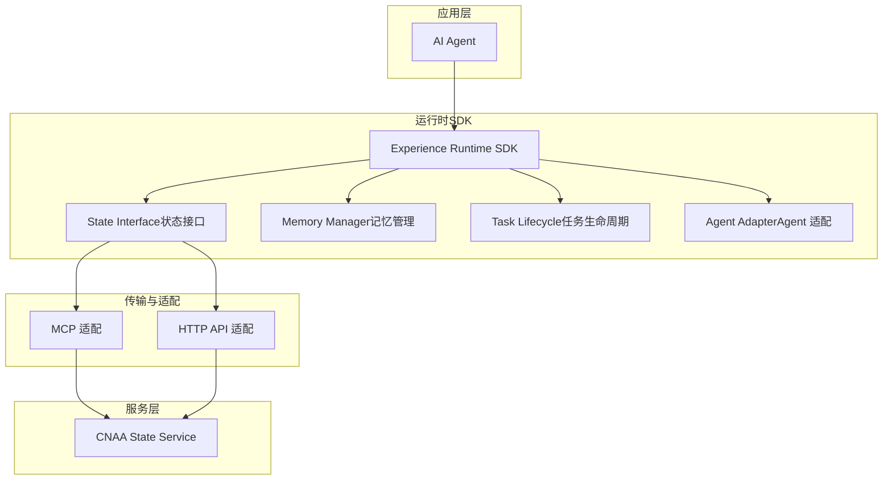
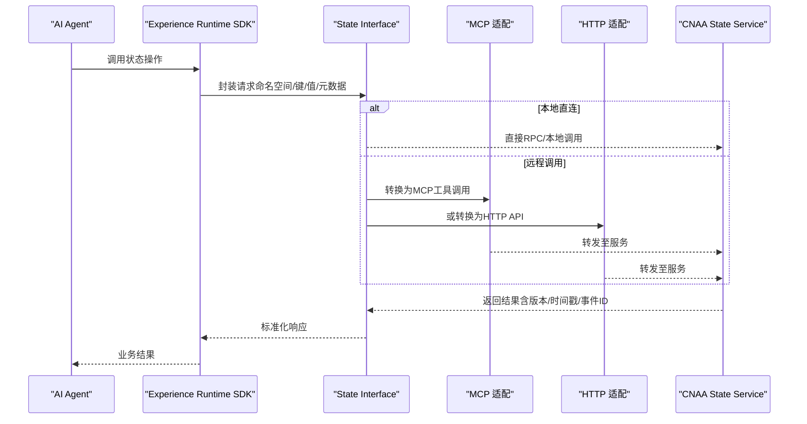
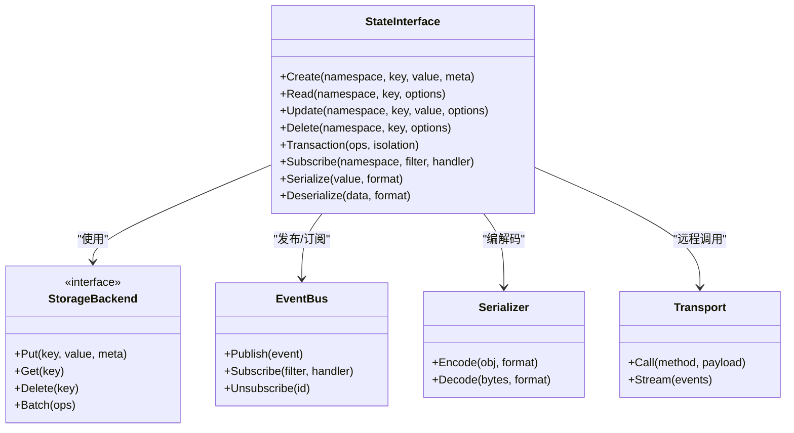

# State Interface（状态接口）

<cite>
**本文档引用的文件**   
- [README.md](file://README.md)
- [README_CN.md](file://README_CN.md)
</cite>

## 目录
1. [简介](#简介)
2. [项目结构](#项目结构)
3. [核心组件](#核心组件)
4. [架构总览](#架构总览)
5. [详细组件分析](#详细组件分析)
6. [依赖关系分析](#依赖关系分析)
7. [性能考量](#性能考量)
8. [故障排查指南](#故障排查指南)
9. [结论](#结论)
10. [附录：API参考与示例](#附录api参考与示例)

## 简介
本文件面向“统一状态接口”的设计与实现，目标是让任意AI Agent在不修改推理逻辑的前提下，获得持久化经验记忆、跨进程/跨节点的状态同步与复用能力。State Interface作为Experience Runtime SDK的核心抽象层，屏蔽底层存储差异，提供一致的CRUD、事务、并发控制、序列化/反序列化、事件通知以及MCP/HTTP适配能力。

设计原则
- 统一抽象：对外暴露一致的状态操作接口，隐藏后端存储细节（内存、本地文件、KV数据库、对象存储等）。
- 强一致性可选：支持读多写少场景的弱一致与需要严格一致性的强一致模式。
- 可扩展性：通过插件式后端接入，快速扩展新的存储介质或协议。
- 可观测性：内置变更事件与审计日志，便于追踪状态演化与问题定位。
- 安全隔离：按Agent/租户维度进行命名空间隔离与访问控制。

## 项目结构
当前仓库处于规划阶段，包含中英文README与文档索引。State Interface的具体实现尚未落地，但可从README中的架构描述推导出模块边界与交互方式。

图表来源
- [README.md:55-72](file://README.md#L55-L72)
- [README_CN.md:63-80](file://README_CN.md#L63-L80)

章节来源
- [README.md:55-72](file://README.md#L55-L72)
- [README_CN.md:63-80](file://README_CN.md#L63-L80)

## 核心组件
- State Interface（状态接口）
  - 职责：定义统一的CRUD、事务、版本控制、序列化、事件发布订阅、并发控制与错误语义。
  - 关键能力：原子更新、乐观锁、读写分离、批量操作、分页查询、条件更新。
- Memory Manager（记忆管理）
  - 职责：负责经验的组织、检索、压缩与归档；与State Interface协作完成持久化。
- Task Lifecycle（任务生命周期）
  - 职责：将状态与任务生命周期绑定，确保状态随任务创建、运行、完成、清理而演进。
- Agent Adapter（Agent 适配）
  - 职责：对接不同Agent框架，统一调用State Interface，屏蔽Agent差异。
- MCP / HTTP 适配
  - 职责：将State Interface暴露为MCP工具与HTTP API，供外部系统或服务间调用。
- CNAA State Service
  - 职责：服务端实现，承载状态存储、事务、并发控制、事件广播与审计。

章节来源
- [README.md:55-72](file://README.md#L55-L72)
- [README_CN.md:63-80](file://README_CN.md#L63-L80)

## 架构总览
State Interface位于Experience Runtime SDK与服务端之间，向上屏蔽存储差异，向下通过MCP/HTTP适配到CNAA State Service。

图表来源
- [README.md:55-72](file://README.md#L55-L72)
- [README_CN.md:63-80](file://README_CN.md#L63-L80)

## 详细组件分析

### 状态模型与命名空间
- 命名空间（Namespace）
  - 用于隔离不同Agent、租户或环境的状态空间。
  - 建议采用层级结构：tenant/project/agent/task。
- 键（Key）
  - 唯一标识一条状态记录，支持路径式与哈希式两种策略。
- 值（Value）
  - 支持结构化数据（JSON）、二进制（Blob）、流式增量（Patch）。
- 元数据（Metadata）
  - 版本、时间戳、标签、TTL、权限信息等。

章节来源
- [README.md:55-72](file://README.md#L55-L72)
- [README_CN.md:63-80](file://README_CN.md#L63-L80)

### CRUD接口设计
- Create（创建）
  - 入参：命名空间、键、值、元数据（可选）。
  - 行为：幂等写入，冲突时根据策略决定覆盖或拒绝。
  - 返回：成功标志、版本号、时间戳。
- Read（读取）
  - 入参：命名空间、键、版本（可选）、一致性级别（可选）。
  - 行为：支持快照读、增量读、条件读。
  - 返回：值、元数据、版本信息。
- Update（更新）
  - 入参：命名空间、键、值、期望版本（可选）、条件表达式（可选）。
  - 行为：支持全量替换与部分更新（Patch），乐观锁校验。
  - 返回：成功标志、新版本号。
- Delete（删除）
  - 入参：命名空间、键、软删除标记（可选）。
  - 行为：支持立即删除与延迟删除（TTL）。
  - 返回：成功标志、被删记录的版本。

章节来源
- [README.md:55-72](file://README.md#L55-L72)
- [README_CN.md:63-80](file://README_CN.md#L63-L80)

### 事务支持机制
- 事务边界
  - 单键事务：对同一键的多步操作保证原子性。
  - 多键事务：跨键操作的ACID保障（由服务端实现）。
- 隔离级别
  - 默认读已提交（RC），可选串行化（SERIALIZABLE）。
- 补偿与回滚
  - 失败自动回滚；支持手动补偿操作。
- 超时与重试
  - 配置事务超时；客户端可设置重试策略与退避。

章节来源
- [README.md:55-72](file://README.md#L55-L72)
- [README_CN.md:63-80](file://README_CN.md#L63-L80)

### 并发控制策略
- 乐观锁
  - 基于版本号的条件更新，冲突时返回冲突码，客户端重试或降级。
- 悲观锁
  - 显式加锁/解锁，适用于长事务与强一致场景。
- 读写分离
  - 读路径走副本或缓存，写路径走主库，降低热点冲突。
- 限流与背压
  - 服务端对高并发写进行限流，客户端感知并退避。

章节来源
- [README.md:55-72](file://README.md#L55-L72)
- [README_CN.md:63-80](file://README_CN.md#L63-L80)

### 序列化和反序列化
- 格式选择
  - JSON（可读性好）、Protobuf（高效）、MessagePack（通用）。
- 兼容性
  - 字段新增/删除的向后兼容策略；版本迁移钩子。
- 压缩与分片
  - 大值压缩存储；超大值分片存储与合并读取。
- 校验
  - Schema校验、完整性校验（如CRC/Hash）。

章节来源
- [README.md:55-72](file://README.md#L55-L72)
- [README_CN.md:63-80](file://README_CN.md#L63-L80)

### 事件机制与监听器模式
- 事件类型
  - 创建、更新、删除、过期、冲突、恢复等。
- 发布订阅
  - 客户端订阅命名空间或键前缀的事件；服务端推送或轮询获取。
- 可靠性
  - 至少一次投递；去重与顺序保证（可选）。
- 监听器
  - 支持异步回调与批处理；异常隔离与重试。

章节来源
- [README.md:55-72](file://README.md#L55-L72)
- [README_CN.md:63-80](file://README_CN.md#L63-L80)

### MCP协议适配
- 工具定义
  - 将CRUD、事务、事件订阅等封装为MCP工具。
- 参数映射
  - 将State Interface参数映射为MCP工具输入输出。
- 错误映射
  - 将服务错误码映射为MCP标准错误。
- 鉴权与会话
  - 透传Agent身份与会话上下文。

章节来源
- [README.md:55-72](file://README.md#L55-L72)
- [README_CN.md:63-80](file://README_CN.md#L63-L80)

### HTTP API适配
- REST风格
  - GET/POST/PUT/DELETE对应Read/Create/Update/Delete。
- 请求体
  - JSON结构，包含命名空间、键、值、元数据与选项。
- 响应体
  - 统一包装：code、message、data、trace_id。
- 版本控制
  - URL或Header指定API版本。

章节来源
- [README.md:55-72](file://README.md#L55-L72)
- [README_CN.md:63-80](file://README_CN.md#L63-L80)

### 错误处理与语义
- 错误分类
  - 参数错误、资源不存在、冲突、权限不足、服务不可用。
- 错误码
  - 统一错误码表，区分客户端错误与服务端错误。
- 重试策略
  - 幂等操作可重试；非幂等需谨慎。
- 审计与追踪
  - 每次操作生成trace_id，便于链路追踪。

章节来源
- [README.md:55-72](file://README.md#L55-L72)
- [README_CN.md:63-80](file://README_CN.md#L63-L80)

## 依赖关系分析
State Interface依赖以下子系统：
- 存储后端（KV/DB/对象存储）
- 事件总线（消息队列或内嵌事件环）
- 序列化器（JSON/Protobuf等）
- 传输层（MCP/HTTP）
- 鉴权与审计（IAM/审计日志）

图表来源
- [README.md:55-72](file://README.md#L55-L72)
- [README_CN.md:63-80](file://README_CN.md#L63-L80)

章节来源
- [README.md:55-72](file://README.md#L55-L72)
- [README_CN.md:63-80](file://README_CN.md#L63-L80)

## 性能考量
- 读路径优化
  - 多级缓存（本地+分布式）、只读副本、预取与预热。
- 写路径优化
  - 批量写入、合并小写、异步落盘、WAL。
- 事务与锁
  - 短事务优先；热点键分片与分区；避免长事务。
- 序列化
  - 选择紧凑格式；按需加载字段；压缩大值。
- 监控与容量规划
  - QPS、延迟、命中率、磁盘IO、网络带宽监控。

[本节为通用指导，不直接分析具体文件]

## 故障排查指南
常见问题与定位步骤
- 读取不到数据
  - 检查命名空间与键是否正确；确认是否被删除或过期；查看事件日志。
- 更新冲突
  - 检查版本号与条件更新；增加重试与退避；必要时降级为强制覆盖。
- 事务超时
  - 缩短事务范围；减少锁持有时间；拆分大事务。
- 事件丢失或重复
  - 检查订阅连接；启用幂等处理；核对投递语义。
- 序列化失败
  - 校验Schema；检查字段兼容；回滚到旧版本。

章节来源
- [README.md:55-72](file://README.md#L55-L72)
- [README_CN.md:63-80](file://README_CN.md#L63-L80)

## 结论
State Interface通过统一的抽象层屏蔽了底层存储差异，提供了稳定的CRUD、事务、并发控制、序列化、事件与协议适配能力。它使Agent能够在无需修改推理逻辑的情况下，获得可靠的持久化经验记忆与跨环境状态同步能力。随着后端存储与协议的扩展，State Interface将持续保持稳定性与高性能。

[本节为总结，不直接分析具体文件]

## 附录：API参考与示例

### API参考（摘要）
- Create(namespace, key, value, meta)
  - 参数：命名空间、键、值、元数据（可选）
  - 返回：成功标志、版本号、时间戳
  - 错误：参数非法、权限不足、存储异常
- Read(namespace, key, options)
  - 参数：命名空间、键、一致性级别、版本（可选）
  - 返回：值、元数据、版本信息
  - 错误：资源不存在、权限不足、服务异常
- Update(namespace, key, value, options)
  - 参数：命名空间、键、值、期望版本、条件表达式（可选）
  - 返回：成功标志、新版本号
  - 错误：冲突、权限不足、服务异常
- Delete(namespace, key, options)
  - 参数：命名空间、键、软删除标记（可选）
  - 返回：成功标志、被删记录版本
  - 错误：权限不足、服务异常
- Transaction(ops, isolation)
  - 参数：操作列表、隔离级别
  - 返回：成功标志、各操作结果
  - 错误：事务失败、超时、冲突
- Subscribe(namespace, filter, handler)
  - 参数：命名空间、过滤规则、回调处理器
  - 返回：订阅ID
  - 错误：参数非法、权限不足
- Serialize(value, format) / Deserialize(data, format)
  - 参数：值/数据、格式（JSON/Protobuf等）
  - 返回：编码后数据/解码后对象
  - 错误：格式不支持、数据损坏

章节来源
- [README.md:55-72](file://README.md#L55-L72)
- [README_CN.md:63-80](file://README_CN.md#L63-L80)

### 使用示例（场景化）
- 场景A：Agent会话状态持久化
  - 在会话开始时Create会话状态；运行过程中Update增量；结束时Delete或归档。
- 场景B：任务经验沉淀
  - 任务完成后Write经验条目；后续任务Read历史经验；通过事件触发经验聚合。
- 场景C：跨节点状态同步
  - 通过MCP/HTTP调用State Service；利用事件订阅实现最终一致。
- 场景D：高并发写热点键
  - 使用乐观锁与重试；必要时引入分片与队列削峰。

章节来源
- [README.md:55-72](file://README.md#L55-L72)
- [README_CN.md:63-80](file://README_CN.md#L63-L80)

### 扩展自定义存储后端开发指南
- 实现StorageBackend接口
  - 实现Put/Get/Delete/Batch等方法；保证幂等与一致性语义。
- 注册序列化器
  - 实现Encode/Decode；支持多种格式。
- 接入事件总线
  - 在状态变更后发布事件；确保至少一次投递。
- 适配传输层
  - 若通过MCP/HTTP暴露，实现Call/Stream方法。
- 测试与验证
  - 单元测试覆盖CRUD、事务、并发、序列化；集成测试验证端到端流程。

章节来源
- [README.md:55-72](file://README.md#L55-L72)
- [README_CN.md:63-80](file://README_CN.md#L63-L80)