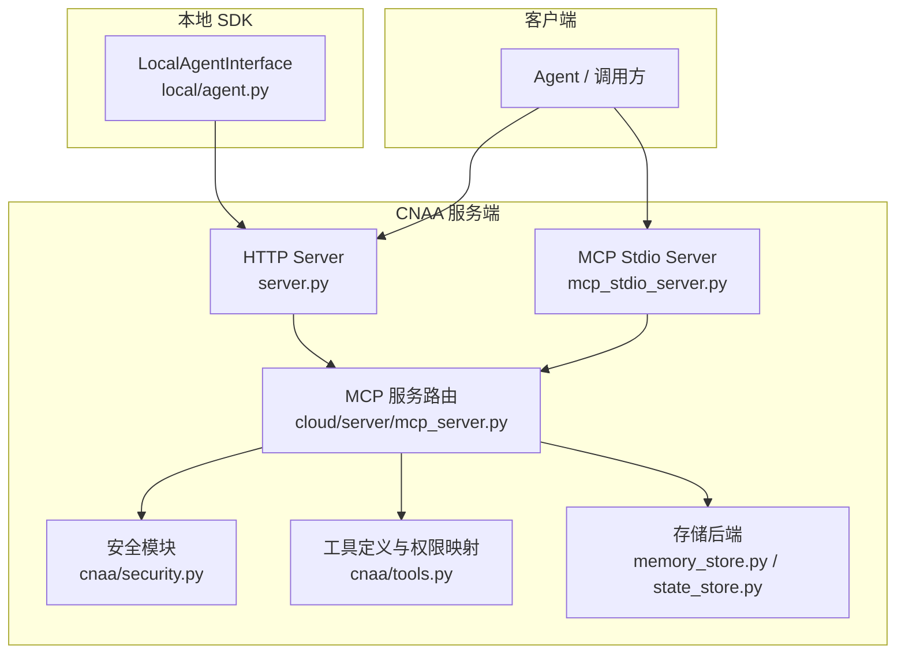
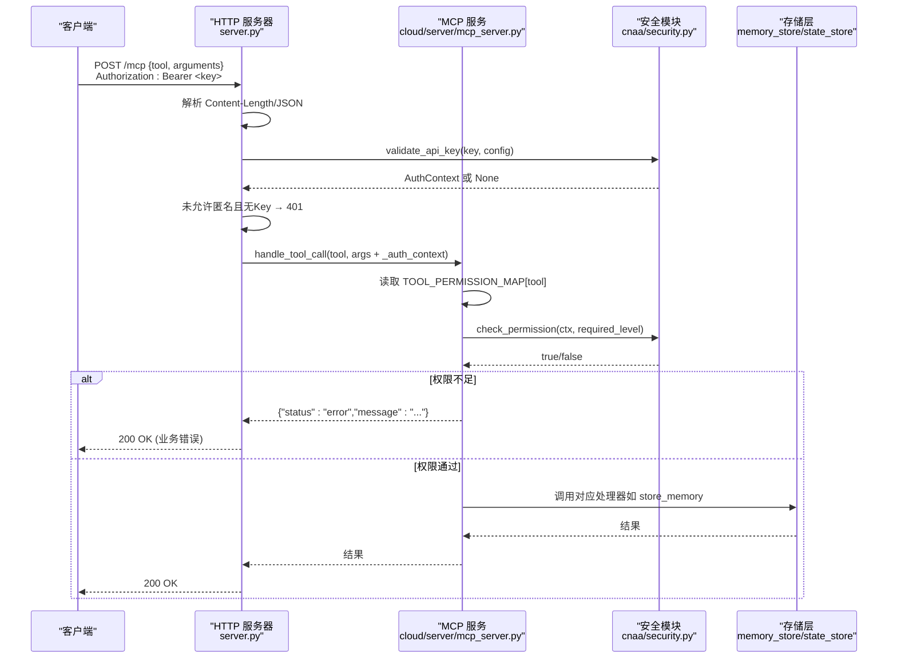
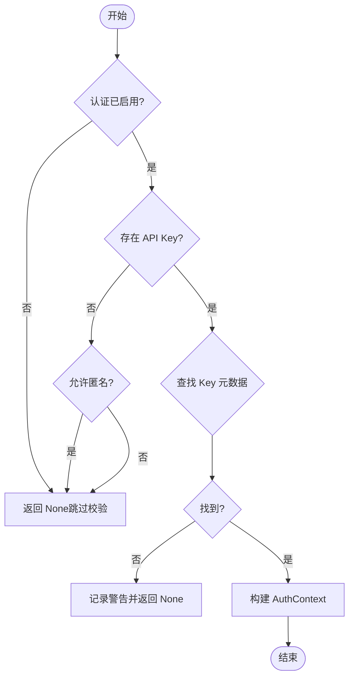
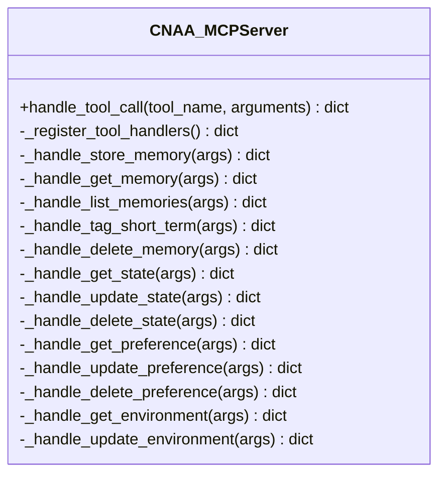
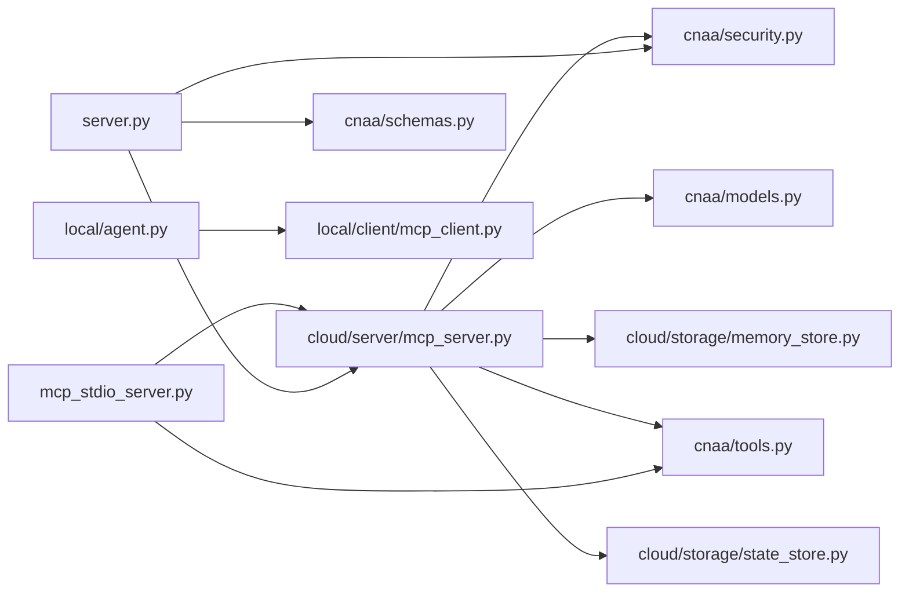

# 工具权限系统

<cite>
**本文引用的文件**   
- [README.md](file://README.md)
- [server.py](file://server.py)
- [mcp_stdio_server.py](file://mcp_stdio_server.py)
- [cloud/server/mcp_server.py](file://cloud/server/mcp_server.py)
- [cnaa/security.py](file://cnaa/security.py)
- [cnaa/tools.py](file://cnaa/tools.py)
- [cnaa/schemas.py](file://cnaa/schemas.py)
- [cnaa/models.py](file://cnaa/models.py)
- [cloud/storage/memory_store.py](file://cloud/storage/memory_store.py)
- [cloud/storage/state_store.py](file://cloud/storage/state_store.py)
- [local/agent.py](file://local/agent.py)
- [tests/test_security.py](file://tests/test_security.py)
</cite>

## 目录
1. [简介](#简介)
2. [项目结构](#项目结构)
3. [核心组件](#核心组件)
4. [架构总览](#架构总览)
5. [详细组件分析](#详细组件分析)
6. [依赖关系分析](#依赖关系分析)
7. [性能考量](#性能考量)
8. [故障排查指南](#故障排查指南)
9. [结论](#结论)
10. [附录](#附录)

## 简介
本文件聚焦 CNAA 的“工具权限系统”，围绕认证、授权与工具级访问控制展开，说明请求如何从 HTTP/stdio 入口进入，经过鉴权上下文注入、工具权限校验，最终到达存储层。系统默认关闭认证以兼容旧版本；启用后支持基于 API Key 的身份验证与读/写/管理员三级权限，并通过工具到权限的映射实现细粒度控制。

## 项目结构
- 服务端入口：HTTP 服务器（/schemas、/mcp、/health）与 stdio MCP 服务器
- 安全模块：API Key 配置、校验与权限检查
- 工具定义：13 个 MCP 工具的声明与权限映射
- 模型与模式：数据模型与接口 JSON Schema 单点管理
- 存储后端：内存实现的记忆与状态存储
- 本地代理：统一封装 MCP Client、即时记忆与状态缓存

图表来源 
- [server.py:67-180](file://server.py#L67-L180)
- [mcp_stdio_server.py:44-163](file://mcp_stdio_server.py#L44-L163)
- [cloud/server/mcp_server.py:54-168](file://cloud/server/mcp_server.py#L54-L168)
- [cnaa/security.py:86-166](file://cnaa/security.py#L86-L166)
- [cnaa/tools.py:227-247](file://cnaa/tools.py#L227-L247)
- [cloud/storage/memory_store.py:19-199](file://cloud/storage/memory_store.py#L19-L199)
- [cloud/storage/state_store.py:18-276](file://cloud/storage/state_store.py#L18-L276)
- [local/agent.py:35-118](file://local/agent.py#L35-L118)

章节来源
- [README.md:106-116](file://README.md#L106-L116)

## 核心组件
- 安全模块（cnaa/security.py）
  - 提供 AuthConfig、AuthContext、PermissionLevel
  - validate_api_key：O(1) 字典查找校验 API Key
  - check_permission：按 read/write/admin 进行授权判断
  - load_auth_config_from_env：从环境变量加载配置
- 工具定义（cnaa/tools.py）
  - 13 个 MCP 工具名称与描述
  - TOOL_PERMISSION_MAP：将每个工具映射为 read 或 write
- MCP 服务（cloud/server/mcp_server.py）
  - handle_tool_call：路由工具、注入/校验 _auth_context、执行权限检查、调用具体处理器
- HTTP 入口（server.py）
  - 解析 Authorization: Bearer，提取 API Key，构造并注入 _auth_context
- Stdio 入口（mcp_stdio_server.py）
  - 通过 tools/call 路由到同一 MCP 服务
- 存储层（cloud/storage/*.py）
  - InMemoryMemoryStore、InMemoryStateStore：在读写时校验 agent_id 一致性（隐身拒绝或错误返回）

章节来源
- [cnaa/security.py:31-166](file://cnaa/security.py#L31-L166)
- [cnaa/tools.py:53-70](file://cnaa/tools.py#L53-L70)
- [cnaa/tools.py:227-247](file://cnaa/tools.py#L227-L247)
- [cloud/server/mcp_server.py:105-168](file://cloud/server/mcp_server.py#L105-L168)
- [server.py:118-179](file://server.py#L118-L179)
- [mcp_stdio_server.py:193-218](file://mcp_stdio_server.py#L193-L218)
- [cloud/storage/memory_store.py:42-86](file://cloud/storage/memory_store.py#L42-L86)
- [cloud/storage/state_store.py:73-122](file://cloud/storage/state_store.py#L73-L122)

## 架构总览
下图展示一次带认证的 MCP 工具调用流程：HTTP 层解析 Bearer Token，校验并注入 _auth_context；MCP 服务根据工具名选择处理器，读取权限映射并进行授权检查；处理器调用存储层完成操作。

图表来源 
- [server.py:118-179](file://server.py#L118-L179)
- [cloud/server/mcp_server.py:105-168](file://cloud/server/mcp_server.py#L105-L168)
- [cnaa/security.py:86-166](file://cnaa/security.py#L86-L166)
- [cloud/storage/memory_store.py:42-86](file://cloud/storage/memory_store.py#L42-L86)

## 详细组件分析

### 安全模块（认证与授权）
- 设计要点
  - 默认关闭认证，向后兼容
  - O(1) API Key 查找，纯数据校验，无业务逻辑
  - 支持三种权限级别：read_only、read_write、admin
- 关键函数
  - validate_api_key：根据配置决定是否放行、是否允许匿名、Key 是否存在
  - check_permission：按 read/write 判定；None 上下文视为全量放行
  - load_auth_config_from_env：从环境变量加载配置，JSON 解析失败回退为空

图表来源 
- [cnaa/security.py:86-133](file://cnaa/security.py#L86-L133)

章节来源
- [cnaa/security.py:31-166](file://cnaa/security.py#L31-L166)

### 工具定义与权限映射
- 工具分类
  - 记忆类：store/get/list/tag/delete
  - 状态类：get/update/delete
  - 偏好类：get/update/delete
  - 环境类：get/update
- 权限映射
  - 读操作（GET/LIST/SEARCH）→ "read"
  - 写操作（STORE/UPDATE/DELETE/TAG）→ "write"
- 作用
  - 作为 MCP 服务中权限检查的依据，确保只读/读写/管理员三类角色正确受限

章节来源
- [cnaa/tools.py:53-70](file://cnaa/tools.py#L53-L70)
- [cnaa/tools.py:227-247](file://cnaa/tools.py#L227-L247)

### MCP 服务（工具路由与权限校验）
- 职责
  - 注册 13 个工具处理器
  - handle_tool_call：路由、提取 _auth_context、权限检查、调用处理器
- 关键点
  - 若存在 _auth_context，则校验 agent_id 一致性，防止越权
  - 依据 TOOL_PERMISSION_MAP 决定所需权限级别
  - 异常统一捕获并返回结构化错误

图表来源 
- [cloud/server/mcp_server.py:54-168](file://cloud/server/mcp_server.py#L54-L168)

章节来源
- [cloud/server/mcp_server.py:83-168](file://cloud/server/mcp_server.py#L83-L168)

### HTTP 入口（Bearer Token 处理）
- 行为
  - 解析 Authorization 头，提取 Bearer Token
  - 当认证开启且不允许匿名时，缺失 Token 直接 401
  - 成功校验后将 _auth_context 注入参数传递给 MCP 服务

章节来源
- [server.py:118-179](file://server.py#L118-L179)

### Stdio MCP 入口
- 行为
  - 接收 JSON-RPC 2.0 消息，tools/call 路由到同一 MCP 服务
  - 结果包装为 MCP content 格式返回

章节来源
- [mcp_stdio_server.py:193-218](file://mcp_stdio_server.py#L193-L218)

### 存储层（隐式鉴权）
- 记忆存储
  - store/get/delete 均支持可选 auth_context
  - 若提供 auth_context，需保证 agent_id 一致，否则返回错误或隐身拒绝
- 状态存储
  - get/update/delete 同样进行 agent_id 一致性校验

章节来源
- [cloud/storage/memory_store.py:42-86](file://cloud/storage/memory_store.py#L42-L86)
- [cloud/storage/state_store.py:73-122](file://cloud/storage/state_store.py#L73-L122)

### 本地代理（集成点）
- LocalAgentInterface 聚合 MCP Client、即时记忆与状态缓存
- 对上层屏蔽底层通信细节，统一暴露 memory/state/preference/environment 操作

章节来源
- [local/agent.py:35-118](file://local/agent.py#L35-L118)

## 依赖关系分析
- server.py 依赖 cnaa.security、cloud.server.mcp_server、cnaa.schemas
- mcp_stdio_server.py 依赖 cloud.server.mcp_server、cnaa.tools
- cloud/server/mcp_server.py 依赖 cnaa.models、cnaa.security、cnaa.tools、cloud.storage.*
- storage 模块依赖 cnaa.models 与交互接口
- local.agent 依赖 MCP Client、InstantMemoryManager、StateCache

图表来源 
- [server.py:50-57](file://server.py#L50-L57)
- [mcp_stdio_server.py:32-33](file://mcp_stdio_server.py#L32-L33)
- [cloud/server/mcp_server.py:22-49](file://cloud/server/mcp_server.py#L22-L49)
- [cloud/storage/memory_store.py:15-16](file://cloud/storage/memory_store.py#L15-L16)
- [cloud/storage/state_store.py:14-15](file://cloud/storage/state_store.py#L14-L15)
- [local/agent.py:29-32](file://local/agent.py#L29-L32)

## 性能考量
- 认证路径
  - validate_api_key 使用字典 O(1) 查找，开销极低
  - check_permission 为常量时间比较
- 工具路由
  - handle_tool_call 通过字典映射 O(1) 路由
- 存储查询
  - list_memories 线性扫描 O(n)，适合小规模；生产可引入索引与分页
  - get/update/delete 为 O(1) 键值操作
- 网络与序列化
  - HTTP/stdio 均为 JSON 编解码，注意大负载时的压缩与批处理

[本节为通用指导，不直接分析具体文件]

## 故障排查指南
- 常见错误
  - 401 未携带或无效 API Key：检查 Authorization 头与环境变量配置
  - 权限不足：确认工具权限映射与用户权限级别（read_only 无法写）
  - Agent ID 不一致：请求中的 agent_id 与认证上下文不一致会被拒绝
  - JSON 解析失败：检查请求体是否为合法 JSON
- 定位建议
  - 查看服务端日志（server.py 与 mcp_stdio_server.py 的 logger）
  - 使用 /health 端点确认服务健康
  - 使用 /schemas 获取接口定义，核对字段与类型

章节来源
- [server.py:175-179](file://server.py#L175-L179)
- [mcp_stdio_server.py:93-105](file://mcp_stdio_server.py#L93-L105)
- [cloud/server/mcp_server.py:127-168](file://cloud/server/mcp_server.py#L127-L168)

## 结论
该工具权限系统以最小侵入的方式实现了“认证+授权”的闭环：HTTP/stdio 入口负责身份校验与上下文注入，MCP 服务负责工具级权限判定，存储层提供最后一道 agent_id 一致性保障。默认关闭认证保证了兼容性，按需启用即可满足多租户与最小权限原则。后续可在请求校验、限流、缓存与持久化方面进一步增强。

[本节为总结性内容，不直接分析具体文件]

## 附录

### 环境变量与配置
- CNAA_AUTH_ENABLED：是否启用认证（默认 false）
- CNAA_ALLOW_UNAUTHENTICATED：启用认证时是否允许匿名（默认 true）
- CNAA_API_KEYS：JSON 字符串，键为 API Key，值为包含 agent_id 与 permission 的元数据

章节来源
- [cnaa/security.py:169-208](file://cnaa/security.py#L169-L208)
- [README.md:106-116](file://README.md#L106-L116)

### 测试覆盖要点
- 权限枚举与默认配置
- API Key 校验与非法输入回退
- 工具权限映射完整性
- MCP 服务中权限拒绝与 Agent ID 一致性校验
- 存储层的隐身拒绝与错误返回

章节来源
- [tests/test_security.py:40-501](file://tests/test_security.py#L40-L501)