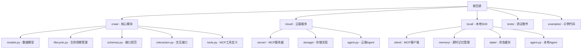
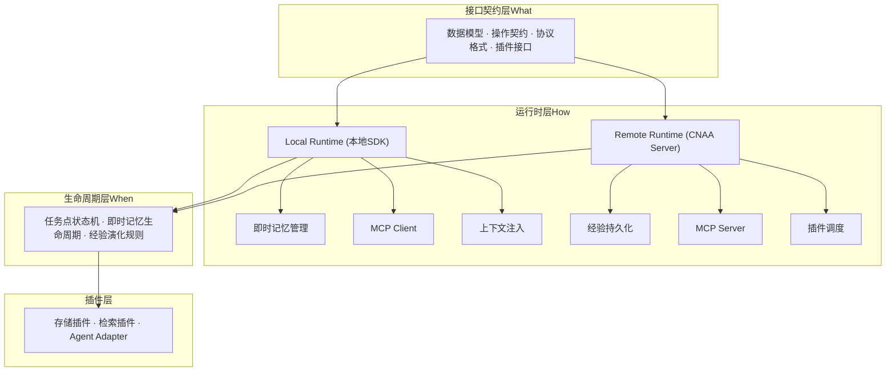
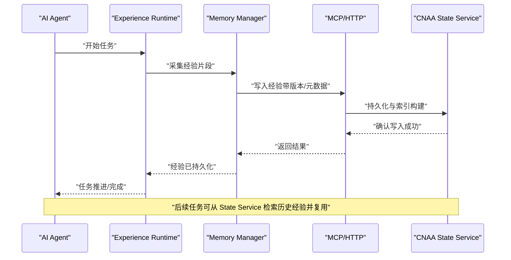
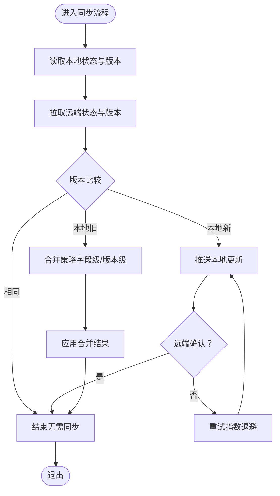
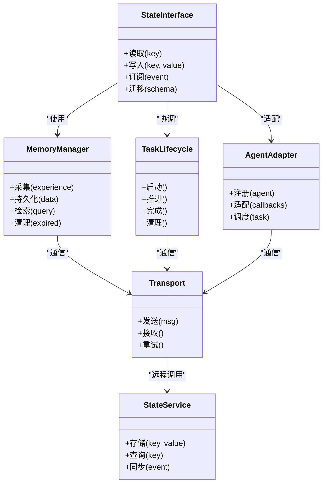

# 核心概念

<cite>
**本文档中引用的文件**
- [README.md](file://README.md)
- [README_CN.md](file://README_CN.md)
- [models.py](file://cnaa/models.py)
- [lifecycle.py](file://cnaa/lifecycle.py)
- [schemas.py](file://cnaa/schemas.py)
- [interaction.py](file://cnaa/interaction.py)
- [tools.py](file://cnaa/tools.py)
- [memory_store.py](file://cloud/storage/memory_store.py)
- [state_store.py](file://cloud/storage/state_store.py)
- [instant_memory.py](file://local/memory/instant_memory.py)
- [state_cache.py](file://local/state/state_cache.py)
</cite>

## 更新摘要
**所做更改**
- 基于代码库的系统性文档改进，全面更新了IMPLEMENTED/TODO模式的实现状态
- 新增了核心数据模型、生命周期管理、存储组件的详细分析
- 更新了架构总览和组件关系图，反映实际的代码结构
- 增强了经验运行时、持久化记忆、状态接口等核心概念的详细说明
- 添加了具体的使用场景和最佳实践建议

## 目录
1. [简介](#简介)
2. [项目结构](#项目结构)
3. [核心组件](#核心组件)
4. [架构总览](#架构总览)
5. [详细组件分析](#详细组件分析)
6. [依赖关系分析](#依赖关系分析)
7. [性能考量](#性能考量)
8. [故障排查指南](#故障排查指南)
9. [结论](#结论)
10. [附录](#附录)

## 简介
CNAA（Cloud Native Agentic Architecture）是一个面向 AI Agent 的"经验运行时"框架，目标是让任意 Agent 在不修改自身推理逻辑的前提下，实现经验的持续沉淀、跨会话复用与状态同步。它不是 Agent 框架、工作流引擎或 RAG 实现，而是为 Agent 提供一套轻量级的 Experience Runtime，将"经验"从临时 Prompt 上下文抽离为独立、可持久化的运行时资源。

核心主张：
- **持久化经验记忆**：经验不再是临时的提示词片段，而是独立的运行时资源，具备生命周期管理与跨进程/跨实例共享能力。
- **运行时状态同步**：在任务执行过程中，状态可在多个节点间保持一致与可见性。
- **统一状态接口**：屏蔽底层存储差异，向上提供一致的状态读写语义。
- **Agent 无关设计**：通过适配层接入不同 Agent，避免侵入式改造。
- **云原生部署**：支持云端与本地环境的一致运行体验。

章节来源
- [README.md:22-26](file://README.md#L22-L26)
- [README_CN.md:22-26](file://README_CN.md#L22-L26)

## 项目结构
当前仓库采用三层正交架构设计，包含核心模块、云端服务和本地SDK三个主要部分：

图表来源
- [README.md:52-96](file://README.md#L52-L96)
- [README_CN.md:52-91](file://README_CN.md#L52-L91)

章节来源
- [README.md:120-126](file://README.md#L120-L126)
- [README_CN.md:115-118](file://README_CN.md#L115-L118)

## 核心组件
根据代码实现，CNAA的核心组件包括：

### 数据模型层（IMPLEMENTED）
- **Memory**：经验记忆实体，支持长期和短期存储
- **TaskCheckpoint**：任务检查点，包含压缩的记忆和摘要
- **State**：Agent累积知识，从经验记忆中提炼
- **Preference**：重要记忆模式，影响Agent行为
- **Environment**：Agent运行环境上下文
- **InstantMemory**：本地短期记忆，包含云端引用指针

### 生命周期管理层（IMPLEMENTED）
- **MemoryLifecyclePlugin**：记忆生命周期管理抽象接口
- **TimeBasedLifecyclePlugin**：基于时间的默认实现
- **RetrievalPlugin**：检索策略抽象接口
- **StateEvolutionPlugin**：状态演化抽象接口

### 存储层（IMPLEMENTED）
- **InMemoryMemoryStore**：内存中的记忆存储实现
- **InMemoryStateStore**：内存中的状态存储实现
- **InstantMemoryManager**：本地即时记忆管理器
- **StateCache**：状态数据缓存

章节来源
- [models.py:15-27](file://cnaa/models.py#L15-L27)
- [lifecycle.py:12-28](file://cnaa/lifecycle.py#L12-L28)
- [memory_store.py:7-11](file://cloud/storage/memory_store.py#L7-L11)
- [instant_memory.py:7-11](file://local/memory/instant_memory.py#L7-L11)

## 架构总览
下图展示了 CNAA 的三层正交架构：接口契约层定义WHAT，运行时层实现HOW，生命周期层控制WHEN。

图表来源
- [README.md:56-96](file://README.md#L56-L96)
- [README_CN.md:56-91](file://README_CN.md#L56-L91)

## 详细组件分析

### Experience Runtime（经验运行时）
- **角色定位**：位于 Agent 与持久化记忆之间，提供无侵入的经验沉淀与状态同步能力。
- **工作机制**：
  - 拦截/观察 Agent 的任务执行过程，提取关键经验片段。
  - 将经验写入 Memory Manager，并通过传输协议与 State Service 同步。
  - 在任务生命周期各阶段触发状态更新与一致性保障。
- **优势**：无需修改 Agent 内部推理逻辑，即可实现经验的跨会话复用与多实例共享。

章节来源
- [README.md:22-26](file://README.md#L22-L26)
- [README_CN.md:22-26](file://README_CN.md#L22-L26)

### Persistent Experience Memory（持久化经验记忆）
- **与传统内存系统的区别**：
  - 传统方案通常仅延长 Prompt 上下文，属于临时性、易丢失的内存片段。
  - CNAA 将经验作为独立运行时资源，具备持久化、版本化与跨实例共享能力。
- **数据模型**（IMPLEMENTED）：
  - **Memory**：复合标识符（agent_id, memory_id），支持类型区分和内容扩展
  - **TaskCheckpoint**：双重表示（完整记忆+摘要），支持完成度跟踪
  - **InstantMemory**：状态生命周期（ACTIVE→CONDENSED→EVICTED），云端引用指针
- **生命周期**：
  - 采集：从任务执行中提取关键经验
  - 存储：写入持久化存储并建立索引
  - 复用：在后续任务中按需检索与注入
  - 清理：过期或低价值经验回收

章节来源
- [models.py:83-121](file://cnaa/models.py#L83-L121)
- [models.py:123-155](file://cnaa/models.py#L123-L155)
- [models.py:217-253](file://cnaa/models.py#L217-L253)

### State Interface（状态接口）
- **设计理念**：
  - 统一抽象：屏蔽底层存储差异，提供一致的读写语义。
  - 幂等与事务：保证状态更新的幂等性与必要的事务边界。
  - 可扩展：支持插件式存储后端与策略（如缓存、分片、压缩）。
- **典型操作**（IMPLEMENTED）：
  - **MemoryInterface**：store/get/list/tag/delete 五种核心操作
  - **StateInterface**：get/update/delete 三种状态类别操作
  - 所有操作遵循"哑服务"原则：JSON输入输出，无推理处理

章节来源
- [interaction.py:44-145](file://cnaa/interaction.py#L44-L145)
- [interaction.py:152-295](file://cnaa/interaction.py#L152-L295)

### Runtime State Synchronization（运行时状态同步）
- **目标**：在多节点或多实例环境下，确保状态的一致性、可见性与最终一致性。
- **机制要点**（IMPLEMENTED）：
  - **MCP通信**：结构化JSON请求-响应对，标准化通信协议
  - **缓存策略**：TTL-based缓存失效，减少网络调用
  - **冲突解决**：基于时间戳的版本控制，支持乐观锁
  - **观测性**：详细的状态计数和监控接口

章节来源
- [state_cache.py:7-10](file://local/state/state_cache.py#L7-L10)
- [README.md:98-104](file://README.md#L98-L104)

### Agent-Agnostic Design（Agent 无关设计）
- **架构优势**：
  - 解耦：Agent 与记忆系统解耦，降低耦合度与升级成本。
  - 通用性：同一套运行时可适配多种 Agent 形态（函数式、类式、微服务等）。
  - 可插拔：通过 Agent Adapter 快速接入新 Agent。
- **适配要点**（IMPLEMENTED）：
  - **MCP工具定义**：13个标准化工具，统一的参数和响应格式
  - **插件接口**：存储、检索、生命周期管理的抽象接口
  - **配置化**：通过配置文件声明Agent的行为与映射规则

章节来源
- [tools.py:16-30](file://cnaa/tools.py#L16-L30)
- [lifecycle.py:88-115](file://cnaa/lifecycle.py#L88-L115)

### 数据流图（端到端）
下图展示一次典型的"经验沉淀与复用"流程：Agent 执行任务 → Runtime 采集经验 → Memory Manager 持久化 → State Service 同步 → 后续任务检索复用。

图表来源
- [README.md:52-96](file://README.md#L52-L96)
- [README_CN.md:52-91](file://README_CN.md#L52-L91)

### 复杂逻辑流程图（状态同步）
下图概括了运行时状态同步的关键分支与决策点，包括冲突检测、重试与回退策略。

图表来源
- [lifecycle.py:188-256](file://cnaa/lifecycle.py#L188-L256)
- [state_cache.py:158-177](file://local/state/state_cache.py#L158-L177)

## 依赖关系分析
- **组件内聚与耦合**：
  - State Interface 高内聚于"状态语义"，对 Memory Manager、Task Lifecycle 与 Agent Adapter 提供稳定契约。
  - Memory Manager 依赖传输协议与 State Service，屏蔽具体存储实现。
  - Task Lifecycle 驱动状态同步与经验采集时机。
  - Agent Adapter 解耦 Agent 实现，降低耦合度。
- **外部依赖**：
  - MCP/HTTP 作为传输层，连接 SDK 与 State Service。
  - State Service 承担持久化、索引与同步职责。

图表来源
- [interaction.py:44-295](file://cnaa/interaction.py#L44-L295)
- [lifecycle.py:91-568](file://cnaa/lifecycle.py#L91-L568)

章节来源
- [interaction.py:1-23](file://cnaa/interaction.py#L1-L23)
- [lifecycle.py:1-28](file://cnaa/lifecycle.py#L1-L28)

## 性能考量
- **经验采集与写入**：
  - 批量写入与异步落盘，减少阻塞。
  - 增量索引与去重，避免重复存储。
- **状态同步**：
  - 使用版本号与最小化变更集，降低带宽与冲突概率。
  - 指数退避与熔断，提升稳定性。
- **检索与复用**：
  - 多级缓存（本地/近线/远线），加速热点经验命中。
  - 预取与懒加载，平衡内存与延迟。
- **可观测性**：
  - 记录关键指标（写入延迟、同步成功率、命中率），便于容量规划与调优。

## 故障排查指南
- **常见问题定位**：
  - 经验未持久化：检查 Memory Manager 的写入路径与 State Service 的响应。
  - 状态不一致：查看版本冲突日志与合并策略是否生效。
  - 同步失败：关注网络重试次数与超时配置。
  - 检索命中率低：评估索引维度与查询条件是否合理。
- **诊断手段**：
  - 启用详细日志与追踪 ID，串联一次请求的全链路。
  - 使用 Mock Adapter 隔离 Agent 侧问题。
  - 回放事件流，复现并定位同步异常。

## 结论
CNAA 通过 Experience Runtime 将"经验"从临时上下文抽离为独立、可持久化的运行时资源，结合统一状态接口与 Agent 无关设计，为任意 Agent 提供低成本、高可用的记忆与状态同步能力。未来随着 SDK、服务与规范的完善，开发者可以以更小的改动获得更强的跨会话记忆与多实例协同能力。

## 附录
- **使用场景建议**：
  - 多轮对话记忆：跨会话保留用户偏好与历史决策。
  - 任务编排优化：复用历史任务的最佳实践与失败教训。
  - 多 Agent 协作：共享领域知识与状态，提升协作效率。
- **最佳实践**：
  - 明确经验粒度与生命周期，避免过度碎片化。
  - 设计幂等写入与冲突解决策略，确保一致性。
  - 分层缓存与冷热分离，提升检索性能。
  - 充分测试：覆盖正常路径、冲突与失败场景。