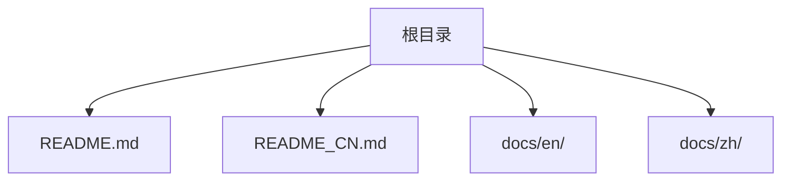
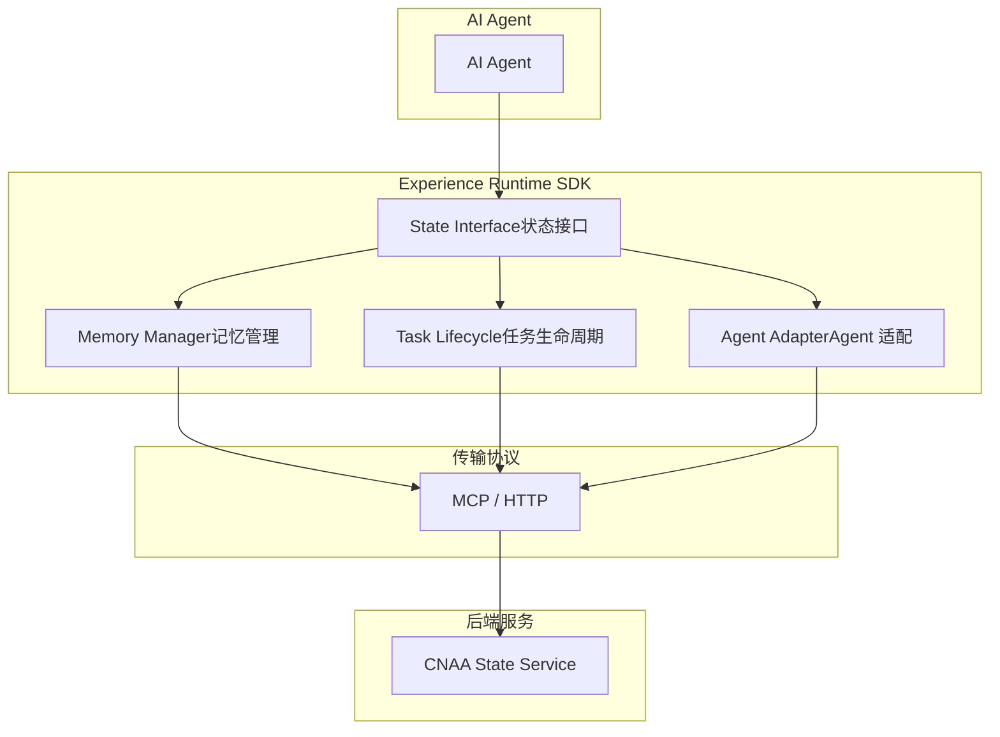
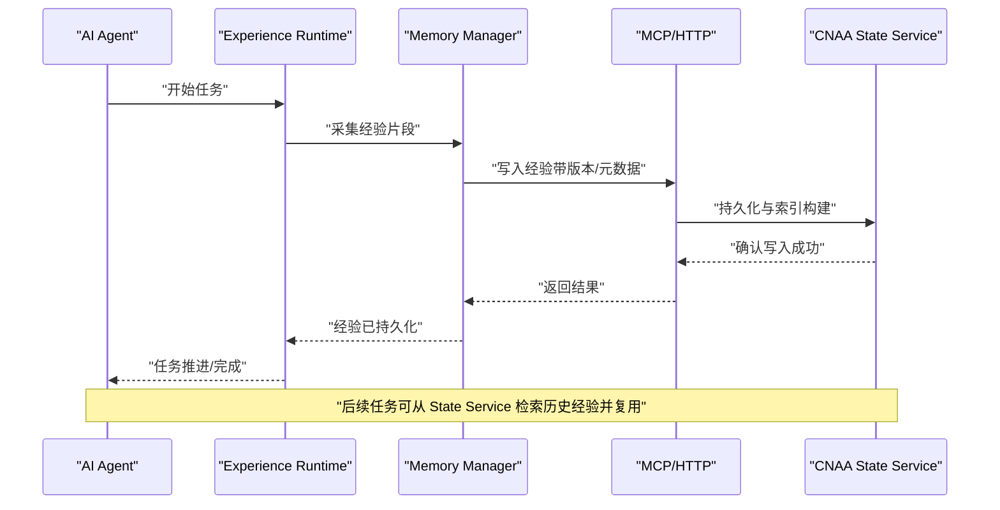
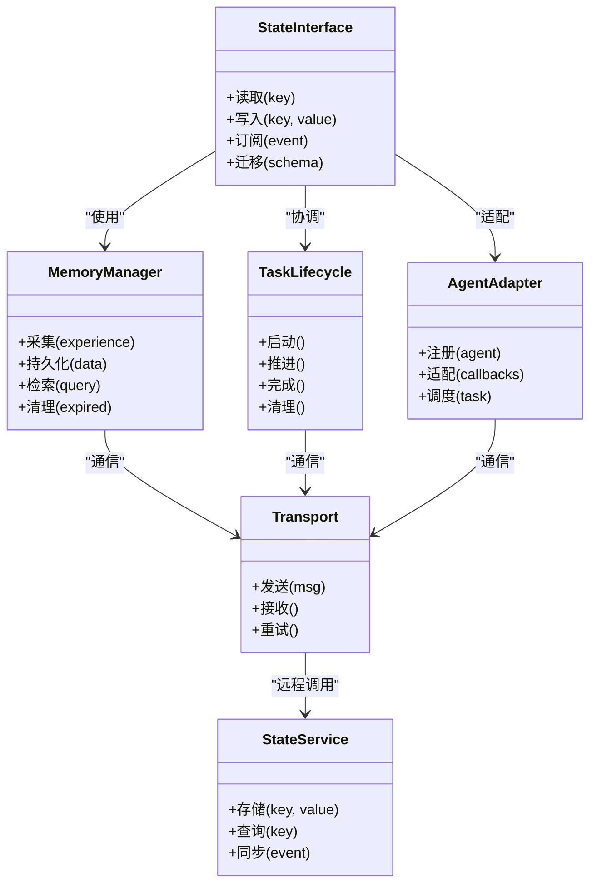

# 核心概念

<cite>
**本文档中引用的文件**
- [README.md](file://README.md)
- [README_CN.md](file://README_CN.md)
</cite>

## 目录
1. [简介](#简介)
2. [项目结构](#项目结构)
3. [核心组件](#核心组件)
4. [架构总览](#架构总览)
5. [详细组件分析](#详细组件分析)
6. [依赖关系分析](#依赖关系分析)
7. [性能考量](#性能考量)
8. [故障排查指南](#故障排查指南)
9. [结论](#结论)
10. [附录](#附录)

## 简介
CNAA（Cloud Native Agentic Architecture）是一个面向 AI Agent 的“经验运行时”框架，目标是让任意 Agent 在不修改自身推理逻辑的前提下，实现经验的持续沉淀、跨会话复用与状态同步。它不是 Agent 框架、工作流引擎或 RAG 实现，而是为 Agent 提供一套轻量级的 Experience Runtime，将“经验”从临时 Prompt 上下文抽离为独立、可持久化的运行时资源。

核心主张：
- 持久化经验记忆：经验不再是临时的提示词片段，而是独立的运行时资源，具备生命周期管理与跨进程/跨实例共享能力。
- 运行时状态同步：在任务执行过程中，状态可在多个节点间保持一致与可见性。
- 统一状态接口：屏蔽底层存储差异，向上提供一致的状态读写语义。
- Agent 无关设计：通过适配层接入不同 Agent，避免侵入式改造。
- 云原生部署：支持云端与本地环境的一致运行体验。

章节来源
- [README.md:9-21](file://README.md#L9-L21)
- [README_CN.md:9-21](file://README_CN.md#L9-L21)

## 项目结构
当前仓库以说明性文档为主，包含英文与中文 README，以及预留的 docs/en 与 docs/zh 目录（尚未填充）。整体结构简洁，便于后续扩展为完整的 SDK、服务与规范文档。

图表来源
- [README.md:1-102](file://README.md#L1-L102)
- [README_CN.md:1-110](file://README_CN.md#L1-L110)

章节来源
- [README.md:1-102](file://README.md#L1-L102)
- [README_CN.md:1-110](file://README_CN.md#L1-L110)

## 核心组件
根据 README 中的架构描述，Experience Runtime SDK 由以下关键子组件构成：
- State Interface（状态接口）：统一的读写抽象，屏蔽存储细节。
- Memory Manager（记忆管理）：负责经验的增删改查、版本与生命周期管理。
- Task Lifecycle（任务生命周期）：定义任务的启动、推进、完成与清理阶段，驱动状态同步。
- Agent Adapter（Agent 适配）：将不同 Agent 的能力与调用约定适配到统一接口。

这些组件共同协作，使 Agent 能够在不感知底层存储的情况下，获得一致的“经验记忆”能力。

章节来源
- [README.md:55-72](file://README.md#L55-L72)
- [README_CN.md:63-80](file://README_CN.md#L63-L80)

## 架构总览
下图展示了 CNAA 的高层架构：AI Agent 通过 Experience Runtime SDK 访问统一状态接口；SDK 内部包含记忆管理、任务生命周期与 Agent 适配等模块；最终通过 MCP/HTTP 与 CNAA State Service 通信，实现状态的持久化与跨实例同步。

图表来源
- [README.md:55-72](file://README.md#L55-L72)
- [README_CN.md:63-80](file://README_CN.md#L63-L80)

## 详细组件分析

### Experience Runtime（经验运行时）
- 角色定位：位于 Agent 与持久化记忆之间，提供无侵入的经验沉淀与状态同步能力。
- 工作机制：
  - 拦截/观察 Agent 的任务执行过程，提取关键经验片段。
  - 将经验写入 Memory Manager，并通过传输协议与 State Service 同步。
  - 在任务生命周期各阶段触发状态更新与一致性保障。
- 优势：无需修改 Agent 内部推理逻辑，即可实现经验的跨会话复用与多实例共享。

章节来源
- [README.md:19-21](file://README.md#L19-L21)
- [README_CN.md:19-21](file://README_CN.md#L19-L21)

### Persistent Experience Memory（持久化经验记忆）
- 与传统内存系统的区别：
  - 传统方案通常仅延长 Prompt 上下文，属于临时性、易丢失的内存片段。
  - CNAA 将经验作为独立运行时资源，具备持久化、版本化与跨实例共享能力。
- 数据模型建议（概念性）：
  - 经验条目：包含类型、内容、元数据（来源、时间戳、关联任务 ID）、版本与有效性标记。
  - 索引与检索：按任务、领域、标签等多维度索引，支持高效检索与去重。
- 生命周期：
  - 采集：从任务执行中提取关键经验。
  - 存储：写入持久化存储并建立索引。
  - 复用：在后续任务中按需检索与注入。
  - 清理：过期或低价值经验回收。

章节来源
- [README.md:31-41](file://README.md#L31-L41)
- [README_CN.md:35-49](file://README_CN.md#L35-L49)

### State Interface（状态接口）
- 设计理念：
  - 统一抽象：屏蔽底层存储差异，提供一致的读写语义。
  - 幂等与事务：保证状态更新的幂等性与必要的事务边界。
  - 可扩展：支持插件式存储后端与策略（如缓存、分片、压缩）。
- 典型操作：
  - 读取：按键/查询获取状态或经验。
  - 写入：原子写入与版本控制。
  - 订阅：监听状态变更事件，用于实时同步。
  - 迁移：支持向后兼容的数据迁移。

章节来源
- [README.md:63-66](file://README.md#L63-L66)
- [README_CN.md:71-74](file://README_CN.md#L71-74)

### Runtime State Synchronization（运行时状态同步）
- 目标：在多节点或多实例环境下，确保状态的一致性、可见性与最终一致性。
- 机制要点：
  - 事件驱动：通过事件总线或消息队列传播状态变更。
  - 冲突解决：采用版本号、时间戳或合并策略处理并发写入。
  - 容错重试：网络抖动或服务重启时自动恢复。
  - 观测性：记录同步轨迹与延迟指标，便于排障。

章节来源
- [README.md:48](file://README.md#L48)
- [README_CN.md:56](file://README_CN.md#L56)

### Agent-Agnostic Design（Agent 无关设计）
- 架构优势：
  - 解耦：Agent 与记忆系统解耦，降低耦合度与升级成本。
  - 通用性：同一套运行时可适配多种 Agent 形态（函数式、类式、微服务等）。
  - 可插拔：通过 Agent Adapter 快速接入新 Agent。
- 适配要点：
  - 标准化回调：定义统一的经验采集与状态更新回调。
  - 配置化：通过配置文件声明 Agent 的行为与映射规则。
  - 测试友好：提供 Mock Adapter 便于单元测试与集成测试。

章节来源
- [README.md:50](file://README.md#L50)
- [README_CN.md:58](file://README_CN.md#L58)

### 数据流图（端到端）
下图展示一次典型的“经验沉淀与复用”流程：Agent 执行任务 → Runtime 采集经验 → Memory Manager 持久化 → State Service 同步 → 后续任务检索复用。

图表来源
- [README.md:55-72](file://README.md#L55-L72)
- [README_CN.md:63-80](file://README_CN.md#L63-L80)

### 复杂逻辑流程图（状态同步）
下图概括了运行时状态同步的关键分支与决策点，包括冲突检测、重试与回退策略。

图表来源
- [README.md:48](file://README.md#L48)
- [README_CN.md:56](file://README_CN.md#L56)

## 依赖关系分析
- 组件内聚与耦合：
  - State Interface 高内聚于“状态语义”，对 Memory Manager、Task Lifecycle 与 Agent Adapter 提供稳定契约。
  - Memory Manager 依赖传输协议与 State Service，屏蔽具体存储实现。
  - Task Lifecycle 驱动状态同步与经验采集时机。
  - Agent Adapter 解耦 Agent 实现，降低耦合度。
- 外部依赖：
  - MCP/HTTP 作为传输层，连接 SDK 与 State Service。
  - State Service 承担持久化、索引与同步职责。

图表来源
- [README.md:55-72](file://README.md#L55-L72)
- [README_CN.md:63-80](file://README_CN.md#L63-L80)

章节来源
- [README.md:55-72](file://README.md#L55-L72)
- [README_CN.md:63-80](file://README_CN.md#L63-L80)

## 性能考量
- 经验采集与写入：
  - 批量写入与异步落盘，减少阻塞。
  - 增量索引与去重，避免重复存储。
- 状态同步：
  - 使用版本号与最小化变更集，降低带宽与冲突概率。
  - 指数退避与熔断，提升稳定性。
- 检索与复用：
  - 多级缓存（本地/近线/远线），加速热点经验命中。
  - 预取与懒加载，平衡内存与延迟。
- 可观测性：
  - 记录关键指标（写入延迟、同步成功率、命中率），便于容量规划与调优。

[本节为通用指导，不直接分析具体文件]

## 故障排查指南
- 常见问题定位：
  - 经验未持久化：检查 Memory Manager 的写入路径与 State Service 的响应。
  - 状态不一致：查看版本冲突日志与合并策略是否生效。
  - 同步失败：关注网络重试次数与超时配置。
  - 检索命中率低：评估索引维度与查询条件是否合理。
- 诊断手段：
  - 启用详细日志与追踪 ID，串联一次请求的全链路。
  - 使用 Mock Adapter 隔离 Agent 侧问题。
  - 回放事件流，复现并定位同步异常。

[本节为通用指导，不直接分析具体文件]

## 结论
CNAA 通过 Experience Runtime 将“经验”从临时上下文抽离为独立、可持久化的运行时资源，结合统一状态接口与 Agent 无关设计，为任意 Agent 提供低成本、高可用的记忆与状态同步能力。未来随着 SDK、服务与规范的完善，开发者可以以更小的改动获得更强的跨会话记忆与多实例协同能力。

[本节为总结性内容，不直接分析具体文件]

## 附录
- 使用场景建议：
  - 多轮对话记忆：跨会话保留用户偏好与历史决策。
  - 任务编排优化：复用历史任务的最佳实践与失败教训。
  - 多 Agent 协作：共享领域知识与状态，提升协作效率。
- 最佳实践：
  - 明确经验粒度与生命周期，避免过度碎片化。
  - 设计幂等写入与冲突解决策略，确保一致性。
  - 分层缓存与冷热分离，提升检索性能。
  - 充分测试：覆盖正常路径、冲突与失败场景。

[本节为通用指导，不直接分析具体文件]