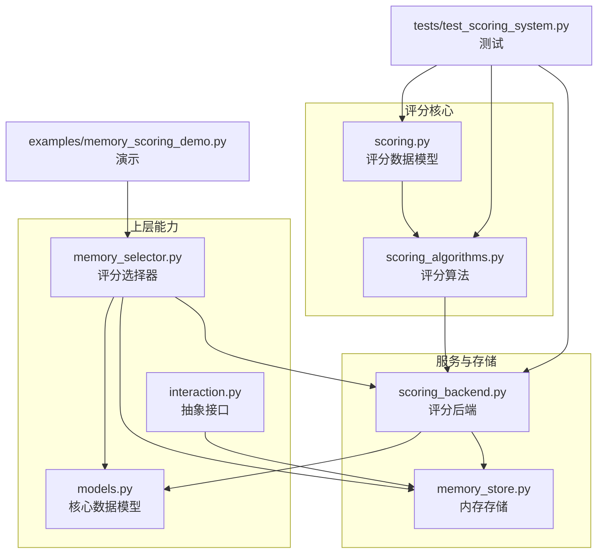
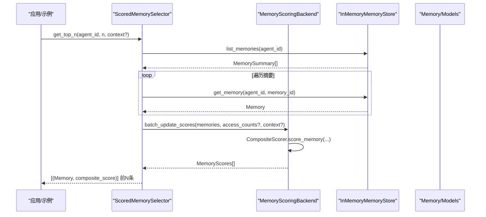
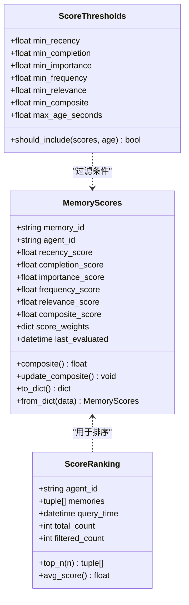
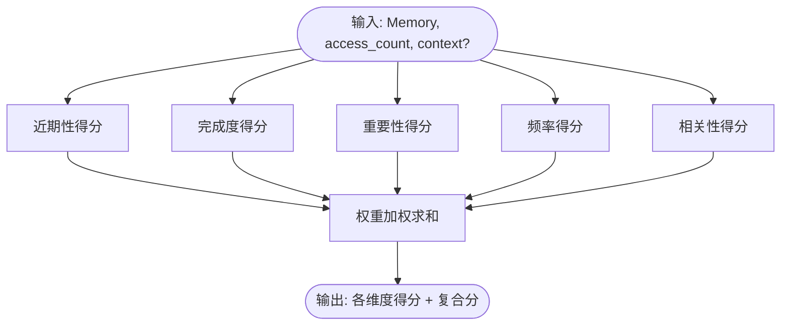
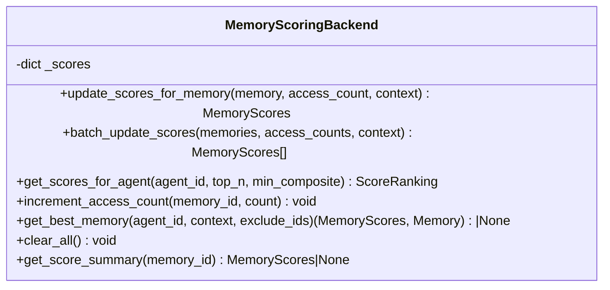
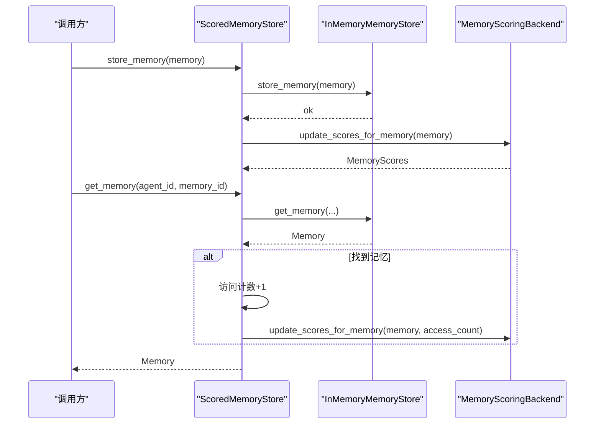
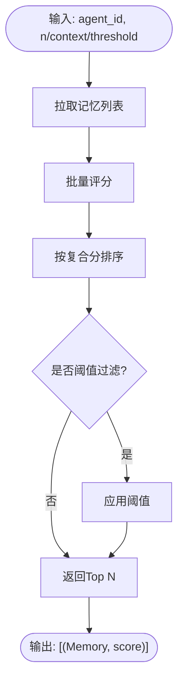
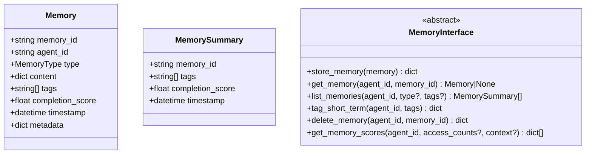
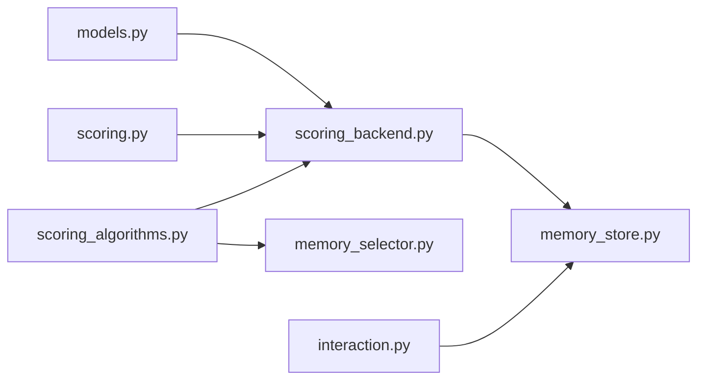

# 记忆评分系统

<cite>
**本文引用的文件**   
- [cnaa/scoring.py](file://cnaa/scoring.py)
- [cnaa/scoring_algorithms.py](file://cnaa/scoring_algorithms.py)
- [cloud/storage/scoring_backend.py](file://cloud/storage/scoring_backend.py)
- [cloud/storage/memory_store.py](file://cloud/storage/memory_store.py)
- [cnaa/models.py](file://cnaa/models.py)
- [cnaa/memory_selector.py](file://cnaa/memory_selector.py)
- [cnaa/interaction.py](file://cnaa/interaction.py)
- [examples/memory_scoring_demo.py](file://examples/memory_scoring_demo.py)
- [tests/test_scoring_system.py](file://tests/test_scoring_system.py)
</cite>

## 目录
1. [引言](#引言)
2. [项目结构](#项目结构)
3. [核心组件](#核心组件)
4. [架构总览](#架构总览)
5. [详细组件分析](#详细组件分析)
6. [依赖关系分析](#依赖关系分析)
7. [性能考量](#性能考量)
8. [故障排查指南](#故障排查指南)
9. [结论](#结论)
10. [附录](#附录)

## 引言
本文件面向“记忆评分系统”的架构与实现，系统性梳理数据模型、评分算法、后端服务、存储集成与高层选择器，帮助读者快速理解并正确使用该子系统。系统围绕五维评分（近期性、完成度、重要性、频率、相关性）构建加权综合分，支持批量计算、按智能体排序、上下文相关检索等典型场景。

## 项目结构
记忆评分系统主要分布在以下模块：
- cnaa/scoring.py：评分数据结构与阈值配置
- cnaa/scoring_algorithms.py：各维度评分算法实现
- cloud/storage/scoring_backend.py：评分后端服务与批处理
- cloud/storage/memory_store.py：内存存储实现（含占位接口）
- cnaa/memory_selector.py：基于评分的高层选择器
- cnaa/models.py：核心数据模型（Memory、MemorySummary 等）
- cnaa/interaction.py：抽象接口（包含评分方法扩展点）
- examples/memory_scoring_demo.py：端到端演示脚本
- tests/test_scoring_system.py：覆盖评分系统与后端的测试集

**图表来源** 
- [cnaa/scoring.py:1-181](file://cnaa/scoring.py#L1-L181)
- [cnaa/scoring_algorithms.py:1-510](file://cnaa/scoring_algorithms.py#L1-L510)
- [cloud/storage/scoring_backend.py:1-306](file://cloud/storage/scoring_backend.py#L1-L306)
- [cloud/storage/memory_store.py:1-233](file://cloud/storage/memory_store.py#L1-L233)
- [cnaa/memory_selector.py:1-310](file://cnaa/memory_selector.py#L1-L310)
- [cnaa/models.py:1-274](file://cnaa/models.py#L1-L274)
- [cnaa/interaction.py:1-321](file://cnaa/interaction.py#L1-L321)
- [examples/memory_scoring_demo.py:1-344](file://examples/memory_scoring_demo.py#L1-L344)
- [tests/test_scoring_system.py:1-444](file://tests/test_scoring_system.py#L1-L444)

**章节来源**
- [cnaa/scoring.py:1-181](file://cnaa/scoring.py#L1-L181)
- [cnaa/scoring_algorithms.py:1-510](file://cnaa/scoring_algorithms.py#L1-L510)
- [cloud/storage/scoring_backend.py:1-306](file://cloud/storage/scoring_backend.py#L1-L306)
- [cloud/storage/memory_store.py:1-233](file://cloud/storage/memory_store.py#L1-L233)
- [cnaa/memory_selector.py:1-310](file://cnaa/memory_selector.py#L1-L310)
- [cnaa/models.py:1-274](file://cnaa/models.py#L1-L274)
- [cnaa/interaction.py:1-321](file://cnaa/interaction.py#L1-L321)
- [examples/memory_scoring_demo.py:1-344](file://examples/memory_scoring_demo.py#L1-L344)
- [tests/test_scoring_system.py:1-444](file://tests/test_scoring_system.py#L1-L444)

## 核心组件
- 评分数据模型：MemoryScores、ScoreRanking、ScoreThresholds，提供标准化评分结构与阈值过滤能力
- 评分算法：RecencyScorer、CompletionScorer、ImportanceScorer、FrequencyScorer、RelevanceScorer、CompositeScorer
- 评分后端：MemoryScoringBackend，负责批量计算、缓存、排序与最佳匹配查询
- 存储集成：InMemoryMemoryStore 作为参考实现，配合 integrate_with_memory_store 自动注入评分
- 高层选择器：ScoredMemorySelector，封装 Top-N、阈值过滤、上下文最佳匹配、重要记忆筛选
- 数据模型与接口：Memory、MemorySummary、MemoryInterface（含评分方法扩展点）

**章节来源**
- [cnaa/scoring.py:1-181](file://cnaa/scoring.py#L1-L181)
- [cnaa/scoring_algorithms.py:1-510](file://cnaa/scoring_algorithms.py#L1-L510)
- [cloud/storage/scoring_backend.py:1-306](file://cloud/storage/scoring_backend.py#L1-L306)
- [cloud/storage/memory_store.py:1-233](file://cloud/storage/memory_store.py#L1-L233)
- [cnaa/memory_selector.py:1-310](file://cnaa/memory_selector.py#L1-L310)
- [cnaa/models.py:1-274](file://cnaa/models.py#L1-L274)
- [cnaa/interaction.py:1-321](file://cnaa/interaction.py#L1-L321)

## 架构总览
评分系统采用分层设计：数据模型层 → 算法层 → 服务层 → 存储层 → 选择器层。服务层聚合算法并维护评分缓存；存储层提供基础 CRUD；选择器层暴露易用 API。

**图表来源** 
- [cnaa/memory_selector.py:30-82](file://cnaa/memory_selector.py#L30-L82)
- [cloud/storage/scoring_backend.py:77-101](file://cloud/storage/scoring_backend.py#L77-L101)
- [cnaa/scoring_algorithms.py:438-502](file://cnaa/scoring_algorithms.py#L438-L502)
- [cloud/storage/memory_store.py:77-155](file://cloud/storage/memory_store.py#L77-L155)
- [cnaa/models.py:83-121](file://cnaa/models.py#L83-L121)

## 详细组件分析

### 评分数据模型（MemoryScores / ScoreRanking / ScoreThresholds）
- MemoryScores：保存单条记忆的各维度分数与权重，提供复合分计算、序列化/反序列化
- ScoreRanking：按复合分排序的结果集，支持 top_n、平均分统计
- ScoreThresholds：多维阈值过滤，包括复合分与最大年龄限制

**图表来源** 
- [cnaa/scoring.py:21-116](file://cnaa/scoring.py#L21-L116)
- [cnaa/scoring.py:118-139](file://cnaa/scoring.py#L118-L139)
- [cnaa/scoring.py:141-181](file://cnaa/scoring.py#L141-L181)

**章节来源**
- [cnaa/scoring.py:1-181](file://cnaa/scoring.py#L1-L181)

### 评分算法（Recency / Completion / Importance / Frequency / Relevance / Composite）
- RecencyScorer：指数衰减或线性衰减，时间越近分数越高
- CompletionScorer：基于任务完成度，结合关键词微调
- ImportanceScorer：关键词权重匹配，支持显式 importance 字段融合
- FrequencyScorer：访问次数对数缩放或日均速率映射
- RelevanceScorer：关键词重叠与标签加权，支持简单上下文匹配
- CompositeScorer：统一调度各维度打分，归一化权重，输出复合分

**图表来源** 
- [cnaa/scoring_algorithms.py:27-97](file://cnaa/scoring_algorithms.py#L27-L97)
- [cnaa/scoring_algorithms.py:99-139](file://cnaa/scoring_algorithms.py#L99-L139)
- [cnaa/scoring_algorithms.py:141-237](file://cnaa/scoring_algorithms.py#L141-L237)
- [cnaa/scoring_algorithms.py:239-301](file://cnaa/scoring_algorithms.py#L239-L301)
- [cnaa/scoring_algorithms.py:303-397](file://cnaa/scoring_algorithms.py#L303-L397)
- [cnaa/scoring_algorithms.py:399-510](file://cnaa/scoring_algorithms.py#L399-L510)

**章节来源**
- [cnaa/scoring_algorithms.py:1-510](file://cnaa/scoring_algorithms.py#L1-L510)

### 评分后端（MemoryScoringBackend）
- 单条/批量更新评分，内部缓存 MemoryScores
- 按智能体获取排名结果，支持最小复合分过滤
- 提供最佳记忆查询与访问计数增量标记（预留）
- 提供 integrate_with_memory_store 包装器，自动在存取时触发评分

**图表来源** 
- [cloud/storage/scoring_backend.py:23-209](file://cloud/storage/scoring_backend.py#L23-L209)

**章节来源**
- [cloud/storage/scoring_backend.py:1-306](file://cloud/storage/scoring_backend.py#L1-L306)

### 存储集成（InMemoryMemoryStore 与包装器）
- InMemoryMemoryStore：字典键为 (agent_id, memory_id)，支持类型/标签/时间范围过滤与分页
- integrate_with_memory_store：返回 ScoredMemoryStore，在 store/get 时自动计算/更新评分，并提供 get_memory_scores 接口

**图表来源** 
- [cloud/storage/memory_store.py:32-76](file://cloud/storage/memory_store.py#L32-L76)
- [cloud/storage/memory_store.py:77-155](file://cloud/storage/memory_store.py#L77-L155)
- [cloud/storage/scoring_backend.py:211-306](file://cloud/storage/scoring_backend.py#L211-L306)

**章节来源**
- [cloud/storage/memory_store.py:1-233](file://cloud/storage/memory_store.py#L1-L233)
- [cloud/storage/scoring_backend.py:211-306](file://cloud/storage/scoring_backend.py#L211-L306)

### 高层选择器（ScoredMemorySelector）
- get_top_n：拉取某智能体的全部记忆，批量评分后排序返回 Top N
- find_best_match：基于上下文的关键词匹配，返回超过阈值的最佳记忆
- filter_by_threshold：按复合分阈值过滤并排序
- get_important_memories：仅按重要性维度筛选

**图表来源** 
- [cnaa/memory_selector.py:30-82](file://cnaa/memory_selector.py#L30-L82)
- [cnaa/memory_selector.py:84-122](file://cnaa/memory_selector.py#L84-L122)
- [cnaa/memory_selector.py:124-168](file://cnaa/memory_selector.py#L124-L168)
- [cnaa/memory_selector.py:170-207](file://cnaa/memory_selector.py#L170-L207)

**章节来源**
- [cnaa/memory_selector.py:1-310](file://cnaa/memory_selector.py#L1-L310)

### 数据模型与接口（Memory / MemorySummary / MemoryInterface）
- Memory：经验记忆实体，包含内容、标签、完成度、时间戳与元数据
- MemorySummary：轻量摘要，用于列表查询
- MemoryInterface：定义记忆操作契约，新增 get_memory_scores 以支持评分

**图表来源** 
- [cnaa/models.py:83-121](file://cnaa/models.py#L83-L121)
- [cnaa/models.py:255-263](file://cnaa/models.py#L255-L263)
- [cnaa/interaction.py:44-171](file://cnaa/interaction.py#L44-L171)

**章节来源**
- [cnaa/models.py:1-274](file://cnaa/models.py#L1-L274)
- [cnaa/interaction.py:1-321](file://cnaa/interaction.py#L1-L321)

### 使用示例与测试
- examples/memory_scoring_demo.py：展示基础评分、上下文感知选择、重要性与时新性权衡、实际工作流集成
- tests/test_scoring_system.py：覆盖评分模型、各维度算法、后端集成与端到端流程

**章节来源**
- [examples/memory_scoring_demo.py:1-344](file://examples/memory_scoring_demo.py#L1-L344)
- [tests/test_scoring_system.py:1-444](file://tests/test_scoring_system.py#L1-L444)

## 依赖关系分析
- scoring.py 被 scoring_backend.py 引用，提供评分数据结构
- scoring_algorithms.py 被 scoring_backend.py 与 memory_selector.py 共同使用
- memory_selector.py 依赖 scoring_backend.py 与 memory_store.py
- scoring_backend.py 依赖 models.py 与 scoring.py
- interaction.py 定义了评分方法的抽象接口，memory_store.py 提供了占位实现

**图表来源** 
- [cnaa/scoring.py:1-181](file://cnaa/scoring.py#L1-L181)
- [cnaa/scoring_algorithms.py:1-510](file://cnaa/scoring_algorithms.py#L1-L510)
- [cloud/storage/scoring_backend.py:1-306](file://cloud/storage/scoring_backend.py#L1-L306)
- [cloud/storage/memory_store.py:1-233](file://cloud/storage/memory_store.py#L1-L233)
- [cnaa/memory_selector.py:1-310](file://cnaa/memory_selector.py#L1-L310)
- [cnaa/models.py:1-274](file://cnaa/models.py#L1-L274)
- [cnaa/interaction.py:1-321](file://cnaa/interaction.py#L1-L321)

**章节来源**
- [cnaa/scoring.py:1-181](file://cnaa/scoring.py#L1-L181)
- [cnaa/scoring_algorithms.py:1-510](file://cnaa/scoring_algorithms.py#L1-L510)
- [cloud/storage/scoring_backend.py:1-306](file://cloud/storage/scoring_backend.py#L1-L306)
- [cloud/storage/memory_store.py:1-233](file://cloud/storage/memory_store.py#L1-L233)
- [cnaa/memory_selector.py:1-310](file://cnaa/memory_selector.py#L1-L310)
- [cnaa/models.py:1-274](file://cnaa/models.py#L1-L274)
- [cnaa/interaction.py:1-321](file://cnaa/interaction.py#L1-L321)

## 性能考量
- 算法复杂度：各维度评分均为 O(1)，批量评分为 O(n)
- 存储查询：InMemoryMemoryStore 的 list_memories 为线性扫描 O(n)，适合开发与测试；生产环境可替换为索引化后端
- 评分缓存：MemoryScoringBackend 内部缓存评分结果，避免重复计算
- 权重归一化：CompositeScorer 支持权重归一化，保证复合分稳定
- 建议优化：
  - 引入向量嵌入提升相关性评分精度
  - 对 list_memories 增加索引（标签、类型、时间范围）
  - 异步批量评分与延迟更新访问计数

[本节为通用指导，不直接分析具体文件]

## 故障排查指南
- 导入错误：确保项目根目录加入 Python 路径或使用 python -m 从项目根运行
- 类型检查警告：安装 mypy 并对评分相关文件进行类型检查，修复所有警告后再提交
- 测试失败：定位破坏范围，优先回滚最近变更，逐步修复
- 字符串内容兼容：selector 会将字符串 content 转换为 dict 格式以满足评分要求

**章节来源**
- [tests/test_scoring_system.py:1-444](file://tests/test_scoring_system.py#L1-L444)
- [cnaa/memory_selector.py:209-239](file://cnaa/memory_selector.py#L209-L239)

## 结论
记忆评分系统通过清晰的分层设计与可扩展的算法模块，实现了多维度评分、批量计算与上下文相关的记忆选择。其默认权重与算法已覆盖常见场景，同时保留扩展点以便未来增强（如向量语义匹配、更细粒度的生命周期管理）。建议在开发阶段使用内存存储与演示脚本验证行为，在生产环境中替换为高性能存储后端并持续监控评分分布与检索效果。

[本节为总结性内容，不直接分析具体文件]

## 附录
- 快速开始：参考 examples/memory_scoring_demo.py 中的四个演示场景
- 常用任务：调整权重、新增维度、扩展接口遵循安全开发规范
- 测试命令：pytest tests/test_scoring_system.py -v

[本节为补充信息，不直接分析具体文件]