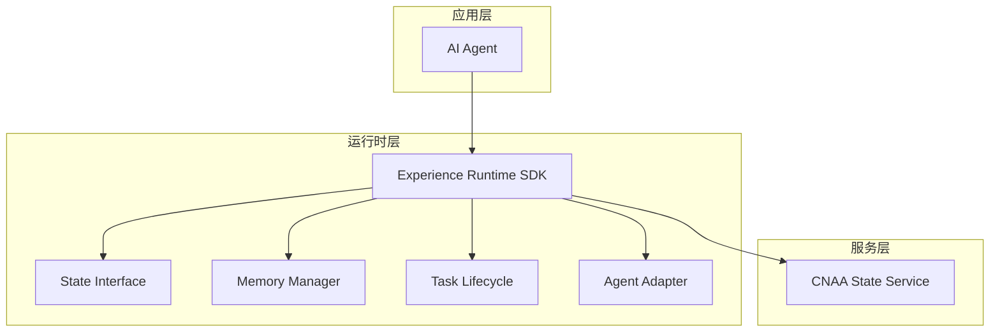
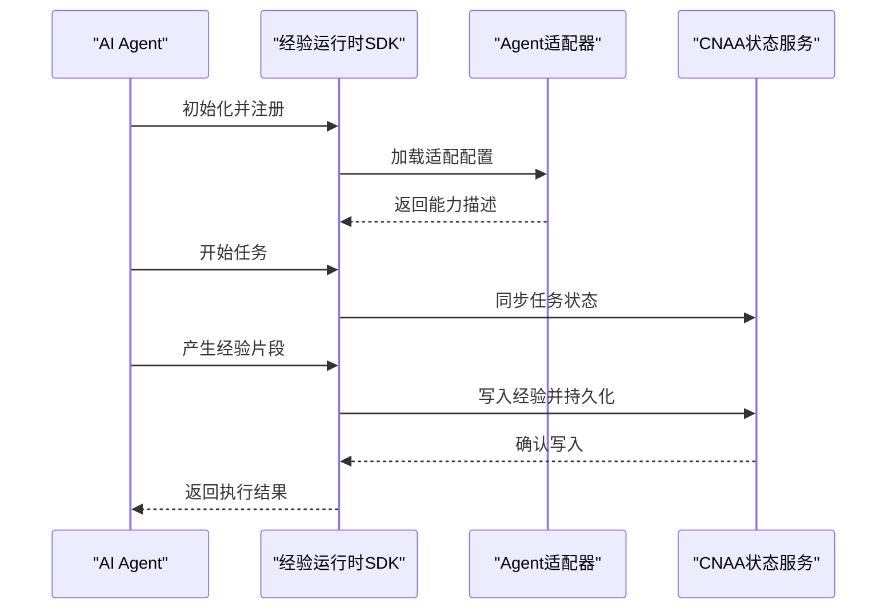
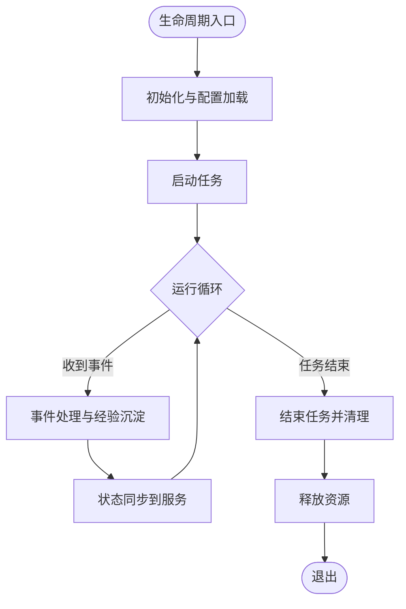
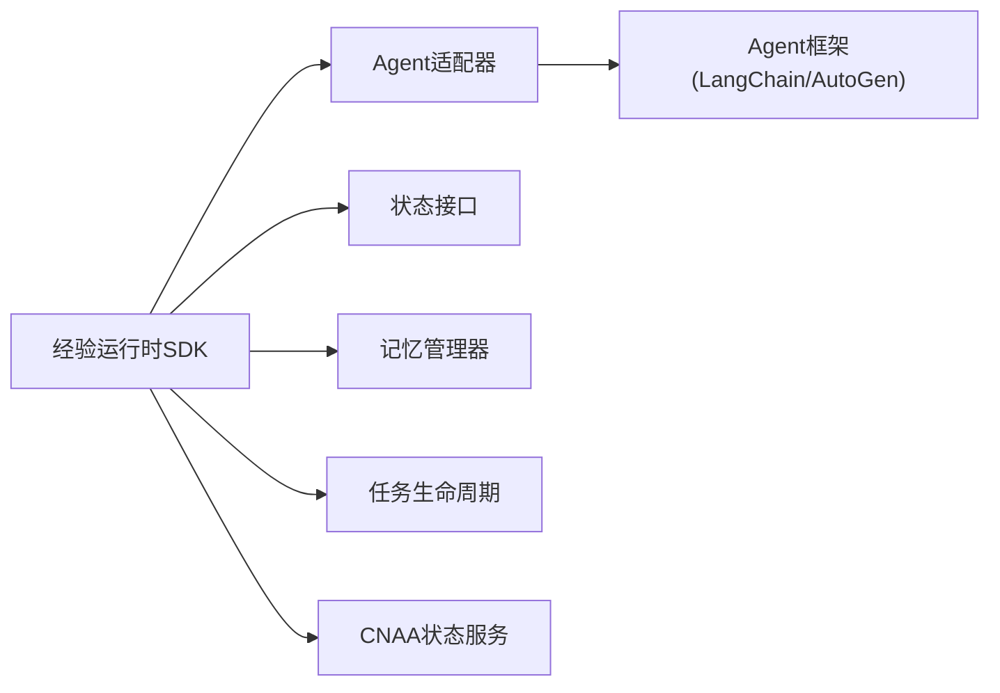

# Agent集成

<cite>
**本文档引用的文件**   
- [README.md](file://README.md)
- [README_CN.md](file://README_CN.md)
</cite>

## 目录
1. [简介](#简介)
2. [项目结构](#项目结构)
3. [核心组件](#核心组件)
4. [架构总览](#架构总览)
5. [详细组件分析](#详细组件分析)
6. [依赖关系分析](#依赖关系分析)
7. [性能考虑](#性能考虑)
8. [故障排除指南](#故障排除指南)
9. [结论](#结论)
10. [附录](#附录)

## 简介
本文件为“Agent集成”专项文档，目标是说明如何将多种AI Agent框架（如LangChain、AutoGen等）与CNAA进行集成。CNAA并非Agent框架或工作流引擎，而是提供一套轻量级的“经验运行时”，使任意Agent在不修改内部推理逻辑的前提下，实现经验的持续沉淀、状态同步与复用。

- CNAA的核心价值：将“经验”从临时上下文提升为独立运行时资源，形成“AI Agent → 经验运行时 → 持久化记忆”的分层结构。
- 关键能力：持久化经验记忆、运行时状态同步、统一状态接口、Agent无关设计、云端/本地部署。

本节为概念性介绍，不直接分析具体代码文件。

## 项目结构
当前仓库以文档为主，包含中英文README，以及预留的docs/en与docs/zh目录。实际工程代码尚未在仓库中体现，但README明确了整体分层与交互方式，可作为后续开发与集成的依据。

图表来源
- [README.md:55-72](file://README.md#L55-L72)
- [README_CN.md:63-80](file://README_CN.md#L63-L80)

章节来源
- [README.md:55-72](file://README.md#L55-L72)
- [README_CN.md:63-80](file://README_CN.md#L63-L80)

## 核心组件
- 经验运行时SDK：对外暴露统一的接入点，屏蔽底层差异，负责事件、生命周期与状态同步编排。
- 状态接口：定义Agent与CNAA之间的状态契约，确保跨框架一致性。
- 记忆管理器：负责经验的持久化、检索、更新与版本管理。
- 任务生命周期：管理任务的启动、执行、挂起、恢复与结束。
- Agent适配器：将不同Agent框架的能力映射到CNAA的统一接口。
- CNAA状态服务：提供状态与经验的存储、同步与共享能力。

章节来源
- [README.md:55-72](file://README.md#L55-L72)
- [README_CN.md:63-80](file://README_CN.md#L63-L80)

## 架构总览
下图展示了Agent通过经验运行时与CNAA状态服务的交互路径，以及各组件的职责边界。

图表来源
- [README.md:55-72](file://README.md#L55-L72)
- [README_CN.md:63-80](file://README_CN.md#L63-L80)

## 详细组件分析

### Agent适配器开发方法
目标：将任意Agent框架的能力映射到CNAA统一接口，包括状态上报、事件回调、经验沉淀与生命周期钩子。

- 适配器职责
  - 能力发现与声明：向运行时注册Agent类型、可用工具、输入输出模式。
  - 生命周期桥接：将Agent的生命周期事件（启动、运行、暂停、恢复、结束）映射到运行时。
  - 状态同步：将Agent的内部状态转换为统一状态模型，并推送到状态服务。
  - 经验沉淀：捕获Agent在执行过程中的关键决策、中间结果与反思，作为经验写入持久化存储。
  - 错误与重试：对异常进行归一化处理，支持重试与降级策略。

- 自定义Agent类型的实现步骤
  1) 定义适配器接口：明确必须实现的方法（如initialize、onEvent、onStateUpdate、onExperienceCapture、onLifecycle）。
  2) 实现能力映射：将Agent框架的事件与状态字段映射到CNAA统一模型。
  3) 配置注册：在运行时中注册适配器类型、默认参数与校验规则。
  4) 生命周期钩子：在任务开始/结束、状态变更时触发经验沉淀与状态同步。
  5) 测试验证：覆盖正常流程、异常分支、并发场景与数据一致性。

- 最佳实践
  - 保持适配器无状态或最小状态，避免内存泄漏。
  - 使用幂等写入，保证经验与状态的最终一致性。
  - 对大对象进行序列化优化与压缩。
  - 提供可观测性指标（延迟、吞吐、错误率、缓存命中率）。

章节来源
- [README.md:55-72](file://README.md#L55-L72)
- [README_CN.md:63-80](file://README_CN.md#L63-L80)

### 不同Agent框架的具体集成示例（LangChain、AutoGen）
- 通用集成要点
  - 事件监听：订阅Agent的关键事件（消息发送、工具调用、思考过程），用于经验沉淀。
  - 状态同步：将Agent的会话ID、消息历史摘要、工具调用结果映射到统一状态模型。
  - 连接与配置：通过环境变量或配置文件指定状态服务地址、认证信息与超时参数。
  - 错误处理：对网络异常、序列化失败、状态冲突等进行重试与回退。

- LangChain集成建议
  - 使用回调机制捕获链式调用中的节点状态与输出。
  - 将工具调用的输入输出作为经验片段持久化。
  - 将对话摘要与关键决策作为长期经验，便于后续任务复用。

- AutoGen集成建议
  - 监听多Agent协作中的角色切换与协商结果。
  - 将协作协议与共识结果作为经验沉淀，支持跨会话复用。
  - 对并发协作进行状态合并与冲突解决。

注意：本节为方法论指导，不涉及具体代码片段。

章节来源
- [README.md:55-72](file://README.md#L55-L72)
- [README_CN.md:63-80](file://README_CN.md#L63-L80)

### Agent生命周期管理、事件监听与状态同步
- 生命周期阶段
  - 初始化：加载配置、建立连接、注册回调。
  - 启动：分配资源、预热缓存、准备上下文。
  - 运行：处理请求、记录经验、同步状态。
  - 暂停/恢复：保存中间状态，支持断点续跑。
  - 结束：清理资源、提交最终状态、释放锁。

- 事件监听
  - 事件类型：任务开始、工具调用、消息发送、思考完成、错误发生。
  - 事件路由：按类型分发到处理器，支持过滤与聚合。
  - 背压与限流：防止事件风暴导致系统过载。

- 状态同步
  - 同步策略：增量同步、全量快照、冲突检测与合并。
  - 一致性模型：最终一致性与强一致的权衡。
  - 幂等写入：确保重复事件不会造成数据不一致。

图表来源
- [README.md:55-72](file://README.md#L55-L72)
- [README_CN.md:63-80](file://README_CN.md#L63-L80)

章节来源
- [README.md:55-72](file://README.md#L55-L72)
- [README_CN.md:63-80](file://README_CN.md#L63-L80)

### Agent注册、配置与连接的最佳实践
- 注册
  - 在运行时中声明适配器类型、能力清单与版本信息。
  - 提供能力探测接口，便于动态发现与选择。

- 配置
  - 使用集中式配置管理，区分环境（开发、测试、生产）。
  - 敏感信息通过密钥管理服务注入。
  - 配置项需具备校验与默认值。

- 连接
  - 使用连接池与心跳检测，提高稳定性。
  - 设置合理的超时与重试策略。
  - 支持熔断与降级，保障可用性。

章节来源
- [README.md:55-72](file://README.md#L55-L72)
- [README_CN.md:63-80](file://README_CN.md#L63-L80)

## 依赖关系分析
- 组件耦合
  - 运行时SDK与适配器松耦合，通过统一接口通信。
  - 状态服务与运行时通过MCP/HTTP解耦，支持横向扩展。

- 外部依赖
  - 状态服务：提供持久化与共享能力。
  - 事件总线：用于事件分发与聚合。
  - 配置中心：统一管理配置与密钥。

图表来源
- [README.md:55-72](file://README.md#L55-L72)
- [README_CN.md:63-80](file://README_CN.md#L63-L80)

章节来源
- [README.md:55-72](file://README.md#L55-L72)
- [README_CN.md:63-80](file://README_CN.md#L63-L80)

## 性能考虑
- 经验沉淀
  - 批量写入与异步落盘，降低主链路延迟。
  - 经验分片与索引，提升检索效率。

- 状态同步
  - 增量同步优先，减少带宽占用。
  - 冲突检测采用版本号或时间戳，避免写冲突。

- 资源管理
  - 连接池复用与空闲回收。
  - 内存限制与垃圾回收调优。

- 可观测性
  - 指标采集：延迟、吞吐、错误率、缓存命中率。
  - 日志规范：结构化日志，关联追踪ID。

[本节为通用性能建议，不直接分析具体代码文件]

## 故障排除指南
- 常见问题
  - 适配器未正确注册：检查类型声明与能力清单是否完整。
  - 状态同步失败：检查网络连接、认证信息与超时配置。
  - 经验写入冲突：检查幂等键与版本号是否正确。
  - 事件丢失或重复：检查事件总线可靠性与消费者幂等性。

- 诊断步骤
  - 查看运行时日志与指标，定位瓶颈与异常。
  - 使用追踪ID串联跨组件调用链。
  - 回放事件与状态快照，复现问题。

- 修复建议
  - 增加重试与退避策略。
  - 引入熔断与降级保护。
  - 完善单元测试与集成测试用例。

章节来源
- [README.md:55-72](file://README.md#L55-L72)
- [README_CN.md:63-80](file://README_CN.md#L63-L80)

## 结论
CNAA通过“经验运行时 + 统一状态接口 + 持久化记忆”的设计，为各类Agent提供了稳定、可扩展的集成基础。通过规范的适配器开发与生命周期管理，可实现跨框架的经验沉淀与状态同步，从而提升Agent的持续学习与复用能力。建议在工程中遵循本文档的最佳实践，结合可观测性与性能优化手段，构建高可用的Agent集成方案。

[本节为总结性内容，不直接分析具体代码文件]

## 附录
- 术语表
  - 经验运行时：封装Agent与持久化记忆之间的交互逻辑。
  - 状态接口：定义Agent与CNAA之间的状态契约。
  - 记忆管理器：负责经验的持久化与检索。
  - 任务生命周期：管理任务的各个阶段。
  - Agent适配器：将不同Agent框架映射到统一接口。
  - CNAA状态服务：提供状态与经验的存储与共享。

- 参考链接
  - 快速开始、持久化记忆、状态接口、运行时SDK、状态服务、MCP接入、Agent接入、整体架构等文档可在README中获取。

章节来源
- [README.md:76-86](file://README.md#L76-L86)
- [README_CN.md:84-93](file://README_CN.md#L84-L93)