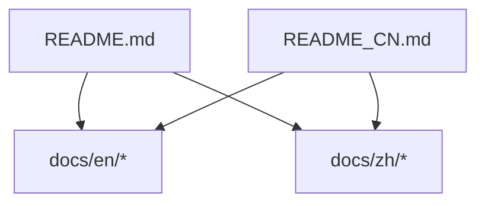
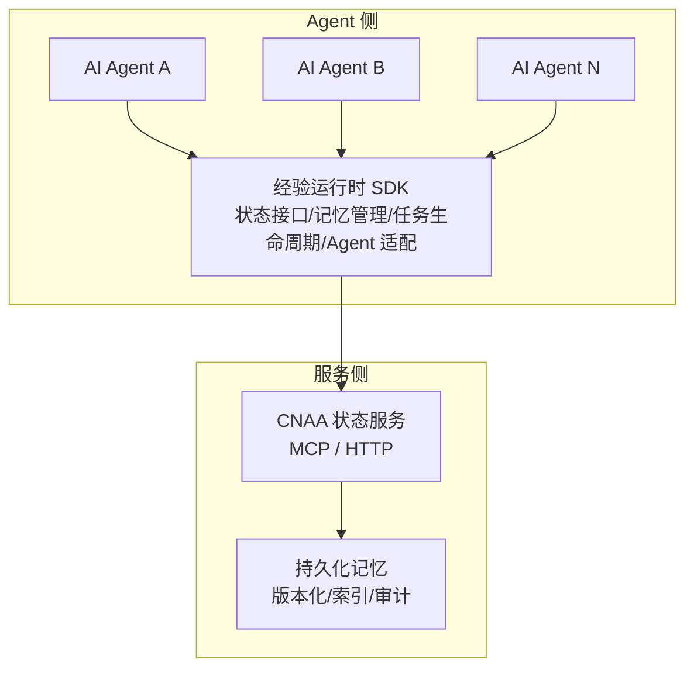
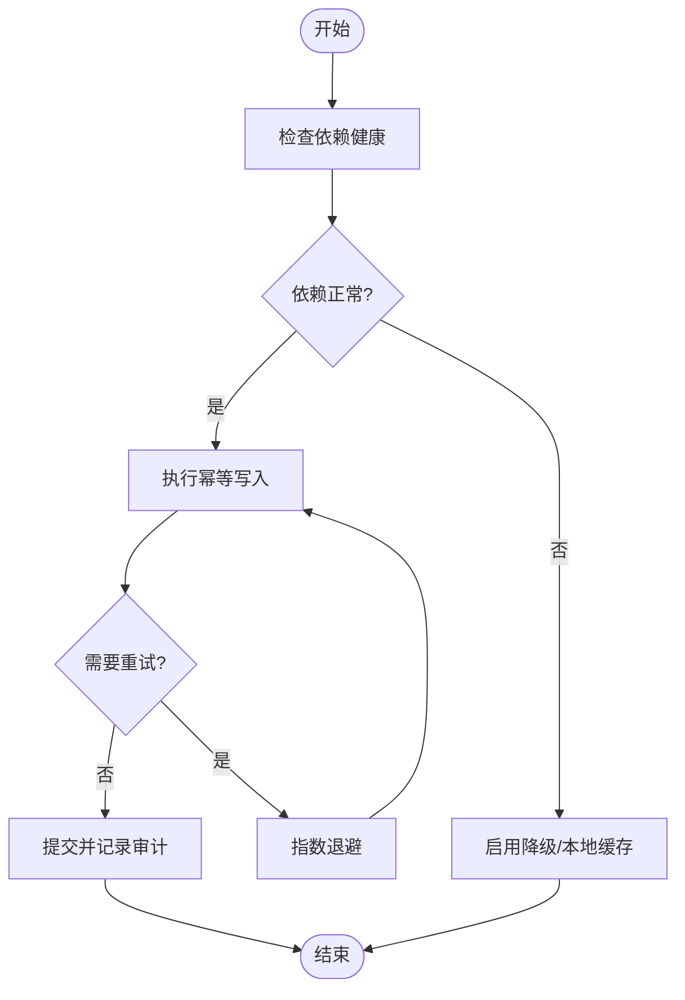
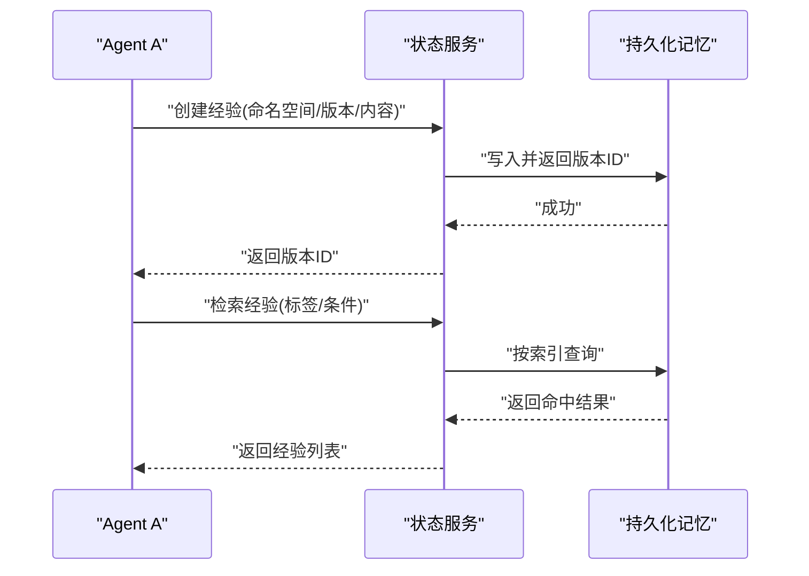
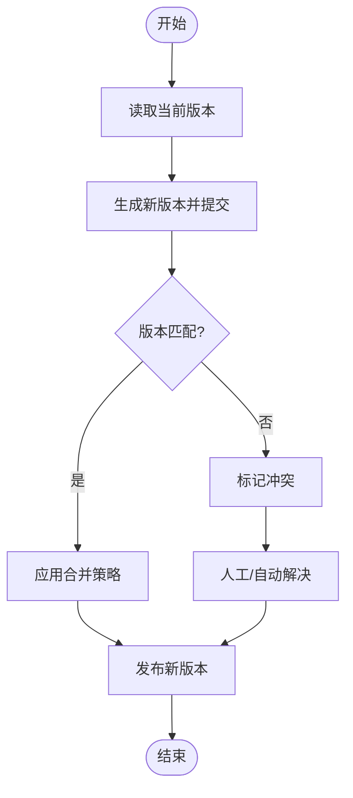
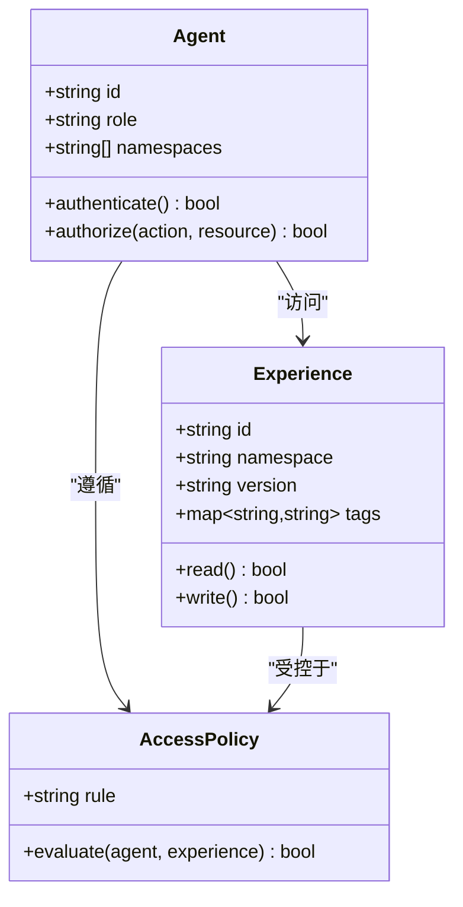
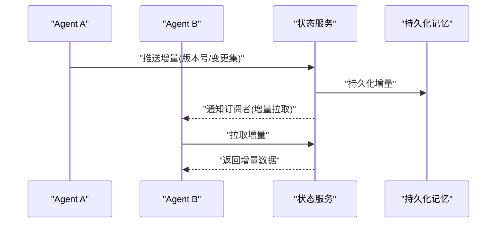
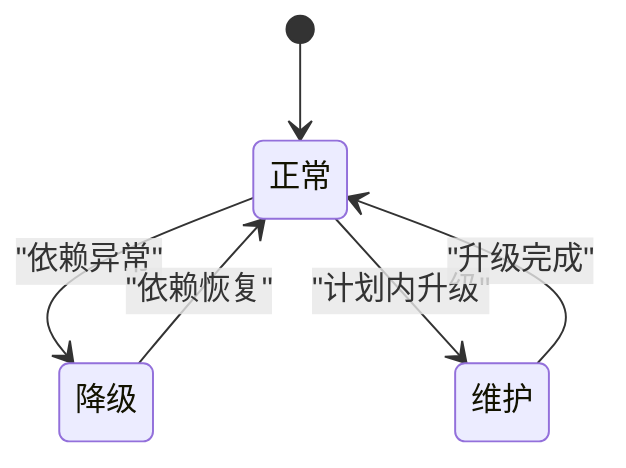

# 多Agent经验共享

<cite>
**本文档引用的文件**   
- [README.md](file://README.md)
- [README_CN.md](file://README_CN.md)
</cite>

## 目录
1. [简介](#简介)
2. [项目结构](#项目结构)
3. [核心组件](#核心组件)
4. [架构总览](#架构总览)
5. [详细组件分析](#详细组件分析)
6. [依赖关系分析](#依赖关系分析)
7. [性能考虑](#性能考虑)
8. [故障处理与恢复](#故障处理与恢复)
9. [结论](#结论)
10. [附录](#附录)

## 简介
本仓库为 CNAA（Cloud Native Agentic Architecture）的轻量级“经验运行时”框架说明，目标是让任意 AI Agent 在不修改内部推理逻辑的前提下，实现经验的持续沉淀、状态同步与跨 Agent 复用。当前仓库以文档入口为主，路线图明确包含“多Agent经验共享”，因此本文围绕该目标给出总体设计、数据模型、版本控制、冲突解决、一致性保证、权限与访问策略、分布式同步与优化、以及故障恢复等完整方案，并给出可落地的配置示例与使用模式。

## 项目结构
仓库目前包含中英文 README，作为项目入口与能力概览；文档目录 docs/en 与 docs/zh 预留用于后续详细说明。整体结构简洁，便于扩展为完整的工程化仓库。

**图表来源** 
- [README.md:1-102](file://README.md#L1-L102)
- [README_CN.md:1-110](file://README_CN.md#L1-L110)

**章节来源**
- [README.md:1-102](file://README.md#L1-L102)
- [README_CN.md:1-110](file://README_CN.md#L1-L110)

## 核心组件
根据 README 中的架构图与特性描述，CNAA 的核心由以下部分构成：
- 经验运行时 SDK：提供统一的状态接口、记忆管理、任务生命周期与 Agent 适配层。
- 状态服务（State Service）：对外暴露 MCP/HTTP 接口，负责状态的持久化与同步。
- 持久化记忆：将经验从临时上下文抽离为独立资源，支持跨会话与跨 Agent 复用。

这些组件共同支撑多 Agent 之间的经验共享与协作。

**章节来源**
- [README.md:45-86](file://README.md#L45-L86)
- [README_CN.md:53-93](file://README_CN.md#L53-L93)

## 架构总览
下图展示了 Agent、经验运行时、状态服务与持久化存储之间的交互关系，以及多 Agent 通过统一状态接口进行经验共享的总体流程。

**图表来源** 
- [README.md:55-86](file://README.md#L55-L86)
- [README_CN.md:63-93](file://README_CN.md#L63-L93)

## 详细组件分析

### 经验运行时 SDK（Agent 侧）
职责与要点：
- 统一状态接口：屏蔽底层存储差异，向 Agent 暴露一致的读写语义。
- 记忆管理：对经验条目进行增删改查、检索、聚合与过期清理。
- 任务生命周期：将经验与任务阶段绑定，支持阶段性沉淀与回溯。
- Agent 适配：兼容不同 Agent 的实现方式，确保无侵入接入。

建议的数据流：
- 写入路径：Agent → SDK → 状态服务 → 持久化记忆（带版本号与元数据）。
- 读取路径：Agent → SDK → 状态服务 → 持久化记忆（按版本/标签/权限过滤）。

**章节来源**
- [README.md:55-86](file://README.md#L55-L86)
- [README_CN.md:63-93](file://README_CN.md#L63-L93)

### 状态服务（MCP/HTTP）
职责与要点：
- 提供统一的 REST/MCP API，承载经验数据的读写、查询与同步。
- 协调多 Agent 并发访问，保障幂等性与一致性。
- 与持久化记忆解耦，便于替换后端存储或引入缓存层。

关键操作：
- 创建/更新经验条目（含版本字段与变更摘要）。
- 批量拉取/增量同步（基于时间戳或版本号）。
- 权限校验与访问控制（按 Agent 身份与角色）。

**章节来源**
- [README.md:55-86](file://README.md#L55-L86)
- [README_CN.md:63-93](file://README_CN.md#L63-L93)

### 持久化记忆（版本化与索引）
职责与要点：
- 经验条目的版本化管理（主版本/次版本/补丁版本），支持回滚与对比。
- 多维索引（按任务、领域、标签、时间范围等）提升检索效率。
- 审计日志记录所有变更，满足合规与问题定位需求。

建议的存储形态：
- 结构化元数据 + 非结构化内容分离存储。
- 冷热分层与压缩归档，降低长期存储成本。

**章节来源**
- [README.md:45-86](file://README.md#L45-L86)
- [README_CN.md:53-93](file://README_CN.md#L53-L93)

## 依赖关系分析
- Agent 与 SDK：松耦合，通过统一状态接口交互。
- SDK 与状态服务：通过 MCP/HTTP 通信，具备重试与熔断能力。
- 状态服务与持久化记忆：可插拔存储后端，支持多副本与分片。

**图表来源** 
- [README.md:55-86](file://README.md#L55-L86)
- [README_CN.md:63-93](file://README_CN.md#L63-L93)

**章节来源**
- [README.md:55-86](file://README.md#L55-L86)
- [README_CN.md:63-93](file://README_CN.md#L63-L93)

## 性能考虑
- 读多写少场景：在状态服务前引入本地/分布式缓存，减少远端调用。
- 批量操作：合并小写请求，采用批量提交与异步确认机制。
- 增量同步：基于版本号/时间戳的增量拉取，避免全量同步。
- 索引优化：热点维度预建索引，结合分页与游标查询。
- 连接池与限流：对状态服务调用进行连接池管理与速率限制。

[本节为通用性能指导，不直接分析具体文件]

## 故障处理与恢复
- 幂等写入：为每次写入生成唯一 ID，服务端去重，避免重复提交。
- 重试与退避：网络异常时指数退避重试，超过阈值降级为本地队列。
- 事务与补偿：跨步骤操作采用本地事务+补偿事件，保证最终一致。
- 健康检查：状态服务与存储后端定期探测，异常自动隔离与切换。
- 回滚与快照：经验版本快照支持快速回滚到稳定版本。

[本图为概念流程图，不映射具体源码文件]

## 多Agent协作的配置示例与使用模式

### 配置项建议
- 经验命名空间：按业务域划分，如 {domain, project, agent_id}。
- 版本策略：语义化版本（主/次/补丁），默认开启最小版本兼容。
- 同步策略：强一致（写后读）或最终一致（拉取式增量同步）。
- 权限模型：RBAC/ABAC，按 Agent 身份、角色与资源标签控制。
- 存储后端：对象存储+数据库索引，冷热分层与压缩。
- 缓存策略：多级缓存（本地 L1 + 分布式 L2），TTL 与失效策略。

### 使用模式
- 沉淀模式：Agent 完成任务后，将经验条目写入指定命名空间，附带标签与摘要。
- 检索模式：其他 Agent 按标签/领域/时间范围检索可用经验，选择最优版本。
- 协同模式：多 Agent 对同一经验进行协作编辑，采用锁或乐观并发控制。
- 发布模式：经验经审核通过后升级为“发布版”，供全局订阅。

**图表来源** 
- [README.md:55-86](file://README.md#L55-L86)
- [README_CN.md:63-93](file://README_CN.md#L63-L93)

## 版本控制、冲突解决与一致性保证

### 版本控制
- 语义化版本：主版本（不兼容变更）、次版本（兼容新增）、补丁（修复）。
- 分支与标签：按任务或领域建立分支，发布打标签。
- 变更摘要：每次提交附带变更原因与影响范围。

### 冲突解决
- 乐观锁：基于版本号比较，失败则提示冲突并触发合并策略。
- 合并策略：优先最新、优先权威来源、人工仲裁或投票机制。
- 冲突检测：基于内容哈希与元数据比对，提前发现潜在冲突。

### 一致性保证
- 读一致性：强一致（单副本）或最终一致（多副本+向量时钟）。
- 写一致性：幂等写入、顺序提交、事务边界清晰。
- 审计追踪：所有变更留痕，支持回溯与取证。

[本图为概念流程图，不映射具体源码文件]

## 权限控制与访问策略
- 身份认证：基于 Agent 证书或令牌，确保来源可信。
- 授权模型：RBAC（角色）与 ABAC（属性）结合，细粒度控制读写权限。
- 命名空间隔离：按业务域隔离经验数据，防止越权访问。
- 审计与告警：记录访问行为，异常访问实时告警。

**图表来源** 
- [README.md:55-86](file://README.md#L55-L86)
- [README_CN.md:63-93](file://README_CN.md#L63-L93)

## 分布式环境下的数据同步策略与性能优化

### 同步策略
- 中心式同步：所有 Agent 通过状态服务集中同步，简单可靠。
- 对等式同步：Agent 之间直接交换经验，适合低延迟局域网。
- 混合模式：中心式为主，局部对等为辅，平衡一致性与性能。

### 性能优化
- 增量同步：仅传输变更片段，减少带宽占用。
- 压缩与序列化：采用高效二进制格式，降低传输开销。
- 批处理与合并：合并多次写入，减少锁竞争。
- 缓存预热：热点经验提前加载，缩短响应时间。

**图表来源** 
- [README.md:55-86](file://README.md#L55-L86)
- [README_CN.md:63-93](file://README_CN.md#L63-L93)

## 多Agent场景下的故障处理和恢复机制
- 节点故障：状态服务多副本部署，自动故障转移。
- 数据损坏：基于快照与校验和恢复，必要时回滚到最近稳定版本。
- 网络分区：分区期间允许本地缓存与离线操作，恢复后合并。
- 死锁与拥塞：超时与退避策略，避免雪崩效应。

[本图为概念状态图，不映射具体源码文件]

## 实际的多Agent协作案例与最佳实践

### 案例一：客服与质检协作
- 客服 Agent 沉淀对话经验（话术、解决方案）。
- 质检 Agent 检索并评估经验质量，反馈改进建议。
- 双方通过统一命名空间与标签协作，形成闭环。

### 案例二：研发与运维协作
- 研发 Agent 沉淀故障排查经验与修复方案。
- 运维 Agent 在生产环境中检索并应用经验，加速排障。
- 通过发布版本与灰度发布控制风险。

### 最佳实践
- 明确经验边界：每个经验聚焦单一问题或场景。
- 标准化元数据：统一标签、分类与摘要格式。
- 渐进式发布：先内部试用，再逐步开放共享。
- 持续治理：定期清理过期经验，保持知识库整洁。

[本节为概念性内容，不直接分析具体文件]

## 结论
CNAA 通过“经验运行时 + 状态服务 + 持久化记忆”的分层架构，为多 Agent 经验共享提供了坚实的基础。围绕版本控制、冲突解决、一致性、权限与分布式同步等关键议题，本文给出了系统化的设计方案与实践建议。随着 roadmap 中“多Agent经验共享”的推进，建议在现有文档基础上补充具体的 SDK 接口规范与服务实现细节，以便更快落地。

[本节为总结性内容，不直接分析具体文件]

## 附录

### 术语表
- 经验：可复用的任务知识、策略或解决方案。
- 命名空间：经验数据的逻辑隔离单元。
- 版本：经验条目的迭代标识，支持回滚与对比。
- 状态服务：提供经验数据读写与同步的服务端。
- 持久化记忆：经验数据的长期存储与索引。

[本节为概念性内容，不直接分析具体文件]