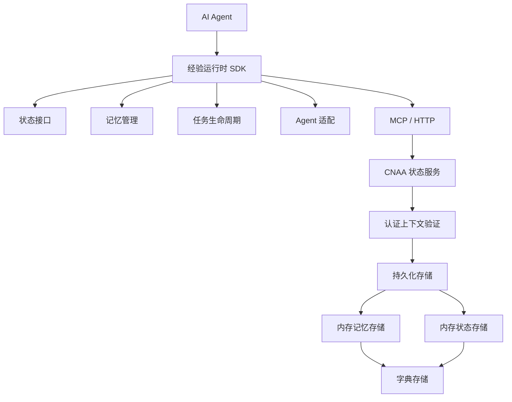
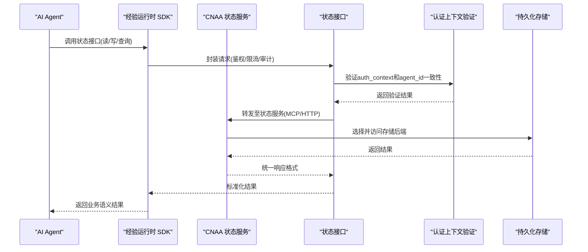
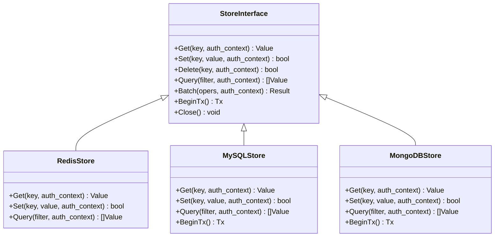
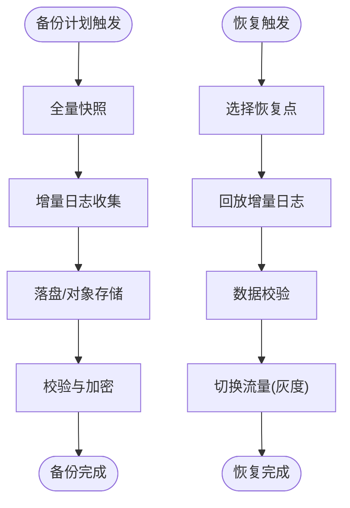
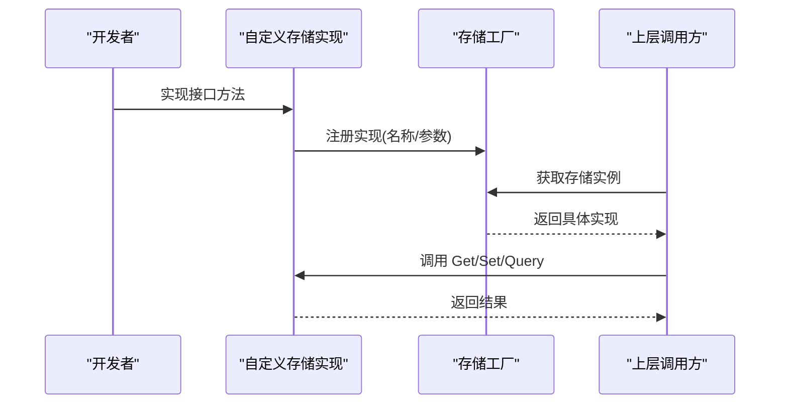
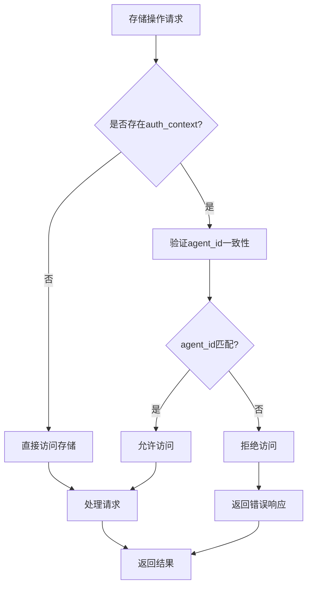
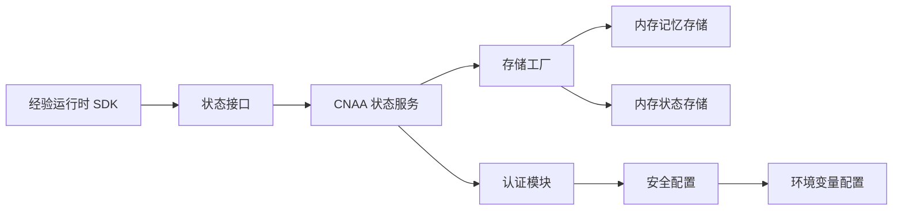

# 存储后端

<cite>
**本文引用的文件**   
- [README.md](file://README.md)
- [README_CN.md](file://README_CN.md)
- [memory_store.py](file://cloud/storage/memory_store.py)
- [state_store.py](file://cloud/storage/state_store.py)
- [interaction.py](file://cnaa/interaction.py)
- [security.py](file://cnaa/security.py)
- [test_cloud_storage.py](file://tests/test_cloud_storage.py)
- [test_security.py](file://tests/test_security.py)
</cite>

## 更新摘要
**所做更改**   
- 新增认证上下文验证机制章节，说明agent_id一致性检查
- 更新存储接口抽象部分，包含可选的auth_context参数
- 添加安全配置和权限控制相关内容
- 更新测试用例和最佳实践指南
- 增强故障排查指南中的认证相关问题

## 目录
1. [简介](#简介)
2. [项目结构](#项目结构)
3. [核心组件](#核心组件)
4. [架构总览](#架构总览)
5. [详细组件分析](#详细组件分析)
6. [认证上下文验证](#认证上下文验证)
7. [依赖关系分析](#依赖关系分析)
8. [性能考虑](#性能考虑)
9. [故障排查指南](#故障排查指南)
10. [结论](#结论)
11. [附录](#附录)

## 简介
本章节面向"存储后端"主题，基于仓库提供的顶层说明文档，梳理 CNAA（Cloud Native Agentic Architecture）在持久化记忆方面的整体定位与能力边界。当前仓库已实现内存存储后端，并集成了可选的认证上下文验证机制，确保agent_id在所有操作中的 consistency。本文详细说明存储后端的配置方法、认证机制、扩展方法与最佳实践。

## 项目结构
仓库目前包含完整的存储层实现，包括内存存储、状态管理和认证机制：

**图表来源**
- [memory_store.py:1-199](file://cloud/storage/memory_store.py#L1-L199)
- [state_store.py:1-276](file://cloud/storage/state_store.py#L1-L276)
- [security.py:1-208](file://cnaa/security.py#L1-L208)

**章节来源**
- [README.md:1-102](file://README.md#L1-L102)
- [README_CN.md:1-110](file://README_CN.md#L1-L110)

## 核心组件
结合顶层架构图，存储后端相关的关键组件包括：
- **状态接口**：定义统一的读写/查询/事务等能力，屏蔽底层存储差异；
- **记忆管理**：负责经验的序列化、版本控制、索引与一致性策略；
- **任务生命周期**：将任务各阶段的状态变更与持久化操作对齐；
- **状态服务**：对外暴露 MCP/HTTP 接口，聚合存储访问逻辑；
- **认证上下文**：提供可选的agent_id一致性验证机制；
- **持久化存储**：Redis、MySQL、MongoDB 等作为可选后端。

**章节来源**
- [interaction.py:44-145](file://cnaa/interaction.py#L44-L145)
- [interaction.py:152-295](file://cnaa/interaction.py#L152-L295)

## 架构总览
下图展示从 Agent 到存储的整体数据流与控制流，强调"统一状态接口 + 认证上下文验证 + 多存储后端"的分层解耦。

**图表来源**
- [memory_store.py:42-64](file://cloud/storage/memory_store.py#L42-L64)
- [state_store.py:45-96](file://cloud/storage/state_store.py#L45-L96)
- [security.py:86-120](file://cnaa/security.py#L86-L120)

## 详细组件分析

### 存储接口抽象与实现
- **目标**：通过统一接口屏蔽 Redis、MySQL、MongoDB 等差异，便于切换与扩展；
- **建议能力**：键值存取、结构化对象存取、批量操作、事务、索引查询、分页、锁与并发控制；
- **扩展方式**：新增存储类型时仅需实现统一接口，并在注册中心完成绑定；
- **认证支持**：所有接口均支持可选的auth_context参数进行agent_id一致性验证。

**图表来源**
- [interaction.py:44-145](file://cnaa/interaction.py#L44-L145)
- [interaction.py:152-295](file://cnaa/interaction.py#L152-L295)

**章节来源**
- [memory_store.py:19-36](file://cloud/storage/memory_store.py#L19-L36)
- [state_store.py:18-35](file://cloud/storage/state_store.py#L18-L35)

### 数据模型与序列化
- **模型建议**：经验条目包含唯一标识、版本号、时间戳、标签、内容体、元数据等；
- **序列化**：JSON/Protobuf 二选一，兼顾可读性与性能；
- **压缩与分片**：大对象建议压缩与分块存储，提升吞吐与降低延迟；
- **版本与合并**：支持乐观锁与冲突合并策略，保障多写场景一致性。

### 备份、恢复与迁移
- **备份策略**：定期快照 + 增量日志，冷热分层存储；
- **恢复流程**：按时间点回滚或跨环境迁移，验证数据完整性；
- **迁移方案**：灰度切换、双写校验、回滚预案；
- **合规要求**：保留周期、脱敏、审计日志。

### 自定义存储后端开发指南
- **步骤一**：实现统一存储接口（见"存储接口抽象与实现"）；
- **步骤二**：实现连接池、重试、超时、熔断与监控埋点；
- **步骤三**：实现序列化/反序列化与压缩/分片策略；
- **步骤四**：实现可选的auth_context参数支持；
- **步骤五**：注册到存储工厂/路由，支持动态切换；
- **步骤六**：编写单元测试与集成测试，覆盖异常路径。

**图表来源**
- [memory_store.py:19-36](file://cloud/storage/memory_store.py#L19-L36)
- [state_store.py:18-35](file://cloud/storage/state_store.py#L18-L35)

### 不同存储场景的配置示例与最佳实践
- **Redis（热点缓存/会话/轻量KV）**
  - 适用：高吞吐、低延迟、简单键值与集合操作；
  - 要点：连接池、过期策略、主从/哨兵、集群分片；
  - 注意：大Key与热Key优化，避免阻塞。
- **MySQL（结构化数据/强一致）**
  - 适用：复杂查询、事务、ACID 要求高的场景；
  - 要点：索引设计、读写分离、分库分表、慢查询治理；
  - 注意：连接数与锁竞争，合理批处理。
- **MongoDB（半结构化/文档型）**
  - 适用：灵活模式、嵌套结构、海量文档；
  - 要点：索引策略、副本集、分片集群、TTL 清理；
  - 注意：聚合性能与内存占用。

**章节来源**
- [memory_store.py:145-160](file://cloud/storage/memory_store.py#L145-L160)
- [state_store.py:247-275](file://cloud/storage/state_store.py#L247-L275)

## 认证上下文验证

### 认证机制概述
CNAA存储层现在支持可选的认证上下文验证，确保agent_id在所有操作中的consistency。该机制通过`auth_context`参数传递，包含以下关键信息：
- `agent_id`: 经过认证的代理标识符
- `permission`: 权限级别（read_only, read_write, admin）
- `authenticated`: 认证状态标志

### 认证上下文验证流程
所有存储操作都支持可选的`auth_context`参数，验证流程如下：

**图表来源**
- [memory_store.py:54-58](file://cloud/storage/memory_store.py#L54-L58)
- [memory_store.py:82-83](file://cloud/storage/memory_store.py#L82-L83)
- [state_store.py:66-67](file://cloud/storage/state_store.py#L66-L67)

### 存储接口的认证支持
所有存储接口都已更新以支持可选的`auth_context`参数：

**记忆存储接口**：
- `store_memory(memory, auth_context=None)` - 存储记忆时验证agent_id
- `get_memory(agent_id, memory_id, auth_context=None)` - 读取时验证权限
- `list_memories(agent_id, memory_type, tags, auth_context=None)` - 列表查询时验证
- `delete_memory(agent_id, memory_id, auth_context=None)` - 删除时验证权限

**状态存储接口**：
- `get_state(agent_id, auth_context=None)` - 获取状态时验证
- `update_state(agent_id, state, auth_context=None)` - 更新状态时验证
- `delete_state(agent_id, state_id, auth_context=None)` - 删除状态时验证
- `get_preference(agent_id, auth_context=None)` - 获取偏好时验证
- `update_preference(agent_id, preference, auth_context=None)` - 更新偏好时验证
- `delete_preference(agent_id, preference_id, auth_context=None)` - 删除偏好时验证
- `get_environment(agent_id, auth_context=None)` - 获取环境时验证
- `update_environment(agent_id, environment, auth_context=None)` - 更新环境时验证

### 向后兼容性
认证上下文验证是可选的，确保向后兼容：
- 当`auth_context`为None时，所有操作正常执行
- 当`auth_context`存在但agent_id不匹配时，返回错误或空结果
- 读取操作在不匹配时返回None（静默失败）
- 写入操作在不匹配时返回错误消息

**章节来源**
- [memory_store.py:42-64](file://cloud/storage/memory_store.py#L42-L64)
- [memory_store.py:66-85](file://cloud/storage/memory_store.py#L66-L85)
- [memory_store.py:87-143](file://cloud/storage/memory_store.py#L87-L143)
- [memory_store.py:162-186](file://cloud/storage/memory_store.py#L162-L186)
- [state_store.py:45-71](file://cloud/storage/state_store.py#L45-L71)
- [state_store.py:73-96](file://cloud/storage/state_store.py#L73-L96)
- [state_store.py:98-122](file://cloud/storage/state_store.py#L98-L122)
- [state_store.py:126-152](file://cloud/storage/state_store.py#L126-L152)
- [state_store.py:154-177](file://cloud/storage/state_store.py#L154-L177)
- [state_store.py:179-203](file://cloud/storage/state_store.py#L179-L203)
- [state_store.py:207-221](file://cloud/storage/state_store.py#L207-L221)
- [state_store.py:223-245](file://cloud/storage/state_store.py#L223-L245)

## 依赖关系分析
- **组件耦合**：状态接口与存储实现松耦合，通过工厂/路由解耦；
- **外部依赖**：网络传输（MCP/HTTP）、存储驱动（Redis/MySQL/MongoDB）；
- **认证依赖**：安全模块提供API密钥验证和权限检查；
- **潜在风险**：循环依赖应避免；存储驱动需具备健康检查与降级能力。

**图表来源**
- [security.py:39-84](file://cnaa/security.py#L39-L84)
- [security.py:169-207](file://cnaa/security.py#L169-L207)

**章节来源**
- [memory_store.py:1-11](file://cloud/storage/memory_store.py#L1-L11)
- [state_store.py:1-10](file://cloud/storage/state_store.py#L1-L10)
- [security.py:1-18](file://cnaa/security.py#L1-L18)

## 性能考虑
- **缓存策略**：多级缓存（本地+分布式），热点数据优先命中；
- **连接与并发**：合理的连接池大小、超时与重试退避；
- **序列化**：二进制序列化（如 Protobuf）减少体积与解析开销；
- **批处理**：批量写入与查询，降低往返次数；
- **认证开销**：auth_context验证为O(1)字典查找，性能影响极小；
- **监控与告警**：QPS、延迟、错误率、资源使用率；
- **容量规划**：根据数据增长预测扩容与分片策略。

## 故障排查指南
- **常见问题**
  - **连接失败**：检查网络连通性、认证信息、端口与防火墙；
  - **认证失败**：验证API密钥配置、agent_id一致性、权限设置；
  - **超时与重试**：调整超时阈值与重试次数，观察下游压力；
  - **数据不一致**：核对事务边界与幂等性，检查补偿机制；
  - **性能抖动**：定位慢查询与大对象，优化索引与序列化；
- **诊断手段**
  - **日志采集**：关键路径打点，关联请求追踪ID；
  - **指标上报**：Prometheus/Grafana 可视化；
  - **压测演练**：模拟峰值流量与异常注入；
  - **认证调试**：检查auth_context传递、agent_id匹配、权限验证。

**章节来源**
- [test_security.py:349-410](file://tests/test_security.py#L349-L410)
- [test_cloud_storage.py:17-152](file://tests/test_cloud_storage.py#L17-L152)

## 结论
CNAA存储后端现已实现完整的内存存储解决方案，并集成了可选的认证上下文验证机制。该机制确保agent_id在所有存储操作中的一致性，同时保持向后兼容性。系统提供了清晰的接口抽象、完善的测试覆盖和灵活的扩展能力，为后续实现持久化存储后端奠定了坚实基础。建议在后续迭代中逐步补齐Redis、MySQL、MongoDB等持久化存储实现，以实现稳定、可扩展且高性能的持久化记忆系统。

## 附录
- **术语**
  - **经验运行时**：在不修改 Agent 推理逻辑的前提下，沉淀与复用任务经验的运行时框架；
  - **状态接口**：对外的统一状态读写与查询能力；
  - **状态服务**：对外暴露 MCP/HTTP 接口的服务层；
  - **持久化存储**：Redis、MySQL、MongoDB 等后端存储；
  - **认证上下文**：包含agent_id、权限级别和认证状态的上下文信息；
  - **agent_id一致性**：确保所有存储操作中的agent_id与认证上下文保持一致。

**章节来源**
- [security.py:58-84](file://cnaa/security.py#L58-L84)
- [interaction.py:44-145](file://cnaa/interaction.py#L44-L145)
- [interaction.py:152-295](file://cnaa/interaction.py#L152-L295)