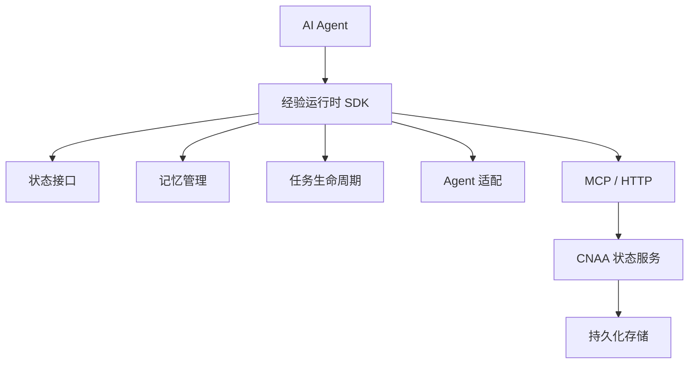
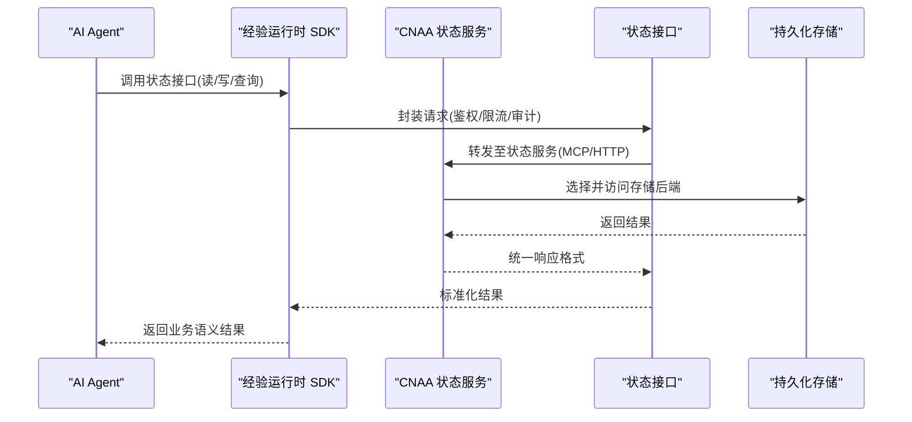
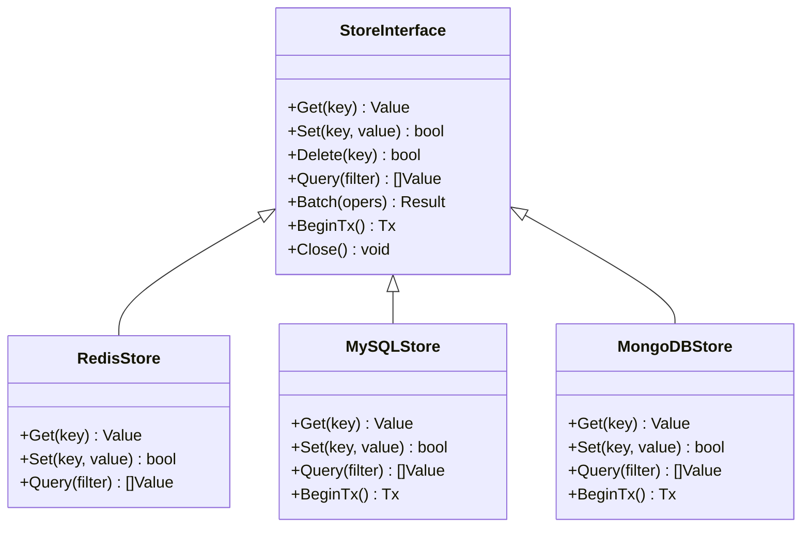
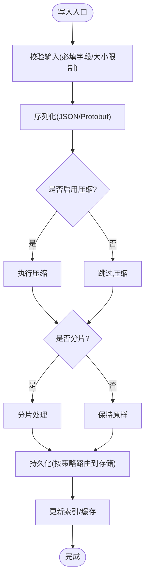
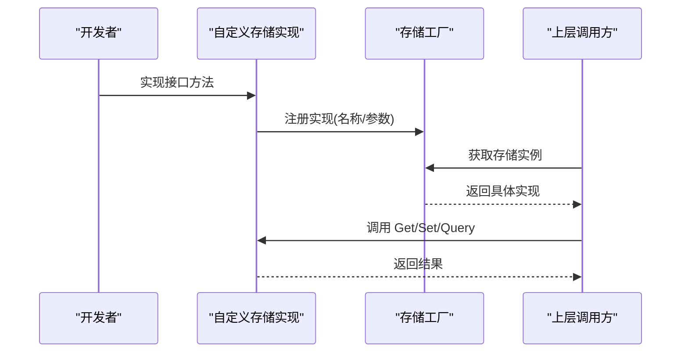
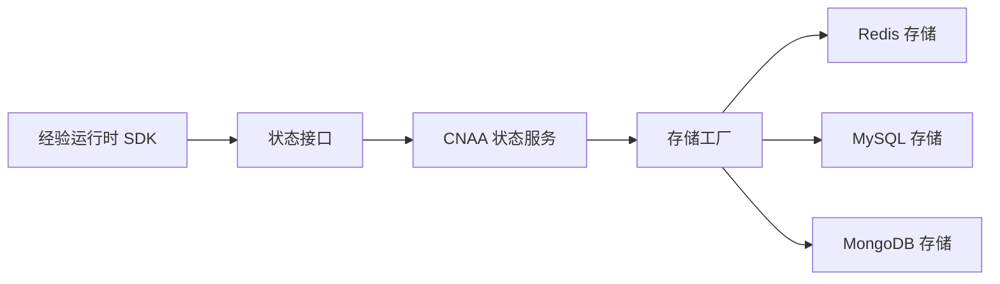

# 存储后端

<cite>
**本文引用的文件**   
- [README.md](file://README.md)
- [README_CN.md](file://README_CN.md)
</cite>

## 目录
1. [简介](#简介)
2. [项目结构](#项目结构)
3. [核心组件](#核心组件)
4. [架构总览](#架构总览)
5. [详细组件分析](#详细组件分析)
6. [依赖关系分析](#依赖关系分析)
7. [性能考虑](#性能考虑)
8. [故障排查指南](#故障排查指南)
9. [结论](#结论)
10. [附录](#附录)

## 简介
本章节面向“存储后端”主题，基于仓库提供的顶层说明文档，梳理 CNAA（Cloud Native Agentic Architecture）在持久化记忆方面的整体定位与能力边界。当前仓库为概念与路线图阶段，尚未包含具体代码实现或配置样例。因此，本文以架构视角给出存储后端的总体设计建议、扩展方法与最佳实践，帮助读者在后续实现中快速落地。

## 项目结构
仓库目前仅包含英文与中文的 README 文件，未包含源码与配置文件。这意味着：
- 存储后端的具体实现与配置尚未提供；
- 可依据顶层架构图中的“Experience Runtime → Persistent Memory”分层思路进行设计与扩展；
- 建议在后续迭代中补充状态服务、接口规范与存储适配层。

图表来源
- [README.md:55-72](file://README.md#L55-L72)
- [README_CN.md:63-80](file://README_CN.md#L63-L80)

章节来源
- [README.md:1-102](file://README.md#L1-L102)
- [README_CN.md:1-110](file://README_CN.md#L1-L110)

## 核心组件
结合顶层架构图，存储后端相关的关键组件包括：
- 状态接口：定义统一的读写/查询/事务等能力，屏蔽底层存储差异；
- 记忆管理：负责经验的序列化、版本控制、索引与一致性策略；
- 任务生命周期：将任务各阶段的状态变更与持久化操作对齐；
- 状态服务：对外暴露 MCP/HTTP 接口，聚合存储访问逻辑；
- 持久化存储：Redis、MySQL、MongoDB 等作为可选后端。

章节来源
- [README.md:55-72](file://README.md#L55-L72)
- [README_CN.md:63-80](file://README_CN.md#L63-L80)

## 架构总览
下图展示从 Agent 到存储的整体数据流与控制流，强调“统一状态接口 + 状态服务 + 多存储后端”的分层解耦。

图表来源
- [README.md:55-72](file://README.md#L55-L72)
- [README_CN.md:63-80](file://README_CN.md#L63-L80)

## 详细组件分析

### 存储接口抽象与实现
- 目标：通过统一接口屏蔽 Redis、MySQL、MongoDB 等差异，便于切换与扩展；
- 建议能力：键值存取、结构化对象存取、批量操作、事务、索引查询、分页、锁与并发控制；
- 扩展方式：新增存储类型时仅需实现统一接口，并在注册中心完成绑定。

图表来源
- [README.md:55-72](file://README.md#L55-L72)
- [README_CN.md:63-80](file://README_CN.md#L63-L80)

章节来源
- [README.md:55-72](file://README.md#L55-L72)
- [README_CN.md:63-80](file://README_CN.md#L63-L80)

### 数据模型与序列化
- 模型建议：经验条目包含唯一标识、版本号、时间戳、标签、内容体、元数据等；
- 序列化：JSON/Protobuf 二选一，兼顾可读性与性能；
- 压缩与分片：大对象建议压缩与分块存储，提升吞吐与降低延迟；
- 版本与合并：支持乐观锁与冲突合并策略，保障多写场景一致性。

图表来源
- [README.md:55-72](file://README.md#L55-L72)
- [README_CN.md:63-80](file://README_CN.md#L63-L80)

### 备份、恢复与迁移
- 备份策略：定期快照 + 增量日志，冷热分层存储；
- 恢复流程：按时间点回滚或跨环境迁移，验证数据完整性；
- 迁移方案：灰度切换、双写校验、回滚预案；
- 合规要求：保留周期、脱敏、审计日志。

图表来源
- [README.md:55-72](file://README.md#L55-L72)
- [README_CN.md:63-80](file://README_CN.md#L63-L80)

### 自定义存储后端开发指南
- 步骤一：实现统一存储接口（见“存储接口抽象与实现”）；
- 步骤二：实现连接池、重试、超时、熔断与监控埋点；
- 步骤三：实现序列化/反序列化与压缩/分片策略；
- 步骤四：注册到存储工厂/路由，支持动态切换；
- 步骤五：编写单元测试与集成测试，覆盖异常路径。

图表来源
- [README.md:55-72](file://README.md#L55-L72)
- [README_CN.md:63-80](file://README_CN.md#L63-L80)

### 不同存储场景的配置示例与最佳实践
- Redis（热点缓存/会话/轻量KV）
  - 适用：高吞吐、低延迟、简单键值与集合操作；
  - 要点：连接池、过期策略、主从/哨兵、集群分片；
  - 注意：大Key与热Key优化，避免阻塞。
- MySQL（结构化数据/强一致）
  - 适用：复杂查询、事务、ACID 要求高的场景；
  - 要点：索引设计、读写分离、分库分表、慢查询治理；
  - 注意：连接数与锁竞争，合理批处理。
- MongoDB（半结构化/文档型）
  - 适用：灵活模式、嵌套结构、海量文档；
  - 要点：索引策略、副本集、分片集群、TTL 清理；
  - 注意：聚合性能与内存占用。

章节来源
- [README.md:55-72](file://README.md#L55-L72)
- [README_CN.md:63-80](file://README_CN.md#L63-L80)

## 依赖关系分析
- 组件耦合：状态接口与存储实现松耦合，通过工厂/路由解耦；
- 外部依赖：网络传输（MCP/HTTP）、存储驱动（Redis/MySQL/MongoDB）；
- 潜在风险：循环依赖应避免；存储驱动需具备健康检查与降级能力。

图表来源
- [README.md:55-72](file://README.md#L55-L72)
- [README_CN.md:63-80](file://README_CN.md#L63-L80)

章节来源
- [README.md:55-72](file://README.md#L55-L72)
- [README_CN.md:63-80](file://README_CN.md#L63-L80)

## 性能考虑
- 缓存策略：多级缓存（本地+分布式），热点数据优先命中；
- 连接与并发：合理的连接池大小、超时与重试退避；
- 序列化：二进制序列化（如 Protobuf）减少体积与解析开销；
- 批处理：批量写入与查询，降低往返次数；
- 监控与告警：QPS、延迟、错误率、资源使用率；
- 容量规划：根据数据增长预测扩容与分片策略。

## 故障排查指南
- 常见问题
  - 连接失败：检查网络连通性、认证信息、端口与防火墙；
  - 超时与重试：调整超时阈值与重试次数，观察下游压力；
  - 数据不一致：核对事务边界与幂等性，检查补偿机制；
  - 性能抖动：定位慢查询与大对象，优化索引与序列化；
- 诊断手段
  - 日志采集：关键路径打点，关联请求追踪ID；
  - 指标上报：Prometheus/Grafana 可视化；
  - 压测演练：模拟峰值流量与异常注入。

## 结论
当前仓库处于概念与路线图阶段，尚未提供存储后端的具体实现与配置。本文基于顶层架构图给出了存储后端的总体设计、扩展方法与最佳实践，建议在后续迭代中逐步补齐状态服务、接口规范与存储适配层，以实现稳定、可扩展且高性能的持久化记忆系统。

## 附录
- 术语
  - 经验运行时：在不修改 Agent 推理逻辑的前提下，沉淀与复用任务经验的运行时框架；
  - 状态接口：对外的统一状态读写与查询能力；
  - 状态服务：对外暴露 MCP/HTTP 接口的服务层；
  - 持久化存储：Redis、MySQL、MongoDB 等后端存储。