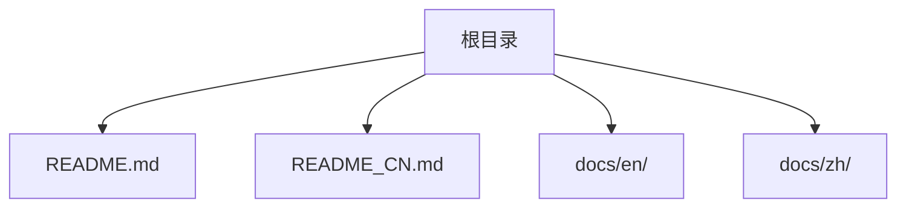
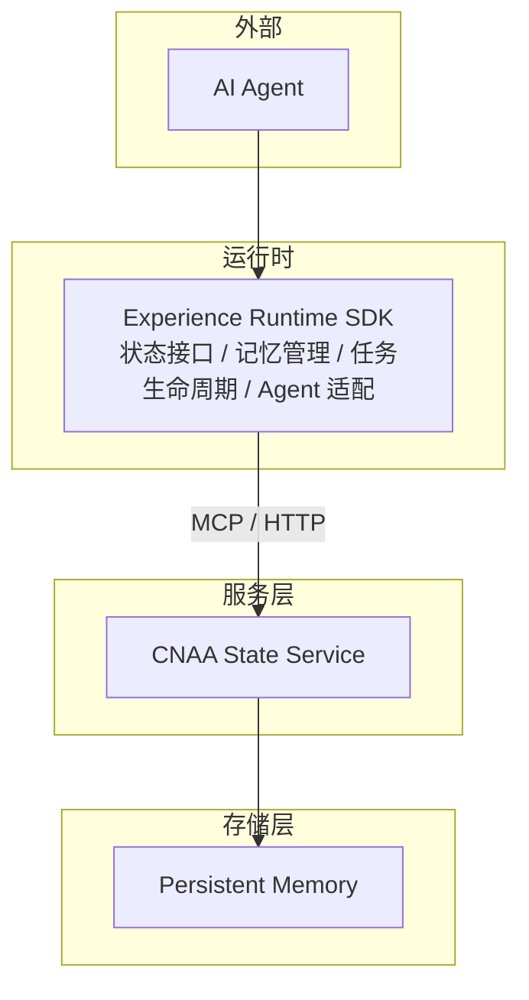
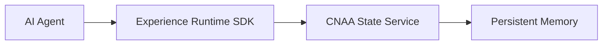

# 部署指南

<cite>
**本文引用的文件**   
- [README.md](file://README.md)
- [README_CN.md](file://README_CN.md)
</cite>

## 目录
1. [简介](#简介)
2. [项目结构](#项目结构)
3. [核心组件](#核心组件)
4. [架构总览](#架构总览)
5. [详细组件分析](#详细组件分析)
6. [依赖分析](#依赖分析)
7. [性能考虑](#性能考虑)
8. [故障排查指南](#故障排查指南)
9. [结论](#结论)
10. [附录](#附录)

## 简介
本指南面向希望在本地、容器化与 Kubernetes 环境中部署 CNAA（Cloud Native Agentic Architecture）的工程师与运维人员。CNAA 提供轻量级“经验运行时”，使任意 AI Agent 在不修改推理逻辑的前提下，实现经验的沉淀、同步与复用。当前仓库为文档与说明阶段，尚未包含具体代码或部署清单，因此本指南以仓库现有信息为基础，给出通用化的部署路径与最佳实践建议，并明确后续需要补充的配置项与资源定义位置。

## 项目结构
仓库目前包含英文与中文 README，以及空的 docs/en 与 docs/zh 目录，表明文档体系已规划但内容尚未填充。部署相关的具体配置（如 Dockerfile、Kubernetes YAML、环境变量等）尚未出现在仓库中，需在后续迭代中补充。

**图表来源** 
- [README.md:1-102](file://README.md#L1-L102)
- [README_CN.md:1-110](file://README_CN.md#L1-L110)

**章节来源**
- [README.md:1-102](file://README.md#L1-L102)
- [README_CN.md:1-110](file://README_CN.md#L1-L110)

## 核心组件
根据 README 中的架构描述，CNAA 的核心由以下部分构成：
- Experience Runtime SDK：为 Agent 提供状态接口、记忆管理、任务生命周期与 Agent 适配能力。
- CNAA State Service：对外暴露统一的状态接口，供 SDK 通过 MCP 或 HTTP 访问。
- Persistent Memory：作为独立于 Agent 的生命周期的持久化资源，承载经验数据。

这些组件共同实现了“Agent 无关”的设计目标，使得不同 Agent 可以共享统一的经验运行时与状态服务。

**章节来源**
- [README.md:55-73](file://README.md#L55-L73)
- [README_CN.md:63-80](file://README_CN.md#L63-L80)

## 架构总览
下图展示了 CNAA 在运行时的整体交互关系：AI Agent 调用 Experience Runtime SDK，SDK 通过 MCP/HTTP 与 CNAA State Service 通信，State Service 负责与持久化存储进行读写。

**图表来源** 
- [README.md:55-73](file://README.md#L55-L73)
- [README_CN.md:63-80](file://README_CN.md#L63-80)

## 详细组件分析
### 本地开发环境搭建（建议步骤）
由于仓库未提供具体的本地启动脚本或配置文件，以下为基于架构的通用建议流程：
- 准备运行环境：安装必要的语言运行时与工具链（例如 Go/Python/Node，视具体实现而定），并确保具备网络访问能力以拉取镜像或依赖。
- 获取源码与文档：克隆仓库，阅读 README 与 docs 目录下的文档，了解状态接口与 SDK 的使用方式。
- 配置环境变量：根据 State Service 的要求设置必要的环境变量（如端口、存储后端地址、认证凭据等）。
- 启动依赖服务：若使用外部数据库或对象存储，请先启动并验证连通性。
- 启动 State Service：按官方指引运行服务进程，确认健康检查与日志输出正常。
- 集成 SDK：在 Agent 侧引入 Experience Runtime SDK，配置连接参数，完成最小可用验证。

注意：以上步骤为通用指导，具体命令与配置项需待仓库补充 Dockerfile、Makefile 或示例配置后完善。

### Docker 容器化部署（建议流程）
- 构建镜像：编写 Dockerfile，将 State Service 及其依赖打包为镜像；如需多阶段构建，可分离编译与运行阶段以减少镜像体积。
- 镜像仓库：将镜像推送到私有或公有镜像仓库，确保集群节点可拉取。
- 容器编排：使用 Docker Compose 或编排平台（如 Kubernetes）定义服务拓扑、端口映射、环境变量与卷挂载。
- 服务发现：在容器网络内通过服务名解析 State Service 的地址，或在 K8s 中使用 Service/DNS 进行服务发现。
- 健康检查：为容器添加健康检查探针，确保自动重启与就绪判定正确。

注意：当前仓库未包含 Dockerfile 与编排文件，建议在后续版本中补充。

### Kubernetes 集群部署（建议清单）
- Deployment：定义 State Service 的副本数、资源限制、滚动更新策略与环境变量。
- Service：暴露 ClusterIP/NodePort/LoadBalancer 以便内部或外部访问。
- ConfigMap/Secret：集中管理配置与敏感信息，避免硬编码。
- Ingress/Gateway：对外暴露 API，结合 TLS 与访问控制。
- HPA/VPA：基于 CPU/内存或自定义指标实现自动扩缩容。
- StorageClass/PV/PVC：为持久化存储提供动态供给与容量保障。
- Monitoring/Logging：集成 Prometheus 指标导出与日志采集（如 Loki/ELK）。

注意：仓库未提供 K8s YAML 清单，需在后续版本中补充。

### 云原生部署最佳实践
- 负载均衡：通过 Ingress/Service 或网关对 State Service 进行流量分发与限流。
- 自动扩缩容：依据 QPS、延迟、CPU/内存利用率等指标配置 HPA，必要时结合 VPA 调整资源请求。
- 监控集成：暴露标准指标端点，接入 Prometheus 与告警规则；集中采集日志，便于问题定位。
- 安全加固：启用 mTLS、RBAC、网络策略与最小权限原则；定期轮换密钥与证书。
- 灰度发布：采用蓝绿或金丝雀发布策略，降低变更风险。

[本节为通用指导，不直接分析具体文件]

## 依赖分析
从架构视角看，CNAA 的依赖关系如下：
- AI Agent 依赖 Experience Runtime SDK。
- SDK 依赖 CNAA State Service（通过 MCP/HTTP）。
- State Service 依赖持久化存储（Persistent Memory）。

该分层设计降低了耦合度，便于独立演进与替换实现。

**图表来源** 
- [README.md:55-73](file://README.md#L55-L73)
- [README_CN.md:63-80](file://README_CN.md#L63-80)

**章节来源**
- [README.md:55-73](file://README.md#L55-L73)
- [README_CN.md:63-80](file://README_CN.md#L63-80)

## 性能考虑
- 连接池与并发：合理配置 SDK 与 State Service 的连接池大小与并发上限，避免资源争用。
- 缓存策略：在 SDK 或服务层引入本地缓存，减少重复读取与跨网络开销。
- I/O 优化：选择高性能存储后端，启用异步写入与批量操作。
- 资源隔离：在容器与 K8s 层面设置合理的 requests/limits，防止抖动与雪崩。
- 观测性：完善指标与链路追踪，定位瓶颈与异常路径。

[本节为通用指导，不直接分析具体文件]

## 故障排查指南
- 服务不可达：检查网络策略、端口映射与服务发现；确认健康检查与就绪探针状态。
- 鉴权失败：核对 Secret 与证书配置，确保客户端与服务端一致。
- 存储异常：验证存储后端连通性与权限；检查磁盘空间与配额。
- 性能退化：观察指标与日志，识别热点与慢查询；调整并发与缓存策略。
- 日志收集：确认日志级别与输出格式，确保被采集系统正确抓取。

[本节为通用指导，不直接分析具体文件]

## 结论
当前仓库处于文档与规划阶段，尚未包含具体的部署清单与实现代码。建议优先补齐以下内容以支撑生产级部署：
- Dockerfile 与镜像构建脚本
- Kubernetes YAML（Deployment、Service、ConfigMap、Ingress、HPA 等）
- 环境变量与配置模板
- 健康检查与监控指标定义
- 安全配置与密钥管理方案

在上述基础完善后，可按本指南的流程快速落地本地、容器化与 K8s 部署，并结合云原生最佳实践提升稳定性与可观测性。

## 附录
- 参考文档链接（来自 README）：
  - 快速开始、持久化记忆、状态接口、运行时 SDK、状态服务、MCP 接入、Agent 接入、整体架构等文档位于 docs/zh 与 docs/en 目录，待内容填充后可作为部署与集成的权威参考。

**章节来源**
- [README_CN.md:84-94](file://README_CN.md#L84-L94)
- [README.md:76-86](file://README.md#L76-L86)