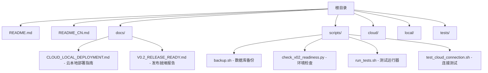
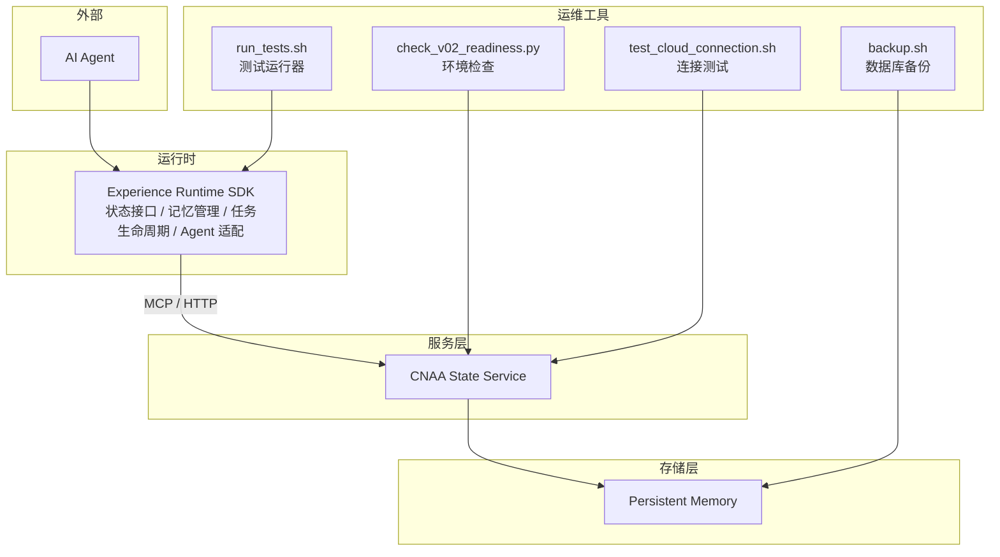
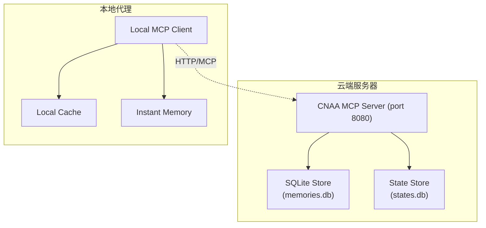

# 部署指南

<cite>
**本文引用的文件**   
- [README.md](file://README.md)
- [README_CN.md](file://README_CN.md)
- [scripts/backup.sh](file://scripts/backup.sh)
- [scripts/check_v02_readiness.py](file://scripts/check_v02_readiness.py)
- [scripts/run_tests.sh](file://scripts/run_tests.sh)
- [scripts/test_cloud_connection.sh](file://scripts/test_cloud_connection.sh)
- [docs/CLOUD_LOCAL_DEPLOYMENT.md](file://docs/CLOUD_LOCAL_DEPLOYMENT.md)
- [QUICK_DEPLOY.md](file://QUICK_DEPLOY.md)
- [docs/V0.2_RELEASE_READY.md](file://docs/V0.2_RELEASE_READY.md)
</cite>

## 更新摘要
**变更内容**   
- 新增云本地部署脚本和配置支持
- 添加环境检查、备份、测试连接等运维工具
- 完善生产环境部署流程和最佳实践
- 增强故障排查和监控能力

## 目录
1. [简介](#简介)
2. [项目结构](#项目结构)
3. [核心组件](#核心组件)
4. [架构总览](#架构总览)
5. [详细组件分析](#详细组件分析)
6. [依赖分析](#依赖分析)
7. [性能考虑](#性能考虑)
8. [故障排查指南](#故障排查指南)
9. [结论](#结论)
10. [附录](#附录)

## 简介
本指南面向希望在本地、容器化与 Kubernetes 环境中部署 CNAA（Cloud Native Agentic Architecture）的工程师与运维人员。CNAA 提供轻量级"经验运行时"，使任意 AI Agent 在不修改推理逻辑的前提下，实现经验的沉淀、同步与复用。当前仓库已包含完整的云本地部署脚本和配置，支持生产环境部署的最佳实践。

## 项目结构
仓库现已包含完整的部署工具和配置文件：



**图表来源** 
- [scripts/backup.sh:1-25](file://scripts/backup.sh#L1-L25)
- [scripts/check_v02_readiness.py:1-154](file://scripts/check_v02_readiness.py#L1-L154)
- [scripts/run_tests.sh:1-176](file://scripts/run_tests.sh#L1-L176)
- [scripts/test_cloud_connection.sh:1-65](file://scripts/test_cloud_connection.sh#L1-L65)

**章节来源**
- [README.md:1-102](file://README.md#L1-L102)
- [README_CN.md:1-110](file://README_CN.md#L1-L110)

## 核心组件
根据 README 中的架构描述，CNAA 的核心由以下部分构成：
- Experience Runtime SDK：为 Agent 提供状态接口、记忆管理、任务生命周期与 Agent 适配能力。
- CNAA State Service：对外暴露统一的状态接口，供 SDK 通过 MCP 或 HTTP 访问。
- Persistent Memory：作为独立于 Agent 的生命周期的持久化资源，承载经验数据。

这些组件共同实现了"Agent 无关"的设计目标，使得不同 Agent 可以共享统一的经验运行时与状态服务。

**章节来源**
- [README.md:55-73](file://README.md#L55-L73)
- [README_CN.md:63-80](file://README_CN.md#L63-80)

## 架构总览
下图展示了 CNAA 在运行时的整体交互关系：AI Agent 调用 Experience Runtime SDK，SDK 通过 MCP/HTTP 与 CNAA State Service 通信，State Service 负责与持久化存储进行读写。



**图表来源** 
- [README.md:55-73](file://README.md#L55-L73)
- [README_CN.md:63-80](file://README_CN.md#L63-80)
- [scripts/backup.sh:1-25](file://scripts/backup.sh#L1-L25)
- [scripts/check_v02_readiness.py:1-154](file://scripts/check_v02_readiness.py#L1-L154)
- [scripts/test_cloud_connection.sh:1-65](file://scripts/test_cloud_connection.sh#L1-L65)
- [scripts/run_tests.sh:1-176](file://scripts/run_tests.sh#L1-L176)

## 详细组件分析

### 本地开发环境搭建（建议步骤）

**更新** 现在提供了完整的环境检查和验证工具：

1. **环境准备**：安装必要的语言运行时与工具链（Python 3.10+），并确保具备网络访问能力以拉取镜像或依赖。
2. **获取源码与文档**：克隆仓库，阅读 README 与 docs 目录下的文档，了解状态接口与 SDK 的使用方式。
3. **环境检查**：使用 `scripts/check_v02_readiness.py` 验证安装就绪性：
   ```bash
   python3 scripts/check_v02_readiness.py
   ```
4. **配置环境变量**：根据 State Service 的要求设置必要的环境变量（如端口、存储后端地址、认证凭据等）。
5. **启动依赖服务**：若使用外部数据库或对象存储，请先启动并验证连通性。
6. **启动 State Service**：按官方指引运行服务进程，确认健康检查与日志输出正常。
7. **集成 SDK**：在 Agent 侧引入 Experience Runtime SDK，配置连接参数，完成最小可用验证。

**章节来源**
- [scripts/check_v02_readiness.py:32-154](file://scripts/check_v02_readiness.py#L32-L154)

### Docker 容器化部署（建议流程）

**更新** 基于云本地架构的容器化部署：

1. **构建镜像**：编写 Dockerfile，将 State Service 及其依赖打包为镜像；如需多阶段构建，可分离编译与运行阶段以减少镜像体积。
2. **镜像仓库**：将镜像推送到私有或公有镜像仓库，确保集群节点可拉取。
3. **容器编排**：使用 Docker Compose 或编排平台（如 Kubernetes）定义服务拓扑、端口映射、环境变量与卷挂载。
4. **服务发现**：在容器网络内通过服务名解析 State Service 的地址，或在 K8s 中使用 Service/DNS 进行服务发现。
5. **健康检查**：为容器添加健康检查探针，确保自动重启与就绪判定正确。

注意：当前仓库未包含 Dockerfile 与编排文件，建议在后续版本中补充。

### Kubernetes 集群部署（建议清单）

**更新** 基于云原生架构的 K8s 部署清单：

1. **Deployment**：定义 State Service 的副本数、资源限制、滚动更新策略与环境变量。
2. **Service**：暴露 ClusterIP/NodePort/LoadBalancer 以便内部或外部访问。
3. **ConfigMap/Secret**：集中管理配置与敏感信息，避免硬编码。
4. **Ingress/Gateway**：对外暴露 API，结合 TLS 与访问控制。
5. **HPA/VPA**：基于 CPU/内存或自定义指标实现自动扩缩容。
6. **StorageClass/PV/PVC**：为持久化存储提供动态供给与容量保障。
7. **Monitoring/Logging**：集成 Prometheus 指标导出与日志采集（如 Loki/ELK）。

注意：仓库未提供 K8s YAML 清单，需在后续版本中补充。

### 云原生部署最佳实践

**更新** 基于现有脚本和配置的最佳实践：

1. **负载均衡**：通过 Ingress/Service 或网关对 State Service 进行流量分发与限流。
2. **自动扩缩容**：依据 QPS、延迟、CPU/内存利用率等指标配置 HPA，必要时结合 VPA 调整资源请求。
3. **监控集成**：暴露标准指标端点，接入 Prometheus 与告警规则；集中采集日志，便于问题定位。
4. **安全加固**：启用 mTLS、RBAC、网络策略与最小权限原则；定期轮换密钥与证书。
5. **灰度发布**：采用蓝绿或金丝雀发布策略，降低变更风险。

### 云本地部署架构

**新增** 基于现有文档的完整云本地部署方案：



**图表来源** 
- [docs/CLOUD_LOCAL_DEPLOYMENT.md:9-33](file://docs/CLOUD_LOCAL_DEPLOYMENT.md#L9-L33)

**章节来源**
- [docs/CLOUD_LOCAL_DEPLOYMENT.md:1-454](file://docs/CLOUD_LOCAL_DEPLOYMENT.md#L1-L454)

## 依赖分析
从架构视角看，CNAA 的依赖关系如下：
- AI Agent 依赖 Experience Runtime SDK。
- SDK 依赖 CNAA State Service（通过 MCP/HTTP）。
- State Service 依赖持久化存储（Persistent Memory）。

该分层设计降低了耦合度，便于独立演进与替换实现。


**图表来源** 
- [README.md:55-73](file://README.md#L55-L73)
- [README_CN.md:63-80](file://README_CN.md#L63-80)

**章节来源**
- [README.md:55-73](file://README.md#L55-L73)
- [README_CN.md:63-80](file://README_CN.md#L63-80)

## 性能考虑

**更新** 基于现有实现的性能优化建议：

1. **连接池与并发**：合理配置 SDK 与 State Service 的连接池大小与并发上限，避免资源争用。
2. **缓存策略**：在 SDK 或服务层引入本地缓存，减少重复读取与跨网络开销。
3. **I/O 优化**：选择高性能存储后端，启用异步写入与批量操作。
4. **资源隔离**：在容器与 K8s 层面设置合理的 requests/limits，防止抖动与雪崩。
5. **观测性**：完善指标与链路追踪，定位瓶颈与异常路径。

## 故障排查指南

**更新** 基于现有运维工具的故障排查流程：

### 环境检查
使用 `scripts/check_v02_readiness.py` 进行全面的环境检查：
```bash
python3 scripts/check_v02_readiness.py
```

### 连接测试
使用 `scripts/test_cloud_connection.sh` 测试云连接：
```bash
chmod +x scripts/test_cloud_connection.sh
./scripts/test_cloud_connection.sh
```

### 备份恢复
使用 `scripts/backup.sh` 进行数据库备份：
```bash
chmod +x scripts/backup.sh
./scripts/backup.sh
```

### 测试运行
使用 `scripts/run_tests.sh` 运行测试套件：
```bash
./scripts/run_tests.sh --unit-only
./scripts/run_tests.sh --coverage-report
```

**章节来源**
- [scripts/check_v02_readiness.py:32-154](file://scripts/check_v02_readiness.py#L32-L154)
- [scripts/test_cloud_connection.sh:1-65](file://scripts/test_cloud_connection.sh#L1-L65)
- [scripts/backup.sh:1-25](file://scripts/backup.sh#L1-L25)
- [scripts/run_tests.sh:1-176](file://scripts/run_tests.sh#L1-L176)

## 结论
当前仓库已具备完整的云本地部署能力和运维工具，包括环境检查、备份、测试连接等关键功能。建议优先使用现有的脚本和配置进行部署，并结合云原生最佳实践提升稳定性与可观测性。

**更新** 主要改进包括：
- 完整的环境检查与验证工具
- 自动化备份脚本
- 云连接测试工具
- 全面的测试运行器
- 详细的云本地部署文档

## 附录

### 快速部署参考

**更新** 基于现有快速部署指南：

1. **单机器部署**：
   ```bash
   cp .env.example .env
   nano .env
   python3 server.py --port 8080
   ./scripts/test_cloud_connection.sh
   ```

2. **远程生产部署**：
   ```bash
   # 在云服务器上部署
   git clone https://github.com/your-org/cnaa.git
   cd cnaa
   cat > .env << 'EOF'
   HOST=0.0.0.0
   PORT=8080
   OPENROUTER_API_KEY=your-key-here
   CNAA_AUTH_ENABLED=false
   CNAA_DB_PATH=/var/lib/cnaa/memories.db
   EOF
   
   nohup python3 server.py > /var/log/cnaa-server.log 2>&1 &
   ```

**章节来源**
- [QUICK_DEPLOY.md:1-243](file://QUICK_DEPLOY.md#L1-L243)

### 参考文档链接

**更新** 基于现有文档体系：
- 云本地部署指南：`docs/CLOUD_LOCAL_DEPLOYMENT.md`
- 快速部署指南：`QUICK_DEPLOY.md`
- v0.2 发布就绪报告：`docs/V0.2_RELEASE_READY.md`
- 环境检查脚本：`scripts/check_v02_readiness.py`
- 备份脚本：`scripts/backup.sh`
- 连接测试脚本：`scripts/test_cloud_connection.sh`
- 测试运行器：`scripts/run_tests.sh`

**章节来源**
- [docs/CLOUD_LOCAL_DEPLOYMENT.md:1-454](file://docs/CLOUD_LOCAL_DEPLOYMENT.md#L1-L454)
- [QUICK_DEPLOY.md:1-243](file://QUICK_DEPLOY.md#L1-L243)
- [docs/V0.2_RELEASE_READY.md:1-200](file://docs/V0.2_RELEASE_READY.md#L1-L200)