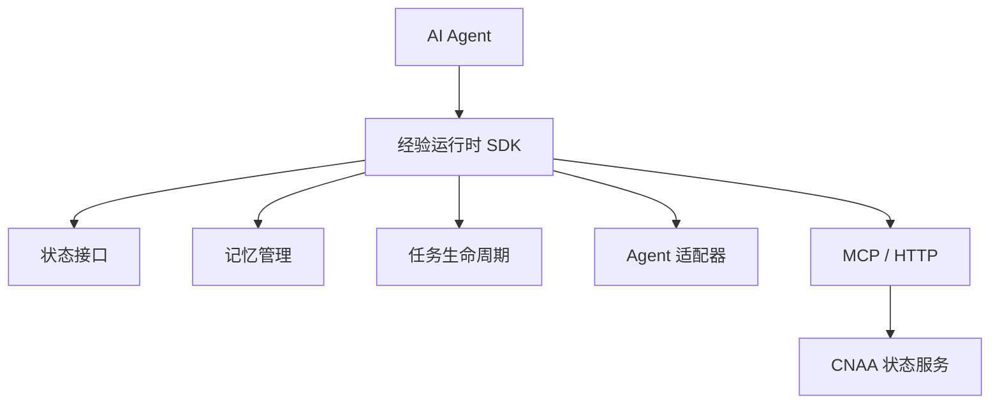
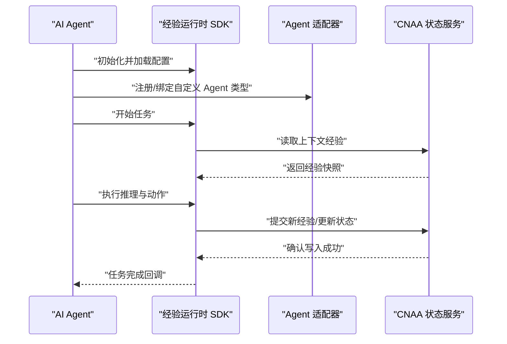
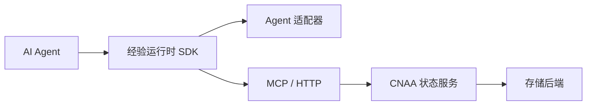

# 集成指南

<cite>
**本文引用的文件**   
- [README.md](file://README.md)
- [README_CN.md](file://README_CN.md)
</cite>

## 目录
1. [简介](#简介)
2. [项目结构](#项目结构)
3. [核心组件](#核心组件)
4. [架构总览](#架构总览)
5. [详细组件分析](#详细组件分析)
6. [依赖关系分析](#依赖关系分析)
7. [性能考虑](#性能考虑)
8. [故障排除指南](#故障排除指南)
9. [结论](#结论)
10. [附录](#附录)

## 简介
本指南面向希望在各类 AI Agent 框架中集成 CNAA（Cloud Native Agentic Architecture）的工程师与架构师。CNAA 并非 Agent 框架、工作流引擎或 RAG 实现，而是提供一套轻量级的“经验运行时”，使任意 Agent 在不修改其内部推理过程的前提下，持续沉淀、同步与复用任务经验，将经验作为独立于提示词之外的持久化资源进行管理与共享。

本指南涵盖：
- 如何将 CNAA 接入不同 Agent 框架（包括自定义 Agent 类型适配）
- 存储后端的配置与扩展（支持多种持久化方案）
- 多 Agent 经验共享的配置与使用
- 云端与本地部署的具体配置示例
- 监控、日志记录与性能调优最佳实践
- 常见集成场景的完整示例与故障排除

[无章节来源]

## 项目结构
当前仓库为文档与说明型结构，包含中英文 README 与空文档目录。该结构表明 CNAA 以“运行时 + 状态服务”的方式对外暴露能力，Agent 通过 SDK/适配器与状态服务交互，从而获得持久化记忆与跨实例的状态同步。

图表来源
- [README.md:55-73](file://README.md#L55-L73)
- [README_CN.md:63-80](file://README_CN.md#L63-L80)

章节来源
- [README.md:1-102](file://README.md#L1-L102)
- [README_CN.md:1-110](file://README_CN.md#L1-L110)

## 核心组件
根据仓库提供的架构图与特性描述，CNAA 的核心由以下部分构成：
- 经验运行时 SDK：封装与状态服务的通信、任务生命周期管理、记忆读写等能力
- 状态接口：统一的读写与查询抽象，屏蔽底层存储差异
- 记忆管理器：负责经验的序列化、去重、版本控制与检索策略
- 任务生命周期：定义任务的创建、执行、完成与清理阶段，并在关键节点触发经验写入与同步
- Agent 适配器：将不同 Agent 框架的能力映射到 CNAA 的经验运行时接口
- MCP/HTTP：与 CNAA 状态服务通信的协议通道
- CNAA 状态服务：提供高可用的经验存储、同步与共享能力

章节来源
- [README.md:55-73](file://README.md#L55-L73)
- [README_CN.md:63-80](file://README_CN.md#L63-L80)

## 架构总览
下图展示了 Agent 与 CNAA 经验运行时及状态服务之间的交互关系。Agent 无需感知底层存储细节，所有经验读写通过统一接口完成；状态服务负责跨实例的状态同步与多 Agent 经验共享。

图表来源
- [README.md:55-73](file://README.md#L55-L73)
- [README_CN.md:63-80](file://README_CN.md#L63-L80)

## 详细组件分析

### Agent 适配器开发方法
- 目标：将特定 Agent 框架的生命周期事件（如会话开始、消息处理、工具调用、结果返回）映射到 CNAA 的任务生命周期钩子，确保在合适的时机写入经验与同步状态。
- 步骤建议：
  - 定义适配器接口：明确“开始/执行/结束/错误”等钩子方法
  - 注入经验运行时 SDK：在钩子中调用状态接口进行经验读写
  - 处理并发与幂等：保证同一任务多次重试不产生重复经验
  - 错误回退：当状态服务不可用时，采用本地缓存或延迟重试策略
- 自定义 Agent 类型：
  - 通过适配器注册新的 Agent 类型，指定其输入输出模式、经验模板与同步策略
  - 为不同类型配置不同的记忆粒度与检索优先级

章节来源
- [README.md:55-73](file://README.md#L55-L73)
- [README_CN.md:63-80](file://README_CN.md#L63-L80)

### 存储后端配置与扩展
- 统一状态接口：屏蔽底层存储差异，支持键值、文档、图数据库等多种后端
- 配置项建议：
  - 连接参数（地址、认证、超时）
  - 数据模型（经验条目结构、索引字段）
  - 一致性策略（最终一致/强一致）
  - 分片与副本（水平扩展与容灾）
- 扩展方式：
  - 实现状态接口的存储驱动
  - 注册驱动到运行时，按环境选择后端
  - 提供迁移脚本与校验工具，保障数据完整性

章节来源
- [README.md:55-73](file://README.md#L55-L73)
- [README_CN.md:63-80](file://README_CN.md#L63-L80)

### 多 Agent 经验共享
- 设计要点：
  - 经验命名空间与标签：用于隔离与聚合不同 Agent 的经验
  - 权限与可见性：控制哪些 Agent 可读写哪些经验集合
  - 冲突解决：基于版本号或时间戳的策略合并
- 使用流程：
  - 发布经验：Agent 完成任务后，将经验写入共享空间
  - 订阅经验：其他 Agent 启动时拉取相关经验，构建初始上下文
  - 增量同步：仅拉取变更的经验片段，降低带宽与延迟

章节来源
- [README.md:55-73](file://README.md#L55-L73)
- [README_CN.md:63-80](file://README_CN.md#L63-L80)

### 云部署与本地部署配置示例
- 云部署：
  - 使用托管状态服务（如云原生数据库或对象存储），配置连接与鉴权
  - 启用自动扩缩容与健康检查，确保高可用
  - 配置网络策略与访问控制，限制外部访问
- 本地部署：
  - 使用容器编排（如 Docker Compose）启动状态服务与代理网关
  - 配置本地文件系统或嵌入式数据库作为存储后端
  - 设置调试端口与日志级别，便于问题定位

章节来源
- [README.md:55-73](file://README.md#L55-L73)
- [README_CN.md:63-80](file://README_CN.md#L63-L80)

### 监控、日志记录与性能调优
- 监控指标：
  - 经验写入/读取延迟与吞吐
  - 状态服务可用性（健康检查、错误率）
  - 内存与 CPU 使用率（运行时与服务端）
- 日志规范：
  - 结构化日志，包含任务 ID、经验 ID、操作类型与耗时
  - 敏感信息脱敏，避免泄露密钥与用户数据
- 性能调优：
  - 批量写入与异步提交，减少阻塞
  - 经验压缩与分页拉取，降低网络开销
  - 热点经验缓存，提升读取性能

章节来源
- [README.md:55-73](file://README.md#L55-L73)
- [README_CN.md:63-80](file://README_CN.md#L63-L80)

## 依赖关系分析
CNAA 的依赖关系清晰分层：Agent 依赖经验运行时 SDK，SDK 通过 MCP/HTTP 与状态服务通信，状态服务依赖具体存储后端。适配器位于 Agent 与 SDK 之间，屏蔽框架差异。

图表来源
- [README.md:55-73](file://README.md#L55-L73)
- [README_CN.md:63-80](file://README_CN.md#L63-L80)

章节来源
- [README.md:55-73](file://README.md#L55-L73)
- [README_CN.md:63-80](file://README_CN.md#L63-L80)

## 性能考虑
- 经验粒度：合理划分经验单元，避免过大导致序列化与传输开销
- 并发控制：使用锁或乐观并发控制，防止写冲突
- 缓存策略：对热点经验进行多级缓存（本地与分布式）
- 批处理：合并小经验为批量写入，提升吞吐
- 网络优化：使用连接池与压缩传输，降低延迟

[无章节来源]

## 故障排除指南
- 常见问题：
  - 状态服务连接失败：检查网络连通性与认证配置
  - 经验写入冲突：查看版本号与合并策略，必要时回滚
  - 性能下降：分析慢查询与热点经验，调整缓存与分片
- 诊断步骤：
  - 启用详细日志，捕获请求链路
  - 使用健康检查接口验证服务状态
  - 回放任务日志，定位异常点
- 恢复策略：
  - 自动重试与降级（本地缓存）
  - 数据修复脚本，清理不一致状态

[无章节来源]

## 结论
CNAA 通过“经验运行时 + 状态服务”的架构，为任意 Agent 提供持久化记忆与跨实例共享能力。通过适配器与统一状态接口，开发者可以无缝集成到现有 Agent 框架，并根据需求扩展存储后端与共享策略。结合监控、日志与性能调优，可在生产环境中稳定运行。

[无章节来源]

## 附录
- 快速开始：参考仓库中的文档链接，了解基础用法与配置
- 持久化记忆：深入理解经验模型与生命周期
- 状态接口：掌握统一 API 的设计与实现
- 经验运行时 SDK：学习如何在代码中集成与调用
- 状态服务：部署与运维指南
- MCP 接入：通过标准协议与状态服务通信
- Agent 接入：适配器开发与最佳实践
- 整体架构：系统设计与扩展点

章节来源
- [README.md:76-86](file://README.md#L76-L86)
- [README_CN.md:84-94](file://README_CN.md#L84-L94)