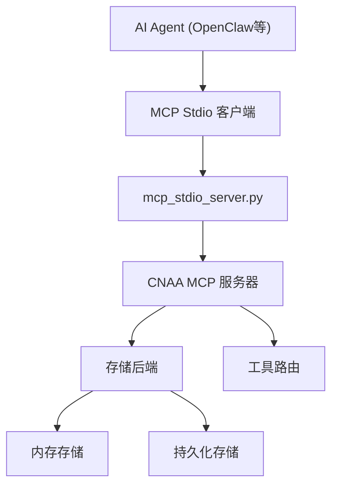
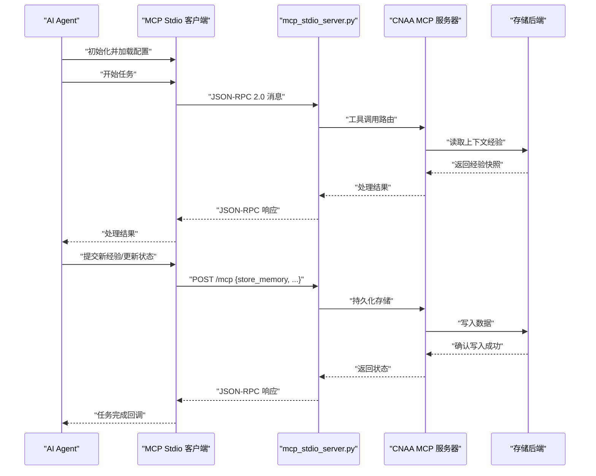
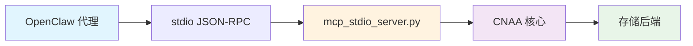
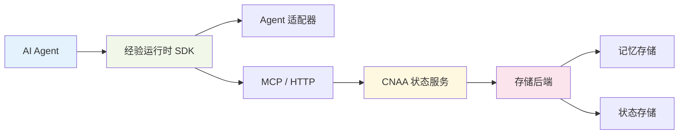

# 集成指南

<cite>
**本文引用的文件**   
- [README.md](file://README.md)
- [README_CN.md](file://README_CN.md)
- [examples/README.md](file://examples/README.md)
- [examples/openclaw_integration.py](file://examples/openclaw_integration.py)
- [mcp_stdio_server.py](file://mcp_stdio_server.py)
- [cloud/server/mcp_server.py](file://cloud/server/mcp_server.py)
- [local/client/mcp_client.py](file://local/client/mcp_client.py)
- [cnaa/tools.py](file://cnaa/tools.py)
- [cnaa/models.py](file://cnaa/models.py)
- [cnaa/schemas.py](file://cnaa/schemas.py)
- [cloud/storage/memory_store.py](file://cloud/storage/memory_store.py)
- [cloud/storage/state_store.py](file://cloud/storage/state_store.py)
- [local/agent.py](file://local/agent.py)
- [tests/test_openclaw_integration.py](file://tests/test_openclaw_integration.py)
- [server.py](file://server.py)
</cite>

## 更新摘要
**所做更改**   
- 新增 MCP stdio 集成方法的详细说明，包括 OpenClaw 集成配置和验证步骤
- 更新了架构图，清晰显示 OpenClaw 代理、MCP stdio 服务器和 CNAA 核心组件之间的通信流程
- 添加了完整的 OpenClaw 集成配置示例和工具列表
- 增强了 HTTP 集成的替代方案说明
- 新增了详细的故障排除和验证指南

## 目录
1. [简介](#简介)
2. [项目结构](#项目结构)
3. [核心组件](#核心组件)
4. [架构总览](#架构总览)
5. [详细组件分析](#详细组件分析)
6. [OpenClaw 集成框架](#openclaw-集成框架)
7. [MCP Stdio 集成方法](#mcp-stdio-集成方法)
8. [依赖关系分析](#依赖关系分析)
9. [性能考虑](#性能考虑)
10. [故障排除指南](#故障排除指南)
11. [结论](#结论)
12. [附录](#附录)

## 简介
本指南面向希望在各类 AI Agent 框架中集成 CNAA（Cloud Native Agentic Architecture）的工程师与架构师。CNAA 并非 Agent 框架、工作流引擎或 RAG 实现，而是提供一套轻量级的"经验运行时"，使任意 Agent 在不修改其内部推理过程的前提下，持续沉淀、同步与复用任务经验，将经验作为独立于提示词之外的持久化资源进行管理与共享。

本指南涵盖：
- 如何将 CNAA 接入不同 Agent 框架（包括自定义 Agent 类型适配）
- 存储后端的配置与扩展（支持多种持久化方案）
- 多 Agent 经验共享的配置与使用
- 云端与本地部署的具体配置示例
- 监控、日志记录与性能调优最佳实践
- 常见集成场景的完整示例与故障排除

**更新** 新增了完整的 MCP stdio 集成方法，为 OpenClaw 等 TypeScript 基于的 Agent 框架提供了标准化的连接能力，包括完整的配置示例和验证步骤。

[无章节来源]

## 项目结构
当前仓库实现了完整的 CNAA 架构，包含云端服务器、本地 SDK、MCP 协议支持和多个 Agent 框架的集成示例。该结构表明 CNAA 以"运行时 + 状态服务"的方式对外暴露能力，Agent 通过 SDK/适配器与状态服务交互，从而获得持久化记忆与跨实例的状态同步。



**图表来源**
- [mcp_stdio_server.py:44-63](file://mcp_stdio_server.py#L44-L63)
- [cloud/server/mcp_server.py:52-76](file://cloud/server/mcp_server.py#L52-L76)
- [examples/README.md:11-14](file://examples/README.md#L11-L14)

章节来源
- [README.md:52-96](file://README.md#L52-L96)
- [README_CN.md:52-91](file://README_CN.md#L52-L91)

## 核心组件
根据仓库提供的架构图与特性描述，CNAA 的核心由以下部分构成：
- 经验运行时 SDK：封装与状态服务的通信、任务生命周期管理、记忆读写等能力
- 状态接口：统一的读写与查询抽象，屏蔽底层存储差异
- 记忆管理器：负责经验的序列化、去重、版本控制与检索策略
- 任务生命周期：定义任务的创建、执行、完成与清理阶段，并在关键节点触发经验写入与同步
- Agent 适配器：将不同 Agent 框架的能力映射到 CNAA 的经验运行时接口
- MCP/HTTP：与 CNAA 状态服务通信的协议通道
- CNAA 状态服务：提供高可用的经验存储、同步与共享能力

**更新** 新增了完整的 MCP stdio 服务器实现，支持标准的 JSON-RPC 2.0 协议，为 OpenClaw 等框架提供标准化的集成方式。

章节来源
- [cnaa/tools.py:1-171](file://cnaa/tools.py#L1-L171)
- [cloud/server/mcp_server.py:100-136](file://cloud/server/mcp_server.py#L100-L136)
- [mcp_stdio_server.py:107-163](file://mcp_stdio_server.py#L107-L163)

## 架构总览
下图展示了 Agent 与 CNAA 经验运行时及状态服务之间的交互关系。Agent 无需感知底层存储细节，所有经验读写通过统一接口完成；状态服务负责跨实例的状态同步与多 Agent 经验共享。



**图表来源**
- [mcp_stdio_server.py:65-105](file://mcp_stdio_server.py#L65-L105)
- [cloud/server/mcp_server.py:100-136](file://cloud/server/mcp_server.py#L100-L136)
- [examples/openclaw_integration.py:43-58](file://examples/openclaw_integration.py#L43-L58)

## 详细组件分析

### Agent 适配器开发方法
- 目标：将特定 Agent 框架的生命周期事件（如会话开始、消息处理、工具调用、结果返回）映射到 CNAA 的任务生命周期钩子，确保在合适的时机写入经验与同步状态。
- 步骤建议：
  - 定义适配器接口：明确"开始/执行/结束/错误"等钩子方法
  - 注入经验运行时 SDK：在钩子中调用状态接口进行经验读写
  - 处理并发与幂等：保证同一任务多次重试不产生重复经验
  - 错误回退：当状态服务不可用时，采用本地缓存或延迟重试策略
- 自定义 Agent 类型：
  - 通过适配器注册新的 Agent 类型，指定其输入输出模式、经验模板与同步策略
  - 为不同类型配置不同的记忆粒度与检索优先级

**更新** 新增了 MCP stdio 适配器的具体实现示例，展示了如何使用标准 JSON-RPC 2.0 协议与 CNAA 服务器通信。

章节来源
- [examples/openclaw_integration.py:16-341](file://examples/openclaw_integration.py#L16-L341)
- [mcp_stdio_server.py:44-63](file://mcp_stdio_server.py#L44-L63)
- [local/agent.py:21-77](file://local/agent.py#L21-L77)

### 存储后端配置与扩展
- 统一状态接口：屏蔽底层存储差异，支持键值、文档、图数据库等多种后端
- 配置项建议：
  - 连接参数（地址、认证、超时）
  - 数据模型（经验条目结构、索引字段）
  - 一致性策略（最终一致/强一致）
  - 分片与副本（水平扩展与容灾）
- 扩展方式：
  - 实现状态接口的存储驱动
  - 注册驱动到运行时，按环境选择后端
  - 提供迁移脚本与校验工具，保障数据完整性

**更新** 提供了内存存储的完整实现，包括记忆存储和状态存储两个核心组件。

章节来源
- [cloud/storage/memory_store.py:19-156](file://cloud/storage/memory_store.py#L19-L156)
- [cloud/storage/state_store.py:18-199](file://cloud/storage/state_store.py#L18-L199)

### 多 Agent 经验共享
- 设计要点：
  - 经验命名空间与标签：用于隔离与聚合不同 Agent 的经验
  - 权限与可见性：控制哪些 Agent 可读写哪些经验集合
  - 冲突解决：基于版本号或时间戳的策略合并
- 使用流程：
  - 发布经验：Agent 完成任务后，将经验写入共享空间
  - 订阅经验：其他 Agent 启动时拉取相关经验，构建初始上下文
  - 增量同步：仅拉取变更的经验片段，降低带宽与延迟

**更新** 通过 agent_id 字段实现了多 Agent 的经验隔离与共享机制。

章节来源
- [cnaa/models.py:70-88](file://cnaa/models.py#L70-88)
- [cloud/storage/state_store.py:86-107](file://cloud/storage/state_store.py#L86-107)

### 云部署与本地部署配置示例
- 云部署：
  - 使用托管状态服务（如云原生数据库或对象存储），配置连接与鉴权
  - 启用自动扩缩容与健康检查，确保高可用
  - 配置网络策略与访问控制，限制外部访问
- 本地部署：
  - 使用容器编排（如 Docker Compose）启动状态服务与代理网关
  - 配置本地文件系统或嵌入式数据库作为存储后端
  - 设置调试端口与日志级别，便于问题定位

**更新** 提供了完整的服务器启动命令和配置示例。

章节来源
- [server.py:47-87](file://server.py#L47-L87)
- [examples/README.md:54-65](file://examples/README.md#L54-L65)

### 监控、日志记录与性能调优
- 监控指标：
  - 经验写入/读取延迟与吞吐
  - 状态服务可用性（健康检查、错误率）
  - 内存与 CPU 使用率（运行时与服务端）
- 日志规范：
  - 结构化日志，包含任务 ID、经验 ID、操作类型与耗时
  - 敏感信息脱敏，避免泄露密钥与用户数据
- 性能调优：
  - 批量写入与异步提交，减少阻塞
  - 经验压缩与分页拉取，降低网络开销
  - 热点经验缓存，提升读取性能

**更新** 新增了详细的日志记录和错误处理机制。

章节来源
- [cloud/server/mcp_server.py:129-136](file://cloud/server/mcp_server.py#L129-L136)
- [local/client/mcp_client.py:108-115](file://local/client/mcp_client.py#L108-L115)

## OpenClaw 集成框架

### 框架概述
OpenClaw 集成框架为 TypeScript 基于的 Agent 框架提供了与 CNAA Python 后端的完整连接能力。该框架实现了两种集成方式：推荐的 MCP stdio 方法和可选的 HTTP 方法。

### 核心组件
- **MCP Stdio 服务器**：基于 JSON-RPC 2.0 协议的标准化 MCP 服务器
- **HTTP 客户端**：基于 requests 库的简单 HTTP 客户端，支持所有 CNAA 操作
- **MCP 工具支持**：完整的 13 个 MCP 工具实现，包括记忆、状态、偏好和环境管理
- **测试基础设施**：完整的单元测试覆盖，支持模拟服务器响应

### 使用方法
```python
from examples.openclaw_integration import OpenClawCNAAIntegration

# 初始化集成
cnaa = OpenClawCNAAIntegration("http://localhost:8080")

# 存储经验
result = cnaa.store_memory(
    agent_id="openclaw-agent-001",
    memory_id="mem-001",
    memory_type="long_term",
    content={"task": "database migration", "result": "success"},
    tags=["database", "migration"],
    completion_score=0.95
)
```

**章节来源**
- [examples/openclaw_integration.py:16-341](file://examples/openclaw_integration.py#L16-L341)
- [tests/test_openclaw_integration.py:1-117](file://tests/test_openclaw_integration.py#L1-117)

## MCP Stdio 集成方法

### 架构概览
MCP stdio 集成方法是推荐的标准集成方式，通过 JSON-RPC 2.0 协议在 stdin/stdout 上通信，为 OpenClaw 等框架提供标准化的 MCP 服务器接口。



**图表来源**
- [examples/README.md:11-14](file://examples/README.md#L11-L14)
- [mcp_stdio_server.py:44-63](file://mcp_stdio_server.py#L44-L63)

### 配置说明
在 `~/.openclaw/openclaw.json` 中添加以下配置：

```json5
{
  mcp: {
    servers: {
      cnaa: {
        command: "python3",
        args: ["/path/to/CNAA/mcp_stdio_server.py"],
      },
    },
  },
}
```

### 可用工具（共13个）
| 类别 | 工具名称 |
|------|----------|
| 记忆 | `cnaa_store_memory`, `cnaa_get_memory`, `cnaa_list_memories`, `cnaa_tag_short_term`, `cnaa_delete_memory` |
| 状态 | `cnaa_get_state`, `cnaa_update_state`, `cnaa_delete_state` |
| 偏好 | `cnaa_get_preference`, `cnaa_update_preference`, `cnaa_delete_preference` |
| 环境 | `cnaa_get_environment`, `cnaa_update_environment` |

### 验证步骤
```bash
# 验证 OpenClaw 能否看到 CNAA 工具
openclaw mcp probe
# 预期输出：cnaa: 13 tools
```

### 工作原理
1. **初始化握手**：OpenClaw 通过 `initialize` 方法建立连接
2. **工具发现**：通过 `tools/list` 获取所有可用工具定义
3. **工具调用**：通过 `tools/call` 方法调用具体工具
4. **通知处理**：支持 `notifications/initialized` 等通知消息

**章节来源**
- [examples/README.md:16-48](file://examples/README.md#L16-L48)
- [mcp_stdio_server.py:132-143](file://mcp_stdio_server.py#L132-L143)
- [mcp_stdio_server.py:183-191](file://mcp_stdio_server.py#L183-191)

## 依赖关系分析
CNAA 的依赖关系清晰分层：Agent 依赖经验运行时 SDK，SDK 通过 MCP/HTTP 与状态服务通信，状态服务依赖具体存储后端。适配器位于 Agent 与 SDK 之间，屏蔽框架差异。



**图表来源**
- [cnaa/models.py:1-225](file://cnaa/models.py#L1-L225)
- [cloud/storage/memory_store.py:1-156](file://cloud/storage/memory_store.py#L1-L156)
- [cloud/storage/state_store.py:1-199](file://cloud/storage/state_store.py#L1-L199)

章节来源
- [cnaa/tools.py:1-210](file://cnaa/tools.py#L1-L210)
- [cloud/server/mcp_server.py:1-355](file://cloud/server/mcp_server.py#L1-L355)

## 性能考虑
- 经验粒度：合理划分经验单元，避免过大导致序列化与传输开销
- 并发控制：使用锁或乐观并发控制，防止写冲突
- 缓存策略：对热点经验进行多级缓存（本地与分布式）
- 批处理：合并小经验为批量写入，提升吞吐
- 网络优化：使用连接池与压缩传输，降低延迟

**更新** 新增了本地缓存机制和 TTL 过期策略，提升了读取性能。

## 故障排除指南
- 常见问题：
  - 状态服务连接失败：检查网络连通性与认证配置
  - 经验写入冲突：查看版本号与合并策略，必要时回滚
  - 性能下降：分析慢查询与热点经验，调整缓存与分片
- 诊断步骤：
  - 启用详细日志，捕获请求链路
  - 使用健康检查接口验证服务状态
  - 回放任务日志，定位异常点
- 恢复策略：
  - 自动重试与降级（本地缓存）
  - 数据修复脚本，清理不一致状态

**更新** 新增了 OpenClaw 集成的具体故障排除方法和测试用例。

## 结论
CNAA 通过"经验运行时 + 状态服务"的架构，为任意 Agent 提供持久化记忆与跨实例共享能力。通过适配器与统一状态接口，开发者可以无缝集成到现有 Agent 框架，并根据需求扩展存储后端与共享策略。结合监控、日志与性能调优，可在生产环境中稳定运行。

**更新** 新增的 MCP stdio 集成方法为 OpenClaw 等 TypeScript 基于的 Agent 框架提供了标准化的解决方案，包括完整的配置示例、工具列表和验证步骤。

## 附录
- 快速开始：参考仓库中的文档链接，了解基础用法与配置
- 持久化记忆：深入理解经验模型与生命周期
- 状态接口：掌握统一 API 的设计与实现
- 经验运行时 SDK：学习如何在代码中集成与调用
- 状态服务：部署与运维指南
- MCP 接入：通过标准协议与状态服务通信
- Agent 接入：适配器开发与最佳实践
- 整体架构：系统设计与扩展点

**更新** 新增了 MCP stdio 集成的完整配置示例和验证步骤。

章节来源
- [README.md:120-125](file://README.md#L120-L125)
- [README_CN.md:115-118](file://README_CN.md#L115-118)
- [examples/README.md:1-82](file://examples/README.md#L1-L82)