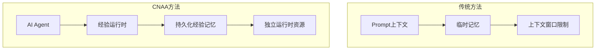
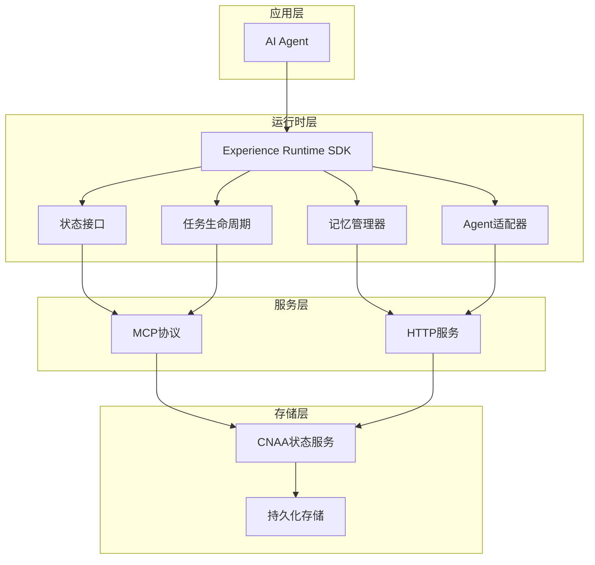
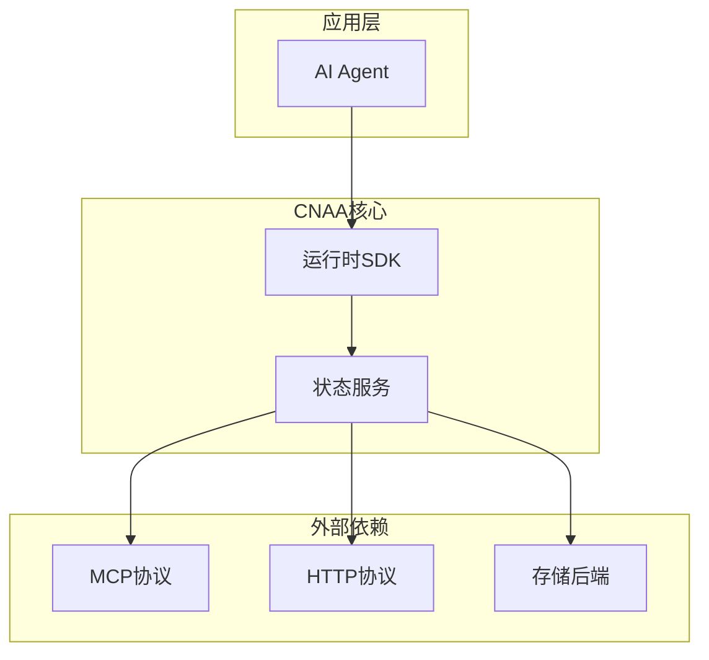

# 项目概述

<cite>
**本文档引用的文件**   
- [README.md](file://README.md)
- [README_CN.md](file://README_CN.md)
</cite>

## 目录
1. [简介](#简介)
2. [项目结构](#项目结构)
3. [核心组件](#核心组件)
4. [架构概览](#架构概览)
5. [详细组件分析](#详细组件分析)
6. [依赖关系分析](#依赖关系分析)
7. [性能考虑](#性能考虑)
8. [故障排除指南](#故障排除指南)
9. [结论](#结论)
10. [附录](#附录)

## 简介

CNAA（Cloud Native Agentic Architecture）是一个面向AI Agent的持久化记忆运行时框架。它的核心价值在于为任何AI Agent提供持续积累、同步和重用任务经验的能力，而无需修改Agent内部的推理过程。

### CNAA的独特定位

CNAA明确区分于其他AI技术：

- **不是Agent框架**：CNAA不替代现有的Agent开发框架
- **不是工作流引擎**：CNAA不负责编排复杂的业务流程
- **不是RAG实现**：CNAA专注于经验记忆而非简单的检索增强生成

### 核心理念

当前大多数AI Agent能够完成任务，但很少能够记住任务经验。传统的记忆系统通常只是扩展上下文窗口，而CNAA引入了**持久化经验记忆**的概念，使经验成为独立于Prompt的运行时资源。



**图表来源** 
- [README.md:33-41](file://README.md#L33-L41)
- [README_CN.md:41-49](file://README_CN.md#L41-L49)

**章节来源**
- [README.md:9-19](file://README.md#L9-L19)
- [README_CN.md:9-19](file://README_CN.md#L9-L19)

## 项目结构

CNAA项目采用简洁的文档驱动架构，主要包含以下组成部分：

### 目录结构
```
CNAA-Cloud-Native-Agent-Architecture/
├── docs/                    # 文档目录
│   ├── en/                  # 英文文档
│   └── zh/                  # 中文文档
├── README.md               # 英文项目说明
└── README_CN.md            # 中文项目说明
```

### 设计原则
- **轻量级设计**：专注于记忆运行时，避免功能膨胀
- **无侵入集成**：无需修改现有Agent代码
- **云原生支持**：支持云端和本地部署
- **标准化接口**：统一的State Interface规范

**章节来源**
- [README.md:1-102](file://README.md#L1-L102)
- [README_CN.md:1-110](file://README_CN.md#L1-L110)

## 核心组件

CNAA的核心价值体现在其五大特性上：

### 1. 持久化经验记忆（Persistent Experience Memory）
- 将任务经验从临时Prompt中分离出来
- 提供跨会话、跨实例的经验存储
- 支持经验的版本管理和演化

### 2. 状态同步（State Synchronization）
- 实时同步Agent运行状态
- 支持分布式环境下的状态一致性
- 提供冲突解决机制

### 3. 统一状态接口（State Interface）
- 标准化的状态访问API
- 抽象底层存储细节
- 支持多种存储后端

### 4. Agent无关设计（Agent-Agnostic）
- 兼容各种类型的AI Agent
- 无需修改Agent内部逻辑
- 提供适配器模式支持

### 5. 云原生部署（Cloud/Local Deployment）
- 支持容器化部署
- 可扩展的架构设计
- 多环境兼容性

**章节来源**
- [README.md:45-52](file://README.md#L45-L52)
- [README_CN.md:53-60](file://README_CN.md#L53-L60)

## 架构概览

CNAA采用分层架构设计，清晰分离了不同职责：



**图表来源** 
- [README.md:57-72](file://README.md#L57-L72)
- [README_CN.md:65-80](file://README_CN.md#L65-L80)

### 架构特点

1. **解耦设计**：各组件职责单一，松耦合
2. **可扩展性**：支持插件式架构
3. **高可用性**：分布式状态服务
4. **标准化**：遵循MCP等开放标准

**章节来源**
- [README.md:55-85](file://README.md#L55-L85)
- [README_CN.md:63-93](file://README_CN.md#L63-L93)

## 详细组件分析

### Experience Runtime SDK

Experience Runtime SDK是CNAA的核心运行时组件，负责协调各个子模块的工作：

#### 主要职责
- 管理Agent与持久化记忆的交互
- 处理任务生命周期的状态转换
- 协调状态同步和数据一致性
- 提供统一的API接口

#### 关键模块
- **状态接口**：定义标准的状态访问方式
- **记忆管理器**：负责经验的存储和检索
- **任务生命周期**：管理任务的创建、执行和清理
- **Agent适配器**：适配不同类型的Agent

### CNAA State Service

CNAA状态服务是整个系统的核心后端服务：

#### 功能特性
- 提供RESTful API接口
- 实现分布式状态管理
- 支持数据持久化和备份
- 提供监控和日志功能

#### 技术栈
- 支持MCP协议通信
- 兼容HTTP REST API
- 可配置的后端存储

**章节来源**
- [README.md:57-80](file://README.md#L57-L80)
- [README_CN.md:65-80](file://README_CN.md#L65-L80)

## 依赖关系分析

CNAA的依赖关系体现了清晰的层次结构：



**图表来源** 
- [README.md:57-72](file://README.md#L57-L72)

### 依赖特点
- **最小化依赖**：只依赖必要的协议和服务
- **标准化接口**：使用开放标准降低耦合度
- **可替换性**：存储后端可以灵活替换

**章节来源**
- [README.md:55-85](file://README.md#L55-L85)

## 性能考虑

CNAA在设计时充分考虑了性能优化：

### 内存管理
- 惰性加载策略，按需加载经验数据
- 缓存机制减少重复查询
- 支持内存映射提高I/O效率

### 并发控制
- 乐观锁机制处理并发更新
- 批量操作支持提高吞吐量
- 异步处理非关键路径

### 扩展性设计
- 水平扩展支持
- 负载均衡能力
- 故障自动恢复

## 故障排除指南

### 常见问题诊断

1. **连接问题**
   - 检查状态服务是否正常运行
   - 验证网络连通性和端口配置
   - 确认认证凭据正确性

2. **数据一致性问题**
   - 查看状态同步日志
   - 检查并发冲突处理
   - 验证数据完整性校验

3. **性能问题**
   - 监控内存使用情况
   - 分析数据库查询性能
   - 检查网络连接延迟

### 调试工具
- 详细的日志记录
- 性能监控指标
- 健康检查接口

## 结论

CNAA作为一个创新的AI Agent记忆运行时框架，成功解决了当前AI系统中经验无法持续积累的核心问题。通过其独特的设计理念和技术架构，CNAA为开发者提供了一个强大而灵活的解决方案。

### 主要优势
- **无侵入集成**：无需修改现有Agent代码
- **持久化记忆**：真正的跨会话经验积累
- **云原生支持**：现代化的部署和运维体验
- **标准化接口**：良好的生态兼容性

### 适用场景
- 需要长期记忆能力的对话系统
- 复杂任务规划和问题求解Agent
- 多Agent协作系统
- 企业级AI应用开发

CNAA代表了AI Agent架构的一个重要发展方向，为构建更加智能、持久的AI系统提供了坚实的基础设施。

## 附录

### 快速开始指南

1. **环境准备**
   - 安装CNAA状态服务
   - 配置存储后端
   - 设置网络访问权限

2. **集成步骤**
   - 引入Experience Runtime SDK
   - 配置状态接口
   - 实现Agent适配器

3. **部署选项**
   - 本地开发环境
   - 容器化部署
   - 云平台部署

### 相关文档
- 完整的技术文档请参考项目中的docs目录
- 示例代码和最佳实践
- 社区支持和贡献指南

**章节来源**
- [README.md:76-85](file://README.md#L76-L85)
- [README_CN.md:84-93](file://README_CN.md#L84-L93)