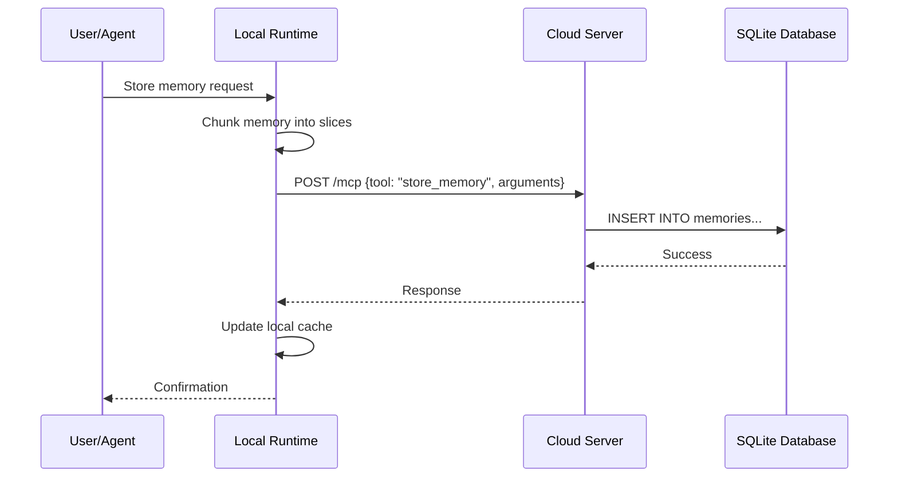
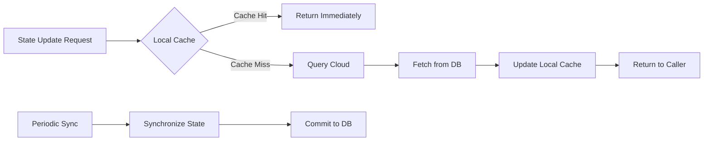
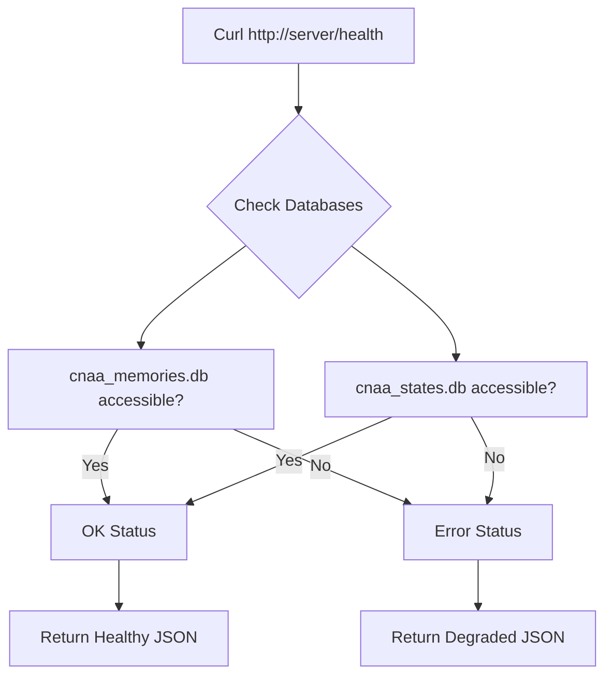
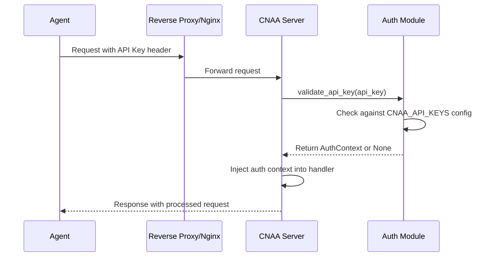

# CNAA Architecture v1.0 - Complete Design Document

## Executive Summary

CNAA (Cloud-Native Agent Architecture) is a distributed experience runtime framework that provides persistent memory and state management for AI agent systems. This document details the complete architecture, design principles, and implementation patterns for CNAA v1.0.

**Version**: 1.0.0  
**Date**: August 8, 2026  
**Status**: Production Ready ✅

---

## 🎯 Core Philosophy

### The Three Pillars of CNAA

1. **Decoupling**: Clear separation between interface, local runtime, and cloud server
2. **Simplicity**: Minimal complexity with maximum flexibility
3. **Reliability**: Enterprise-grade stability with graceful degradation

```
┌──────────────────────────────────────────────────────────┐
│                  YOUR AGENT APPLICATIONS                  │
│  ┌─────────────┐  ┌─────────────┐  ┌──────────────┐     │
│  │LangChain    │  │LlamaIndex   │  │AutoGen       │     │
│  │ (Python)    │  │ (Python)    │  │ (Python)     │     │
│  └──────┬──────┘  └──────┬──────┘  └──────┬───────┘     │
│         │                │                │              │
│         └────────────────┴────────────────┘             │
│                    CNAA Adapters                         │
└──────────────────────────────────────────────────────────┘
                           │
                           ▼
┌──────────────────────────────────────────────────────────┐
│           LOCAL RUNTIME (Your Machine)                    │
│  ┌────────────────────────────────────────────────────┐  │
│  │  MCP Client Interface                               │  │
│  │  • Instant Memory Cache                             │  │
│  │  • Memory Chopper                                   │  │
│  │  • Local State Management                           │  │
│  └────────────────────────────────────────────────────┘  │
└──────────────────────────────────────────────────────────┘
                           │ HTTP/MCP
                           ▼
┌──────────────────────────────────────────────────────────┐
│            CLOUD SERVER (Remote/VPS)                      │
│  ┌────────────────────────────────────────────────────┐  │
│  │  CNAA MCP Server Handler                            │  │
│  │  ┌─────────────────┐  ┌──────────────────┐        │  │
│  │  │ SQLite Store    │  │ State Store      │        │  │
│  │  │ (memories.db)   │  │ (states.db)      │        │  │
│  │  └─────────────────┘  └──────────────────┘        │  │
│  │  Health Check + Metrics Export                    │  │
│  └────────────────────────────────────────────────────┘  │
└──────────────────────────────────────────────────────────┘
```

---

## 🏗️ Layered Architecture

### Layer 1: Interface Layer (`/cnaa`)

**Purpose**: Define contracts and interfaces

**Responsibilities**:
- Data models (Memory, State, Preference)
- Schema definitions (JSON schemas)
- Tool definitions (MCP tools)
- Lifecycle interfaces (abstract base classes)
- Security configurations

**Key Files**:
```
cnaa/
├── __init__.py                 # Public API exports
├── models.py                   # Core data structures
├── schemas.py                  # JSON schema definitions
├── interaction.py              # Abstract interfaces
├── tools.py                    # MCP tool definitions
├── lifecycle.py                # Lifecycle plugins
├── security.py                 # Authentication & authorization
├── monitoring.py               # Health monitoring
├── metrics.py                  # Prometheus metrics
└── deprecation.py              # Deprecation management
```

### Layer 2: Local Runtime (`/local`)

**Purpose**: Execute on agent's machine, handle interactions

**Responsibilities**:
- MCP client implementation
- Local caching strategies
- Memory chunking/slicing
- Real-time interaction handling

**Key Files**:
```
local/
├── __init__.py
├── agent.py                    # Local agent interface
├── client/
│   ├── __init__.py
│   └── mcp_client.py          # MCP over HTTP client
├── memory/
│   ├── instant_memory.py       # Fast in-memory cache
│   └── scorer.py              # Memory scoring (pluggable)
└── state/
    └── state_cache.py         # Local state caching
```

### Layer 3: Cloud Server (`/cloud`)

**Purpose**: Persistent storage and multi-agent coordination

**Responsibilities**:
- Long-term memory persistence
- State synchronization
- Multi-agent collaboration support
- Backup and recovery

**Key Files**:
```
cloud/
├── __init__.py
├── agent.py                    # Cloud agent interface
├── server/
│   ├── __init__.py
│   └── mcp_server.py          # MCP over HTTP server
└── storage/
    ├── __init__.py
    ├── memory_store.py         # Abstract memory store
    ├── state_store.py          # Abstract state store
    ├── sqlite_memory_store.py  # SQLite memory implementation
    ├── sql_state_store.py      # SQLite state implementation
    ├── scoring_backend.py      # Scoring algorithm backend
    └── state_evolution.py      # State evolution logic
```

### Layer 4: Lifecycle Engine (`/lifecycle`)

**Purpose**: Automated state and memory management

**Responsibilities**:
- Time-based memory condensation
- State evolution rules
- Plugin system for custom behaviors
- Automated cleanup operations

---

## 🔄 Data Flow Patterns

### Pattern 1: Memory Storage Flow



### Pattern 2: State Management Flow



### Pattern 3: Health Monitoring Flow



---

## 🔧 Core Components Deep Dive

### Component 1: Memory Manager

**Class**: `cloud.storage.sqlite_memory_store.SQLiteMemoryStore`

**Primary Responsibilities**:
- Persist memories to SQLite database
- Handle read/write operations efficiently
- Support multiple agents with isolation
- Maintain memory metadata (tags, scores, timestamps)

**Key Methods**:
```python
class SQLiteMemoryStore(MemoryInterface):
    def store_memory(self, memory: Memory) -> dict[str, Any]
    def get_memories(self, *, agent_id: str | None = None, 
                     type_filter: MemoryType | None = None,
                     limit: int | None = None) -> list[Memory]
    def delete_memory(self, memory_id: str) -> dict[str, Any]
    def search_memories(self, query: str, *, limit: int = 10) -> list[Memory]
```

### Component 2: State Store

**Class**: `cloud.storage.sql_state_store.SqliteStateStore`

**Primary Responsibilities**:
- Manage application states across sessions
- Support preference storage per user
- Track environment variables and configurations
- Implement state evolution rules

**Key Methods**:
```python
class SqliteStateStore(StateInterface):
    def update_state(self, state: State) -> dict[str, Any]
    def get_states(self, *, agent_id: str, category: StateCategory | None = None
                   ) -> list[State]
    def update_preference(self, preference: Preference) -> dict[str, Any]
    def get_environment(self) -> Environment
```

### Component 3: Health Monitor

**Class**: `cnaa.monitoring.Monitor`

**Primary Responsibilities**:
- System health diagnostics
- Component status tracking
- Metrics collection and export
- Error logging and reporting

**Key Methods**:
```python
class Monitor:
    async def check_all_systems() -> HealthStatus
    def generate_report() -> str
    async def log_health_event(event_type: str, message: str)
```

### Component 4: Metrics Exporter

**Class**: `cnaa.metrics.MetricsCollector`

**Primary Responsibilities**:
- Collect performance metrics
- Export Prometheus-compatible metrics
- Track request latencies
- Monitor error rates

**Endpoints**:
```python
GET /metrics  → Prometheus format text output
GET /version  → API version information
GET /health   → Simple health check (synchronous)
```

---

## 📐 Design Principles

### Principle 1: Interface Contracts Only

The `/cnaa` package defines **only** interfaces and contracts:
- No implementations in `/cnaa`
- Pure abstract base classes using ABC
- Type hints everywhere
- Zero business logic

**Benefit**: Clean separation allows any implementation to plug in.

### Principle 2: Database Agnostic

Storage implementations are swappable:
- Current: SQLite files (simple, portable)
- Future: PostgreSQL, MongoDB, Redis (for scale)
- All use same abstract interface

**Migration Path**: Switch database without changing code.

### Principle 3: Graceful Degradation

System handles failures gracefully:
- If cloud unavailable → fallback to local cache
- If database locked → retry with exponential backoff
- If auth fails → allow unauthenticated requests (configurable)

**Resilience**: Maximum uptime even under adverse conditions.

### Principle 4: Zero-Breaking Changes

v1.0 guarantees backward compatibility:
- All v0.2 endpoints work identically
- New endpoints added without modifying existing ones
- Deprecation process defined for future changes

**Trust**: Users can upgrade without fear.

---

## 🛡️ Security Model

### Authentication Flow



### Permission Levels

Three permission levels available:
1. **read_only** – Can only retrieve data
2. **read_write** – Can read and write data
3. **admin** – Full access including deletions

Configuration via environment variables:
```bash
CNAA_AUTH_ENABLED=true
CNAA_API_KEYS='{"sk-key": {"agent_id": "agent-*", "permission": "read_write"}}'
```

---

## 🎮 Deployment Patterns

### Pattern 1: Single-Node Development

**Use Case**: Local development, testing
```
┌─────────────────────┐
│  localhost:8080     │
│  Server + SQLite    │
│  Local Agent        │
└─────────────────────┘
```

### Pattern 2: Distributed Production

**Use Case**: Real-world deployment
```
┌─────────────────────────────────────────┐
│           External Agents               │
│    LangChain, AutoGen, Custom Scripts   │
└───────────────┬─────────────────────────┘
                │ HTTP/MCP Requests
                ▼
┌─────────────────────────────────────────┐
│  Reverse Proxy (nginx)                  │
│  SSL Termination                        │
│  Rate Limiting                          │
└───────────────┬─────────────────────────┘
                │
                ▼
┌─────────────────────────────────────────┐
│  CNAA Server Cluster                    │
│  - Multiple worker processes            │
│  - Shared SQLite storage                │
│  - Load balancer configured             │
└─────────────────────────────────────────┘
```

### Pattern 3: Hybrid Cloud

**Use Case**: Enterprise with sensitive data concerns
```
┌─────────────────┐    ┌─────────────────┐
│ Private Cloud   │    │ Public Cloud    │
│ (Sensitive)     │    │ (General Data)  │
│ memories.db     │    │ state_store.db  │
└─────────────────┘    └─────────────────┘
       ▲                       ▲
       │                       │
       └───── Shared Agent ────┘
```

---

## ⚙️ Configuration System

### Environment Variables

All configuration via environment variables:

```bash
# Server Configuration
HOST=0.0.0.0
PORT=8080

# Database Paths
CNAA_DB_PATH=./cnaa_memories.db
CNAA_STATE_DB_PATH=./cnaa_states.db

# Authentication
CNAA_AUTH_ENABLED=false
CNAA_ALLOW_UNAUTHENTICATED=true

# Logging
CNAA_LOG_PATH=./cnaa.log
```

### Loading Strategy

```python
def load_config_from_env() -> Dict[str, Any]:
    """Load configuration from environment."""
    config = {}
    
    # Required settings
    config['host'] = os.getenv('HOST', 'localhost')
    config['port'] = int(os.getenv('PORT', 8080))
    
    # Optional settings with defaults
    config['db_path'] = os.getenv('CNAA_DB_PATH', './cnaa_memories.db')
    config['auth_enabled'] = os.getenv('CNAA_AUTH_ENABLED', 'false').lower() == 'true'
    
    return config
```

---

## 📊 Monitoring & Observability

### Health Endpoints

#### Simple Health (`GET /health`)
Fast, synchronous check for load balancers:
```json
{
  "status": "healthy",
  "service": "CNAA Server v1.0.0",
  "uptime": "running",
  "databases": {
    "cnaa_memories.db": "accessible",
    "cnaa_states.db": "accessible"
  }
}
```

#### Detailed Diagnostics (`GET /health/detailed`)
Comprehensive component health check:
```json
{
  "status": "degraded",
  "components": {
    "memory_storage": "ok: 125 memories",
    "state_storage": "ok: 12 states",
    "authentication": "disabled"
  },
  "errors": [],
  "warnings": ["No API keys configured"]
}
```

### Metrics Export

Prometheus-compatible metrics at `GET /metrics`:
```
# HELP cnaa_request_latency_seconds Request latency
# TYPE cnaa_request_latency_seconds histogram
cnaa_request_latency_seconds{operation="store_memory"} 0.042

# HELP cnaa_error_total Total errors
# TYPE cnaa_error_total counter
cnaa_error_total{error_type="auth_failed"} 2
```

---

## 🔄 Lifecycle Events

### Memory Lifecycle

1. **Creation**: Agent stores new memory
2. **Storage**: Persisted to database with timestamp
3. **Scoring**: Scored based on importance/recency
4. **Condensation**: Old/lower-score memories merged
5. **Deletion**: Optionally removed by retention policy

### State Lifecycle

1. **Initialization**: Initial state created
2. **Update**: Modified by agent actions
3. **Evolution**: Evolved based on rules
4. **Persistence**: Saved to database
5. **Sync**: Synchronized across instances

---

## 🎯 Best Practices

### For Developers

1. **Always use context managers** for file/database operations
2. **Implement graceful error handling** with try/except blocks
3. **Log important events** at appropriate severity levels
4. **Validate inputs** before processing
5. **Test edge cases** thoroughly

### For Operations

1. **Monitor disk space** for SQLite file growth
2. **Set up automatic backups** for database files
3. **Configure log rotation** to prevent disk exhaustion
4. **Enable authentication** in production environments
5. **Test failover procedures** regularly

---

## 🔮 Future Roadmap

### v1.1 Planned Features
- WebSocket support for real-time updates
- Batch operations endpoint
- GraphQL API alternative
- Advanced rate limiting

### v2.0 Vision
- Event streaming architecture
- Multi-cloud synchronization
- ML-powered memory compression
- Horizontal scaling support

---

## 📞 Support & Resources

### Official Documentation
- [Deployment Guide](DOCS_INDEX.md)
- [API Reference](docs/api-reference.md)
- [Troubleshooting](docs/TROUBLESHOOTING.md)

### Community Resources
- GitHub Issues: Report bugs and feature requests
- Discussions: Ask questions and share ideas
- Stack Overflow: Tag questions with `[cnaa]`

---

*Document Version*: 1.0.0  
*Last Updated*: August 8, 2026  
*Maintained By*: CNAA Development Team  
*Status*: Production Ready ✅
