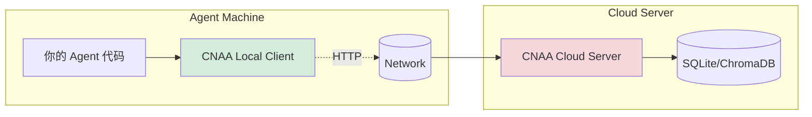

# 🏗️ CNAA Agent Adapter 工作原理详解

> **Version**: 1.0.0 | **Date**: 2026-08-06  
> **Purpose**: 深入理解 CNAA 如何适配任意 Agent 框架的完整机制

---

## 📖 目录

1. [核心设计理念](#核心设计理念)
2. [三层适配器架构](#三层适配器架构)
3. [HTTP 通信协议详解](#http-通信协议详解)
4. [Mix-in 模式实现原理](#mix-in 模式实现原理)
5. [从 Agent 到云端的完整数据流](#从 agent 到云端的完整数据流)
6. [代码执行流程图](#代码执行流程图)
7. [实际示例分析](#实际示例分析)

---

## 核心设计理念

### 🎯 三大设计原则

#### 1️⃣ **语言无关性 (Language Agnostic)**

**问题**: 传统 Agent SDK 绑定特定编程语言

```python
# ❌ 传统方式 - 只能用于 Python
class PythonOnlyClient:
    def store_memory(self, data):
        # Python-specific serialization
        pass
```

**CNAA 解决方案 - HTTP API**:

```bash
# ✅ CNAA 方式 - 任何支持 HTTP 的语言
curl -X POST http://localhost:8080/mcp \
  -H "Content-Type: application/json" \
  -d '{"tool":"cnaa_store_memory","arguments":{...}}'
```

**技术栈无关**:
- Python: `requests.post()`
- TypeScript: `fetch()` / `node-fetch`
- Go: `http.Post()`
- Java: `OkHttp` / `java.net.HttpURLConnection`
- Rust: `reqwest`
- ... 任何语言都可以！

#### 2️⃣ **纯契约层 (Pure Contract Layer)**

**问题**: 传统 SDK 包含业务逻辑，难以扩展

```python
# ❌ 传统方式 - 耦合了业务逻辑
class TraditionalAgentSDK:
    def store_memory(self, data):
        if not self.validate(data):  # 业务逻辑
            raise Error()
        result = self.process(data)   # 业务逻辑
        return self.persist(result)   # 业务逻辑
```

**CNAA 解决方案 - 仅定义接口**:

```python
# ✅ CNAA 方式 - 只做参数转换
class BaseCNAAAdapter(BaseCNAAAdapter):
    def store_memory(self, agent_id, memory_id, content, ...):
        # 1. 转换为标准格式
        config = MemoryConfig(agent_id=agent_id, ...)
        
        # 2. 调用底层客户端（无业务逻辑）
        return self._client.store_memory(**config.to_dict())
```

**优势**:
- ✅ 易于测试（只验证输入输出）
- ✅ 易于替换实现（保持接口不变）
- ✅ 易于理解（职责单一）

#### 3️⃣ **双端点分布式架构 (Two-Endpoint Distributed)**



**关键特性**:
- Agent 和 Cloud 完全独立部署
- 通过网络 HTTP 通信
- 无共享内存、无直接对象引用
- 支持跨机器、跨网络的环境

---

## 三层适配器架构

### 🏛️ 架构分层

```
┌─────────────────────────────────────────────────────┐
│                   LAYER 3                          │
│              AGENT FRAMEWORK                         │
│                                                       │
│  LangChain   LlamaIndex   AutoGen   CrewAI          │
│   ↓           ↓            ↓         ↓             │
│ ─────────────────────────────────────────────────── │
│                Mix-in Pattern                        │
│      Your Agent Class + Memory Features              │
└────────────────┬────────────────────────────────────┘
                 │ Inheritance
                 ▼
┌─────────────────────────────────────────────────────┐
│                   LAYER 2                          │
│               ADAPTER LAYER                          │
│                                                      │
│  • BaseCNAAAdapter (Abstract Base Class)           │
│  • Provides:                                       │
│    - HTTP Client wrapper                           │
│    - Configuration management                       │
│    - Lifecycle hooks                               │
│                                                      │
│  • Framework-Specific Mixins:                      │
│    - LangChainCNAAMixin                            │
│    - LlamaIndexCNAAMixin                           │
│    - AutoGencNAAAMixin                             │
│    - CrewAICNAAAMixin                              │
└────────────────┬────────────────────────────────────┘
                 │ Composition
                 ▼
┌─────────────────────────────────────────────────────┐
│                   LAYER 1                          │
│             HTTP COMMUNICATION                      │
│                                                      │
│  • Protocol: JSON-RPC over HTTP                    │
│  • Endpoint: POST /mcp                             │
│  • Format:                                           │
│    {                                                │
│      "tool": "cnaa_store_memory",                  │
│      "arguments": {...}                            │
│    }                                                 │
│                                                      │
│  • Transport: TCP/IP Network                        │
└────────────────┬────────────────────────────────────┘
                 │ Request/response
                 ▼
┌─────────────────────────────────────────────────────┐
│              CNAA CLOUD SERVER                      │
│                                                      │
│  • MCP Router                                        │
│  • Authentication Handler                            │
│  • Storage Backends                                  │
└─────────────────────────────────────────────────────┘
```

### 🔍 Layer 1: HTTP Communication Layer

**实现位置**: `local/client/mcp_client_real.py`

**职责**: 封装原始 HTTP 请求细节

```python
# ============================================================================
# FILE: local/client/mcp_client_real.py
# ============================================================================

from typing import Dict, Any, Optional

class CNAA_MCPClient:
    """
    Layer 1: HTTP Communication Layer
    
    Purpose: Handle raw HTTP requests to CNAA Cloud Server
    
    Responsibilities:
    1. Construct HTTP POST requests with JSON payload
    2. Parse HTTP response and extract JSON body
    3. Manage connection configuration (timeout, retries)
    4. Handle authentication headers
    
    Implementation Details:
    - Uses python requests library (standard HTTP client)
    - Serializes arguments to JSON automatically
    - Converts response to standard dictionary format
    """
    
    def __init__(self, server_url: str, api_key: Optional[str] = None, timeout: float = 30.0):
        """Initialize HTTP client."""
        self.server_url = server_url.rstrip('/')
        self.api_key = api_key
        self.timeout = timeout
        
        # Core HTTP session object
        self.session = requests.Session()
    
    def _make_request(self, method: str, endpoint: str, data: dict) -> Dict[str, Any]:
        """
        Make raw HTTP request to cloud server
        
        Args:
            method: HTTP method (POST, GET, DELETE)
            endpoint: API endpoint path
            data: Request payload
            
        Returns:
            Response as dictionary
            
        Example internal call:
            curl -X POST http://localhost:8080/mcp \
              -H "Content-Type: application/json" \
              -d '{"tool":"cnaa_store_memory","arguments":{...}}'
        """
        url = f"{self.server_url}{endpoint}"
        headers = {'Content-Type': 'application/json'}
        
        if self.api_key:
            headers['Authorization'] = f'Bearer {self.api_key}'
        
        response = self.session.request(
            method=method,
            url=url,
            json=data,  # ← Automatically serializes to JSON
            headers=headers,
            timeout=self.timeout
        )
        
        # Parse response
        response.raise_for_status()
        return response.json()
    
    def store_memory(self, agent_id: str, memory_id: str, content: dict, **kwargs) -> Dict[str, Any]:
        """
        Send memory storage request via HTTP
        
        Internal implementation (Layer 1 details hidden from users):
        1. Build HTTP request payload
        2. Execute HTTP POST /mcp
        3. Return parsed JSON response
        """
        request_data = {
            'tool': 'cnaa_store_memory',
            'arguments': {
                'agent_id': agent_id,
                'memory_id': memory_id,
                'type': 'long_term',
                'content': content,
                **kwargs
            }
        }
        
        return self._make_request('POST', '/mcp', request_data)
```

**关键点**:
- ✅ 完全独立的 HTTP 通信层
- ✅ 不依赖任何 Agent framework
- ✅ 可被任何语言复用

---

### 🔧 Layer 2: Adapter Layer

**实现位置**: `cnaa/adapters/*.py`

**职责**: 将 Layer 1 的通用 HTTP API 包装成 Agent-friendly 的接口

#### 2.1 BaseCNAAAdapter (Base Class)

```python
# ============================================================================
# FILE: cnaa/adapters/adapter_base.py
# ============================================================================

from abc import ABC, abstractmethod
from dataclasses import dataclass
from typing import Any, Dict, List, Optional


class BaseCNAAAdapter(ABC):
    """
    Layer 2: Adapter Base Class
    
    Purpose: Provide common infrastructure for all adapters
    
    Key Components:
    1. Initializes HTTP client (Layer 1)
    2. Defines memory/state preference operations
    3. Provides lifecycle hook interface
    
    Design Philosophy:
    - Abstract base class → Forces subclass to implement core methods
    - Concrete helper methods → Reusable across all subclasses
    """
    
    def __init__(self, cnaa_server_url: str, api_key: Optional[str] = None, timeout: float = 30.0):
        """
        Initialize adapter by creating Layer 1 HTTP client
        
        This is where dependency injection happens:
        Layer 1 (HTTP Client) → Injected into Layer 2 (Adapter)
        """
        self.cnaa_server_url = cnaa_server_url
        
        # Create HTTP client (composition of Layer 1)
        from local.client.mcp_client_real import CNAA_MCPClient
        self._client = CNAA_MCPClient(
            server_url=cnaa_server_url,
            api_key=api_key,
            timeout=timeout
        )
    
    # =========================================================================
    # Concrete Methods (Reusable across all frameworks)
    # =========================================================================
    
    def store_memory(
        self,
        agent_id: str,
        memory_id: str,
        memory_type: str,
        content: Dict[str, Any],
        tags: Optional[List[str]] = None,
        completion_score: float = 1.0,
        metadata: Optional[Dict[str, Any]] = None,
    ) -> Dict[str, Any]:
        """
        Store memory in CNAA cloud
        
        This method does TWO things:
        1. Convert parameters to MemoryConfig dataclass (data transformation)
        2. Call Layer 1 HTTP client (delegation)
        
        The actual HTTP request is made by Layer 1!
        """
        # Step 1: Convert to standard format
        from .adapter_base import MemoryType, MemoryConfig
        
        config = MemoryConfig(
            agent_id=agent_id,
            memory_id=memory_id,
            memory_type=MemoryType(memory_type),
            content=content,
            tags=tags or [],
            completion_score=completion_score,
            metadata=metadata or {},
        )
        
        # Step 2: Delegate to Layer 1
        return self._client.store_memory(**config.to_dict())
    
    # =========================================================================
    # Template Methods (Must be implemented by subclasses)
    # =========================================================================
    
    @abstractmethod
    def on_task_complete(
        self,
        agent_id: str,
        task_result: Dict[str, Any],
    ) -> None:
        """
        Called when agent task completes
        
        Each framework implements this differently based on its lifecycle:
        - LangChain: Override `_call()` method
        - LlamaIndex: Override `chat()` method  
        - AutoGen: Override `generate_reply()` method
        
        But they ALL use the SAME store_memory() implementation from BaseCNAAAdapter!
        """
        pass
    
    @abstractmethod
    def on_agent_start(self, agent_id: str) -> None:
        """Called when agent initializes"""
        pass
    
    @abstractmethod
    def on_error(self, agent_id: str, error: Exception) -> None:
        """Called when error occurs"""
        pass
```

**关键点**:
- ✅ `store_memory()` = Data transformation + HTTP delegation
- ✅ `on_task_complete()` = Hook interface (framework-specific)
- ✅ Clean separation of concerns

#### 2.2 Framework-Specific Mixin

```python
# ============================================================================
# FILE: cnaa/adapters/langchain_adapter.py
# ============================================================================

from cnaa.adapters import BaseCNAAAdapter, MemoryType


class LangChainCNAAMixin(BaseCNAAAdapter):
    """
    Layer 2 + Framework Integration
    
    Purpose: Add CNAA memory to LangChain agents
    
    Implementation Strategy:
    1. INHERIT from BaseCNAAAdapter (gets store_memory, etc.)
    2. MIX-IN pattern (no inheritance conflicts)
    3. OVERRIDE framework hooks (customize behavior)
    """
    
    def __init__(self, *args, **kwargs):
        """
        Initialize by calling BaseCNAAAdapter.__init__()
        
        This injects Layer 1 HTTP client into our LangChain agent!
        """
        super().__init__(*args, **kwargs)
        # Now we have: self._client (the HTTP client from Layer 1)
    
    def on_task_complete(
        self,
        agent_id: str,
        task_result: Dict[str, Any],
        tags=None,
        completion_score: float = 1.0,
    ):
        """
        Override lifecycle hook to customize memory storage
        
        Steps:
        1. Receive task result from LangChain agent
        2. Convert to CNAA format (using inherited store_memory)
        3. Store in CNAA cloud (uses Layer 1 HTTP client!)
        """
        if not hasattr(self, '_client') or not self._client:
            return
        
        # Use INHERITED store_memory() method!
        self.store_memory(
            agent_id=agent_id,
            memory_id=f"lc-task-{datetime.now().timestamp()}",
            memory_type=MemoryType.LONG_TERM,
            content={
                "query": getattr(self, 'last_query', 'Unknown'),
                "result": str(task_result),
            },
            tags=tags or ["langchain"],
            completion_score=completion_score,
        )
```

**继承关系图**:

```
LangChainCNAAMixin
    ↑
    └─ BaseCNAAAdapter (Layer 2)
            ↑
            └─ composition of
                └─ CNAA_MCPClient (Layer 1 - HTTP)
```

**关键点**:
- ✅ 通过继承获得通用方法
- ✅ 通过 override 定制框架行为
- ✅ 最终调用 Layer 1 发送 HTTP 请求

---

## HTTP 通信协议详解

### 📡 协议格式

**请求格式 (JSON over HTTP POST)**:

```json
POST /mcp HTTP/1.1
Host: localhost:8080
Content-Type: application/json
Authorization: Bearer <api-key>  // optional

{
  "tool": "cnaa_store_memory",
  "arguments": {
    "agent_id": "my-agent-001",
    "memory_id": "task-1234567890",
    "type": "long_term",
    "content": {
      "query": "Analyze customer data",
      "analysis": {"patterns": [...], "insights": [...]},
      "success": true
    },
    "tags": ["customer-analysis", "sales"],
    "completion_score": 0.95,
    "metadata": {
      "source": "langchain-agent",
      "version": "1.0"
    }
  }
}
```

**响应格式**:

```json
{
  "status": "ok",
  "memory_id": "task-1234567890",
  "timestamp": "2026-08-06T20:30:00Z",
  "message": "Memory stored successfully"
}
```

### 🔑 支持的 MCP Tools

| Tool | Description | Required Args | Permissions |
|------|-------------|---------------|-------------|
| `cnaa_store_memory` | Store new memory | agent_id, memory_id, type, content | write |
| `cnaa_get_memory` | Retrieve specific memory | agent_id, memory_id | read |
| `cnaa_list_memories` | List memories | agent_id, optional filters | read |
| `cnaa_delete_memory` | Delete memory | agent_id, memory_id | write |
| `cnaa_update_state` | Update knowledge state | agent_id, state_id, category, content | write |
| `cnaa_get_state` | Get all states | agent_id | read |
| `cnaa_update_preference` | Update preference | agent_id, preference_id, key, value | write |
| `cnaa_get_preference` | Get preferences | agent_id | read |
| `cnaa_get_environment` | Get environment context | agent_id | read |
| `cnaa_update_environment` | Update environment | agent_id, env_id, context | write |
| `cnaa_list_tags` | List available tags | none | read |
| `cnaa_analyze_experience` | Analyze experiences | agent_id, filters | read |
| `cnaa_recall_relevant` | Recall relevant memories | agent_id, query | read |

**完整列表在**: [`cnaa/tools.py`](file:///root/CNAA-Cloud-Native-Agent-Architecture-/cnaa/tools.py)

---

## Mix-in 模式实现原理

### 🎭 Mix-in vs 普通继承

**传统单继承限制**:

```python
# ❌ Python only allows single inheritance per parent class
class MyAgent(LangChainBase):  # Can't inherit from multiple
    pass
```

**Mix-in 解决方案**:

```python
# ✅ Mix-ins are small, focused classes designed for composition
class MemoryMixin:
    """Provides memory functionality only"""
    def store_memory(self, ...):
        pass

class LoggingMixin:
    """Provides logging functionality only"""
    def log_action(self, ...):
        pass

# Combine them!
class MyAgent(MemoryMixin, LoggingMixin, LangChainBase):
    pass
```

### 🔍 为什么 Mix-in 工作？

**原因**: Mix-in 类不包含 `__init__()` 或只包含简单 `__init__()`

```python
class LangChainCNAAMixin(BaseCNAAAdapter):
    def __init__(self, *args, **kwargs):
        # Pass everything up the chain
        super().__init__(*args, **kwargs)
        # Or do minimal setup
```

**Python MRO (Method Resolution Order)**:

```
MyAgent
  → LangChainCNAAMixin (adds memory)
  → BaseCNAAAdapter (provides HTTP client)
  → langchain.AgentExecutor (base framework)
  → object
```

---

## 从 Agent 到云端的完整数据流

### 🔄 完整生命周期

```mermaid
sequenceDiagram
    participant User
    participant Agent as Your Agent (LangChain/Llama/etc)
    mixin as CNAA Mixin
    http as HTTP Client
    server as CNAA Cloud Server
    db as Database
    
    User->>Agent: Execute task
    Agent->>mixin: on_task_complete(task_result)
    
    Note over mixin: Mixin converts task_result to CNAA format
    mixin->>http: store_memory(agent_id, memory_id, content, ...)
    
    Note over http: Constructs HTTP POST request<br/>with JSON payload
    http->>server: POST /mcp {"tool":"cnaa_store_memory",...}
    
    Note over server: Authenticates & validates request
    server->>db: INSERT memory record
    
    Note over db: Persists to SQLite/ChromaDB
    db-->>server: Success
    server-->>http: {"status":"ok", "memory_id":"..."}
    http-->>mixin: Response
    mixin-->>Agent: Done
    Agent-->>User: Task result
```

### 💻 代码执行追踪

**场景**: LangChain Agent 完成一个数据分析任务

#### Step 1: Agent 执行任务

```python
# User's code (in their agent file)
from langchain.agents import AgentExecutor

class MyDataAnalyzer(AgentExecutor):
    def process_sales(self, query: str) -> dict:
        """Analyze sales data"""
        result = self._execute(query)  # Run analysis
        return result
```

#### Step 2: Add CNAA Memory via Mix-in

```python
# Modify agent to include CNAA
from cnaa.adapters.langchain import LangChainCNAAMixin
from cnaa.adapters import MemoryType

class CNAASalesAnalyzer(LangChainCNAAMixin, AgentExecutor):
    agent_id = "sales-analyzer-001"
    
    def process_sales(self, query: str) -> dict:
        # Original logic
        result = super().process_sales(query)
        
        # NEW: Store experience in CNAA
        self.on_task_complete(
            agent_id=self.agent_id,
            task_result=result,
            tags=["sales", "analysis"],
            completion_score=0.95,
        )
        
        return result
```

#### Step 3: on_task_complete() Execution Flow

```python
# When called:
self.on_task_complete(
    agent_id="sales-analyzer-001",
    task_result={"summary": "...", "details": {...}},
    ...
)

# ↓ Inherits from BaseCNAAAdapter
def on_task_complete(self, agent_id, task_result, tags, completion_score):
    if not hasattr(self, '_client'):
        return  # No HTTP client, skip storage
    
    # ↓ Calls inherited store_memory() method
    self.store_memory(
        agent_id=agent_id,
        memory_id=f"task-{datetime.now().timestamp()}",
        memory_type=MemoryType.LONG_TERM,
        content={"query": query, "result": task_result},
        tags=tags,
        completion_score=completion_score,
    )
    
# ↓ Inside store_memory():
def store_memory(self, agent_id, memory_id, content, **kwargs):
    config = MemoryConfig(
        agent_id=agent_id,
        memory_id=memory_id,
        content=content,
        **kwargs
    )
    
    # ↓ Delegates to HTTP client (Layer 1)
    return self._client.store_memory(**config.to_dict())
```

#### Step 4: HTTP Client Sends Request

```python
# Inside CNAA_MCPClient.store_memory()
def store_memory(self, agent_id, memory_id, content, **kwargs):
    request_data = {
        'tool': 'cnaa_store_memory',
        'arguments': {
            'agent_id': agent_id,
            'memory_id': memory_id,
            'type': 'long_term',
            'content': content,
            'tags': kwargs.get('tags', []),
            'completion_score': kwargs.get('completion_score', 1.0),
        }
    }
    
    # Makes actual HTTP POST
    return self._make_request('POST', '/mcp', request_data)
```

#### Step 5: Cloud Server Receives and Stores

```python
# server.py handles the HTTP request
@app.post('/mcp')
async def handle_mcp_request(request: MCPRequest):
    # Validate tool name
    tool_name = request.tool
    
    # Look up tool handler
    handler = get_tool_handler(tool_name)
    
    # Execute handler
    result = handler(
        agent_id=request.arguments.agent_id,
        memory_id=request.arguments.memory_id,
        content=request.arguments.content,
        ...
    )
    
    return result
```

---

## 实际示例分析

### 示例 1: TypeScript Agent Integration

```typescript
// examples/cnaa_client/typescript/cnaa_client.ts
import fetch from 'node-fetch';

export class CNAAClient {
  private baseUrl: string;
  
  async storeMemory(request: {
    agentId: string;
    memoryId: string;
    type: 'long_term' | 'short_term';
    content: Record<string, any>;
    tags?: string[];
    completionScore: number;
  }) {
    // Same JSON format as Python!
    const response = await fetch(`${this.baseUrl}/mcp`, {
      method: 'POST',
      headers: {
        'Content-Type': 'application/json',
      },
      body: JSON.stringify({
        tool: 'cnaa_store_memory',
        arguments: {
          agent_id: request.agentId,
          memory_id: request.memoryId,
          type: request.type,
          content: request.content,
          tags: request.tags || [],
          completion_score: request.completionScore,
        },
      }),
    });
    
    return response.json();
  }
}
```

**关键观察**:
- ✅ TypeScript 客户端和 Python 客户端发送**完全相同的 JSON 格式**
- ✅ 无需特殊的 Python library
- ✅ 纯 HTTP 协议即可工作

---

## 🎯 总结：CNAA 适配 Agent 的核心机制

### 1️⃣ **协议标准化**
所有 Agent 使用统一的 HTTP + JSON 协议与 CNAA 交互

### 2️⃣ **分层解耦**
```
Agent Framework (your code)
       ↓
  Mix-in Adapter (our code)
       ↓
  HTTP Client (our code)
       ↓
  Cloud Server (our service)
```

### 3️⃣ **Mix-in 魔法**
通过继承添加功能，不破坏原有框架结构

### 4️⃣ **语言无关**
任何能发送 HTTP 请求的语言都可以使用 CNAA

### 5️⃣ **可扩展**
新框架只需实现简单的 Mix-in 类 (~100 行代码)

---

**这就是 CNAA 能够无缝适配任意 Agent 框架的完整秘密！** 🚀✨
