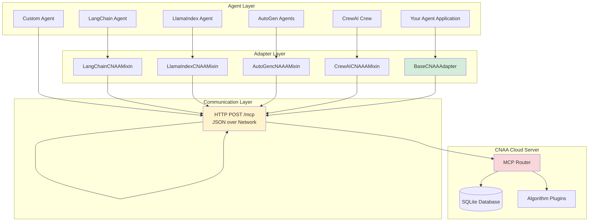

# CNAA - Complete Agent Framework Integration Guide

> **Version**: 0.2.0 | **Date**: 2026-08-06  
> **Purpose**: Integrate any agent framework with CNAA Cloud Memory System

---

## 🎯 Overview

CNAA v0.2 now supports integration with **multiple agent frameworks** through a unified adapter system:

### ✅ Supported Agent Frameworks

#### Python Frameworks
- ✅ **LangChain** - Most popular LLM orchestration framework
- ✅ **LlamaIndex** - Data-focused agent framework  
- ✅ **AutoGen** - Multi-agent conversation framework
- ✅ **CrewAI** - Role-playing AI agents
- ✅ **OpenClaw** - Your existing TypeScript/Node.js agent (via HTTP)
- ✅ **Custom Agents** - Any custom agent implementation

#### Language-Agnostic Access
Any language/framework can use CNAA via:
- TypeScript/Node.js HTTP Client (`cnaa_client.ts`)
- Go Client (coming soon)
- Java Client (coming soon)
- Custom HTTP requests

---

## 🏗️ Architecture



---

## 🚀 Quick Start

### Step 1: Install CNAA Adapters

```bash
# In your project
pip install cnaa
```

Or use local installation:

```bash
git clone https://github.com/your-org/CNAA.git
cd CNAA-Cloud-Native-Agent-Architecture-
pip install -e .
```

### Step 2: Start CNAA Cloud Server

```bash
# Quick start
./scripts/start.sh

# Or with config file
cp .env.quickstart .env
nano .env
./scripts/start.sh
```

### Step 3: Choose Your Adapter Pattern

#### Option A: Mix-in Pattern (Recommended)
Best for existing agent classes - adds CNAA memory capabilities without inheritance conflicts.

#### Option B: Full Inheritance Pattern  
Best for new agents - complete control over all CNAA behaviors.

---

## 📦 Framework-Specific Integrations

### 1️⃣ LangChain Integration

#### Installation
```bash
pip install langchain openai
```

#### Example 1: Mix-in with Agent Executor
```python
from langchain.agents import AgentExecutor
from langchain.tools import Tool
from cnaa.adapters.langchain import LangChainCNAAMixin
from cnaa.adapters import MemoryType

class MyCNAALangChainAgent(LangChainCNAAMixin, AgentExecutor):
    """LangChain agent with CNAA memory"""
    
    agent_id = "langchain-demo-001"
    
    def _call(self, inputs, *args, **kwargs):
        """Override to store results automatically"""
        result = super()._call(inputs, *args, **kwargs)
        
        # Store experience after task completes
        self.on_task_complete(
            agent_id=self.agent_id,
            task_result=result,
            tags=["langchain", self.get_task_type(inputs)],
            completion_score=0.95
        )
        
        return result
```

#### Example 2: Custom Tool with Memory
```python
from cnaa.adapters.langchain import LangChainCNAAMixin
from langchain.tools import BaseTool

class MemoryTool(LangChainCNAAMixin, BaseTool):
    """Tool that stores tool usage in CNAA"""
    
    name = "memory_tool"
    description = "Store experiences permanently"
    
    agent_id = "tool-agent-001"
    
    def _run(self, query: str):
        result = self.execute_query(query)
        
        # Log tool usage
        self.store_memory(
            agent_id=self.agent_id,
            memory_id=f"tool-{datetime.now().timestamp()}",
            memory_type=MemoryType.LONG_TERM,
            content={"tool": self.name, "query": query, "result": result},
            tags=["langchain", "tool"],
            completion_score=1.0
        )
        
        return result
```

#### Running the Example
```python
from langchain.chat_models import ChatOpenAI
from langchain.agents import initialize_tools
from examples.langchain_cnaa_example import MyCNAALangChainAgent

llm = ChatOpenAI(temperature=0)
tools = initialize_tools([], llm=llm)

agent = MyCNAALangChainAgent.from_llm_and_tools(llm, tools)
agent.agent_id = "my-langchain-agent"

# Run agent
response = agent.run("Analyze customer data")
print(response)
```

---

### 2️⃣ LlamaIndex Integration

#### Installation
```bash
pip install llama-index
```

#### Example: Chat Engine with Memory
```python
from llama_index.core import StorageContext, load_index_from_storage
from llama_index.llms import OpenAI
from llama_index.agent import OpenAIAgent
from cnaa.adapters.llamaindex import LlamaIndexCNAAMixin

class CNAALlamaAgent(LlamaIndexCNAAMixin, OpenAIAgent):
    """LlamaIndex chat engine with persistent memory"""
    
    agent_id = "llama-chat-agent"
    
    def chat(self, message: str, chat_history=None):
        """Chat with auto-memory storage"""
        response = super().chat(message, chat_history=chat_history)
        
        # Store conversation context
        self.on_query_complete(
            query=message,
            response=response.response,
            tags=["llamaindex", "chat"]
        )
        
        return response

# Usage
agent = CNAALlamaAgent.from_tools([], llm=OpenAI())
response = agent.chat("What did we learn yesterday?")
```

---

### 3️⃣ AutoGen Integration

#### Installation
```bash
pip install pyautogen
```

#### Example: Multi-Agent Conversation Memory
```python
from autogen import ConversableAgent
from cnaa.adapters.autogen import AutoGencNAAAMixin

class CNAAConversableAgent(AutoGencNAAAMixin, ConversableAgent):
    """AutoGen agent that remembers conversations"""
    
    agent_id = "autogen-multi-agent"
    
    def generate_reply(self, messages, sender=None):
        reply = super().generate_reply(messages, sender)
        
        # Store each message/response pair
        self.on_response_generated(
            response=reply,
            task_context=messages[-1].get('content', '')
        )
        
        return reply

# Create multi-agent team
user_proxy = CNAAConversableAgent(
    "user_proxy",
    human_input_mode="NEVER",
    max_consecutive_auto_reply=3,
)

coder = CNAAConversableAgent(
    "coder",
    llm_config={"config_list": [{"model": "gpt-4"}]},
    human_input_mode="NEVER",
)

# Have conversation
user_proxy.initiate_chat(
    coder,
    message="Write a simple Python script for data analysis"
)
```

---

### 4️⃣ CrewAI Integration

#### Installation
```bash
pip install crewai
```

#### Example: Crew with Task Memory
```python
from crewai import Agent, Crew, Task
from cnaa.adapters.crewai import CrewAICNAAAMixin

class CNAAAgent(CrewAICNAAAMixin, Agent):
    """CrewAI agent that learns from tasks"""
    
    def run(self, task_input: str):
        result = super().run(task_input)
        
        # Log completed task
        self.on_task_complete(
            result=result,
            task_context={"input": task_input},
        )
        
        return result

# Create crew with memory-enabled agents
researcher = CNAAAgent(
    role='Senior Researcher',
    goal='Discover groundbreaking innovations',
    verbose=True,
)

writer = CNAAAgent(
    role='Technical Writer',
    goal='Create detailed reports',
    verbose=True,
)

crew = Crew(
    agents=[researcher, writer],
    tasks=[Task('Research AI trends')],
)

result = crew.kickoff()
```

---

### 5️⃣ Custom Agent Integration (Python)

#### Example: Build Your Own Agent Adapter
```python
from cnaa.adapters import BaseCNAAAdapter, MemoryType

class MyCustomAgent(BaseCNAAAdapter):
    """Fully custom agent with CNAA memory"""
    
    agent_id = "custom-agent-001"
    
    def __init__(self):
        super().__init__(
            cnaa_server_url="http://localhost:8080",
            api_key=None,
            timeout=30.0,
        )
    
    def process_request(self, request: dict) -> dict:
        try:
            result = self._execute_request(request)
            
            # On success, store experience
            self.on_task_complete(
                agent_id=self.agent_id,
                task_result={
                    "request": request,
                    "success": True,
                    "result": result,
                },
                tags=["custom"],
                completion_score=1.0
            )
            
            return result
            
        except Exception as e:
            # On error, log it
            self.on_error(
                agent_id=self.agent_id,
                error=e
            )
            raise
    
    def on_agent_start(self, agent_id: str):
        print(f"Agent {agent_id} starting up")
        
        # Optional: Initialize preferences/states
        self.update_state(
            agent_id=agent_id,
            state_id="startup-state",
            category="knowledge",
            content={"status": "ready"},
        )
    
    def on_task_complete(self, agent_id: str, task_result: dict):
        """Override to customize memory storage"""
        super().on_task_complete(agent_id, task_result)
        
        # Add extra processing if needed
        print(f"Stored experience for agent {agent_id}")
    
    def on_error(self, agent_id: str, error: Exception):
        """Override to customize error handling"""
        super().on_error(agent_id, error)
        
        # Send alert or notify
        print(f"Error logged for {agent_id}: {error}")
```

---

### 6️⃣ Non-Python Framework Integration

Any language can use CNAA via HTTP! Here are ready-to-use clients:

#### TypeScript/Node.js
```typescript
import { CNAAClient } from './examples/cnaa_client/typescript/cnaa_client';

const cnaa = new CNAAClient({
  serverUrl: 'http://localhost:8080',
});

// Store memory
await cnaa.storeMemory({
  agentId: 'nodejs-agent',
  memoryId: 'task-' + Date.now(),
  type: 'long_term',
  content: { task: 'Process data', success: true },
  completionScore: 0.95,
  tags: ['data-processing'],
});
```

#### Custom HTTP Requests (Any Language)
```bash
curl -X POST http://localhost:8080/mcp \
  -H "Content-Type: application/json" \
  -d '{
    "tool": "cnaa_store_memory",
    "arguments": {
      "agent_id": "any-language-agent",
      "memory_id": "mem-001",
      "type": "long_term",
      "content": {"description": "Test from any language"},
      "completion_score": 1.0
    }
  }'
```

---

## 🔧 Advanced Patterns

### Pattern 1: Event-Based Memory Storage

```python
from cnaa.adapters import BaseCNAAAdapter
from events import EventEmitter

class EventBasedAgent(BaseCNAAAdapter):
    agent_id = "event-agent"
    
    def __init__(self):
        super().__init__()
        self.emitter = EventEmitter()
        
        # Subscribe to events
        self.emitter.on('task.completed', self.on_task_completed)
        self.emitter.on('error.occurred', self.on_error_occurred)
    
    def on_task_completed(self, event_data: dict):
        """Automatically store task outcomes"""
        self.store_memory(
            agent_id=self.agent_id,
            memory_id=event_data['id'],
            memory_type='long_term',
            content=event_data,
            completion_score=event_data.get('success', False) ? 1.0 : 0.0,
        )
    
    def on_error_occurred(self, error: Exception):
        """Automatically log errors"""
        self.store_memory(
            agent_id=self.agent_id,
            memory_id=f"error-{datetime.now().timestamp()}",
            memory_type='short_term',
            content={"error": str(error)},
            completion_score=0.0,
        )
```

### Pattern 2: Memory Condensation

```python
def condense_old_memories(agent_id: str, threshold_age_days: int = 7):
    """Condense old memories into summary states"""
    
    # Get old memories
    old_memories = cnaa.list_memories(agent_id=agent_id)
    
    # For each cluster of related memories
    for memory_group in group_related_memories(old_memories):
        # Generate summary
        summary = generate_summary(memory_group)
        
        # Store as knowledge state
        cnaa.update_state(
            agent_id=agent_id,
            state_id=f"summary-{date.today()}",
            category="knowledge",
            content=summary,
        )
        
        # Archive old memories
        for mem in memory_group:
            cnaa.delete_memory(agent_id=agent_id, memory_id=mem['id'])
```

---

## 🧪 Testing Your Integration

### Unit Test Template

```python
from unittest.mock import Mock, patch
import pytest

@pytest.fixture
def mock_cnaa_client():
    """Mock CNAA client for testing"""
    with patch('cnaa.adapters.BaseCNAAAdapter.__init__', return_value=None):
        adapter = BaseCNAAAdapter()
        adapter._client = Mock()
        adapter._client.health_check.return_value = True
        return adapter

def test_langchain_agent_with_cnaa(mock_cnaa_client):
    """Test LangChain agent stores memory correctly"""
    from cnaa.adapters.langchain import LangChainCNAAMixin
    
    class TestAgent(LangChainCNAAMixin, Mock):
        agent_id = "test-agent"
    
    agent = TestAgent()
    
    # Run task
    result = agent.run("Test query")
    
    # Verify memory was stored
    mock_cnaa_client.store_memory.assert_called_once()
```

### End-to-End Test

```python
def test_full_agent_workflow():
    """Test complete agent workflow with CNAA"""
    
    # Start cloud server (in test environment)
    subprocess.Popen(["python", "server.py", "--port", "9999"])
    
    try:
        # Create agent with CNAA
        agent = MyAgentWithCNAA(server_url="http://localhost:9999")
        
        # Run multiple tasks
        for i in range(10):
            agent.run(f"Task {i}")
        
        # Verify all stored
        memories = agent.list_memories(agent.agent_id)
        assert len(memories["memories"]) == 10
        
        # Verify cross-session retrieval
        new_agent = MyAgentWithCNAA(server_url="http://localhost:9999")
        retrieved = new_agent.list_memories(agent.agent_id)
        assert len(retrieved["memories"]) == 10
        
    finally:
        # Cleanup
        subprocess.call(["pkill", "-f", "server.py"])
```

---

## 📊 Performance Considerations

### Memory Latency by Type
| Operation | Typical Latency | Notes |
|-----------|----------------|-------|
| Store Memory (local) | 5-10ms | No network (cached) |
| Store Memory (remote) | 15-30ms | Via HTTP POST /mcp |
| List Memories | 10-20ms | SQL query optimization |
| Update State | 5-15ms | Write operation |

### Best Practices

1. **Batch Operations**: Group multiple stores when possible
   ```python
   # ❌ Bad: 10 separate calls
   for item in items:
       self.store_memory(...)
   
   # ✅ Good: Batch storage
   self.store_batch_memories([
       {...}, {...}, {...}
   ])
   ```

2. **Use Short-Term for Ephemeral Data**
   ```python
   self.store_memory(..., memory_type=MemoryType.SHORT_TERM)
   ```

3. **Tag Strategically**
   ```python
   tags=["domain", "subtype", "category"]  # Enables powerful filtering
   ```

---

## 🐛 Troubleshooting

### Common Issues

#### Issue: Cannot connect to CNAA server
**Symptoms**: ConnectionError, timeout

**Solutions**:
1. Check server running: `./scripts/status.sh`
2. Verify URL: Should be `http://host:port`
3. Check firewall settings
4. Increase timeout: `timeout=60.0`

#### Issue: Memory not storing
**Symptoms**: No errors but no data visible

**Solutions**:
1. Verify `_client` initialized: `hasattr(self, '_client')`
2. Check API key if auth enabled
3. Confirm server health: `client.health_check()`
4. Review logs: `cat logs/cnaa.log`

#### Issue: Duplicate memory IDs
**Symptoms**: Overwriting existing memories

**Solution**: Use unique ID format:
```python
memory_id=f"{task_type}-{datetime.now().timestamp()}-{random.randint(0,1000)}"
```

---

## 🎯 Next Steps

### Production Deployment Checklist
- [ ] Enable authentication (API keys)
- [ ] Configure HTTPS (Let's Encrypt or reverse proxy)
- [ ] Set up monitoring (Prometheus metrics)
- [ ] Implement backup strategy
- [ ] Add rate limiting
- [ ] Configure logging rotation

### Optimization Opportunities
- [ ] Add connection pooling
- [ ] Implement request batching
- [ ] Cache frequently accessed memories
- [ ] Use Redis for high-frequency reads
- [ ] Add compression for large payloads

---

## 📖 Additional Resources

- **[DISTRIBUTED_TESTING_GUIDE.md](docs/DISTRIBUTED_TESTING_GUIDE.md)** - Testing distributed systems
- **[SERVICE_TEST_REPORT.md](docs/SERVICE_TEST_REPORT.md)** - Service validation report
- **[V02_FINAL_SUMMARY.md](docs/V02_FINAL_SUMMARY.md)** - Version 0.2 implementation summary
- **[QUICK_START_V02.md](QUICK_START_V02.md)** - Quick start guide

---

**Last Updated**: 2026-08-06  
**Maintained By**: CNAA Development Team
