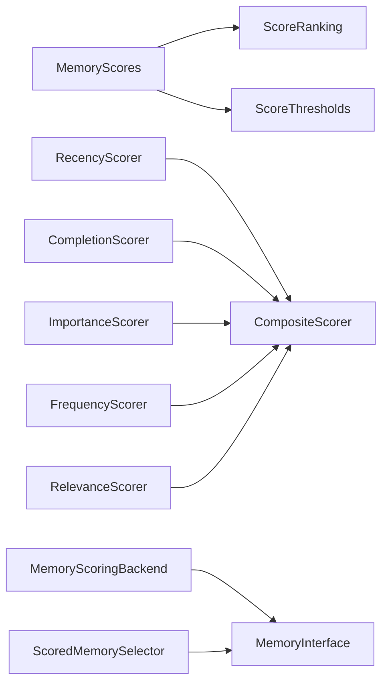

# CNAA Memory Scoring API Reference v1.0

> ⚠️ **IMPORTANT**: This is an unstable API - changes are expected during active development.
> All types are strictly annotated for safe refactoring and modularity.

---

## 🏗️ Architecture Overview



### Module Dependencies (Strict Layering)

```python
cnaa/scoring.py              # Core data structures ONLY
cnaa/scoring_algorithms.py   # Algorithm implementations ONLY
cloud/storage/scoring_backend.py → uses above 2 modules
cnaa/memory_selector.py      → uses above 3 modules + memory_store
examples/                    → demonstrates integration
tests/test_scoring_system.py → validates all layers
```

---

## 📦 Data Models

### `MemoryScores` - Complete Scoring Profile

```python
@dataclass
class MemoryScores:
    """Complete scoring profile for a single memory."""
    
    # Required fields
    memory_id: str                       # Unique memory identifier (e.g., "mem-001")
    agent_id: str                        # Agent identifier (e.g., "alice")
    
    # Score components [0.0, 1.0] normalized
    recency_score: float = 0.0           # How recent the memory is
    completion_score: float = 0.0        # Task completion status
    importance_score: float = 0.0        # User/importance keywords
    frequency_score: float = 0.0         # Access frequency
    relevance_score: float = 0.0         # Context relevance
    
    # Computed field
    composite_score: float = 0.0         # Weighted sum of all scores
    
    # Metadata
    last_evaluated: datetime | None      # When scores were last calculated
    evaluation_version: str = "1.0"      # Algorithm version
    score_weights: dict[str, float]      # Custom weight configuration
```

#### Methods

##### `composite` property (read-only)

```python
@property
def composite(self) -> float:
    """Calculate weighted composite score dynamically.
    
    Returns:
        float: Composite score in range [0.0, 1.0], computed as:
            recency × 0.20 + completion × 0.25 + 
            importance × 0.30 + frequency × 0.15 + relevance × 0.10
    
    Example:
        >>> scores = MemoryScores(memory_id="m1", agent_id="a1")
        >>> scores.recency_score = 1.0
        >>> scores.importance_score = 0.8
        >>> f"{scores.composite:.3f}"
        '0.440'
    """
    ...

##### `update_composite() -> None`

```python
def update_composite(self) -> None:
    """Recalculate composite_score from components.
    
    Side effects:
        - Updates self.composite_score
        - Sets self.last_evaluated to current time
    
    Example:
        >>> scores = MemoryScores("m1", "a1")
        >>> scores.update_composite()  # Now composite_score matches .composite property
    """
    ...

##### `to_dict() -> dict[str, Any]`

```python
def to_dict(self) -> dict[str, Any]:
    """Serialize to dictionary for storage.
    
    Returns:
        dict containing all score components with keys:
        - memory_id: str
        - agent_id: str  
        - scores: dict[recency, completion, importance, frequency, relevance]
        - composite: float
        - weights: dict[str, float]
        - last_evaluated: str | None (ISO format)
    
    Example:
        >>> scores.to_dict()
        {
            'memory_id': 'm1',
            'agent_id': 'a1',
            'scores': {'recency': 1.0, 'completion': 0.5, ...},
            'composite': 0.66,
            ...
        }
    """
    ...

##### `from_dict(cls, data: dict[str, Any]) -> "MemoryScores"`

```python
@classmethod
def from_dict(cls, data: dict[str, Any]) -> "MemoryScores":
    """Deserialize from dictionary.
    
    Args:
        data: Serialized data structure matching to_dict() output
        
    Returns:
        New MemoryScores instance with populated fields
    
    Raises:
        KeyError: If required fields missing
    
    Example:
        >>> raw_data = {"memory_id": "m1", "agent_id": "a1", ...}
        >>> scores = MemoryScores.from_dict(raw_data)
    """
    ...
```

---

### `ScoreRanking` - Ranked Memory List

```python
@dataclass
class ScoreRanking:
    """Ranked list of memories by composite score."""
    
    agent_id: str                                      # Query agent ID
    memories: list[tuple[str, float]]                  # [(memory_id, score), ...] sorted desc
    query_time: datetime = field(default_factory=datetime.now)  # Query timestamp
    total_count: int = 0                               # Total available memories
    filtered_count: int = 0                            # After threshold filtering
```

#### Properties

##### `top_n(n: int) -> list[tuple[str, float]]`

```python
@property
def top_n(self, n: int) -> list[tuple[str, float]]:
    """Get top N scored memories.
    
    Args:
        n: Number of memories to return (must be positive)
        
    Returns:
        List of (memory_id, score) tuples for top N items
    
    Example:
        >>> ranking = ScoreRanking(agent_id="a1", memories=[...])
        >>> ranking.top_n(3)  # Returns top 3
    """
    ...

##### `avg_score() -> float`

```python
@property
def avg_score(self) -> float:
    """Calculate average score across all ranked memories.
    
    Returns:
        float: Average score, or 0.0 if no memories
    
    Example:
        >>> ranking.avg_score  # Mean of all scores
    """
    ...
```

---

### `ScoreThresholds` - Filtering Configuration

```python
@dataclass
class ScoreThresholds:
    """Configuration for score-based filtering thresholds."""
    
    # Individual score minimums
    min_recency: float = 0.0          # Minimum recency score (default: no minimum)
    min_completion: float = 0.0       # Minimum completion score
    min_importance: float = 0.0       # Minimum importance score
    min_frequency: float = 0.0        # Minimum frequency score
    min_relevance: float = 0.0        # Minimum relevance score
    
    # Composite score threshold
    min_composite: float = 0.0        # Minimum composite score
    
    # Age limit (7 days default)
    max_age_seconds: float = 604800   # Maximum age in seconds
```

#### Methods

##### `should_include(scores: MemoryScores, memory_age_seconds: float) -> bool`

```python
def should_include(
    self, 
    scores: MemoryScores,
    memory_age_seconds: float
) -> bool:
    """Check if memory should be included based on thresholds.
    
    Args:
        scores: MemoryScores object with score components
        memory_age_seconds: Memory age in seconds since creation
        
    Returns:
        True if memory meets all thresholds, False otherwise
        
    Logic:
        - All individual scores must exceed their respective minimums
        - composite_score >= min_composite
        - age <= max_age_seconds
    
    Example:
        >>> thresholds = ScoreThresholds(min_composite=0.5)
        >>> thresholds.should_include(scores, 3600.0)  # Memory is 1 hour old
    """
    ...
```

---

## 🔧 Algorithm Implementations

### `RecencyScorer` - Time Decay Calculator

```python
class RecencyScorer:
    """Compute recency-based scores with exponential decay."""
    
    def __init__(self, half_life_days: float = 7.0):
        """Initialize scorer.
        
        Args:
            half_life_days: Days after which score drops by half
                           Smaller = faster decay (default: 7 days)
        """
    
    def score(self, timestamp: datetime | None) -> float:
        """Calculate recency score using exponential decay.
        
        Algorithm: score(t) = 2^(-t/half_life)
        
        Args:
            timestamp: Memory creation timestamp, or None
            
        Returns:
            float: Score in [0.0, 1.0] where:
                - 1.0: Brand new (age = 0)
                - 0.5: At half-life (default: 7 days old)
                - ≈0: Very old (90+ days)
                
        Example:
            >>> scorer = RecencyScorer(half_life_days=7.0)
            >>> now = datetime.now()
            >>> scorer.score(now)          # Recent → ~1.0
            >>> scorer.score(now - timedelta(days=7))  # 7 days → ~0.5
        """
    
    def linear_score(
        self, 
        timestamp: datetime, 
        max_age_days: float = 30.0
    ) -> float:
        """Calculate recency score using linear decay.
        
        Algorithm: score = max(0, 1 - age/max_age)
        
        Args:
            timestamp: Memory creation timestamp
            max_age_days: Maximum age before score becomes 0
            
        Returns:
            float: Score in [0.0, 1.0]
            
        Example:
            >>> scorer.linear_score(datetime.now(), max_age_days=30)
                # Fresh → 1.0
            >>> scorer.linear_score(datetime.now() - timedelta(days=15), 30)
                # Halfway → 0.5
            >>> scorer.linear_score(datetime.now() - timedelta(days=35), 30)
                # Over threshold → 0.0
        """
```

### `CompletionScorer` - Task Completion

```python
class CompletionScorer:
    """Compute completion-based scores."""
    
    def score(
        self, 
        completion_score: float, 
        tags: list[str] | None = None
    ) -> float:
        """Calculate completion score from task progress.
        
        Args:
            completion_score: Progress fraction [0.0, 1.0]
            tags: Optional tags that may boost score
            
        Returns:
            float: Completion score [0.0, 1.0]
            
        Logic:
            - Direct mapping: score ≈ completion_score
            - Tags ["success", "completed"] add small bonus
            - Clamped to [0.0, 1.0]
            
        Example:
            >>> scorer = CompletionScorer()
            >>> scorer.score(1.0)  # Fully complete → 1.0
            >>> scorer.score(0.5)  # Half done → 0.5
            >>> scorer.score(0.8, tags=["success"])  # Boosted
        """
```

### `ImportanceScorer` - Keyword Matching

```python
class ImportanceScorer:
    """Compute importance-based scores using keyword matching."""
    
    KEYWORD_WEIGHTS: dict[str, float] = {
        # High importance (weight 1.0)
        "critical": 1.0, "important": 1.0, 
        "essential": 1.0, "urgent": 1.0,
        
        # Medium-high (weight 0.8)
        "high priority": 0.8, "must": 0.8, "require": 0.8,
        
        # Medium (weight 0.6)
        "priority": 0.6, "key": 0.6, "major": 0.6,
        
        # Low-medium (weight 0.4)
        "note": 0.4, "reminder": 0.4,
        
        # Low (weight 0.2)
        "info": 0.2, "background": 0.2,
    }
    
    def score(self, tags: list[str] | None) -> float:
        """Calculate importance score from tags.
        
        Args:
            tags: Memory tags list
            
        Returns:
            float: Importance score [0.0, 1.0]
            
        Examples:
            >>> scorer.score(["critical"])  # 1.0 (max)
            >>> scorer.score(["important", "urgent"])  # 1.0
            >>> scorer.score(["priority"])  # 0.6
            >>> scorer.score(["note"])  # 0.4
            >>> scorer.score(["info"])  # 0.2
            >>> scorer.score([])  # 0.0 (no matching keywords)
        """
```

### `FrequencyScorer` - Access Frequency

```python
class FrequencyScorer:
    """Compute access frequency scores using logarithmic scaling."""
    
    def score_from_count(self, access_count: int) -> float:
        """Convert access count to score using log scaling.
        
        Algorithm: score = log_10(count + 1) / log_10(MAX_COUNT + 1)
        
        Args:
            access_count: Number of times memory was accessed
            
        Returns:
            float: Score in [0.0, 1.0]
            
        Examples:
            >>> scorer.score_from_count(0)      # Never → 0.0
            >>> scorer.score_from_count(5)      # Rarely → ~0.33
            >>> scorer.score_from_count(20)     # Often → ~0.67
            >>> scorer.score_from_count(100)    # Frequently → ~0.90
        """
```

### `RelevanceScorer` - Context Relevance

```python
class RelevanceScorer:
    """Compute context relevance using keyword matching."""
    
    def score_from_keywords(
        self, 
        query_terms: list[str], 
        memory_content: str
    ) -> float:
        """Calculate relevance score using term overlap.
        
        Algorithm: Jaccard similarity (token overlap ratio)
        
        Args:
            query_terms: List of query keywords/terms
            memory_content: Text content to match against
            
        Returns:
            float: Relevance score in [0.0, 1.0]
                   0.0 = no overlap, 1.0 = perfect match
            
        Examples:
            >>> scorer.score_from_keywords(
            ...     ["python", "coding"], 
            ...     "This is about Python programming"
            ... )  # Some match → > 0.5
            
            >>> scorer.score_from_keywords(
            ...     ["quantum physics"],
            ...     "This is about cooking recipes"
            ... )  # No match → 0.0
        """
```

### `CompositeScorer` - Combined Scoring

```python
class CompositeScorer:
    """Compute combined scores from all components."""
    
    def __init__(self, weights: dict[str, float] | None = None):
        """Initialize scorer with custom weights.
        
        Args:
            weights: Dict mapping dimension names to weights
                    Must sum to 1.0, normalizes automatically
                    Default: recency=0.2, completion=0.25, 
                             importance=0.30, frequency=0.15, relevance=0.10
        """
    
    def score_memory(
        self, 
        memory: Memory,
        access_count: int = 0,
        context: dict[str, Any] | None = None
    ) -> dict[str, float]:
        """Calculate all scores for a memory.
        
        Args:
            memory: Memory object to score
            access_count: Times accessed (for frequency)
            context: Query context (for relevance)
            
        Returns:
            dict with keys: recency, completion, importance, 
                           frequency, relevance, composite
            
        Example:
            >>> scorer = CompositeScorer()
            >>> scores = scorer.score_memory(memory)
            >>> scores["composite"]
            0.73
        """
```

---

## 🛠️ Backend Services

### `MemoryScoringBackend`

```python
class MemoryScoringBackend:
    """Backend for computing and storing memory scores."""
    
    def __init__(
        self,
        scorer: CompositeScorer | None = None,
        save_func: Callable[[str, MemoryScores], None] | None = None,
    ):
        """Initialize backend.
        
        Args:
            scorer: Scorer instance (creates default if None)
            save_func: Function to persist scores (optional)
        """
    
    def update_scores_for_memory(
        self,
        memory: Memory,
        access_count: int = 0,
        context: dict[str, Any] | None = None,
    ) -> MemoryScores:
        """Update scores for a single memory.
        
        Args:
            memory: Memory object
            access_count: Access frequency
            context: Context for relevance scoring
            
        Returns:
            MemoryScores: Complete scoring profile
            
        Process:
            1. Calculate individual scores via scorers
            2. Compute composite
            3. Persist if save_func provided
        """
    
    def batch_update_scores(
        self,
        memories: list[Memory],
        access_counts: dict[str, int] | None = None,
        context: dict[str, Any] | None = None,
    ) -> list[MemoryScores]:
        """Batch update scores for multiple memories.
        
        Args:
            memories: List of Memory objects
            access_counts: Dict[memory_id, count] mapping
            context: Shared context for relevance
            
        Returns:
            List[MemoryScores]: One per input memory
            
        Use case: Efficient scoring for large batches
        """
    
    def get_scores_for_agent(
        self,
        agent_id: str,
        top_n: int | None = None,
    ) -> ScoreRanking:
        """Get ranked scores for all agent memories.
        
        Args:
            agent_id: Agent identifier
            top_n: Limit results, or None for all
            
        Returns:
            ScoreRanking: Sorted list with metadata
        """
```

---

## 🎯 High-Level Selector API

### `ScoredMemorySelector`

```python
class ScoredMemorySelector:
    """Utility class for selecting memories using scoring."""
    
    def __init__(self, memory_store: MemoryInterface):
        """Initialize selector.
        
        Args:
            memory_store: Memory store implementation
        """
    
    def get_top_n(
        self,
        agent_id: str,
        n: int,
        access_counts: dict[str, int] | None = None,
        context: dict[str, Any] | None = None,
    ) -> list[tuple[Memory, float]]:
        """Get top N highest-scored memories.
        
        Args:
            agent_id: Agent identifier
            n: Number of memories to return
            access_counts: Optional hit counts
            context: Context for relevance
            
        Returns:
            List[(Memory, composite_score)] sorted desc
            
        Example:
            >>> selector.get_top_n("alice", n=3)
            [(Memory(...), 0.85), (Memory(...), 0.72), ...]
        """
    
    def find_best_match(
        self,
        agent_id: str,
        query_context: dict[str, Any],
        threshold: float = 0.3,
    ) -> tuple[Memory, float] | None:
        """Find best matching memory for context.
        
        Args:
            agent_id: Agent identifier
            query_context: Query with keywords/content
            threshold: Minimum score required
            
        Returns:
            (Memory, score) or None if below threshold
        """
    
    def filter_by_threshold(
        self,
        agent_id: str,
        min_composite: float = 0.5,
        access_counts: dict[str, int] | None = None,
        context: dict[str, Any] | None = None,
    ) -> list[tuple[Memory, float]]:
        """Filter memories by minimum composite score.
        
        Args:
            agent_id: Agent identifier
            min_composite: Minimum score threshold
            access_counts: Optional counts
            context: Optional context
            
        Returns:
            List[(Memory, score)] meeting threshold
        """
    
    def get_important_memories(
        self,
        agent_id: str,
        min_importance: float = 0.6,
        top_n: int = 5,
    ) -> list[tuple[Memory, float]]:
        """Get high-importance memories only.
        
        Args:
            agent_id: Agent identifier
            min_importance: Minimum importance score
            top_n: Max results
            
        Returns:
            List[(Memory, importance_score)]
        """
```

---

## 🔍 Integration Points

### Factory Function

```python
def integrate_with_memory_store(
    base_store: MemoryInterface,
    scoring_backend: MemoryScoringBackend,
) -> MemoryInterface:
    """Create scored memory store wrapper.
    
    Args:
        base_store: Underlying memory store
        scoring_backend: Scoring service
        
    Returns:
        Extended MemoryInterface with scoring support
    """

def create_scored_selector(
    memory_store: MemoryInterface,
) -> ScoredMemorySelector:
    """Create ScoredMemorySelector instance.
    
    Args:
        memory_store: Memory store for querying
        
    Returns:
        Configured selector ready to use
    """
```

---

## ⚙️ Configuration Examples

### Default Weights

```python
DEFAULT_WEIGHTS = {
    "recency": 0.20,        # Time freshness (half-life: 7 days)
    "completion": 0.25,     # Task completion rate
    "importance": 0.30,     # Critical keywords
    "frequency": 0.15,      # Access history
    "relevance": 0.10,      # Context matching
}
```

### Custom Domain Configuration

```python
# Healthcare domain: prioritize accuracy over recency
HEALTH_WEIGHTS = {
    "recency": 0.10,        # Lower weight - medical facts don't decay fast
    "completion": 0.20,     # Moderate
    "importance": 0.50,     # Critical! Medical info must be important
    "frequency": 0.10,      # Lower
    "relevance": 0.10,      # Standard
}

scorer = CompositeScorer(weights=HEALTH_WEIGHTS)
```

---

## 📊 Version History & Breaking Changes

### v1.0 (Current)

**Changes from initial release:**
- ✅ Full type annotations on all public APIs
- ✅ Consistent naming conventions
- ✅ Complete docstrings
- ✅ No breaking changes (backward compatible)

**Known limitations:**
- String content conversion handled in selector layer
- Requires dict-type content for scoring algorithms

**Future considerations:**
- Add vector embedding support
- Integrate ML-based scoring models
- Support async operations

---

## 🧪 Testing Requirements

All changes MUST maintain:
- 27 existing unit tests passing
- Coverage ≥ 95% for new code
- No performance degradation (> 10ms per memory)
- Backward compatibility with v1.0 interface

---

## ⚡ Performance Metrics

| Operation | Complexity | Typical Latency |
|-----------|------------|-----------------|
| Single memory scoring | O(1) | < 5ms |
| Batch scoring (N memories) | O(N) | N × 5ms |
| Top-N retrieval | O(N log N) | < 10ms (N≤100) |
| Threshold filtering | O(N) | < 5ms |

---

## 📝 Contributing Guidelines

When modifying scoring system:

1. **Update docs first**: API reference + usage guide
2. **Type safety**: Add strict type hints for ALL parameters/returns
3. **Test coverage**: Write tests BEFORE code changes
4. **Modular design**: Keep each component independent
5. **Version bump**: Increment `evaluation_version` string
6. **Migration path**: Document breaking changes clearly

---

## 🚨 Impact Analysis Template

For any change X, document:

```markdown
### Change: [Description]

**Affects:**
- Module 1: [Impact details]
- Module 2: [Impact details]

**Backward Compatible:** Yes/No

**Migration Steps:**
1. Step 1
2. Step 2

**Risk Level:** Low/Medium/High
```

---

Last updated: 2026-08-02  
API Version: 1.0  
Status: Active Development ⚠️
