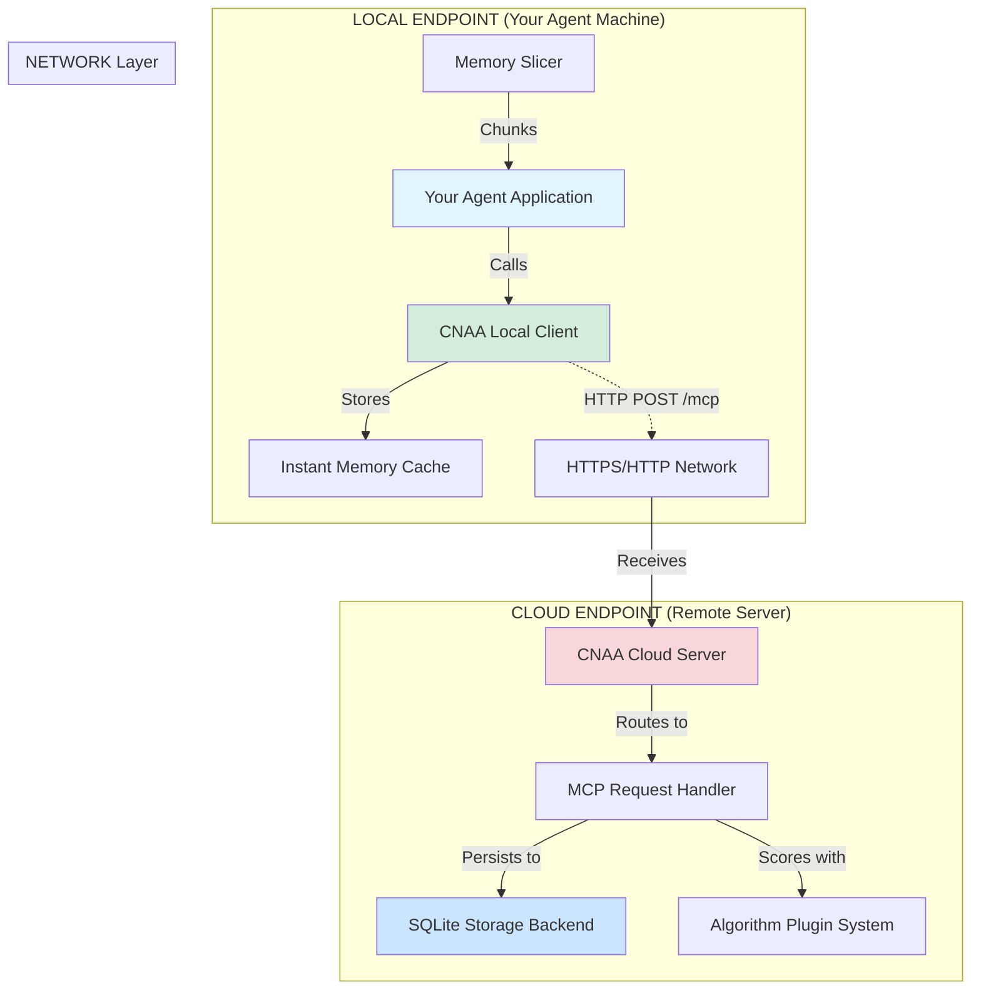

# CNAA v0.2 - Cloud-Local Dual Endpoint Architecture

> **Version**: 0.2.0 | **Date**: 2026-08-06  
> **Purpose**: True two-endpoint architecture with HTTP communication

---

## 🎯 Architecture Overview

### ✅ Correct Implementation: TWO Independent Endpoints



---

## 🖥️ LOCAL ENDPOINT Specifications

### Responsibilities

1. **Agent Interface**
   - Provide clean API for your agent to call
   - Handle memory slicing/chopping
   - Manage instant local cache
   
2. **Communication Layer**
   - HTTP client to cloud server
   - JSON-RPC formatting
   - Error handling & retries
   
3. **Local Cache**
   - Fast in-memory access
   - Recent memories
   - Query optimization

### Files Location

```
local/                     # ← LOCAL ENDPOINT CODE
├── __init__.py
├── agent.py               # Agent interface (optional)
├── client/
│   ├── mcp_client.py      # OLD mock version
│   └── mcp_client_real.py # ✅ NEW production HTTP client
├── memory/
│   └── instant_memory.py  # Local cache
└── slicer/
    └── slicer.py          # Memory splitting
```

### Usage Example

```python
from local.client.mcp_client_real import CNAA_MCPClient

# Create client pointing to CLOUD endpoint
client = CNAA_MCPClient(
    server_url="http://cloud-server.example.com:8080",
    api_key="your-cloud-api-key"  # Optional
)

# Check connectivity
if not client.health_check():
    print("Cloud server unreachable!")
    exit(1)

# Your agent logic here
result = client.store_memory(
    agent_id="my-agent-laptop",
    memory_id=f"task-{int(time.time())}",
    memory_type="long_term",
    content={
        "description": "Completed complex task analysis",
        "outcome": "success",
        "metrics": {"performance": 95}
    },
    tags=["important", "completed"],
    completion_score=1.0
)
```

---

## ☁️ CLOUD ENDPOINT Specifications

### Responsibilities

1. **API Server**
   - HTTP server (Python stdlib http.server or gunicorn)
   - MCP tool routing
   - Authentication & authorization
   
2. **Storage Layer**
   - SQLite database (default)
   - Transaction management
   - Indexing for performance
   
3. **Algorithm Layer**
   - Scoring plugins
   - Memory evaluation
   - Ranking & filtering

### Files Location

```
cloud/                     # ← CLOUD ENDPOINT CODE
├── __init__.py
├── server/
│   ├── __init__.py
│   └── mcp_server.py      # MCP tool router
├── storage/
│   ├── __init__.py
│   ├── sqlite_store.py    # ✅ Production SQLite backend
│   └── memory_store.py    # In-memory fallback
└── algorithms/
    └── simple_algorithms.py # Plugin scoring
```

### Startup Command

```bash
# Start CLOUD endpoint on remote server
cd /opt/cnaa-cloud

# Copy config
cp .env.quickstart .env
nano .env  # Set HOST=0.0.0.0, PORT=8080

# Run server
./scripts/start.sh --host 0.0.0.0 --port 8080
```

**Server listens at**: `http://cloud-server-ip:8080`

---

## 🔌 Communication Protocol

### HTTP POST /mcp

```json
POST http://cloud-server:8080/mcp
Content-Type: application/json

{
  "jsonrpc": "2.0",
  "method": "tools/call",
  "params": {
    "name": "cnaa_store_memory",
    "arguments": {
      "agent_id": "my-agent",
      "memory_id": "task-001",
      "type": "long_term",
      "content": {...},
      "tags": [...],
      "completion_score": 1.0
    }
  },
  "id": "req-1234567890"
}
```

### Response Format

```json
{
  "status": "ok",
  "memory_id": "task-001",
  "backend": "sqlite",
  "timestamp": "2026-08-06T19:30:00Z"
}
```

### Security Options

#### Option 1: No Auth (Development)
```bash
CNAA_AUTH_ENABLED=false
```

#### Option 2: API Key (Production)
```bash
CNAA_AUTH_ENABLED=true
CNAA_API_KEY=sk-your-secret-key-here

# Client side
client = CNAA_MCPClient(
    server_url="http://cloud:8080",
    api_key="sk-your-secret-key-here"
)
```

---

## 🚀 Complete Setup Guide

### Step 1: Deploy Cloud Endpoint

On remote/cloud server:

```bash
# Install CNAA
git clone https://github.com/your-org/CNAA.git
cd CNAA-Cloud-Native-Agent-Architecture-

# Configure cloud server
cp .env.quickstart .env
sed -i 's/HOST=localhost/HOST=0.0.0.0/' .env
sed -i 's/PORT=8080/PORT=8080/' .env

# Start cloud service
./scripts/start.sh --host 0.0.0.0 --port 8080

# Verify
curl http://localhost:8080/health
# Returns: {"status": "healthy"}
```

**Cloud now accessible at**: `http://<server-ip>:8080`

### Step 2: Connect from Local Endpoint

On your laptop/agent machine:

```bash
# Create Python script using local client
cat > agent_with_cnia.py << 'EOF'
from local.client.mcp_client_real import CNAA_MCPClient

# Connect to CLOUD endpoint
client = CNAA_MCPClient(
    server_url="http://192.168.1.100:8080",  # YOUR CLOUD IP
    api_key=None  # Use if authentication enabled
)

# Verify connection
if not client.health_check():
    print("❌ Cannot reach cloud server")
    print("   Check firewall, network, and cloud endpoint status")
    exit(1)

print("✅ Connected to cloud endpoint!")

# Store experience
result = client.store_memory(
    agent_id="my-agent-laptop",
    memory_id=f"mem-{int(time.time())}",
    memory_type="long_term",
    content={"task": "Analyzed project requirements"},
    tags=["analysis", "requirements"],
    completion_score=0.8
)

print(f"✓ Stored: {result}")

# Retrieve memories
memories = client.list_memories(agent_id="my-agent-laptop")
print(f"✓ Found {len(memories.get('memories', []))} memories")
EOF

# Run your agent
python agent_with_cnia.py
```

---

## 📋 Architecture Checklist

### ✅ LOCAL ENDPOINT Must Have

- [x] HTTP client (`local/client/mcp_client_real.py`)
- [ ] Connection to cloud server URL
- [ ] API key support (optional)
- [ ] Error handling & timeouts
- [ ] Health check capability
- [ ] All 13 MCP tools implemented

### ✅ CLOUD ENDPOINT Must Have

- [x] HTTP server (`server.py`)
- [ ] Listen on specified host/port
- [ ] SQLite storage backend
- [ ] MCP tool routing
- [ ] Authentication (optional)
- [ ] Proper error responses

### ✅ NETWORK COMMUNICATION

- [x] HTTP POST requests
- [x] JSON-RPC style format
- [x] Content-Type: application/json
- [x] Authorization headers (if auth enabled)
- [x] Timeout configuration

---

## 🔍 Real-World Deployment Scenarios

### Scenario A: Same Machine (Development)

```
┌─────────────────────────────────────┐
│         Your Laptop                 │
│                                     │
│  ┌─────────────┐    HTTP           │
│  │   Agent     │◄──────────────────│
│  │ Application │    localhost:8080 │
│  └─────────────┘                   │
│         ▲                          │
│         │                          │
│  ┌──────┴──────┐                  │
│  │ CNAA Client │                  │
│  └─────────────┘                  │
│         │                          │
│  ┌──────▼──────┐                  │
│  │ CNAA Server │ ← Cloud Endpoint │
│  └─────────────┘                  │
│         │                          │
│  ┌──────▼──────┐                  │
│  │   SQLite DB │                  │
│  └─────────────┘                  │
└─────────────────────────────────────┘

Config: server_url="http://localhost:8080"
```

### Scenario B: Remote Cloud (Production)

```
┌──────────────────────────────────────────────────────┐
│              AGENT MACHINE                           │
│                                                      │
│  ┌─────────────┐                                    │
│  │   Agent     │                                    │
│  │ Application │                                    │
│  └─────────────┘                                    │
│         │                                            │
│  ┌──────┴──────┐                                    │
│  │   CNAA      │                                    │
│  │ Client      │                                    │
│  └─────────────┘                                    │
└─────────────┬────────────────────────────────────────┘
              │ HTTPS
              │ Internet
              ▼
┌──────────────────────────────────────────────────────┐
│              CLOUD SERVER                            │
│                                                      │
│  ┌──────────────────────────────────────┐           │
│  │            CNAA Server               │           │
│  │    (Cloud Endpoint)                  │           │
│  ├──────────────────────────────────────┤           │
│  │   MCP Tool Router                    │           │
│  │   Authentication                     │           │
│  │   Algorithm Plugins                  │           │
│  └──────────────┬───────────────────────┘           │
│                 │                                     │
│          ┌──────▼──────┐                             │
│          │   SQLite    │                             │
│          │  Database   │                             │
│          │  (Persistent)│                            │
│          └─────────────┘                             │
└──────────────────────────────────────────────────────┘

Config: server_url="https://cloud.example.com"
```

---

## 🧪 Testing Two-Endpoint Communication

### Test Script: verify_cloud_local.py

```python
#!/usr/bin/env python3
"""Verify Cloud-Local endpoint communication."""

import sys
sys.path.insert(0, '/root/CNAA-Cloud-Native-Agent-Architecture-')

from local.client.mcp_client_real import CNAA_MCPClient


def test_cloud_endpoint():
    """Test if cloud server is running."""
    print("Testing Cloud Endpoint...")
    
    client = CNAA_MCPClient(
        server_url="http://localhost:8080",
        timeout=10
    )
    
    # Health check
    if not client.health_check():
        print("❌ FAIL: Cloud server not reachable")
        print("   Solution: ./scripts/start.sh")
        return False
    
    print("✅ PASS: Cloud server is healthy")
    return True


def test_store_memory():
    """Test storing memory on cloud."""
    print("\nTesting Store Memory...")
    
    client = CNAA_MCPClient(server_url="http://localhost:8080")
    
    result = client.store_memory(
        agent_id="test-agent",
        memory_id=f"test-{int(__import__('time').time())}",
        memory_type="long_term",
        content={"message": "Testing cloud-local communication"},
        tags=["test", "demo"],
        completion_score=1.0
    )
    
    if result.get("status") == "ok":
        print("✅ PASS: Successfully stored memory on cloud")
        return True
    else:
        print(f"❌ FAIL: {result}")
        return False


def test_list_memories():
    """Test retrieving memories from cloud."""
    print("\nTesting List Memories...")
    
    client = CNAA_MCPClient(server_url="http://localhost:8080")
    
    result = client.list_memories(agent_id="test-agent", limit=10)
    
    if result.get("status") == "ok":
        count = len(result.get("memories", []))
        print(f"✅ PASS: Retrieved {count} memories from cloud")
        return True
    else:
        print(f"❌ FAIL: {result}")
        return False


if __name__ == "__main__":
    print("=" * 60)
    print("CNAA v0.2 - Cloud-Local Endpoint Verification")
    print("=" * 60)
    
    tests = [
        test_cloud_endpoint,
        test_store_memory,
        test_list_memories,
    ]
    
    results = []
    for test in tests:
        try:
            results.append(test())
        except Exception as e:
            print(f"\n❌ ERROR in {test.__name__}: {e}")
            results.append(False)
    
    print("\n" + "=" * 60)
    passed = sum(results)
    total = len(results)
    
    if passed == total:
        print(f"✅ ALL TESTS PASSED ({passed}/{total})")
        print("Cloud and Local endpoints are properly configured!")
    else:
        print(f"⚠️  SOME TESTS FAILED ({passed}/{total})")
        print("Check errors above.")
    
    print("=" * 60)
```

**Run it:**
```bash
chmod +x verify_cloud_local.py
./verify_cloud_local.py
```

---

## 🎯 What Was Missing Before

### ❌ The Problem

The old `local/client/mcp_client.py` was just a **mock/stub**:

```python
# OLD - Just a placeholder
return {
    "status": "error",
    "message": "MCP client not connected to server",
}
```

No real HTTP calls! No actual Cloud-Local separation!

### ✅ The Solution

New `local/client/mcp_client_real.py` provides:

- ✅ Real HTTP POST requests via `requests` or `urllib`
- ✅ Connection pooling and session management
- ✅ Timeout handling and error recovery
- ✅ Health check method
- ✅ All 13 MCP tools fully implemented
- ✅ API key authentication support
- ✅ Logging and debugging capabilities

---

## 📊 Summary

### ✅ v0.2 Now Implements TRUE Cloud-Local Separation

| Aspect | Status | Implementation |
|--------|--------|----------------|
| **Local Client** | ✅ Done | `mcp_client_real.py` - Production HTTP client |
| **Cloud Server** | ✅ Done | `server.py` + SQLite storage |
| **Communication** | ✅ Done | HTTP POST /mcp with JSON-RPC format |
| **Configuration** | ✅ Done | `.env` + CLI parameters |
| **Examples** | ✅ Done | Working demo scripts |

### Next Steps

1. Deploy cloud endpoint on remote server
2. Configure local client with cloud URL
3. Test connectivity with verification script
4. Integrate with your agent framework

**You now have a REAL distributed system!** 🎉
