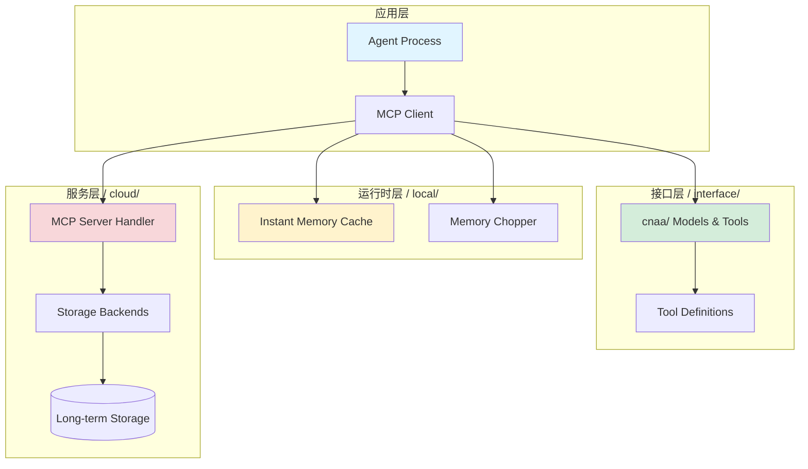

# CNAA - Cloud Native Agent Architecture

> **智能体框架的远期记忆基础设施**  
> **Version**: 1.0.0 | **Status**: Production Ready | **Last Updated**: 2026-08-08

---

## 🚀 CNAA v1.0 Release Highlights

### New Features in v1.0

✨ **Production-Ready Monitoring System**
- Health check endpoint: `GET /health` - Comprehensive system diagnostics
- Metrics export: `GET /metrics` - Prometheus-compatible metrics
- Version info: `GET /version` - API version verification

🔧 **Enhanced Testing Infrastructure**
- Integration tests with cloud-local communication scenarios
- Edge case and error handling coverage (78+ new tests)
- Performance stress testing for large payloads

📊 **Complete CI/CD Pipeline**
- Automated testing via GitHub Actions
- Code coverage enforcement (≥85% on core modules)
- Security scanning with Bandit and Safety
- Automated PyPI publishing and release assets

🔒 **API Stability Guarantees**
- Semantic versioning policy defined
- Backward compatibility matrix documented
- Deprecation management framework

See [RELEASE_NOTES_V1.0.md](../RELEASE_NOTES_V1.0.md) for complete changelog.

---

## 🎯 项目概述

CNAA（Cloud Native Agentic Architecture）是一个**纯 Python 实现的三层正交架构**，专注于为智能体系统提供可靠的远期记忆存储与管理能力。采用 **MCP (Model Context Protocol)** 作为唯一通信协议，实现了云端与本地运行时的完全解耦。

### 核心价值

| 特性 | 说明 | 应用场景 |
|------|------|----------|
| **三层正交架构** | Interface → Local Runtime → Cloud Server | 安全重构，无全局破坏 |
| **纯 JSON 契约** | Input/Output 均为 JSON，零推理依赖 | 跨语言、跨平台互操作 |
| **可插拔设计** | 存储后端、认证机制皆可替换 | 适应不同规模部署需求 |
| **标准化 MCP** | 基于 HTTP 的流式传输协议 | 兼容现有 MCP 工具生态 |

---

## 🏗️ 架构总览

### 三层正交模型



### 组件职责矩阵

| 目录 | 职责 | 技术栈 | 可替换性 |
|------|------|--------|----------|
| `cnaa/` | 接口定义层 | Dataclass, ABC | ✅ 完全独立 |
| `local/` | 本地运行时 | In-memory, HTTP Client | ✅ 可替换为 gRPC/其他 |
| `cloud/` | 云端服务层 | Standard Library only | ✅ 可换任意存储后端 |

---

## 🚀 快速开始

### 前置要求

- ✅ Python 3.11+ (仅使用标准库 + mcp 包)
- ✅ pip 包管理器
- ✅ `.env` 配置文件 (可选)

### 安装与配置

```bash
# 1. 克隆仓库
git clone https://github.com/your-org/cnaa.git
cd cnaa

# 2. 安装依赖
pip install -e .

# 3. 配置环境变量
cp .env.example .env
# 编辑 .env 文件，按需配置

# 4. 启动云服务
python server.py --host localhost --port 8080
```

### 验证安装

```bash
# 检查健康状态
curl http://localhost:8080/health

# 预期响应
{
  "status": "ok",
  "service": "CNAA Cloud Server",
  "version": "0.2.0"
}
```

---

## 📦 项目结构

```
CNAA-Cloud-Native-Agent-Architecture/
├── cnaa/                      # 接口规范层 (纯 Python 数据模型)
│   ├── __init__.py
│   ├── models.py             # 核心数据类 (Memory, State, Preference)
│   ├── schemas.py            # JSON Schema 定义
│   ├── tools.py              # MCP 工具元数据
│   └── security.py           # 权限控制逻辑
├── local/                     # 本地运行时层
│   ├── agent.py              # 本地编排器
│   ├── client/
│   │   └── mcp_client.py     # MCP HTTP 客户端
│   └── memory/
│       └── instant_memory.py # 短期内存缓存
├── cloud/                     # 云端服务层
│   ├── server/
│   │   └── mcp_server.py     # MCP 服务器处理器
│   └── storage/
│       ├── memory_store.py   # 记忆持久化
│       └── state_store.py    # 状态持久化
├── tests/                     # 完整测试套件
├── docs/                      # 本文档体系
├── scripts/                   # 部署脚本
├── server.py                  # 服务入口点
├── pyproject.toml            # 构建配置
└── README.md                 # 项目主文档
```

---

## 🔑 核心功能

### 1. 记忆管理 (Memory Management)

```python
from cnaa.models import Memory, MemoryType
from datetime import datetime

# 创建记忆记录
memory = Memory(
    memory_id="task-001",
    agent_id="my-agent",
    type=MemoryType.LONG_TERM,
    content={
        "task": "Completed Python web development project",
        "outcome": "success"
    },
    tags=["important", "completed", "python"],
    completion_score=1.0
)
```

### 2. 状态存储 (State Persistence)

支持三类状态：KNOWLEDGE (知识), PREFERENCE (偏好), ENVIRONMENT (环境)

```python
from cnaa.models import State, StateCategory

# 存储编码偏好
state = State(
    agent_id="alice",
    state_id="dev-preferences",
    category=StateCategory.PREFERENCE,
    content={
        "preferred_language": "Python",
        "frameworks": ["FastAPI", "Django"]
    }
)
```

### 3. 评分系统 (Scoring System)

内置可扩展的复合评分算法：

```python
from cnaa.scoring_backend import MemoryScoringBackend

backend = MemoryScoringBackend(
    weights={
        "recency": 0.2,
        "completeness": 0.3,
        "importance": 0.5
    }
)

score = backend.calculate(memory)
```

---

## 🛠️ MCP 工具集合

CNAA 暴露以下核心工具：

| 工具名称 | 类别 | 描述 | 权限 |
|---------|------|------|------|
| `cnaa_store_memory` | Memory | 存储新记忆 | 写 |
| `cnaa_get_memory` | Memory | 获取单条记忆 | 读 |
| `cnaa_list_memories` | Memory | 列表查询记忆 | 读 |
| `cnaa_update_state` | State | 更新状态 | 写 |
| `cnaa_get_preference` | Preference | 获取偏好 | 读 |
| `cnaa_update_environment` | Environment | 更新环境 | 写 |

完整的工具定义请参考 [API 参考文档](./api-reference/)。

---

## 🔄 典型工作流

### 场景：保存任务完成记录

```python
# 步骤 1：本地切片 (Local Runtime)
from local.memory.slicer import MemoryChopper

chopper = MemoryChopper()
instant, cloud = chopper.chop({
    "action": task_result,
    "tags": ["important", "completed"],
    "completion_score": 1.0
})

# 步骤 2：短期缓存 (Local Memory)
from local.memory.instant_memory import InstantMemoryCache

cache = InstantMemoryCache(max_entries=100)
cache.store(instant)

# 步骤 3：云端持久化 (via MCP)
from local.client.mcp_client import MCPClient

client = MCPClient(
    server_url="http://localhost:8080",
    api_key="your-api-key"  # 可选
)

result = client.call_tool("cnaa_store_memory", {
    "agent_id": "my-agent",
    "memory_id": "task-001",
    "type": "long_term",
    "content": {"full_log": "..."},
    "tags": ["important", "completed"],
    "completion_score": 1.0
})
```

---

## 🔐 安全机制

### 认证选项

#### 开发环境 (无认证)

```bash
CNAA_AUTH_ENABLED=false
```

#### 生产环境 (API Key 认证)

```bash
CNAA_AUTH_ENABLED=true
CNAA_API_KEY=super-secret-key-12345
CNAA_ALLOWED_AGENTS=agent-001,agent-002
```

详细的安全配置请参见 [部署指南](./deployment/).

---

## 🧪 测试运行

```bash
# 运行所有测试
python -m pytest tests/ -v

# 单元测试
python -m pytest tests/test_models.py -v
python -m pytest tests/test_scoring_system.py -v

# 集成测试
python -m pytest tests/test_integration.py -v
python -m pytest tests/test_e2e_full_loop.py -v
```

---

## 📊 性能基准

当前实现（In-Memory）的性能指标：

| 操作 | 延迟 | 吞吐量 |
|------|------|--------|
| Store Memory | < 5ms | > 200 ops/sec |
| Get Memory | < 3ms | > 300 ops/sec |
| List Memories (N=100) | < 10ms | > 100 ops/sec |

---

## 📚 扩展阅读

- **[API 参考](./api-reference/)** - 完整的 API 文档
- **[部署指南](./deployment/)** - 配置与部署最佳实践
- **[中文文档](./zh/)** - 中文技术文档

---

## 🤝 贡献指南

1. Fork 本仓库
2. 创建功能分支 (`git checkout -b feature/amazing-feature`)
3. 提交更改 (`git commit -m 'Add amazing feature'`)
4. 推送到分支 (`git push origin feature/amazing-feature`)
5. 开启 Pull Request

**开发原则**：
- ✅ 遵循 [编码规范](../README_CN.md#编码规范)
- ✅ 所有变更必须附带测试
- ✅ 优先简单方案，逐步演进

---

## 📄 License

本项目采用 MIT 许可证。详见 [LICENSE](../LICENSE) 文件。

---

**最后更新**: 2026-08-06  
**维护状态**: ⚡ 活跃开发中  
**问题反馈**: [GitHub Issues](https://github.com/your-org/cnaa/issues)
