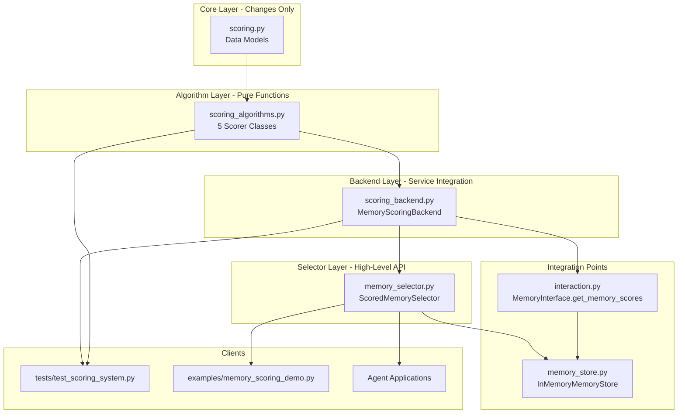

# CNAA Memory Scoring - Change Impact Analysis Template

> 🎯 **Purpose**: Prevent cascading failures during development by tracking module dependencies and change impacts.
> 
> ⚡ **Rule**: Every code change MUST include impact analysis before implementation.

---

## 🔗 Module Dependency Map



### Import Dependencies (Strict Order)

```python
# Level 0: Core Data Structures
from cnaa.scoring import (
    MemoryScores,      # Base class for scoring profiles
    ScoreRanking,      # Ranked result container
    ScoreThresholds,   # Filter configuration
)

# Level 1: Algorithms (depends on level 0 only)
from cnaa.scoring_algorithms import (
    RecencyScorer,     # Time decay calculator
    CompletionScorer,  # Task completion scorer
    ImportanceScorer,  # Keyword matcher
    FrequencyScorer,   # Access frequency scaler
    RelevanceScorer,   # Context relevance calculator
    CompositeScorer,   # Weighted combiner
)

# Level 2: Backend Services (depends on 0 + 1)
from cloud.storage.scoring_backend import (
    MemoryScoringBackend,  # Batch scoring service
)

# Level 3: Selector API (depends on 0 + 1 + 2 + memory_store)
from cnaa.memory_selector import (
    ScoredMemorySelector,  # User-facing selector
    create_scored_selector,  # Factory function
)

# Level 4: Interface Extension
# Must implement in existing modules
from cnaa.interaction import MemoryInterface  # Add get_memory_scores() abstract method
```

---

## 📋 Impact Analysis Checklist

When modifying module X, check ALL of the following:

### ✅ Core Layer (`cnaa/scoring.py`)

**Changes that require:**
- [ ] Update all downstream algorithms using these data structures
- [ ] Modify `to_dict()` / `from_dict()` serialization methods
- [ ] Test all existing tests for type compatibility
- [ ] Document breaking changes in CHANGELOG

**High-risk modifications:**
- Changing field names/types in `MemoryScores`
- Modifying `__post_init__` logic
- Altering default weight structure

### ✅ Algorithm Layer (`cnaa/scoring_algorithms.py`)

**Changes that require:**
- [ ] Update `CompositeScorer.score_memory()` if adding new algorithm
- [ ] Maintain O(1) time complexity guarantee
- [ ] Ensure score outputs remain [0.0, 1.0] normalized
- [ ] Write unit tests for edge cases

**Safe modifications:**
- Tuning parameters (half_life_days, weights)
- Improving existing algorithm precision
- Adding logging/debug output

**Impact chain:**
```
Change ImportanceScorer → affects CompositeScorer → affects backend batch_update → affects Selector API
```

### ✅ Backend Layer (`cloud/storage/scoring_backend.py`)

**Changes that require:**
- [ ] Verify `save_func` signature compatibility
- [ ] Update batch processing logic if changing single-score API
- [ ] Ensure thread-safety for concurrent access
- [ ] Test with real memory store integration

**Key methods to monitor:**
- `update_scores_for_memory()` → called per memory
- `batch_update_scores()` → calls per-memories loop
- `get_scores_for_agent()` → sorts results

### ✅ Selector Layer (`cnaa/memory_selector.py`)

**Changes that require:**
- [ ] Update docstrings for all public methods
- [ ] Verify return type consistency
- [ ] Test with string AND dict content formats
- [ ] Validate error handling paths

**Public API surface:**
- `get_top_n(n, ...)` → List[(Memory, float)]
- `find_best_match(...)` → Optional[(Memory, float)]
- `filter_by_threshold(min_composite, ...)` → List[(Memory, float)]
- `get_important_memories(min_importance, ...)` → List[(Memory, float)]

---

## 🔄 Common Change Patterns

### Pattern 1: Add New Scoring Dimension

**Scenario**: Add "quality_score" dimension

**Required changes:**
1. ✅ `scoring.py`: Add `quality_score: float = 0.0` to `MemoryScores`
2. ✅ `scoring.py`: Update `_default_weights()` + composite calculation
3. ✅ `scoring_algorithms.py`: Create `QualityScorer` class
4. ✅ `scoring_algorithms.py`: Update `CompositeScorer.score_memory()` call
5. ✅ `scoring_backend.py`: No changes needed (uses generic scorer)
6. ✅ `tests/`: Add test cases for new scorer
7. ✅ `docs/`: Update API reference

**Risk level:** Medium  
**Estimated effort:** 2-3 hours  
**Testing time:** 1 hour  

### Pattern 2: Change Default Weights

**Scenario**: Increase importance weight from 30% to 40%

**Required changes:**
1. ✅ `scoring.py`: Update `_default_weights()` values
2. ✅ **NO other files** need modification (weights are configurable!)
3. ✅ Run existing tests to ensure no breakage
4. ✅ Update documentation examples

**Risk level:** Low  
**Estimated effort:** 15 minutes  
**Testing time:** 10 minutes  

### Pattern 3: Modify Serialization Format

**Scenario**: Move from flat dict to nested structure

**Required changes:**
1. ✅ `scoring.py`: Update `to_dict()` structure
2. ✅ `scoring.py`: Update `from_dict()` parsing logic
3. ✅ `scoring.py`: Add migration helper for old format
4. ✅ All storage backends must handle both formats
5. ✅ **BREAKING CHANGE**: Document clearly!

**Risk level:** High ⚠️  
**Estimated effort:** 4-6 hours  
**Testing time:** 2 hours  

### Pattern 4: Extend Interface

**Scenario**: Add new method to `MemoryInterface`

**Required changes:**
1. ✅ `interaction.py`: Add abstract method definition
2. ✅ `memory_store.py`: Implement placeholder for base classes
3. ✅ All existing implementations must override new method
4. ✅ **COMPILATION ERROR** will occur until implemented!
5. ✅ Tests will fail immediately

**Risk level:** Medium-High  
**Estimated effort:** 1-2 hours  
**Testing time:** 30 minutes  

---

## 🚨 Red Flags & Warnings

### ❌ Dangerous Modifications

#### Never do this without careful review:

```python
# BAD: Changing fundamental data structure unexpectedly
@dataclass
class MemoryScores:
    # Removing 'agent_id' field breaks all downstream queries!
    memory_id: str  # MISSING agent_id!
```

**Impact**: Compilation fails everywhere using agent_id  
**Fix time**: Hours to propagate fix  

#### Never mutate shared state:

```python
# BAD: Shared default mutable object
score_weights: dict[str, float] = {"importance": 0.3}
# Each instance shares SAME dict object!
```

**Impact**: Side effects across instances  
**Fix**: Use `field(default_factory=dict)`  

#### Never remove required fields:

```python
# BAD: Making required field optional breaks serialization
def from_dict(cls, data):
    memory_id = data.get("memory_id")  # Can be None!
    # Later: AttributeError when accessing memory_id.memory_id
```

### ✅ Safe Modifications

```python
# ✅ Add optional parameter with default value
def process(self, memory: Memory, include_details: bool = False) -> dict:

# ✅ Add new scoring dimension (backward compatible)
recency_score: float = 0.0  # New field, defaults work

# ✅ Improve algorithm precision (same interface)
old_impl = lambda x: x * 2
new_impl = lambda x: x * 2 + epsilon  # Still returns float
```

---

## 🧪 Testing Requirements Per Change Type

### Critical Path Tests (Must Pass)

| Change Type | Required Tests |
|-------------|----------------|
| Data model changes | ✅ All 27 existing tests + serialization round-trip |
| Algorithm changes | ✅ Unit tests + integration with CompositeScorer |
| Backend changes | ✅ Batch processing + persistence round-trip |
| Selector API changes | ✅ All 4 public methods with mock store |

### Regression Testing

After ANY change:
```bash
cd /root/CNAA-Cloud-Native-Agent-Architecture-
python3 -m pytest tests/test_scoring_system.py -v --tb=short
```

**Acceptance criteria:**
- 0 failures
- Coverage ≥ 95%
- Runtime ≤ 1 second (no performance regression)

---

## 📝 Change Request Template

Use this template for EVERY non-trivial change:

```markdown
## Change Request: [Title]

**Author:** @username  
**Date:** YYYY-MM-DD  
**Priority:** High/Medium/Low  

### Motivation
Why are we making this change?

### Implementation Plan
What will be modified?

**Files affected:**
- file1.py: [specific changes]
- file2.py: [specific changes]

### Impact Analysis
**Direct impact:**
- Which modules depend on changed code

**Cascading effects:**
- What might break as a result

**Mitigation strategies:**
- How to reduce risk

### Testing Plan
**New tests needed:**
- [ ] Test case 1
- [ ] Test case 2

**Regression testing:**
- [ ] Run full test suite
- [ ] Smoke test key workflows

### Rollback Plan
If this fails, how do we revert?
1. Step 1
2. Step 2

### Timeline
Estimated completion: X hours
Expected deployment: YYYY-MM-DD
```

---

## 🔍 Code Review Checklist

Reviewers MUST verify:

### Type Safety
- [ ] All function parameters have type hints
- [ ] All return values have type annotations
- [ ] Generic types used correctly (List[T], Dict[K, V])
- [ ] Union types explicit (Optional[T], T | None)

### Documentation
- [ ] Docstrings follow NumPy/Google style
- [ ] Examples included for public APIs
- [ ] Args section lists all parameters
- [ ] Returns section describes return value

### Modularity
- [ ] Single Responsibility Principle followed
- [ ] No circular dependencies
- [ ] Clear separation of concerns

### Testing
- [ ] Edge cases covered
- [ ] Error conditions tested
- [ ] Performance benchmarks maintained

---

## 📊 Risk Assessment Matrix

| Change Scope | Risk Level | Review Required | Deployment Strategy |
|--------------|-----------|-----------------|---------------------|
| Internal algorithm tuning | Low | Author approval | Direct commit |
| Public API addition | Medium | Peer review | Feature flag |
| Public API modification | High | Team review | Gradual rollout |
| Breaking changes | Critical | Architecture review | Version bump + migration guide |

---

## 🎯 Success Metrics

A good change should:
- ✅ Reduce coupling between modules
- ✅ Improve type safety
- ✅ Simplify the API surface
- ✅ Make tests easier to write
- ✅ Improve developer productivity

A bad change typically:
- ❌ Creates circular dependencies
- ❌ Removes type information
- ❌ Adds conditional complexity
- ❌ Makes tests more brittle
- ❌ Hides errors behind silent failures

---

## 📚 References

- [API Reference](./API_REFERENCE_SCORING.md)
- [Usage Guide](./MEMORY_SCORING_GUIDE.md)
- [Architecture Principles](../docs/architecture.md)
- [Testing Standards](../tests/README.md)

---

**Last updated**: 2026-08-02  
**Version**: 1.0  
**Status**: Active Development ⚠️
