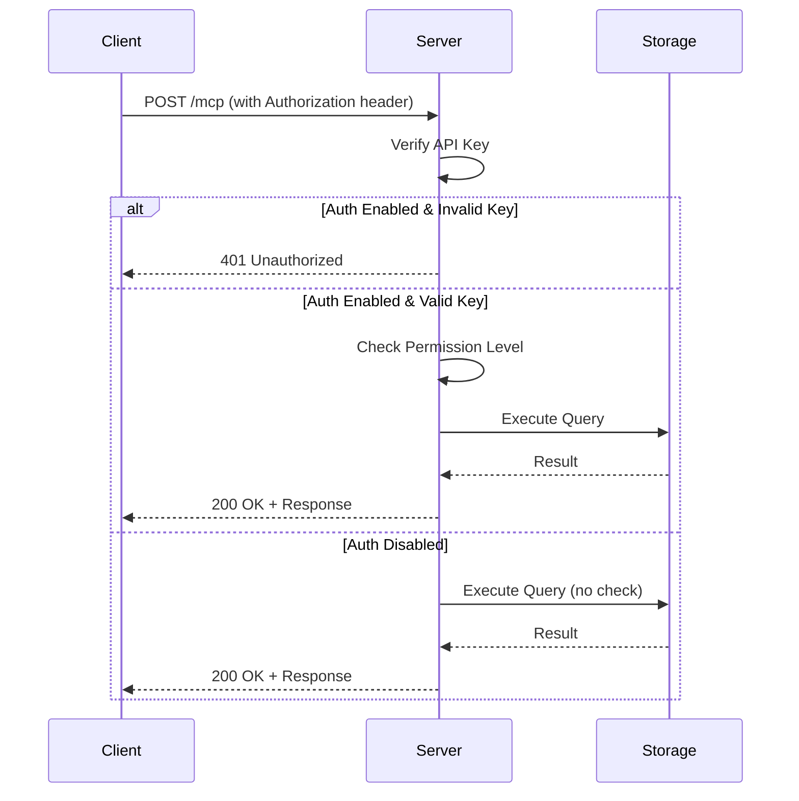

# CNAA API Reference

> **Version**: 0.2.0 | **Last Updated**: 2026-08-06  
> **规范**: JSON Schema + Python Dataclass

---

## 📖 目录

1. [数据模型](#1-数据模型)
   - [Memory](#memory)
   - [State](#state)
   - [Preference](#preference)
   - [Environment](#environment)
2. [MCP 工具定义](#2-mcp 工具定义)
3. [Scoring API](#3-scoring-api)
4. [Security API](#4-security-api)
5. [错误码定义](#5-错误码定义)

---

## 1. 数据模型

### Memory

**用途**: 智能体经历的核心载体，支持短期和长期记忆存储。

```python
@dataclass
class Memory:
    memory_id: str                # 唯一标识符 (agent_id + memory_id 组合键)
    agent_id: str                 # 拥有者标识
    type: MemoryType              # LONG_TERM / SHORT_TERM
    content: dict[str, Any]       # 开放 JSON 结构
    tags: list[str]               # 分类标签列表 (用于搜索与过滤)
    completion_score: float       # [0.0, 1.0] 完成度评分
    timestamp: datetime           # 自动生成 (default_factory=datetime.now)
    metadata: dict[str, Any]      # 扩展信息字典 (可选)
```

#### Field Details

| Field | Type | Required | Description |
|-------|------|----------|-------------|
| `memory_id` | `str` | ✅ | 唯一标识符，建议格式：`{prefix}-{timestamp}` |
| `agent_id` | `str` | ✅ | 拥有者 Agent ID，用于区分不同实例 |
| `type` | `MemoryType` | ✅ | `LONG_TERM` 或 `SHORT_TERM` |
| `content` | `dict[str, Any]` | ✅ | 任意 JSON 序列化的内容结构 |
| `tags` | `list[str]` | ⚠️ | 空列表允许，推荐至少包含一个标签 |
| `completion_score` | `float` | ⚠️ | 范围 `[0.0, 1.0]`，默认 `0.0` |
| `timestamp` | `datetime` | ❌ | 自动设置到当前时间 |
| `metadata` | `dict[str, Any]` | ❌ | 可扩展字段，如 `source`, `version` 等 |

#### Example

```json
{
  "memory_id": "mem-task-001",
  "agent_id": "alice-agent",
  "type": "LONG_TERM",
  "content": {
    "task": "Completed Python web development project",
    "details": {
      "framework": "FastAPI",
      "lines_of_code": 1500
    },
    "outcome": "success"
  },
  "tags": ["important", "completed", "python", "webdev"],
  "completion_score": 1.0,
  "timestamp": "2026-08-02T10:00:00Z",
  "metadata": {
    "source": "manual_entry",
    "verified_by": "human_reviewer"
  }
}
```

---

### State

**用途**: 沉淀后的结构化信息，支持三类状态：KNOWLEDGE (知识), PREFERENCE (偏好), ENVIRONMENT (环境)。

```python
@dataclass
class State:
    agent_id: str                 # 拥有者标识
    state_id: str                 # 唯一标识符
    category: StateCategory       # KNOWLEDGE / PREFERENCE / ENVIRONMENT
    content: dict[str, Any]       # 结构化数据
    updated_at: datetime          # 最后更新时间
```

#### Category Types

| Category | Description | Example |
|----------|-------------|---------|
| `KNOWLEDGE` | 累积的知识、经验总结 | `{"preferred_language": "Python"}` |
| `PREFERENCE` | 用户偏好设置 | `{"code_format": "black", "width": 88}` |
| `ENVIRONMENT` | 当前运行环境上下文 | `{"team_size": 5, "deadline": "2026-09-01"}` |

#### Example

```json
{
  "agent_id": "alice",
  "state_id": "dev-preferences",
  "category": "PREFERENCE",
  "content": {
    "preferred_language": "Python",
    "frameworks": ["FastAPI", "Django"],
    "code_style": "pep8"
  },
  "updated_at": "2026-08-02T09:30:00Z"
}
```

---

### Preference

**用途**: 特殊类型的 State（仅 `PREFERENCE` 类别），强调重要性权重。

```python
@dataclass
class Preference:
    agent_id: str                 # 拥有者标识
    preference_id: str            # 唯一标识符
    key: str                      # 配置键名，如 `"coding_style"`
    value: dict[str, Any]         # 配置值
    importance: float             # [0.0, 1.0] 重要程度权重
    source_memory_ids: list[str]  # 来源记忆 IDs (溯源)
```

#### Example

```json
{
  "agent_id": "alice",
  "preference_id": "pref-dev-workflow",
  "key": "development_workflow",
  "value": {
    "use_git": true,
    "code_review_required": true,
    "auto_format": true
  },
  "importance": 0.9,
  "source_memory_ids": ["mem-001", "mem-002"]
}
```

---

### Environment

**用途**: 存储智能体的当前操作环境上下文。

```python
@dataclass
class Environment:
    agent_id: str                 # 拥有者标识
    env_id: str                   # 唯一标识符 (通常用 `"current_context"`)
    context: dict[str, Any]       # 环境上下文数据
    updated_at: datetime          # 最后更新时间
```

#### Example

```json
{
  "agent_id": "alice",
  "env_id": "current_context",
  "context": {
    "active_project": "web-dev-app",
    "team_members": ["bob", "charlie"],
    "deadline": "2026-09-01",
    "resources": {
      "budget": "$5000",
      "servers": 3
    }
  },
  "updated_at": "2026-08-02T08:00:00Z"
}
```

---

## 2. MCP 工具定义

### 工具列表

CNAA 提供以下核心工具供智能体调用：

| Tool Name | 类别 | 功能描述 | 权限要求 |
|-----------|------|----------|----------|
| `cnaa_store_memory` | Memory | 存储新记忆记录 | WRITE |
| `cnaa_get_memory` | Memory | 获取单条记忆 | READ |
| `cnaa_list_memories` | Memory | 列表查询记忆 | READ |
| `cnaa_delete_memory` | Memory | 删除指定记忆 | WRITE |
| `cnaa_tag_short_term` | Memory | 标记近期记忆 | WRITE |
| `cnaa_get_state` | State | 获取状态 | READ |
| `cnaa_update_state` | State | 更新/创建状态 | WRITE |
| `cnaa_delete_state` | State | 删除状态 | WRITE |
| `cnaa_get_preference` | Preference | 获取偏好设置 | READ |
| `cnaa_update_preference` | Preference | 更新偏好 | WRITE |
| `cnaa_delete_preference` | Preference | 删除偏好 | WRITE |
| `cnaa_get_environment` | Environment | 获取环境上下文 | READ |
| `cnaa_update_environment` | Environment | 更新环境上下文 | WRITE |

### 工具调用示例

#### cnaa_store_memory

**请求**:

```json
{
  "jsonrpc": "2.0",
  "method": "tools/call",
  "params": {
    "name": "cnaa_store_memory",
    "arguments": {
      "agent_id": "alice-agent",
      "memory_id": "task-web-dev-001",
      "type": "long_term",
      "content": {
        "task": "Completed Python web development project",
        "details": {
          "framework": "FastAPI",
          "lines_of_code": 1500
        },
        "outcome": "success"
      },
      "tags": ["important", "completed", "python", "webdev"],
      "completion_score": 1.0
    }
  },
  "id": 1
}
```

**成功响应**:

```json
{
  "jsonrpc": "2.0",
  "result": {
    "status": "ok",
    "memory_id": "task-web-dev-001",
    "timestamp": "2026-08-02T10:00:00Z"
  },
  "id": 1
}
```

#### cnaa_list_memories

**请求**:

```json
{
  "jsonrpc": "2.0",
  "method": "tools/call",
  "params": {
    "name": "cnaa_list_memories",
    "arguments": {
      "agent_id": "alice-agent",
      "type": "long_term",
      "tags": ["python"],
      "start_time": "2026-08-01T00:00:00Z",
      "end_time": "2026-08-02T23:59:59Z",
      "limit": 50
    }
  },
  "id": 2
}
```

**成功响应**:

```json
{
  "jsonrpc": "2.0",
  "result": {
    "memories": [
      {
        "memory_id": "task-web-dev-001",
        "agent_id": "alice-agent",
        "type": "LONG_TERM",
        "content": {"task": "Web dev project"},
        "tags": ["python", "webdev"],
        "completion_score": 1.0,
        "timestamp": "2026-08-02T10:00:00Z"
      }
    ],
    "total_count": 1,
    "has_more": false
  },
  "id": 2
}
```

完整的工具元数据定义请查看 [cnaa/tools.py](../cnaa/tools.py)。

---

## 3. Scoring API

### MemoryScoringBackend

**用途**: 计算记忆的复合评分，支持多算法加权组合。

#### Constructor

```python
def __init__(
    self,
    weights: dict[str, float] = None,
    algorithms: list[BaseAlgorithm] = None
)
```

| Parameter | Type | Default | Description |
|-----------|------|---------|-------------|
| `weights` | `dict[str, float]` | `{"recency": 0.2, "completeness": 0.3, "importance": 0.5}` | 各算法权重 |
| `algorithms` | `list[BaseAlgorithm]` | 默认算法集合 | 自定义评分器 |

#### Methods

##### calculate

计算单个记忆的评分。

```python
def calculate(self, memory: Memory) -> float
```

**Returns**: `float` in range `[0.0, 1.0]`

**Example**:

```python
from cnaa.scoring_backend import MemoryScoringBackend
from cnaa.models import Memory, MemoryType

backend = MemoryScoringBackend()

memory = Memory(
    memory_id="test-001",
    agent_id="alice",
    type=MemoryType.LONG_TERM,
    content={"message": "Hello"},
    tags=["test"],
    completion_score=0.8,
    timestamp=datetime.now() - timedelta(days=1)
)

score = backend.calculate(memory)
print(f"Score: {score:.3f}")  # 输出类似 Score: 0.742
```

##### rank

对记忆列表进行评分并排序。

```python
def rank(
    self, 
    memories: list[Memory], 
    limit: int = 10
) -> list[Memory]
```

| Parameter | Type | Description |
|-----------|------|-------------|
| `memories` | `list[Memory]` | 待评分的记忆列表 |
| `limit` | `int` | 返回 Top N 条结果，默认 10 |

**Returns**: 按分数降序排列的记忆列表

---

### Built-in Algorithms

| Algorithm | Weight | Description | Score Range |
|-----------|--------|-------------|-------------|
| `RecencyScorer` | 0.2 | 基于时间衰减 | `(0, 1]` |
| `CompletenessScorer` | 0.3 | 基于内容完整度 | `[0, 1]` |
| `ImportanceScorer` | 0.5 | 基于 completion_score | `[0, 1]` |

自定义算法实现参考 [cnaa/scoring_algorithms.py](../cnaa/scoring_algorithms.py)。

---

## 4. Security API

### AuthConfig

**用途**: 配置认证选项。

```python
@dataclass
class AuthConfig:
    enabled: bool                    # 是否启用认证
    api_key: str                     # API Key (若启用)
    allowed_agents: list[str]        # 允许的 Agents 列表
```

### PermissionLevel

```python
class PermissionLevel(Enum):
    READ = "read"      # 仅读取权限
    WRITE = "write"    # 读写权限
```

### 认证流程



---

## 5. 错误码定义

### HTTP Status Codes

| Code | Description | Cause |
|------|-------------|-------|
| `200` | Success | 请求成功处理 |
| `400` | Bad Request | 参数验证失败 |
| `401` | Unauthorized | 认证失败 |
| `403` | Forbidden | 无权限访问 |
| `404` | Not Found | 资源不存在 |
| `500` | Internal Error | 服务器内部错误 |

### JSON-RPC Error Codes

遵循 [JSON-RPC 2.0 Spec](https://www.jsonrpc.org/spec#error_object):

| Code | Message | Description |
|------|---------|-------------|
| `-32700` | Parse error | JSON 解析失败 |
| `-32600` | Invalid Request | 请求格式无效 |
| `-32601` | Method not found | 方法不存在 |
| `-32001` | Custom error | CNAA 自定义错误 |

### Custom Error Format

```json
{
  "jsonrpc": "2.0",
  "error": {
    "code": -32001,
    "message": "Unauthorized: Invalid API Key provided"
  },
  "id": null
}
```

### 常见错误处理

#### 401 Unauthorized

**原因**: API Key 无效或未提供（当认证启用时）

**解决方案**:
1. 检查 `.env` 中 `CNAA_AUTH_ENABLED=true`
2. 确保请求头包含 `Authorization: Bearer <your-key>`

#### 400 Bad Request

**原因**: 参数验证失败

**示例**:
```json
{
  "jsonrpc": "2.0",
  "error": {
    "code": -32001,
    "message": "Validation error: completion_score must be between 0.0 and 1.0"
  },
  "id": 1
}
```

#### 404 Not Found

**原因**: 请求的资源不存在

**示例**:
```json
{
  "jsonrpc": "2.0",
  "error": {
    "code": -32001,
    "message": "Memory not found: agent_id='alice', memory_id='non-existent'"
  },
  "id": 1
}
```

---

## 📚 完整类型定义

完整的 Python 类型定义请参考源码：

- [models.py](../cnaa/models.py) - 数据模型
- [schemas.py](../cnaa/schemas.py) - JSON Schema
- [tools.py](../cnaa/tools.py) - 工具元数据
- [security.py](../cnaa/security.py) - 安全机制

---

**API 版本**: 0.2.0  
**最后更新**: 2026-08-06  
**维护者**: CNAA Team
