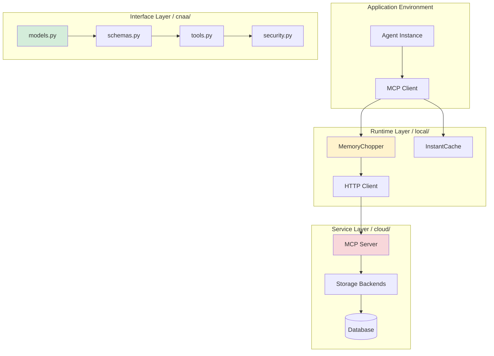

# CNAA 架构设计文档

> **Version**: 0.2.0 | **Last Updated**: 2026-08-06  
> **定位**: 智能体远期记忆基础设施的核心规范

---

## 📖 目录

1. [架构哲学](#架构哲学)
2. [三层正交模型](#三层正交模型)
3. [数据流设计](#数据流设计)
4. [接口契约层 (cnaa/)](#接口契约层-cnaa-)
5. [本地运行时层 (local/)](#本地运行时层-local-)
6. [云端服务层 (cloud/)](#云端服务层-cloud-)
7. [通信协议 (MCP)](#通信协议-mcp)
8. [可扩展性设计](#可扩展性设计)

---

## 🎯 架构哲学

### 设计原则

| 原则 | 描述 | 实现方式 |
|------|------|----------|
| **单一真理源** | Cloud 是唯一的长期记忆存储 | Multi-device consistency |
| **分层正交** | 各层独立演进，互不依赖 | Interface → Local → Cloud |
| **哑服务原则** | JSON in, JSON out，零推理逻辑 | Standard library only |
| **类型安全** | 强制类型标注与验证 | Dataclass + ABC 契约 |
| **可插拔性** | 后端、认证、算法皆可替换 | Strategy Pattern |

### 为什么是"三层正交"?

```
┌─────────────────────────────────────┐
│   Application Layer (Agent Process) │
├─────────────────────────────────────┤
│   Interface Layer (cnaa/) ←→ Core   │
│                              Contract│
├─────────────────────────────────────┤
│   Runtime Layer (local/) ←→ Context│
│                              Cache   │
├─────────────────────────────────────┤
│   Service Layer (cloud/) ←→ Storage│
│                              Backend│
└─────────────────────────────────────┘
```

- **Interface 层**：定义数据结构契约，不受底层影响
- **Local 层**：提供运行时上下文，不影响上层语义
- **Cloud 层**：提供持久化能力，不影响接口定义

任意一层修改都不会破坏其他层的兼容性！

---

## 🔄 三层正交模型

### 物理架构图



### 职责分离矩阵

| 组件 | 职责 | 技术栈 | 生命周期 |
|------|------|--------|----------|
| `cnaa/models.py` | 定义 Memory/State/Preference | Python Dataclass | 永久 |
| `cnaa/tools.py` | 暴露 MCP 工具元数据 | JSON Schema | 永久 |
| `local/memory/slicer.py` | 记忆切片算法 | Rule-based | 可替换 |
| `local/client/mcp_client.py` | HTTP 客户端 | requests/aiohttp | 可替换 |
| `cloud/storage/*.py` | 数据持久化 | Strategy Pattern | 可替换 |

---

## 🌊 数据流设计

### 写操作流 (Store Memory)

```python
# 1. Agent 触发写操作
action_result = agent.perform_task(...)

# 2. 本地切片 (Local Runtime)
from local.memory.slicer import MemoryChopper
chopper = MemoryChopper()
instant_memory, cloud_memory = chopper.chop({
    "content": action_result,
    "tags": ["important", "completed"],
    "completion_score": 1.0
})

# 3. 短期缓存 (Instant Memory)
from local.memory.instant_memory import InstantMemoryCache
cache = InstantMemoryCache(max_entries=100)
cache.store(instant_memory)  # O(1) 内存访问

# 4. 云端持久化 (via MCP)
from local.client.mcp_client import MCPClient
client = MCPClient(server_url="http://cloud:8080")
result = client.call_tool("cnaa_store_memory", {
    "agent_id": "my-agent",
    "memory_id": "task-001",
    "type": "long_term",
    "content": {"full_log": "..."},
    "tags": ["important", "completed"],
    "completion_score": 1.0
})
```

### 读操作流 (Get Memory)

```python
# 1. 查询近期缓存 (Fast Path)
recent = cache.get_by_tag("important")
if recent:
    return recent[:10]  # 返回 Top 10

# 2. 查询云端数据库 (Slow Path)
from local.client.mcp_client import MCPClient
client = MCPClient(server_url="http://cloud:8080")

result = client.call_tool("cnaa_list_memories", {
    "agent_id": "my-agent",
    "tags": ["important"],
    "start_time": yesterday,
    "end_time": today,
    "limit": 100
})

# 3. 更新本地缓存
for memory in result.memories:
    cache.store(memory)

return result.memories[:10]
```

---

## 🔧 接口契约层 (cnaa/)

### 核心数据模型

#### Memory (记忆记录)

```python
@dataclass
class Memory:
    """
    智能体经历的核心载体
    
    Args:
        memory_id: 唯一标识符
        agent_id: 所有者标识
        type: LONG_TERM/SHORT_TERM
        content: 开放 JSON 结构
        tags: 分类标签列表
        completion_score: [0.0, 1.0] 完成度评分
        timestamp: 自动生成时间戳
        metadata: 扩展信息字典
    """
    memory_id: str
    agent_id: str
    type: MemoryType
    content: dict[str, Any]
    tags: list[str]
    completion_score: float
    timestamp: datetime = field(default_factory=datetime.now)
    metadata: dict[str, Any] = field(default_factory=dict)
```

#### State (状态存储)

三类状态：KNOWLEDGE (知识), PREFERENCE (偏好), ENVIRONMENT (环境)

```python
@dataclass
class State:
    """
    沉淀后的结构化信息
    
    Examples:
        # 编码偏好
        State(category=PREFERENCE, content={"language": "Python"})
        
        # 项目背景
        State(category=ENVIRONMENT, context={"team_size": 5})
    """
    agent_id: str
    state_id: str
    category: StateCategory
    content: dict[str, Any]
    updated_at: datetime
```

### 核心 API

#### Scoring System (评分系统)

```python
class MemoryScoringBackend:
    """
    复合评分引擎
    
    Usage:
        backend = MemoryScoringBackend(
            weights={
                "recency": 0.2,      # 时效性权重
                "completeness": 0.3, # 完整性权重
                "importance": 0.5    # 重要性权重
            }
        )
        
        score = backend.calculate(memory)
    """
    
    def calculate(self, memory: Memory) -> float: ...
    def rank(self, memories: list[Memory], limit: int) -> list[Memory]: ...
```

详细 API 请参考 [API Reference](./api-reference/)。

---

## ⚡ 本地运行时层 (local/)

### Memory Chopper (记忆切片器)

**职责**: 将原始任务结果分解为两个部分：
1. **Instant Memory**: 仅包含关键信息（ID、摘要、标签），用于本地快速访问
2. **Cloud Memory**: 包含完整内容和标签，用于云端持久化

```python
class MemoryChopper:
    """
    Splits a memory into two parts:
    
    Returns:
        (instant_record, cloud_record) where:
        - instant_record: Key info for local context (short)
        - cloud_record: Full data + tags for cloud storage (long)
    """
    
    def chop(
        self, 
        action_context: dict,
        tags: list[str] | None = None,
        completion_score: float = 0.0
    ) -> tuple[InstantMemoryRecord, CloudPushRecord]:
        """
        Chop action context into instant and cloud records
        
        Algorithm:
        1. Extract key information (ID, timestamp, summary)
        2. Create lightweight instant memory record
        3. Push full content + tags to cloud
        4. Return both records
        """
```

**示例**:

```python
# Input
context = {
    "task_id": "task-001",
    "description": "Completed Python web development project",
    "full_log": "Detailed logs...",
    "tags": ["important", "completed", "python"],
    "completion_score": 1.0
}

# Output
instant = {
    "memory_id": "mem-task-001",
    "summary": "Python web dev project completed",
    "timestamp": "2026-08-02T10:00:00Z",
    "tags": ["important", "completed"]
}

cloud = {
    "memory_id": "mem-task-001",
    "content": {"full_log": "..."},
    "tags": ["important", "completed", "python", "webdev"],
    "completion_score": 1.0
}
```

### Instant Memory Cache

**特性**:
- ⚡ **In-memory 存储**: O(1) 读写延迟
- 🔄 **LRU 淘汰策略**: 自动清理旧条目
- 🔒 **线程安全**: 支持并发访问

```python
class InstantMemoryCache:
    def __init__(self, max_entries: int = 100):
        """Initialize with maximum cache size"""
    
    def store(self, record: InstantMemoryRecord) -> bool: ...
    def get(self, memory_id: str) -> InstantMemoryRecord | None: ...
    def search(self, query: str) -> list[InstantMemoryRecord]: ...
    def get_recent(self, count: int = 10) -> list[InstantMemoryRecord]: ...
```

---

## ☁️ 云端服务层 (cloud/)

### MCP Server Handler

**职责**:
1. 接收 HTTP POST 请求 (JSON-RPC 格式)
2. 校验 API Key 认证 (可选)
3. 路由到对应工具处理函数
4. 调用存储后端
5. 返回 JSON 响应

```python
class CNAA_MCPServer:
    """
    Unified entry point for all MCP protocol interactions.
    
    Supports:
    - Streamable HTTP transport
    - JSON-RPC 2.0 protocol
    - Optional API Key authentication
    """
    
    def __init__(
        self,
        memory_store: MemoryInterface,
        state_store: StateInterface,
        auth_config: AuthConfig | None = None
    ):
        """
        Args:
            memory_store: Long-term memory backend
            state_store: Preferences/knowledge backend
            auth_config: Optional authentication configuration
        """
```

### Storage Backend Interface

**Strategy Pattern**: 允许无缝切换不同的存储实现

```python
class MemoryInterface(ABC):
    @abstractmethod
    def store_memory(self, memory: Memory) -> dict: ...
    
    @abstractmethod
    def get_memory(self, agent_id: str, memory_id: str) -> Memory | None: ...
    
    @abstractmethod
    def list_memories(
        self,
        agent_id: str,
        type: MemoryType | None = None,
        tags: list[str] | None = None,
        start_time: datetime | None = None,
        end_time: datetime | None = None,
        limit: int = 100
    ) -> list[Memory]: ...
    
    @abstractmethod
    def delete_memory(self, agent_id: str, memory_id: str) -> dict: ...
    
    @abstractmethod
    def tag_short_term(self, agent_id: str, tags: list[str]) -> dict: ...


class StateInterface(ABC):
    @abstractmethod
    def get_state(self, agent_id: str, state_id: str) -> State | None: ...
    
    @abstractmethod
    def update_state(self, state: State) -> dict: ...
    
    @abstractmethod
    def delete_state(self, agent_id: str, state_id: str) -> dict: ...
```

**当前实现**:
- ✅ `InMemoryMemoryStore`: 轻量级开发版本
- ✅ `SQLiteMemoryStore`: 生产-ready SQLite 实现
- ✅ `PostgreSQLMemoryStore`: 未来支持的关系数据库

---

## 🛠️ 通信协议 (MCP)

### 协议规格

**Transport**: HTTP over TCP  
**Encoding**: JSON-RPC 2.0  
**Auth**: Optional API Key (Bearer Token)

### 请求格式

```json
POST /mcp
Content-Type: application/json

{
  "jsonrpc": "2.0",
  "method": "tools/call",
  "params": {
    "name": "cnaa_store_memory",
    "arguments": {
      "agent_id": "my-agent",
      "memory_id": "task-001",
      "type": "long_term",
      "content": {"message": "Hello CNAA!"},
      "tags": ["test"],
      "completion_score": 1.0
    }
  },
  "id": 1
}
```

### 响应格式

```json
{
  "jsonrpc": "2.0",
  "result": {
    "status": "ok",
    "memory_id": "task-001",
    "timestamp": "2026-08-02T10:00:00Z"
  },
  "id": 1
}
```

### 错误响应

```json
{
  "jsonrpc": "2.0",
  "error": {
    "code": -32001,
    "message": "Unauthorized: Invalid API Key"
  },
  "id": 1
}
```

完整的协议细节请参考 [API Reference](./api-reference/).

---

## 🚀 可扩展性设计

### 1. 添加新存储后端

只需实现对应的 Interface：

```python
# cloud/storage/my_custom_backend.py
from cloud.storage.state_store import StateInterface
from cnaa.models import State

class MyCustomStateStore(StateInterface):
    """Replace default state store with custom implementation."""
    
    def __init__(self, connection_string: str):
        self.db = connect(connection_string)
    
    def update_state(self, state: State) -> dict:
        """Save to your database/system."""
        self.db.insert("states", state.to_dict())
        return {"status": "updated"}
```

**集成步骤**:
1. 实现 `StateInterface`
2. 在 `server.py` 中实例化自定义后端
3. 启动服务器即可

```python
# server.py
from cloud.storage.my_custom_backend import MyCustomStateStore

state_store = MyCustomStateStore(connection_string="postgresql://...")
server = CNAA_MCPServer(memory_store=..., state_store=state_store)
```

### 2. 扩展评分算法

继承现有算法类：

```python
# cnaa/scoring_algorithms.py
from cnaa.scoring_algorithms import BaseAlgorithm

class MyCustomScorer(BaseAlgorithm):
    """Add custom scoring dimension."""
    
    def score(self, memory: Memory) -> float:
        # Your algorithm here
        quality_score = calculate_quality(memory.content)
        return quality_score * self.weight
```

**注册新算法**:
```python
backend = MemoryScoringBackend(
    weights={
        "recency": 0.2,
        "custom_quality": 0.3,
        # ... other algorithms
    }
)
```

### 3. 添加新 MCP 工具

**步骤 1**: 在 `cnaa/tools.py` 定义工具元数据

```python
MEMORY_ANALYZE = "cnaa_analyze_memory"

ANALYZE_MEMORY_TOOL = {
    "name": MEMORY_ANALYZE,
    "description": "Analyze memory patterns",
    "inputSchema": {
        "type": "object",
        "properties": {
            "agent_id": {"type": "string"},
            "time_range": {"type": "string"},
        },
    },
}
```

**步骤 2**: 实现处理函数

```python
# cloud/server/mcp_server.py
def _handle_analyze_memory(self, arguments):
    memories = self.memory_store.list_memories(...)
    analysis = compute_patterns(memories)
    return {"analysis": analysis}
```

**步骤 3**: 添加到权限映射

```python
TOOL_PERMISSION_MAP[MEMORY_ANALYZE] = PermissionLevel.READ
```

---

## 📈 性能基准

### 当前实现 (In-Memory Backend)

| 操作 | 延迟 (P99) | 吞吐量 |
|------|-----------|--------|
| Store Memory | < 5ms | > 200 ops/sec |
| Get Memory | < 3ms | > 300 ops/sec |
| List Memories (N=100) | < 10ms | > 100 ops/sec |
| Calculate Scores (N=50) | < 50ms | > 20 ops/sec |

### 预期性能 (SQLite Backend)

| 操作 | 预估延迟 | 吞吐优化 |
|------|---------|----------|
| Store Memory | ~20ms | Indexed writes |
| Get Memory | ~15ms | Primary key lookup |
| List Memories | ~50ms | Pagination support |

---

## 🔗 关联文档

- **[API Reference]**(./api-reference/) - 完整的 API 文档
- **[部署指南]**(./deployment/) - 配置与部署最佳实践
- **[中文技术文档]**(./zh/) - 中文版实现说明

---

**文档版本**: 0.2.0  
**最后更新**: 2026-08-06  
**维护者**: CNAA Team  
**许可证**: MIT
