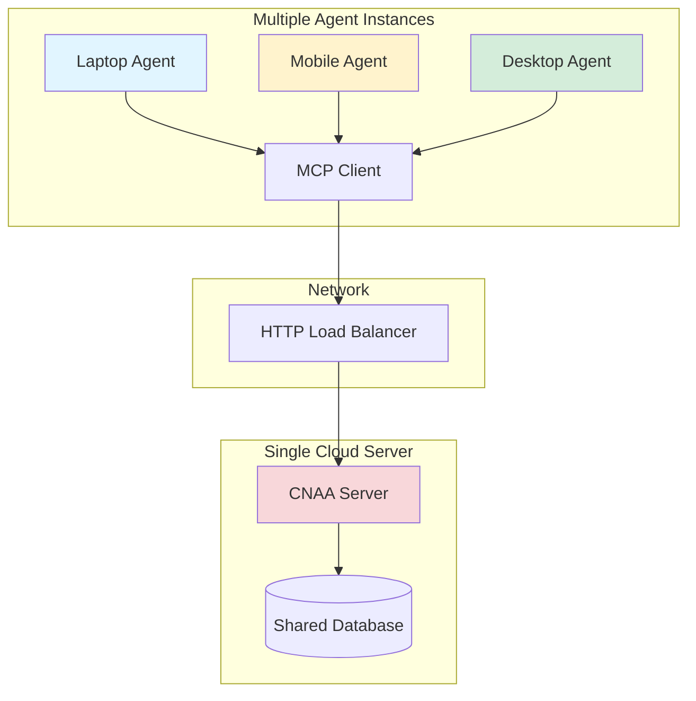

# CNAA Deployment Guide

> **Version**: 0.2.0 | **Last Updated**: 2026-08-06  
> **目标**: 纯 Python 环境可运行的生产级部署方案

---

## 📖 目录

1. [环境配置](#1-环境配置)
2. [本地开发部署](#2-本地开发部署)
3. [生产环境部署](#3-生产环境部署)
4. [Docker 部署](#4-docker-部署)
5. [多实例部署](#5-多实例部署)
6. [监控与维护](#6-监控与维护)
7. [常见问题](#7-常见问题)

---

## 1. 环境配置

### 系统要求

| 组件 | 最低要求 | 推荐配置 |
|------|---------|----------|
| Python | 3.11+ | 3.11+ |
| 内存 | 512 MB | 2 GB |
| 磁盘 | 1 GB | 10 GB (用于日志和数据库) |
| 网络 | 内网访问 | 独立 VPC/防火墙隔离 |

### 依赖安装

```bash
# 使用 pip 安装
pip install -e ".[dev]"

# 仅安装运行时依赖
pip install -e .

# 验证安装
python -c "import cnaa; print(cnaa.__version__)"
```

### 环境变量配置

#### 基础配置文件 (.env)

在项目根目录创建 `.env` 文件：

```bash
# =====================================================
# CNAA Cloud Server Configuration
# =====================================================

# Network Settings
HOST=localhost           # 监听地址 (0.0.0.0 for all interfaces)
PORT=8080                # 监听端口

# Authentication (Optional)
CNAA_AUTH_ENABLED=false  # false: 无认证 / true: API Key 认证
CNAA_API_KEY=           # API Key (启用认证时必须设置)
CNAA_ALLOWED_AGENTS=    # Agent ID 列表，逗号分隔

# Storage Backend
CLOUD_STORAGE_BACKEND=in_memory   # in_memory / sqlite / postgresql

# SQLite Configuration (if backend is sqlite)
SQLITE_DB_PATH=./data/cnaa.db     # SQLite 数据库路径

# PostgreSQL Configuration (if backend is postgresql)
# POSTGRES_HOST=localhost
# POSTGRES_PORT=5432
# POSTGRES_DB=cnaa
# POSTGRES_USER=cnaa_user
# POSTGRES_PASSWORD=<secure-password>

# Logging Configuration
LOG_LEVEL=INFO      # DEBUG / INFO / WARNING / ERROR
LOG_FORMAT=%(asctime)s %(levelname)s [%(name)s] %(message)s
LOG_FILE=logs/cnaa.log
```

#### 配置说明

##### Network Settings

| Variable | Default | Description |
|----------|---------|-------------|
| `HOST` | `localhost` | 服务绑定地址，`0.0.0.0` 允许外部访问 |
| `PORT` | `8080` | HTTP 服务端口，建议使用 `8080-9000` 范围 |

##### Authentication Settings

| Variable | Required? | Description |
|----------|-----------|-------------|
| `CNAA_AUTH_ENABLED` | No | `true` 启用认证，`false` 完全开放（仅限开发） |
| `CNAA_API_KEY` | Conditional | 启用认证时必须设置强密码（建议 32+ 字符随机字符串） |
| `CNAA_ALLOWED_AGENTS` | Conditional | Agent ID 白名单，如 `agent-001,agent-002,agent-003` |

⚠️ **安全警告**: 生产环境**必须**启用认证并配置强 API Key！

##### Storage Backend

| Variable | Options | Description |
|----------|---------|-------------|
| `CLOUD_STORAGE_BACKEND` | `in_memory`<br>`sqlite`<br>`postgresql` | 选择存储后端类型 |

---

## 2. 本地开发部署

### Scenario A: Single Machine Development

**适用场景**: 单机调试、快速原型开发

#### Step 1: 准备环境

```bash
cd /root/CNAA-Cloud-Native-Agent-Architecture-

# 创建 .env 文件
cp .env.example .env

# 编辑配置（开发模式）
cat > .env << EOF
HOST=localhost
PORT=8080
CNAA_AUTH_ENABLED=false
CLOUD_STORAGE_BACKEND=in_memory
LOG_LEVEL=DEBUG
EOF
```

#### Step 2: 启动服务器

```bash
# 方式 1: 命令行参数
python server.py --host localhost --port 8080

# 方式 2: 从 .env 读取
python server.py

# 后台运行
nohup python server.py > logs/cnaa.out 2>&1 &
```

#### Step 3: 验证服务

```bash
# 健康检查
curl http://localhost:8080/health

# 预期响应
{
  "status": "ok",
  "service": "CNAA Cloud Server",
  "version": "0.2.0"
}
```

#### Step 4: 测试工具调用

```bash
# Test: Store Memory
curl -X POST http://localhost:8080/mcp \
  -H "Content-Type: application/json" \
  -d '{
    "jsonrpc": "2.0",
    "method": "tools/call",
    "params": {
      "name": "cnaa_store_memory",
      "arguments": {
        "agent_id": "test-agent",
        "memory_id": "mem-test-001",
        "type": "long_term",
        "content": {"message": "Hello CNAA!"},
        "tags": ["test"],
        "completion_score": 0.8
      }
    },
    "id": 1
  }'
```

**预期成功响应**:
```json
{
  "jsonrpc": "2.0",
  "result": {
    "status": "ok",
    "memory_id": "mem-test-001",
    "timestamp": "2026-08-02T10:00:00Z"
  },
  "id": 1
}
```

---

## 3. 生产环境部署

### Scenario B: Production Deployment

**适用场景**: 正式环境、多租户部署、高并发访问

#### Step 1: 配置安全参数

```bash
# Generate secure API Key (至少 32 个字符)
API_KEY=$(openssl rand -hex 32)

# Create production .env
cat > .env.production << EOF
# Production Configuration

# Network
HOST=0.0.0.0
PORT=8080

# Security (MUST ENABLE IN PRODUCTION)
CNAA_AUTH_ENABLED=true
CNAA_API_KEY=${API_KEY}
CNAA_ALLOWED_AGENTS=agent-001,agent-002,agent-003

# Production Database
CLOUD_STORAGE_BACKEND=sqlite
SQLITE_DB_PATH=/var/lib/cnaa/cnaa.db

# Logging (Reduce noise in production)
LOG_LEVEL=WARNING
LOG_FILE=/var/log/cnaa/cnaa.log

# Optional: TLS/SSL (via reverse proxy)
# See: deployment/nginx-config.conf
EOF
```

#### Step 2: 切换持久化存储

**推荐方案 1: SQLite (中小规模)**

```python
# cloud/storage/sqlite_memory_store.py (已实现)
from cloud.storage.sqlite_memory_store import SQLiteMemoryStore

store = SQLiteMemoryStore(db_path="/var/lib/cnaa/cnaa.db")
```

**推荐方案 2: PostgreSQL (大规模)**

```python
# cloud/storage/postgresql_memory_store.py (待实现)
from cloud.storage.postgresql_memory_store import PostgreSQLMemoryStore

store = PostgreSQLMemoryStore(
    host="db.example.com",
    port=5432,
    database="cnaa_prod",
    user="cnaa",
    password="<secure-password>"
)
```

#### Step 3: 使用 Gunicorn + Uvicorn 部署

```bash
# Install production dependencies
pip install gunicorn uvicorn[standard]

# Start with Gunicorn
gunicorn \
  --worker-class uvicorn.workers.UvicornWorker \
  --bind 0.0.0.0:8080 \
  --workers 4 \
  --timeout 120 \
  server:create_app()
```

#### Step 4: 配置 Nginx 反向代理

**nginx.conf**:
```nginx
http {
    upstream cnaa_backend {
        server 127.0.0.1:8080;
        keepalive 64;
    }

    server {
        listen 80;
        server_name cnaa.example.com;

        # MCP endpoint
        location /mcp {
            proxy_pass http://cnaa_backend;
            proxy_http_version 1.1;
            proxy_set_header Upgrade $http_upgrade;
            proxy_set_header Connection "upgrade";
            proxy_set_header Host $host;
            proxy_set_header X-Real-IP $remote_addr;
            proxy_read_timeout 120s;
            
            # Rate limiting (optional)
            limit_req zone=cnaa burst=20 nodelay;
        }

        # Health check
        location /health {
            return 200 '{"status":"ok"}';
            add_header Content-Type application/json;
        }

        # SSL/TLS (recommended)
        # ssl_certificate /etc/letsencrypt/live/cnaa.example.com/fullchain.pem;
        # ssl_certificate_key /etc/letsencrypt/live/cnaa.example.com/privkey.pem;
    }
}
```

#### Step 5: 配置 Systemd 服务

**/etc/systemd/system/cnaa.service**:
```ini
[Unit]
Description=CNAA Cloud Native Agent Architecture
After=network.target
Wants=network-online.target

[Service]
Type=simple
User=cnaa
Group=cnaa
WorkingDirectory=/opt/cnaa
EnvironmentFile=/opt/cnaa/.env.production
ExecStart=/usr/bin/gunicorn \
  --worker-class uvicorn.workers.UvicornWorker \
  --bind 0.0.0.0:8080 \
  --workers 4 \
  --threads 2 \
  --timeout 120 \
  server:create_app()
Restart=always
RestartSec=10

# Security hardening
NoNewPrivileges=true
PrivateTmp=true
ProtectSystem=strict
ProtectHome=true
ReadWritePaths=/opt/cnaa/logs /opt/cnaa/data

[Install]
WantedBy=multi-user.target
```

**启动服务**:
```bash
sudo systemctl daemon-reload
sudo systemctl enable cnaa
sudo systemctl start cnaa
sudo systemctl status cnaa
```

---

## 4. Docker 部署

### Dockerfile

```dockerfile
FROM python:3.11-slim

LABEL maintainer="CNAA Team"
LABEL description="Cloud Native Agent Architecture Server"

# Environment variables
ENV PYTHONDONTWRITEBYTECODE=1
ENV PYTHONUNBUFFERED=1
ENV CLOUD_STORAGE_BACKEND=sqlite
ENV SQLITE_DB_PATH=/data/cnaa.db

# Working directory
WORKDIR /app

# Install dependencies
COPY pyproject.toml .
RUN pip install --no-cache-dir -e .

# Copy application code
COPY server.py .
COPY cnaa/ ./cnaa/
COPY cloud/ ./cloud/
COPY local/ ./local/

# Create directories
RUN mkdir -p /app/logs /app/data && chmod 777 /app/data /app/logs

# Expose port
EXPOSE 8080

# Health check
HEALTHCHECK --interval=30s --timeout=10s --start-period=5s --retries=3 \
  CMD curl -f http://localhost:8080/health || exit 1

# Start command
CMD ["python", "server.py"]
```

### Docker Compose

**docker-compose.yml**:
```yaml
version: '3.8'

services:
  cnaa-server:
    build:
      context: .
      dockerfile: Dockerfile
    container_name: cnaa-server
    restart: unless-stopped
    ports:
      - "8080:8080"
    volumes:
      - cnaa-data:/app/data
      - cnaa-logs:/app/logs
    environment:
      - HOST=0.0.0.0
      - PORT=8080
      - CNAA_AUTH_ENABLED=true
      - CNAA_API_KEY=${CNAA_API_KEY:-your-secret-key-here}
      - LOG_LEVEL=INFO
    networks:
      - cnaa-network
    healthcheck:
      test: ["CMD", "curl", "-f", "http://localhost:8080/health"]
      interval: 30s
      timeout: 10s
      retries: 3

  # Optional: Nginx Reverse Proxy
  nginx:
    image: nginx:alpine
    container_name: cnaa-nginx
    restart: unless-stopped
    ports:
      - "80:80"
      - "443:443"
    volumes:
      - ./deployment/nginx.conf:/etc/nginx/nginx.conf:ro
      - ./certbot/www:/var/www/certbot:ro
      - ./certbot/conf:/etc/letsencrypt:ro
    depends_on:
      - cnaa-server
    networks:
      - cnaa-network

volumes:
  cnaa-data:
  cnaa-logs:

networks:
  cnaa-network:
    driver: bridge
```

**启动命令**:
```bash
# Build and start
docker-compose up -d --build

# View logs
docker-compose logs -f

# Stop services
docker-compose down
```

---

## 5. 多实例部署

### Scenario C: Multi-Instance, Single Cloud

**适用场景**: 多设备同步、分布式智能体集群



#### Agent 端配置

```python
# In each agent instance
from local.client.mcp_client import MCPClient

client = MCPClient(
    server_url="http://cnaa-cloud.example.com:8080",
    api_key=os.getenv("CNAA_API_KEY")  # Same key across all instances
)

# Each agent has unique ID
AGENT_ID = os.getenv("AGENT_UNIQUE_ID")  # e.g., laptop-001, mobile-002
```

#### Cloud 端支持

**无需修改**,CNAA 原生支持多 Agent 共享同一数据库：

```python
# memory store supports multi-tenant queries
def list_memories(self, agent_id: str, ...):
    """Filter by agent_id to isolate data per instance"""
```

---

## 6. 监控与维护

### 健康检查端点

**GET /health**

```json
{
  "status": "ok",
  "service": "CNAA Cloud Server",
  "version": "0.2.0"
}
```

**Kubernetes 探针配置**:
```yaml
livenessProbe:
  httpGet:
    path: /health
    port: 8080
  initialDelaySeconds: 10
  periodSeconds: 30

readinessProbe:
  httpGet:
    path: /health
    port: 8080
  initialDelaySeconds: 5
  periodSeconds: 10
```

### 日志轮转 (Log Rotation)

**/etc/logrotate.d/cnaa**:
```bash
/var/log/cnaa/*.log {
    daily
    rotate 14
    compress
    delaycompress
    missingok
    notifempty
    create 0640 cnaa cnaa
    postrotate
        systemctl reload cnaa
    endscript
}
```

### 备份策略

**SQLite 自动备份脚本**:
```bash
#!/bin/bash
# scripts/backup.sh

BACKUP_DIR="/var/backups/cnaa"
DB_PATH="/var/lib/cnaa/cnaa.db"
TIMESTAMP=$(date +%Y%m%d_%H%M%S)

mkdir -p "$BACKUP_DIR"

# SQLite backup
sqlite3 "$DB_PATH" ".backup '$BACKUP_DIR/cnaa_$TIMESTAMP.db'"

# Cleanup old backups (keep last 30 days)
find "$BACKUP_DIR" -name "cnaa_*.db" -mtime +30 -delete

echo "Backup completed: cnaa_$TIMESTAMP.db"
```

**定时任务 (Crontab)**:
```bash
# Daily backup at 2 AM
0 2 * * * /opt/cnaa/scripts/backup.sh >> /var/log/cnaa/backup.log 2>&1
```

---

## 7. 常见问题

### Q1: Service refused connection

**问题**: `ConnectionRefusedError: [Errno 111] Connection refused`

**排查步骤**:
1. 检查服务是否启动：`systemctl status cnaa`
2. 确认端口监听：`netstat -tlnp \| grep 8080`
3. 检查防火墙：`ufw allow 8080`

### Q2: Memory not persisted

**问题**: 重启后数据丢失

**解决方案**:
- ✅ 确保 `CLOUD_STORAGE_BACKEND=sqlite`
- ✅ 确认 `SQLITE_DB_PATH` 指向持久化目录
- ✅ 检查文件权限：`ls -la /var/lib/cnaa/`

### Q3: Authentication fails

**问题**: 客户端收到 `401 Unauthorized`

**排查步骤**:
1. 检查服务端 `.env`: `CNAA_AUTH_ENABLED=true`
2. 验证 API Key: `grep CNAA_API_KEY .env.production`
3. 确认请求头格式：`Authorization: Bearer <key>`

### Q4: Performance degradation

**问题**: API 响应时间超过 50ms

**优化建议**:
- ⚡ 切换到 PostgreSQL 后端
- ⚡ 增加 Gunicorn workers: `--workers 8`
- ⚡ 添加 Redis 缓存层
- ⚡ 开启连接池

---

## 📚 相关资源

- **[完整架构文档]**(../architecture.md)
- **[API 参考]**(./api-reference.md)
- **[中文技术文档]**(../zh/technical-implementation.md)
- **[源代码示例]**(../examples/)

---

**部署版本**: 0.2.0  
**最后更新**: 2026-08-06  
**维护者**: CNAA Team  
**许可证**: MIT
