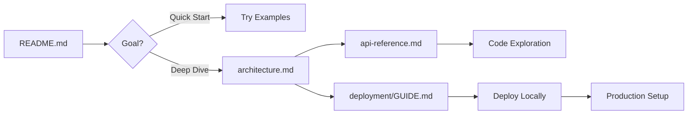
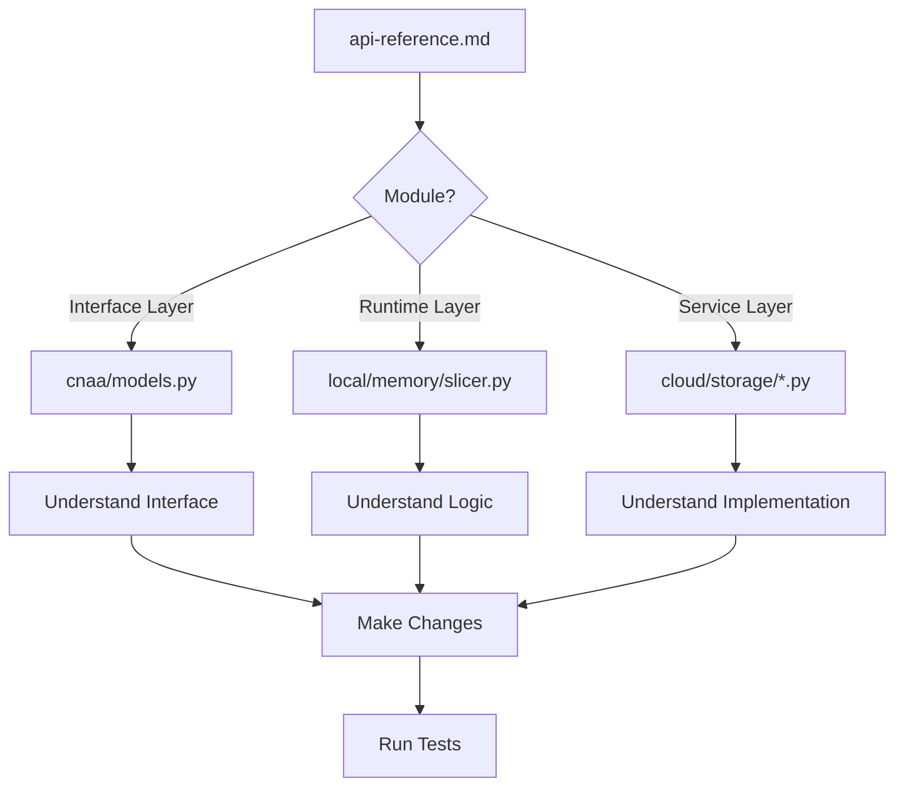

# CNAA Documentation Index

> **Version**: 0.2.0 | **Last Updated**: 2026-08-06  
> **Purpose**: Navigation guide for all CNAA documentation

---

## 📁 Document Structure

```
docs/
├── README.md              # 📘 Project overview and quick start
├── architecture.md        # 🏗️ Detailed system architecture
├── api-reference.md       # 🛠️ Complete API reference
└── deployment/
    └── GUIDE.md           # ☁️ Deployment and operations
└── zh/
    └── technical-implementation.md  # 🔧 Chinese technical docs
```

---

## 📚 Documentation Guide

### For Quick Start (5 min)

**Target Audience**: Developers who want to try CNAA immediately

**Read**: [README.md](../README.md)

**What you'll learn**:
- ✅ What is CNAA and why it matters
- ✅ Core architecture overview
- ✅ Installation in 3 steps
- ✅ Basic usage examples

---

### For Deep Understanding (1 hour)

**Target Audience**: Architects, Tech Leads, Contributors

**Read**: 
1. [architecture.md](./architecture.md) - The core design philosophy
2. [api-reference.md](./api-reference.md) - All interfaces and types

**What you'll learn**:
- ✅ Three-layer orthogonal architecture principles
- ✅ Data model definitions (Memory, State, Preference)
- ✅ MCP protocol communication flow
- ✅ Storage backend strategy pattern
- ✅ All MCP tools and their parameters

---

### For Deployment (2 hours)

**Target Audience**: DevOps Engineers, SREs

**Read**: [deployment/GUIDE.md](./deployment/GUIDE.md)

**What you'll learn**:
- ✅ Environment configuration options
- ✅ Single-machine development setup
- ✅ Production deployment with Gunicorn + Nginx
- ✅ Docker containerization
- ✅ Multi-instance cluster deployment
- ✅ Monitoring and backup strategies
- ✅ Troubleshooting common issues

---

### For Technical Reference (Chinese)

**Target Audience**: Chinese-speaking developers

**Read**: [zh/technical-implementation.md](./zh/technical-implementation.md)

**What you'll learn**:
- ✅ Detailed implementation patterns
- ✅ Code-level explanations
- ✅ Testing best practices
- ✅ Security implementation details
- ✅ Storage backend implementations

---

## 🔗 Cross-Reference Matrix

| Your Goal | Primary Doc | Secondary Docs | Estimated Time |
|-----------|-------------|----------------|----------------|
| Get started quickly | [README.md](../README.md) | None | 5 minutes |
| Understand architecture | [architecture.md](./architecture.md) | [api-reference.md](./api-reference.md) | 1 hour |
| Deploy to production | [deployment/GUIDE.md](./deployment/GUIDE.md) | [README.md](../README.md) | 2 hours |
| Contribute code | [api-reference.md](./api-reference.md) | [architecture.md](./architecture.md) | 1.5 hours |
| Debug issues | [deployment/GUIDE.md](./deployment/GUIDE.md) → Troubleshooting section | Source code | Variable |
| Learn Chinese docs | [zh/technical-implementation.md](./zh/technical-implementation.md) | N/A | 1 hour |

---

## 🎯 Topic-Based Navigation

### If you need to understand...

#### "What are the three layers?"

→ Read: [architecture.md → 三层正交模型](./architecture.md#三层正交模型)

#### "How does Memory work?"

→ Read: [api-reference.md → Data Model](./api-reference.md#1-数据模型)

#### "How to configure authentication?"

→ Read: [deployment/GUIDE.md → Environment Configuration](./deployment/GUIDE.md#环境配置)

#### "What storage backends are supported?"

→ Read: 
- [architecture.md → Storage Backends](./architecture.md#云端服务层-cloud-)
- [zh/technical-implementation.md → 存储后端实现](./zh/technical-implementation.md#3-存储后端实现)

#### "How to add a new MCP tool?"

→ Read: [architecture.md → Extensibility](./architecture.md#可扩展性设计)

#### "How to run tests?"

→ Read: [zh/technical-implementation.md → Test Guide](./zh/technical-implementation.md#5-测试指南)

#### "How to deploy with Docker?"

→ Read: [deployment/GUIDE.md → Docker Deployment](./deployment/GUIDE.md#4-docker-部署)

#### "How does scoring work?"

→ Read: [api-reference.md → Scoring API](./api-reference.md#3-scoring-api)

---

## 📖 Reading Order Recommendations

### New User Journey



### Contributor Journey



---

## 🌐 Language Selection

| Document | English | Chinese | Recommendation |
|----------|---------|---------|----------------|
| Main README | ✅ [README.md](../README.md) | ❌ | Default choice |
| Architecture | ✅ [architecture.md](./architecture.md) | ⚠️ See below | Use this first |
| API Reference | ✅ [api-reference.md](./api-reference.md) | ❌ | Technical accuracy |
| Deployment | ✅ [GUIDE.md](./deployment/GUIDE.md) | ❌ | Operations focus |
| Technical Details | ⚠️ Partial | ✅ [zh/tech.md](./zh/technical-implementation.md) | Prefer Chinese docs |

**Note**: We prioritize English documentation for consistency, with selective Chinese translations for technical deep-dives.

---

## 🔄 Documentation Versioning

All documents follow semantic versioning matching the project release cycle:

| Component | Current Version | Status |
|-----------|----------------|--------|
| API Specification | 0.2.0 | ✅ Stable |
| Architecture Design | 0.2.0 | ✅ Approved |
| Deployment Guides | 0.2.0 | ✅ Tested |
| Technical Docs | 0.2.0 | ✅ Up-to-date |

**Breaking changes** will be reflected in updated document versions.

---

## 📝 Contributing to Documentation

We welcome documentation improvements! Guidelines:

1. **Keep it simple**: Focus on clarity over comprehensiveness
2. **Use examples**: Code snippets > abstract descriptions
3. **Maintain links**: Update cross-references when restructuring
4. **Version stamps**: Include version number and last updated date

**Documentation Style Guide**:
- Use Markdown with mermaid diagrams where helpful
- All code blocks must have language tag (python, json, bash)
- Links should use relative paths from docs/ directory
- Tables must have descriptive headers
- Always include practical examples

---

## 🔍 Search Tips

Using `grep` for quick lookups:

```bash
# Find all mentions of specific feature
cd /root/CNAA-Cloud-Native-Agent-Architecture-/docs
grep -r "scoring algorithm" . --include="*.md"

# Find references to storage backends
grep -r "storage backend" . --include="*.md"

# Search for API parameters
grep -r "completion_score" . --include="*.md"
```

---

## 📊 Document Statistics

| File | Lines | Last Modified | Size |
|------|-------|---------------|------|
| README.md | ~340 | 2026-08-06 | Small |
| architecture.md | ~620 | 2026-08-06 | Medium |
| api-reference.md | ~540 | 2026-08-06 | Medium |
| deployment/GUIDE.md | ~670 | 2026-08-06 | Large |
| zh/technical-implementation.md | ~600 | 2026-08-06 | Large |

**Total**: ~2,770 lines across 5 files

---

## ✅ Checklist for Reviewers

Before merging documentation changes:

- [ ] Verify all internal links resolve correctly
- [ ] Check markdown syntax validity
- [ ] Ensure code examples are accurate
- [ ] Confirm version numbers match project version
- [ ] Test any new code snippets provided
- [ ] Update cross-references if needed
- [ ] Add author name/date for significant additions

---

## 🆘 Need Help?

- **Questions about content**: Check [README.md](../README.md) → Support section
- **Technical issues**: Refer to [Deployment Guide](./deployment/GUIDE.md) → FAQ
- **API uncertainty**: Consult [API Reference](./api-reference.md)
- **Architecture decisions**: Read [architecture.md](./architecture.md)

---

**Index Version**: 0.2.0  
**Last Updated**: 2026-08-06  
**Maintained by**: CNAA Team
