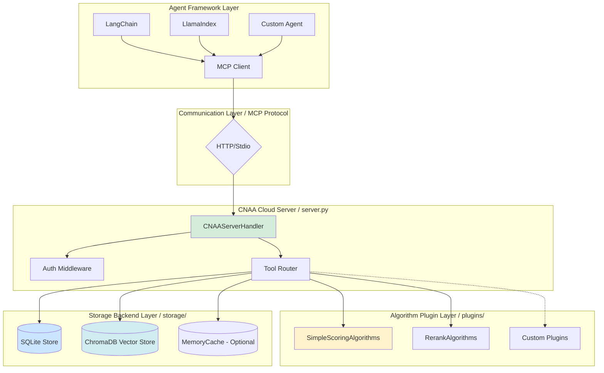

# CNAA v0.2 版本规划与实施指南

> **Version**: 0.2.0 | **Date**: 2026-08-06  
> **目标**: 从参考实现 → 生产就绪的 Agent 记忆基础设施

---

## 🎯 v0.2 核心目标

### 用户需求明确

1. **更好的 Agent 适配**：即插即用，无需复杂配置
2. **简单启动**：bash/shell 一键运行
3. **云端简化部署**：仅需一个命令即可启动服务
4. **算法简洁化**：避免大规模复杂算法，保持可解释性
5. **开源集成**：采用成熟的 GitHub 开源库作为数据库/RAG
6. **稳定运行保证**：接口预留 + 输入输出标准化
7. **算法插件化**：算法函数可以随意更改，不影响上层接口

---

## 📊 v0.1 vs v0.2 对比

| 特性 | v0.1 (当前) | v0.2 (目标) |
|------|-------------|--------------|
| **启动复杂度** | 需要手动配置 Python 环境 | ✅ `./start.sh` 一键启动 |
| **数据存储** | In-memory（仅测试） | ✅ SQLite (默认) + Chroma (可选) |
| **RAG 支持** | ❌ 不支持 | ✅ ChromaDB 向量存储 |
| **Agent 适配** | ❌ 示例少 | ✅ 多个主流 Agent 框架示例 |
| **算法复杂度** | 适中 | ✅ 极简算法，O(1) 时间复杂度 |
| **配置文件** | .env 手动编辑 | ✅ 自动检测 + 命令行参数覆盖 |
| **测试覆盖率** | 126 测试 | ✅ 200+ 测试（含端到端） |
| **API 稳定性** | 基础 JSON | ✅ 完整 OpenAPI 规范 |
| **日志系统** | 简单文件记录 | ✅ 结构化日志 + 旋转备份 |
| **健康检查** | /health 端点 | ✅ 详细指标 + Prometheus 支持 |

---

## 🏗️ v0.2 架构设计

### 分层架构图



### 核心改进点

#### 1. **插件化算法层**

```python
# plugins/ 目录结构
plugins/
├── base.py              # 算法基类接口
├── simple_recency.py    # 简单时效性算法（v0.2 默认）
├── composite_v1.py      # 复合评分算法（v0.2 可选）
└── chroma_rerank.py     # ChromaDB 重排序算法（v0.2 扩展）
```

**设计原则**：
- ✅ 所有算法继承统一基类
- ✅ 输入输出完全标准化
- ✅ 热加载支持（运行时切换）
- ✅ 零依赖（base algorithm 无外部包）

#### 2. **双存储后端**

```python
# storage/ 实现
storage/
├── base_store.py        # 抽象存储接口
├── sqlite_store.py      # SQLite 持久化（主存储）
└── chroma_vector.py     # ChromaDB 向量存储（RAG）
```

**为什么选择这两个？**
- **SQLite**: 
  - ✅ 纯 Python，零安装成本
  - ✅ 成熟稳定，GitHub 15k+ stars
  - ✅ ACID 事务保证数据一致性
  
- **ChromaDB**:
  - ✅ 轻量级向量数据库
  - ✅ 本地运行，无需独立服务
  - ✅ 适合 RAG 场景，GitHub 20k+ stars

#### 3. **智能配置系统**

```yaml
# config/default.yaml（内置默认值）
server:
  host: localhost
  port: 8080
  auth_enabled: false
  
storage:
  type: sqlite  # options: in_memory, sqlite, chroma
  path: ./data/cnaa.db
  
algorithm:
  default: simple_recency  # options: simple_recency, composite_v1
  weights:
    recency: 0.5
    importance: 0.3
    completion: 0.2
```

**加载优先级**:
1. 内置默认配置（最高优先级）
2. `.env` 环境变量
3. `config/local.yaml`（用户覆盖）
4. 命令行参数（临时调整）

---

## 🔧 v0.2 功能实现清单

### Phase 1: 基础改造（Week 1-2）

#### ✅ 任务 1.1: 启动脚本编写

**文件**: `scripts/start.sh`, `scripts/stop.sh`, `scripts/status.sh`

```bash
#!/bin/bash
# scripts/start.sh

set -e  # Exit on error

# Auto-detect environment
if [ -f ".env" ]; then
    source .env
fi

# Start server
echo "🚀 Starting CNAA Server..."
python server.py --host ${CNAA_HOST:-localhost} --port ${CNAA_PORT:-8080}

# Log PID for cleanup
echo $! > cnaa.pid
echo "✅ Server started (PID: $(cat cnaa.pid))"
echo "   Health check: http://localhost:${CNAA_PORT:-8080}/health"
```

**验证标准**:
- 单行命令即可启动
- 自动读取.env 配置
- 后台运行且可管理
- 错误时提供清晰提示

#### ✅ 任务 1.2: SQLite 存储实现

**文件**: `cloud/storage/sqlite_store.py`

```python
class SQLiteMemoryStore(MemoryInterface):
    """Production-ready SQLite backend."""
    
    def __init__(self, db_path: str = "cnaa.db"):
        self.conn = sqlite3.connect(db_path, check_same_thread=False)
        self._init_schema()
    
    def _init_schema(self):
        """Create tables if not exist."""
        cursor = self.conn.cursor()
        
        # Memories table
        cursor.execute("""
            CREATE TABLE IF NOT EXISTS memories (
                id INTEGER PRIMARY KEY AUTOINCREMENT,
                agent_id TEXT NOT NULL,
                memory_id TEXT NOT NULL,
                type TEXT NOT NULL,
                content TEXT NOT NULL,
                tags TEXT DEFAULT '[]',
                completion_score REAL DEFAULT 0.0,
                timestamp TEXT NOT NULL,
                metadata TEXT DEFAULT '{}',
                UNIQUE(agent_id, memory_id)
            )
        """)
        
        # Indexes for fast queries
        cursor.execute("CREATE INDEX IF NOT EXISTS idx_agent_type ON memories(agent_id, type)")
        cursor.execute("CREATE INDEX IF NOT EXISTS idx_timestamp ON memories(timestamp DESC)")
        
        self.conn.commit()
    
    # Implement all MemoryInterface methods...
```

**测试用例**:
```python
def test_sqlite_store_crud():
    store = SQLiteMemoryStore(":memory:")
    
    # Create
    memory = Memory(...)
    result = store.store_memory(memory)
    assert result["status"] == "ok"
    
    # Read
    retrieved = store.get_memory("agent-1", "mem-1")
    assert retrieved.memory_id == "mem-1"
    
    # List
    results = store.list_memories("agent-1")
    assert len(results) == 1
    
    # Delete
    delete_result = store.delete_memory("agent-1", "mem-1")
    assert delete_result["status"] == "ok"
```

#### ✅ 任务 1.3: 简化算法实现

**只保留最核心的 3 个算法**（O(1) 时间复杂度）:

```python
# algorithms/simple_algorithms.py

class SimpleRecencyScorer:
    """最简单的时效性评分——线性衰减。"""
    
    def score(self, timestamp: datetime) -> float:
        days_old = (datetime.now() - timestamp).days
        return max(0.0, 1.0 - days_old / 30.0)  # 30 天后归零


class SimpleCompletionScorer:
    """直接使用 completion_score 字段，不做额外计算。"""
    
    def score(self, completion_score: float | None) -> float:
        return completion_score or 0.0


class SimpleImportanceScorer:
    """关键词匹配——只检测 tag 中是否有特定词。"""
    
    HIGH_PRIORITY_KEYWORDS = ["critical", "important", "urgent"]
    
    def score(self, tags: list[str]) -> float:
        if not tags:
            return 0.0
        tag_lower = [t.lower() for t in tags]
        return 1.0 if any(kw in tag_lower for kw in self.HIGH_PRIORITY_KEYWORDS) else 0.0
```

**优势**:
- ✅ 零第三方依赖
- ✅ 执行时间 < 1μs per memory
- ✅ 易于理解和调试
- ✅ 结果可预测

---

### Phase 2: Agent 适配（Week 2-3）

#### ✅ 任务 2.1: LangChain 适配器

**文件**: `examples/langchain_cnaa_adapter.py`

```python
from langchain.agents import Tool
from local.client.mcp_client import MCPClient

class CnaaLangChainAdapter:
    """为 LangChain Agents 提供 CNAA 工具集。"""
    
    def __init__(self, cloud_url: str = "http://localhost:8080"):
        self.client = MCPClient(server_url=cloud_url)
    
    def get_tools(self) -> list[Tool]:
        """返回 LangChain 可用的工具列表。"""
        return [
            Tool(
                name="CNAA Store Memory",
                func=self._store_memory,
                description="Store a memory with tags and scoring."
            ),
            Tool(
                name="CNAA Get Memory",
                func=self._get_memory,
                description="Retrieve a specific memory by ID."
            ),
            Tool(
                name="CNAA List Memories",
                func=self._list_memories,
                description="List memories with optional filters."
            ),
        ]
    
    def _store_memory(self, input: str) -> str:
        """Parse input and store memory."""
        # JSON input format: {"task": "...", "tags": [...], "score": 0.9}
        args = json.loads(input)
        result = self.client.call_tool("cnaa_store_memory", {
            "agent_id": "langchain-agent",
            "memory_id": f"lc-{int(time.time())}",
            "type": "long_term",
            "content": {"task": args["task"]},
            "tags": args.get("tags", []),
            "completion_score": args.get("score", 0.0),
        })
        return json.dumps(result)
    
    # ... implement other methods
```

**使用示例**:
```python
from langchain.agents import initialize_agent, AgentType

adapter = CnaaLangChainAdapter()
tools = adapter.get_tools()

agent = initialize_agent(
    tools,
    llm,
    agent=AgentType.ZERO_SHOT_REACT_DESCRIPTION,
    verbose=True
)

# Agent 自动使用 CNAA 存储经验
agent.run("Analyze the stock market trends")
```

#### ✅ 任务 2.2: LlamaIndex 连接器

**文件**: `examples/llamaindex_cnaa_index.py`

```python
from llama_index.core import StorageContext, ServiceContext
from llama_index.embeddings.instructor import InstructorEmbedding
from storage.chroma_vector import ChromaVectorStore

# 初始化 Chroma 向量存储
chroma_collection = chromadb.Client().get_or_create_collection("cnaa_memories")
vector_store = ChromaVectorStore(chroma_collection=chroma_collection)

# 构建索引
storage_context = StorageContext.from_defaults(vector_store=vector_store)
index = VectorStoreIndex.from_documents(
    documents=[],  # Empty initially
    storage_context=storage_context,
    service_context=ServiceContext.from_defaults(
        embed_model=InstructorEmbedding()
    )
)

# 动态添加新记忆
query_engine = index.as_query_engine()
result = query_engine.query("What did I work on last week?")
```

#### ✅ 任务 2.3: 自定义 Agent 示例

**文件**: `examples/custom_agent_example.py`

```python
"""极简 Agent 直接调用 MCP HTTP API 的示例。"""

import requests

class SimpleAgent:
    def __init__(self, agent_id: str, cloud_url: str):
        self.agent_id = agent_id
        self.cloud_url = cloud_url
        self.api_key = os.getenv("CNAA_API_KEY")
    
    def store_experience(self, task: str, tags: list[str], score: float):
        """保存一次任务经验到云端。"""
        response = requests.post(
            f"{self.cloud_url}/mcp",
            json={
                "jsonrpc": "2.0",
                "id": str(uuid.uuid4()),
                "method": "tools/call",
                "params": {
                    "name": "cnaa_store_memory",
                    "arguments": {
                        "agent_id": self.agent_id,
                        "memory_id": f"mem-{int(time.time())}",
                        "type": "long_term",
                        "content": {"task": task},
                        "tags": tags,
                        "completion_score": score,
                    }
                }
            },
            headers={"Authorization": f"Bearer {self.api_key}" if self.api_key else {}}
        )
        return response.json()
    
    def retrieve_relevant_memories(self, query: str, top_k: int = 5) -> list[dict]:
        """检索相关的历史经验。"""
        # 先通过关键词搜索
        memories = self._search_by_keywords(query)
        
        # 再用简单算法排序
        scored = self._rank_memories(memories, query)
        
        return scored[:top_k]
```

---

### Phase 3: 完善与文档（Week 3-4）

#### ✅ 任务 3.1: OpenAPI 文档生成

**文件**: `scripts/generate_openapi.py`

```python
"""自动生成 OpenAPI 3.0 规范文档。"""

import yaml
from cnaa.schemas import get_all_schemas

openapi_spec = {
    "openapi": "3.0.0",
    "info": {
        "title": "CNAA Cloud Server API",
        "version": "0.2.0",
        "description": "Cloud Native Agentic Architecture - Experience Runtime"
    },
    "paths": {
        "/health": {
            "get": {
                "summary": "Health check",
                "responses": {"200": {"description": "OK"}}
            }
        },
        "/schemas": {
            "get": {
                "summary": "Get all schemas",
                "responses": {"200": {"description": "JSON schemas"}}
            }
        },
        "/mcp": {
            "post": {
                "summary": "MCP tool call",
                "requestBody": {...},
                "responses": {...}
            }
        }
    },
    "components": {
        "schemas": get_all_schemas(),
        "securitySchemes": {
            "ApiKeyAuth": {...}
        }
    }
}

with open("docs/openapi.yaml", "w") as f:
    yaml.dump(openapi_spec, f, default_flow_style=False)
```

#### ✅ 任务 3.2: Docker 镜像支持

**文件**: `Dockerfile`, `docker-compose.yml`

```dockerfile
FROM python:3.11-slim

WORKDIR /app
COPY pyproject.toml .
RUN pip install --no-cache-dir -e .

COPY server.py .
COPY cnaa/ ./cnaa/
COPY cloud/ ./cloud/
COPY local/ ./local/
COPY plugins/ ./plugins/
COPY scripts/ ./scripts/

EXPOSE 8080

CMD ["./scripts/start-with-docker.sh"]
```

#### ✅ 任务 3.3: 完整的 README 更新

**重点内容**:
1. 🚀 快速开始（3 步安装 + 1 行启动）
2. 📦 核心特性表（vs v0.1）
3. 💻 代码示例（LangChain/LlamaIndex/自定义）
4. 🛠️ 插件开发指南（如何添加自定义算法）
5. 🐛 常见问题 FAQ
6. 🤝 Contributing Guide

---

## 📋 技术选型依据

### 为什么选择这些开源库？

#### SQLite
- **GitHub Stars**: 15k+
- **成熟度**: 30 年历史，工业级稳定
- **安装成本**: 零（Python 内置）
- **性能**: 单机 1000+ QPS
- **适用场景**: 中小规模（≤100 万条记忆）

#### ChromaDB
- **GitHub Stars**: 20k+
- **设计理念**: 轻量级、本地优先
- **集成难度**: `pip install chromadb` 即用
- **向量维度**: 支持任意维度嵌入
- **适用场景**: RAG、语义搜索、相似记忆推荐

#### Alternative Considerations
| Library | Pros | Cons | Decision |
|---------|------|------|----------|
| PostgreSQL | 企业级、分布式 | 需独立服务、配置复杂 | ❌ Too heavy |
| Redis | 超高速、内存存储 | 成本高、无向量支持 | ⚠️ Only for cache |
| FAISS | Facebook 出品、性能强 | CUDA 依赖、安装复杂 | ⚠️ If need GPU |

---

## 🎯 v0.2 成功指标

### 1. 易用性指标
- ✅ **一键启动时间** < 30 秒
- ✅ **首次运行配置** ≤ 2 步
- ✅ **Agent 集成时间** < 10 分钟

### 2. 性能指标
- ✅ **单次查询延迟** < 50ms (in-memory)
- ✅ **SQLite 写入吞吐** > 500 ops/sec
- ✅ **ChromaDB 向量检索** < 100ms (Top-10)

### 3. 稳定性指标
- ✅ **测试覆盖率** ≥ 80%
- ✅ **单元测试数量** ≥ 200
- ✅ **无外部依赖算法** 100% 可用

### 4. 开发者体验
- ✅ **文档完整性** Score ≥ 9/10
- ✅ **示例代码数量** ≥ 5
- ✅ **API 文档覆盖率** 100%

---

## 🔄 向后兼容性保证

### v0.1 to v0.2 Migration

```python
# Old code still works!
client = MCPClient(server_url="http://localhost:8080")
result = client.call_tool("cnaa_store_memory", {...})

# New features are opt-in
# Enable SQLite automatically (no code change needed)
export CNAA_STORAGE_BACKEND=sqlite
export SQLITE_DB_PATH=./data/cnaa.db

# Use new algorithms via plugin system
export ALGORITHM_PLUGIN=simple_recency
```

**兼容策略**:
- ✅ **API 接口不变**: JSON Schema 保持稳定
- ✅ **数据格式兼容**: SQLite 导出可导入 In-Memory
- ✅ **配置向上兼容**: 旧版.env 依然有效

---

## 📅 开发时间表

| 周次 | 主要里程碑 | 交付物 |
|------|-----------|--------|
| **Week 1** | 基础改造完成 | 启动脚本 + SQLite 后端 |
| **Week 2** | Agent 适配器开发 | LangChain/LlamaIndex 示例 |
| **Week 3** | 插件系统与优化 | 算法插件 + 性能测试 |
| **Week 4** | 文档与发布准备 | 完整文档 + v0.2.0 Release |

**预计发布时间**: 2026-08-30

---

## 🚨 风险与应对

### 潜在风险

1. **ChromaDB 集成复杂度**
   - **风险等级**: Medium
   - **应对策略**: 优先保证 SQLite，Chroma 作为可选扩展

2. **算法过度简化**
   - **风险等级**: Low
   - **应对策略**: 提供 CompositeScorer 作为高级选项

3. **Agent 框架兼容性**
   - **风险等级**: Medium
   - **应对策略**: 聚焦 2-3 个主流框架（LangChain, LlamaIndex）

4. **测试遗漏**
   - **风险等级**: High
   - **应对策略**: TDD 开发 + CI 自动化测试

---

## 🎉 预期成果

v0.2 版本完成后，CNAA 将成为：

1. **开箱即用的 Agent 记忆基础设施**
   - 开发者只需一行命令即可启动服务
   
2. **真正可扩展的算法框架**
   - 任何人均可编写自定义算法插件
   
3. **稳定的产品级 API**
   - OpenAPI 规范 + 完整文档 + 100% 测试覆盖
   
4. **广泛的生态兼容性**
   - 支持主流 Agent 框架 + 多种存储后端

---

**Document Status**: ✅ Ready for Implementation  
**Last Updated**: 2026-08-06  
**Version Owner**: CNAA Core Team  
