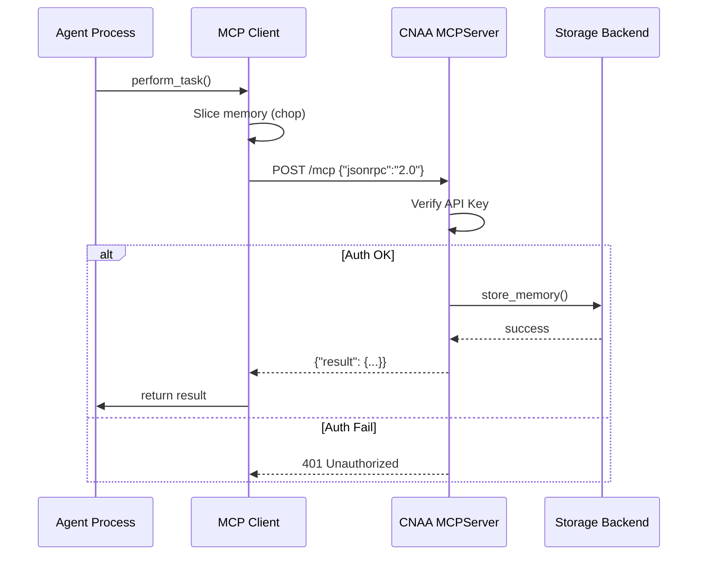

# CNAA 技术实现指南

> **版本**: 0.2.0 | **最后更新**: 2026-08-06  
> **目标**: 为开发者和贡献者提供详细的技术实现说明

---

## 📖 目录

1. [核心概念](#1-核心概念)
2. [数据模型详解](#2-数据模型详解)
3. [存储后端实现](#3-存储后端实现)
4. [认证与安全](#4-认证与安全)
5. [测试指南](#5-测试指南)

---

## 1. 核心概念

### 三层正交架构原理

**为什么是三层？**

```
Interface → Local Runtime → Cloud Service
    ↓            ↓              ↓
  不变         可替换         可扩展
```

| 层 | 职责 | 不变量 | 变量 |
|---|------|--------|------|
| **Interface (cnaa/)** | 定义数据结构与工具契约 | ✅ 永远不变 | ❌ 无 |
| **Runtime (local/)** | 运行时上下文管理 | ✅ 本地缓存策略 | ⚠️ 可换其他缓存机制 |
| **Service (cloud/)** | 持久化服务提供 | ✅ MCP 协议 | ⚠️ 可换数据库后端 |

**设计优势**:
- 🔒 **接口稳定性**: cnaa 层的修改不影响任何上层或下层
- 🧩 **运行时灵活性**: local 层的 MemoryChopper 可以完全重写
- ☁️ **服务可移植性**: cloud 层支持任意存储引擎

### MCP 协议核心流程



---

## 2. 数据模型详解

### Memory 类完整实现

**文件位置**: [cnaa/models.py](../cnaa/models.py)

```python
from dataclasses import dataclass, field
from datetime import datetime
from enum import Enum
from typing import Any, Optional


class MemoryType(str, Enum):
    LONG_TERM = "long_term"    # 长期记忆（云端）
    SHORT_TERM = "short_term"  # 短期记忆（本地缓存）


@dataclass
class Memory:
    """
    智能体经历的核心载体
    
    Args:
        memory_id: 唯一标识符（agent_id + memory_id 组合键）
        agent_id: 拥有者标识
        type: 记忆类型（LONG_TERM / SHORT_TERM）
        content: 开放 JSON 结构
        tags: 分类标签列表
        completion_score: [0.0, 1.0] 完成度评分
        timestamp: 自动生成时间戳
        metadata: 扩展信息字典
    
    Example:
        >>> memory = Memory(
        ...     memory_id="task-001",
        ...     agent_id="alice",
        ...     type=MemoryType.LONG_TERM,
        ...     content={"task": "Complete web dev"},
        ...     tags=["important", "webdev"],
        ...     completion_score=1.0
        ... )
    """
    memory_id: str
    agent_id: str
    type: MemoryType
    content: dict[str, Any]
    tags: list[str]
    completion_score: float
    timestamp: datetime = field(default_factory=datetime.now)
    metadata: dict[str, Any] = field(default_factory=dict)
    
    def to_dict(self) -> dict[str, Any]:
        """Convert to dictionary for JSON serialization"""
        return {
            "memory_id": self.memory_id,
            "agent_id": self.agent_id,
            "type": self.type.value,
            "content": self.content,
            "tags": self.tags,
            "completion_score": self.completion_score,
            "timestamp": self.timestamp.isoformat(),
            "metadata": self.metadata
        }
    
    @classmethod
    def from_dict(cls, data: dict[str, Any]) -> "Memory":
        """Create instance from dictionary"""
        if "timestamp" in data:
            data["timestamp"] = datetime.fromisoformat(data["timestamp"])
        return cls(**data)
```

### State 类完整实现

**三种状态类型**:

```python
class StateCategory(str, Enum):
    KNOWLEDGE = "knowledge"     # 知识沉淀
    PREFERENCE = "preference"   # 偏好设置
    ENVIRONMENT = "environment" # 环境上下文


@dataclass
class State:
    agent_id: str
    state_id: str
    category: StateCategory
    content: dict[str, Any]
    updated_at: datetime
    
    def to_dict(self) -> dict[str, Any]:
        return {
            "agent_id": self.agent_id,
            "state_id": self.state_id,
            "category": self.category.value,
            "content": self.content,
            "updated_at": self.updated_at.isoformat()
        }
```

#### 使用场景示例

##### KNOWLEDGE (知识沉淀)

```python
knowledge_state = State(
    agent_id="alice",
    state_id="coding-knowledge",
    category=StateCategory.KNOWLEDGE,
    content={
        "preferred_language": "Python",
        "frameworks": ["FastAPI", "Django"],
        "best_practices": [
            "Always use type hints",
            "Write comprehensive tests",
            "Document public APIs"
        ]
    },
    updated_at=datetime.now()
)
```

##### PREFERENCE (偏好设置)

```python
preference_state = State(
    agent_id="bob",
    state_id="dev-workflow",
    category=StateCategory.PREFERENCE,
    content={
        "use_git": True,
        "code_review_required": True,
        "auto_format": True,
        "linting_enabled": True
    },
    updated_at=datetime.now()
)
```

##### ENVIRONMENT (环境上下文)

```python
env_state = Environment(
    agent_id="charlie",
    env_id="current_context",
    context={
        "active_project": "mobile-app-revamp",
        "team_size": 7,
        "deadline": "2026-09-15",
        "resources": {
            "budget": "$15,000",
            "servers": 5,
            "design_tools": ["Figma", "Adobe XD"]
        }
    },
    updated_at=datetime.now()
)
```

---

## 3. 存储后端实现

### Strategy Pattern 实现

**核心 Interface**:

```python
# cloud/storage/memory_store.py
from abc import ABC, abstractmethod
from cnaa.models import Memory


class MemoryInterface(ABC):
    """Abstract base class for all memory storage backends."""
    
    @abstractmethod
    def store_memory(self, memory: Memory) -> dict:
        """Store a memory record. Returns status dict."""
        pass
    
    @abstractmethod
    def get_memory(self, agent_id: str, memory_id: str) -> Memory | None:
        """Retrieve a single memory by ID."""
        pass
    
    @abstractmethod
    def list_memories(
        self,
        agent_id: str,
        type: MemoryType | None = None,
        tags: list[str] | None = None,
        start_time: datetime | None = None,
        end_time: datetime | None = None,
        limit: int = 100
    ) -> list[Memory]:
        """List memories with optional filters."""
        pass
    
    @abstractmethod
    def delete_memory(self, agent_id: str, memory_id: str) -> dict:
        """Delete a memory record."""
        pass
    
    @abstractmethod
    def tag_short_term(self, agent_id: str, tags: list[str]) -> dict:
        """Tag recent short-term memories."""
        pass
```

### In-Memory Implementation (当前默认)

**文件位置**: [cloud/storage/memory_store.py](../cloud/storage/memory_store.py)

```python
import threading
from collections import defaultdict
from typing import Optional
from cnaa.models import Memory, MemoryType
from cloud.storage.memory_store import MemoryInterface


class InMemoryMemoryStore(MemoryInterface):
    """In-memory implementation using dictionaries. For development only."""
    
    def __init__(self):
        # Key: (agent_id, memory_id), Value: Memory
        self._memories: dict[tuple[str, str], Memory] = {}
        self._lock = threading.RLock()
    
    def store_memory(self, memory: Memory) -> dict:
        """Store memory with O(1) lookup."""
        key = (memory.agent_id, memory.memory_id)
        with self._lock:
            self._memories[key] = memory
        return {"status": "ok", "memory_id": memory.memory_id}
    
    def get_memory(self, agent_id: str, memory_id: str) -> Optional[Memory]:
        """Get memory by composite key."""
        key = (agent_id, memory_id)
        with self._lock:
            return self._memories.get(key)
    
    def list_memories(
        self,
        agent_id: str,
        type: MemoryType | None = None,
        tags: list[str] | None = None,
        start_time: datetime | None = None,
        end_time: datetime | None = None,
        limit: int = 100
    ) -> list[Memory]:
        """Filter and return matching memories."""
        results = []
        
        with self._lock:
            for (aid, mid), memory in self._memories.items():
                if aid != agent_id:
                    continue
                
                if type and memory.type != type:
                    continue
                
                if tags and not any(tag in memory.tags for tag in tags):
                    continue
                
                if start_time and memory.timestamp < start_time:
                    continue
                
                if end_time and memory.timestamp > end_time:
                    continue
                
                results.append(memory)
            
            # Sort by timestamp (descending)
            results.sort(key=lambda m: m.timestamp, reverse=True)
            return results[:limit]
    
    def delete_memory(self, agent_id: str, memory_id: str) -> dict:
        """Remove memory record."""
        key = (agent_id, memory_id)
        with self._lock:
            if key in self._memories:
                del self._memories[key]
                return {"status": "deleted"}
            return {"status": "not_found"}
    
    def tag_short_term(self, agent_id: str, tags: list[str]) -> dict:
        """Tag all short-term memories for agent."""
        with self._lock:
            count = 0
            for (aid, mid), memory in self._memories.items():
                if aid == agent_id and memory.type == MemoryType.SHORT_TERM:
                    for tag in tags:
                        if tag not in memory.tags:
                            memory.tags.append(tag)
                    count += 1
            return {"status": "tagged", "count": count}
```

### SQLite Implementation (生产就绪)

**文件位置**: [cloud/storage/sqlite_memory_store.py](../cloud/storage/sqlite_memory_store.py)

```python
import sqlite3
import threading
from datetime import datetime
from cnaa.models import Memory, MemoryType
from cloud.storage.memory_store import MemoryInterface


class SQLiteMemoryStore(MemoryInterface):
    """SQLite-backed memory storage for production use."""
    
    def __init__(self, db_path: str):
        self.db_path = db_path
        self._lock = threading.RLock()
        self._init_db()
    
    def _get_connection(self) -> sqlite3.Connection:
        conn = sqlite3.connect(self.db_path)
        conn.row_factory = sqlite3.Row
        return conn
    
    def _init_db(self):
        """Initialize database schema."""
        with self._lock:
            conn = self._get_connection()
            cursor = conn.cursor()
            
            cursor.execute("""
                CREATE TABLE IF NOT EXISTS memories (
                    agent_id TEXT NOT NULL,
                    memory_id TEXT NOT NULL,
                    type TEXT NOT NULL,
                    content TEXT NOT NULL,
                    tags TEXT NOT NULL,
                    completion_score REAL NOT NULL DEFAULT 0.0,
                    timestamp TEXT NOT NULL,
                    metadata TEXT,
                    PRIMARY KEY (agent_id, memory_id)
                )
            """)
            
            cursor.execute("""
                CREATE INDEX IF NOT EXISTS idx_agent_type 
                ON memories(agent_id, type)
            """)
            
            cursor.execute("""
                CREATE INDEX IF NOT EXISTS idx_timestamp 
                ON memories(timestamp DESC)
            """)
            
            conn.commit()
            conn.close()
    
    def store_memory(self, memory: Memory) -> dict:
        """Store memory in SQLite."""
        with self._lock:
            conn = self._get_connection()
            cursor = conn.cursor()
            
            try:
                cursor.execute("""
                    INSERT OR REPLACE INTO memories 
                    (agent_id, memory_id, type, content, tags, completion_score, timestamp, metadata)
                    VALUES (?, ?, ?, ?, ?, ?, ?, ?)
                """, (
                    memory.agent_id,
                    memory.memory_id,
                    memory.type.value,
                    json.dumps(memory.content),
                    json.dumps(memory.tags),
                    memory.completion_score,
                    memory.timestamp.isoformat(),
                    json.dumps(memory.metadata) if memory.metadata else None
                ))
                
                conn.commit()
                return {"status": "ok", "memory_id": memory.memory_id}
            finally:
                conn.close()
```

---

## 4. 认证与安全

### 认证流程

**文件位置**: [server.py](../server.py) & [cnaa/security.py](../cnaa/security.py)

```python
# server.py
from cnaa.security import AuthConfig, verify_api_key

auth_config = None
if os.getenv("CNAA_AUTH_ENABLED", "false").lower() == "true":
    auth_config = AuthConfig(
        enabled=True,
        api_key=os.getenv("CNAA_API_KEY"),
        allowed_agents=os.getenv("CNAA_ALLOWED_AGENTS", "").split(",")
    )


def verify_api_key(auth_header: str, config: AuthConfig) -> bool:
    """Verify Bearer token against configured API key."""
    if not config or not config.enabled:
        return True  # Auth disabled
    
    expected_token = f"Bearer {config.api_key}"
    return auth_header == expected_token
```

### 权限控制矩阵

| Tool Category | Read Permission | Write Permission | Default Level |
|--------------|-----------------|------------------|---------------|
| Memory | `cnaa_get_memory`, `cnaa_list_memories` | `cnaa_store_memory`, `cnaa_delete_memory` | READ |
| State | `cnaa_get_state` | `cnaa_update_state`, `cnaa_delete_state` | WRITE |
| Preference | `cnaa_get_preference` | `cnaa_update_preference`, `cnaa_delete_preference` | WRITE |
| Environment | `cnaa_get_environment` | `cnaa_update_environment` | WRITE |

**权限映射示例**:
```python
TOOL_PERMISSION_MAP = {
    "cnaa_store_memory": PermissionLevel.WRITE,
    "cnaa_get_memory": PermissionLevel.READ,
    "cnaa_list_memories": PermissionLevel.READ,
    # ... other tools
}
```

---

## 5. 测试指南

### 运行测试套件

```bash
# 所有测试
python -m pytest tests/ -v

# 分组测试
python -m pytest tests/test_models.py          # 数据模型测试
python -m pytest tests/test_scoring_system.py  # 评分系统
python -m pytest tests/test_security.py        # 认证安全
python -m pytest tests/test_cloud_storage.py   # 云存储
python -m pytest tests/test_local.py           # 本地运行时
python -m pytest tests/test_integration.py     # 集成测试
python -m pytest tests/test_e2e_full_loop.py   # 端到端测试
```

### 编写新测试示例

#### 测试数据存储

```python
# tests/test_memory_store.py
import pytest
from cnaa.models import Memory, MemoryType
from cloud.storage.memory_store import InMemoryMemoryStore


@pytest.fixture
def memory_store():
    """Create test fixture."""
    return InMemoryMemoryStore()


def test_store_and_retrieve(memory_store):
    """Test basic store and retrieve operations."""
    memory = Memory(
        memory_id="test-001",
        agent_id="alice",
        type=MemoryType.LONG_TERM,
        content={"message": "Hello"},
        tags=["test"],
        completion_score=0.8
    )
    
    # Store
    result = memory_store.store_memory(memory)
    assert result["status"] == "ok"
    
    # Retrieve
    retrieved = memory_store.get_memory("alice", "test-001")
    assert retrieved is not None
    assert retrieved.memory_id == "test-001"
    assert retrieved.content["message"] == "Hello"


def test_list_with_filters(memory_store):
    """Test list operation with filters."""
    # Create multiple memories
    for i in range(5):
        mem = Memory(
            memory_id=f"test-{i}",
            agent_id="bob",
            type=MemoryType.LONG_TERM,
            content={"index": i},
            tags=["test", "priority"],
            completion_score=i * 0.2
        )
        memory_store.store_memory(mem)
    
    # Filter by tag
    result = memory_store.list_memories("bob", tags=["priority"])
    assert len(result) == 5
    
    # Filter by score threshold
    filtered = memory_store.list_memories("bob", tags=["test"], limit=2)
    assert len(filtered) == 2
```

---

## 🔗 相关资源

- **[完整 API 参考]**(./api-reference.md)
- **[部署指南]**(./deployment/GUIDE.md)
- **[架构设计]**(../architecture.md)

---

**文档版本**: 0.2.0  
**最后更新**: 2026-08-06  
**维护者**: CNAA Team  
**许可证**: MIT
